# Delivery{#delivery}

A **Delivery**-type activity lets you create a delivery action. It can be constructed using input elements.

To configure it, edit the activity and enter the delivery options.

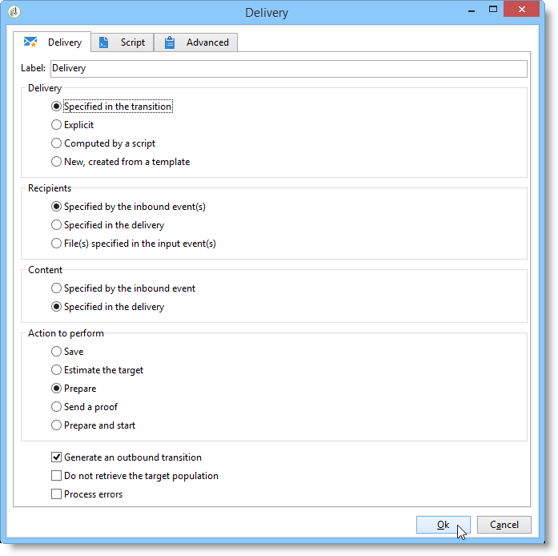

1. **Delivery**

   You can:

    * Act on the delivery specified in the inbound transition. To do this, select the first option of the **[!UICONTROL Delivery]** section of the window.

      This option can be used when a previous workflow activity has already created or specified the delivery. This can have been done, like in the example below, by an activity of the same type having generated an outbound transition.

      In the following example, the delivery is created for the first time. The population and the content are defined later. Next, the information for these three elements is re-entered into a new delivery activity using the inbound transition so that this can be sent.
    
      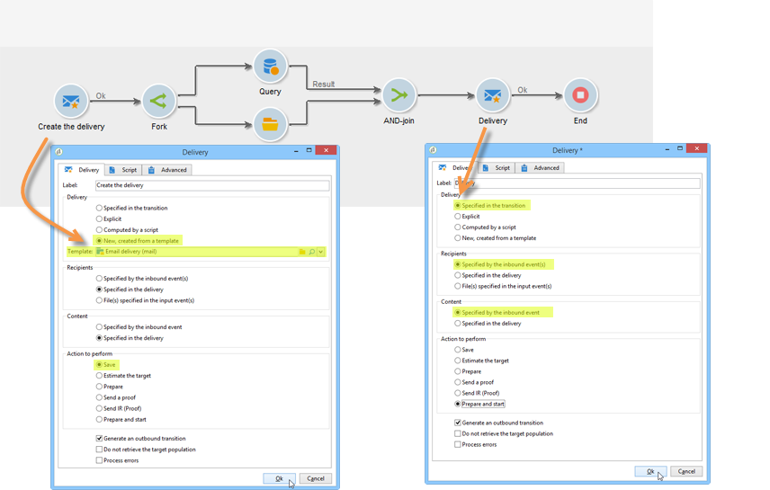

    * Directly select the delivery concerned. To do this, select the **[!UICONTROL Explicit]** option and select the delivery from the drop-down list of the **[!UICONTROL Delivery]** field.

      The list shows unfinished deliveries contained in the **Deliveries** folder by default. To access other campaigns, click the **[!UICONTROL Select link]** icon.
    
      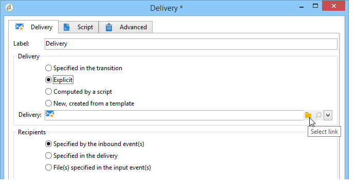

      Select the campaign from the drop-down list of the **[!UICONTROL Folder]** field, or click **[!UICONTROL Display sub-levels]** to display all of the deliveries contained in sub-folders:
    
      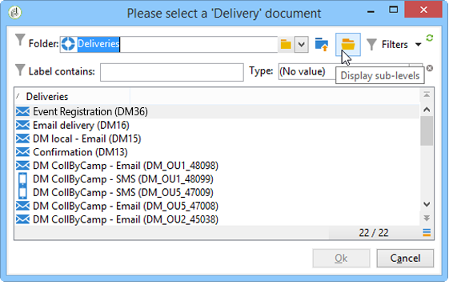

      After selecting the delivery action, you can display the content by clicking the **[!UICONTROL Edit link]** icon.
    
    * Create a script to calculate the delivery. To do this, select the **[!UICONTROL Computed by a script]** option and enter the script. You can open an input window by clicking the **[!UICONTROL Edit...]** option. The following example recovers the identifier of the delivery:
    
      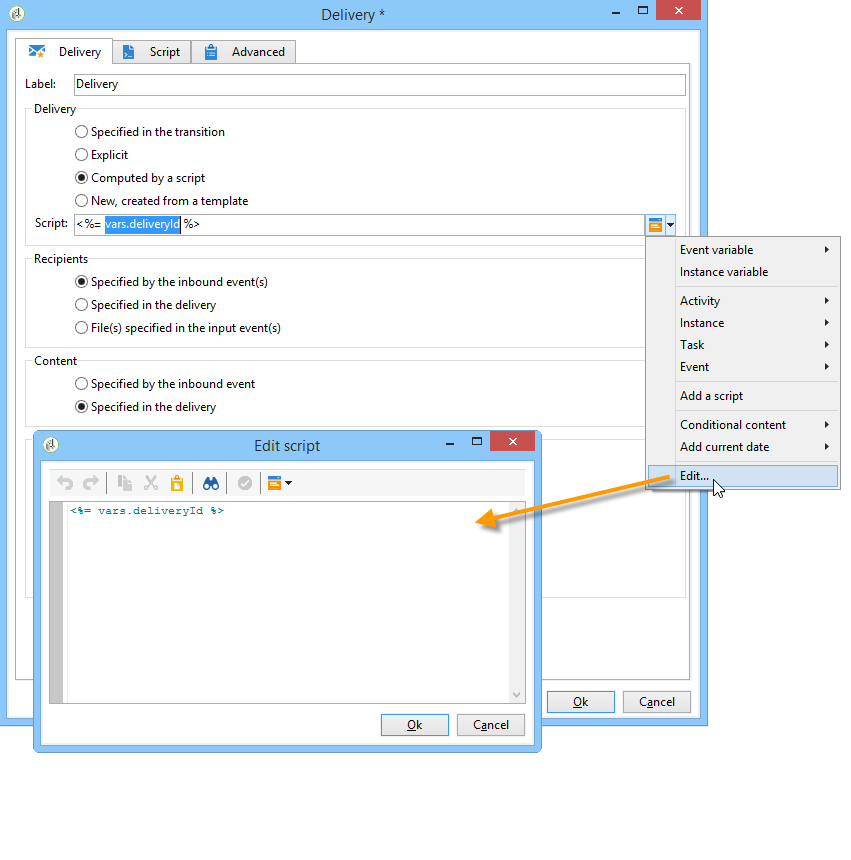

    * Create a new delivery. To do this, select the **[!UICONTROL New, created from a template]** option and select the delivery template which the delivery will be based on.
    
      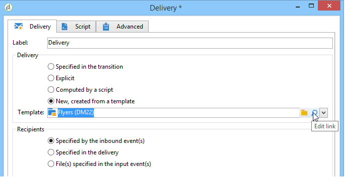

      Click the **[!UICONTROL Select link]** icon to browse the folders, and click the **[!UICONTROL Edit link]** icon if you wish to view the content of the selected template.

1. **Recipients**

   Recipients can be specified by the inbound events, for example following a file import, or specified in the delivery action. They can also be stored in one or more files.

   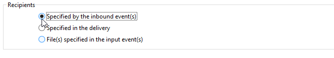

1. **Content**

   The content of the message can be defined in the delivery or the inbound event.

   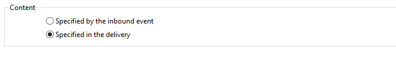

1. **Action to execute**

   You can create the delivery, prepare it, start it, estimate the target or send a proof. 

   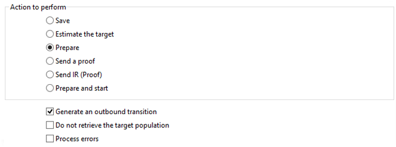

   Select the type of action to be carried out:

    * **[!UICONTROL Save]**: this option lets you create the delivery and save it. It will not analyze or deliver it.
    * **[!UICONTROL Estimate the target]**: this option lets you calculate the delivery target to assess its potential (first analysis phase). This action is the equivalent of selecting the **[!UICONTROL Estimate the population to be targeted]** option and clicking **[!UICONTROL Analyze]** when sending a delivery to the main target via **Delivery**.
    * **[!UICONTROL Prepare]**: this option lets you run the full analysis process (target calculation and content preparation). The delivery isn't sent. This action is the equivalent of selecting the **[!UICONTROL Deliver as soon as possible]** option and clicking **[!UICONTROL Analyze]** when sending a delivery to the main target with **Delivery**.
    * **[!UICONTROL Send a proof]**: this option lets you send a proof of the delivery. This action is the equivalent of clicking the **[!UICONTROL Send a proof]** button in the toolbar of a delivery with **Delivery** 
    * **[!UICONTROL Prepare and start]**: this option launches the full analysis process (target calculation and content preparation) and sends the delivery. This action is the equivalent of clicking **[!UICONTROL Deliver as soon as possible]**, **[!UICONTROL Analyze]**, and **[!UICONTROL Confirm delivery]** option when sending a delivery to the main target with **Delivery**.

   The **[!UICONTROL Act on a delivery]** activity used further on in the workflow lets you launch all remaining steps required for starting the delivery (target calculation, content preparation, delivery). For more on this, refer to [Delivery control](../../workflow/using/delivery-control.md).

   The following options are also available:

    * **[!UICONTROL Generate an outbound transition]**

      Creates an outbound transition that will be activated at the end of execution. You can choose whether or not to retrieve the target of the outbound delivery.
    
    * **[!UICONTROL Do not recover target]**

      Does not recover the target of the outgoing delivery action.
    
    * **[!UICONTROL Processing errors]**

      Refer to [Delivery control](../../workflow/using/delivery-control.md).

   The **Script** tab lets you modify the delivery parameters.

   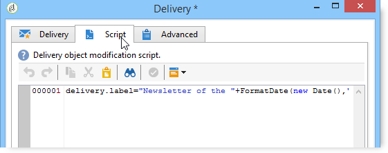

## Example: delivery workflow {#example--delivery-workflow}

Create a new workflow and add activities as shown in the graphic below:

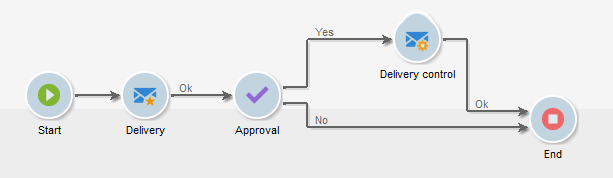

Open the **Delivery** activity and define the properties as follows:

* In the **[!UICONTROL Delivery]** section, select **[!UICONTROL New, created from a template]** and select a delivery template. 
* In the **[!UICONTROL Recipients]** section, select **[!UICONTROL Specified in the delivery]**. 
* In the **[!UICONTROL Action to execute]** section, keep the **[!UICONTROL Prepare]** option.

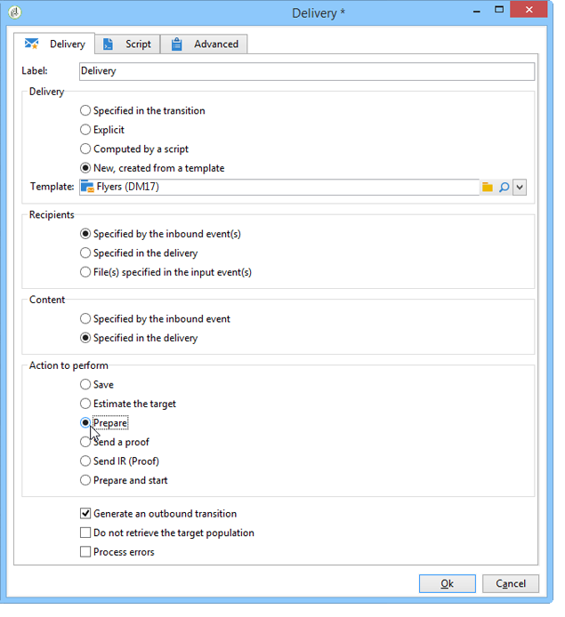

Click **[!UICONTROL OK]** to close the properties window. You have just configured an activity that consists of creating and preparing a new delivery based on a delivery template whose target will be specified within it.

Open the **Approval** activity and define the properties as follows:

1. In the **[!UICONTROL Assignment type]** field, select a group in which you are registered. If you are connected using the 'admin' account, select the Administration group.
1. Next, enter a title and insert the following text in the message body:

   ```
   Do you wish to approve delivery (<%= vars.recCount %> recipient(s))?
   ```

   This is a message that includes an expression written in JavaScript: **[!UICONTROL vars.recCount]** represents the number of recipients targeted by the delivery of the preceding task. For further information on JavaScript expressions, refer to [JavaScript scripts and templates](../../workflow/using/javascript-scripts-and-templates.md).

   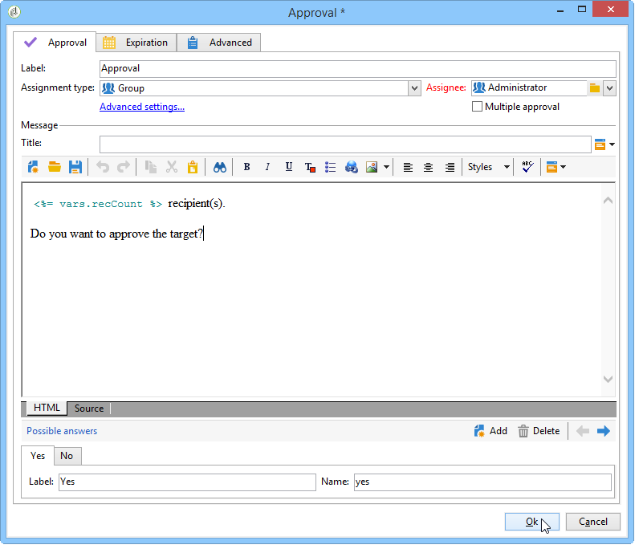

   The Approval task is detailed in [Approval](../../workflow/using/approval.md).

## Input parameters {#input-parameters}

Delivery identifier, if the **[!UICONTROL Specified in the transition]** option is selected in the **[!UICONTROL Delivery]** section.

* deliveryId
* tableName
* schema

Each inbound event must specify a target defined by these parameters.

>[!NOTE]
>
>This parameter only appears if the **[!UICONTROL Specified by inbound event(s)]** option is selected in the **[!UICONTROL Recipients]** section.

* filename

  Full name of the file generated if the **[!UICONTROL File(s) specified by inbound event(s)]** option is selected in the **[!UICONTROL Recipients]** section.

* contentId

  Content identifier if the **[!UICONTROL Specified by inbound events]** option is selected in the **[!UICONTROL Content]** section.

## Output parameters {#output-parameters}

* tableName
* schema
* recCount

This set of three values identifies the target resulting from the delivery. **[!UICONTROL tableName]** is the name of the table which memorizes the identifiers of the target, **[!UICONTROL schema]** is the schema of the population (usually nms:recipient) and **[!UICONTROL recCount]** is the number of elements in the table.

The transition associated with the complement has the same parameters.

>[!NOTE]
>
>There are no output parameters when the **[!UICONTROL Do not recover target]** option is selected.
