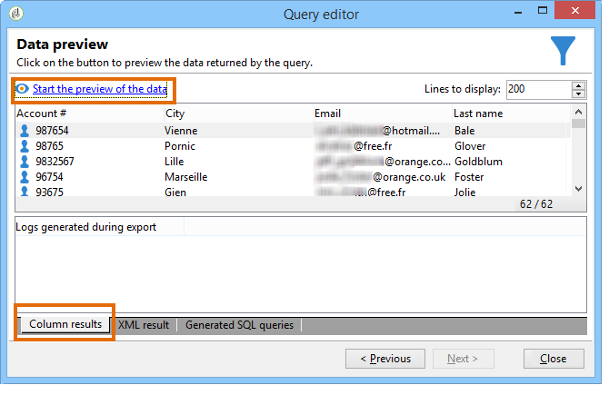
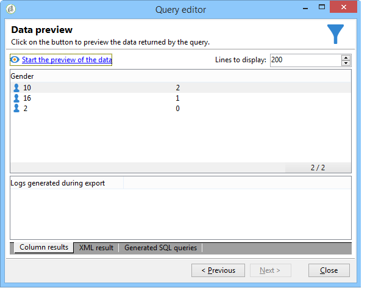
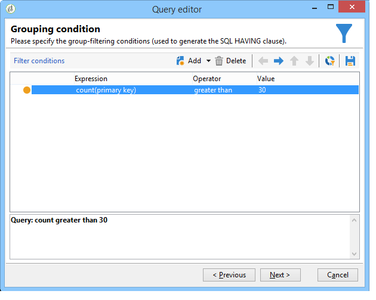

# Designing queries{#designing-queries}

The sections below present use case targeting recipients through the **[!UICONTROL Query]** activity. For more on how to use this activity, refer to the [dedicated section](../../workflow/using/query.md).

## Querying the recipient table {#querying-the-recipient-table}

In this example, we want to recover the names and emails of recipients whose email domain is "orange.co.uk" and who don't live in London.

* Which table should we select?

  The recipient table (nms:recipient)

* Fields to be selected as output columns

  Email, Name, City and Account number

* What are the filtering conditions of the recipients?

  city and email domain

* Is a sort configured?

  Yes, based on **[!UICONTROL Account number]** and **[!UICONTROL Last name]**

To create this example, apply the following steps:

1. Click **[!UICONTROL Tools > Generic query editor...]** and choose the **Recipients** (**nms:recipient**) table. Then click **[!UICONTROL Next]** .
1. Choose: **[!UICONTROL Last name]** , **[!UICONTROL First name]** , **[!UICONTROL Email]** , **[!UICONTROL City]** and **[!UICONTROL Account number]** . These fields are added to **[!UICONTROL Output columns]** . Then click **[!UICONTROL Next]** .

   

1. Sort the columns to display them in the right order. Here we want to sort account numbers in descending order and names in alphabetical order. Then click **[!UICONTROL Next]** .

   

1. In the **[!UICONTROL Data filtering]** window, refine your search: choose **[!UICONTROL Filtering conditions]** and click **[!UICONTROL Next]** .
1. The **[!UICONTROL Target element]** window lets you enter the filter settings.

   Define the following filter condition: recipients with an email domain equal to "orange.co.uk". To do this, choose **Email domain (@email)** in the **[!UICONTROL Expression]** column, choose **equal to** in the **[!UICONTROL Operator]** column and enter "orange.co.uk" in the **[!UICONTROL Value]** column.

   

1. If needed, click the **[!UICONTROL Distribution of values]** button to view a distribution based on the email domain of prospects. A percentage is available for each email domain in the database. Domains other than "orange.co.uk" are displayed until the filter is applied.

   A summary of the query is displayed at the bottom of the window: **Email domain equal to 'orange.co.uk'**. 

1. Click the **[!UICONTROL Preview]** to get an idea of the query result: only "orange.co.uk" email domains are displayed.

   

1. We will now change the query to find contacts not living in London.

   Select **[!UICONTROL City (location/@city)]** in the **[!UICONTROL Expression]** column, **[!UICONTROL different from]** as an operator and enter **[!UICONTROL London]** in the **[!UICONTROL Value]** column.

   

1. This will take you to the **[!UICONTROL Data formatting]** window. Check the column order. Move the "City" column up under the "Account number" column.

   Uncheck the "First name" column to remove it from the list.

   

1. In the **[!UICONTROL Data preview]** window, click **[!UICONTROL Start the preview of the data]** . This function calculates the result of the query.

   The **[!UICONTROL Column results]** tab shows the query result in columns.

   The result shows all recipients with an "orange.co.uk" email domain who do not live in London. The "First name" column is not shown because it was unchecked during the previous stage. Account numbers are sorted in descending order.

   

   The **[!UICONTROL XML result]** tab shows the result in XML format.

   

   The **[!UICONTROL Generated QSL queries]** tab shows the query result in SQL format.

   

## Querying delivery information {#querying-delivery-information}

### Number of clicks for a specific delivery {#number-of-clicks-for-a-specific-delivery}

In this example, we are looking to recover the number of clicks for a specific delivery. These clicks are recorded thanks to recipient tracking logs taken over a given period. The recipient is identified via their email address. This query uses the **[!UICONTROL Recipient tracking logs]** table.

* Which table needs to be selected?

  The recipient log tracking table ( **[!UICONTROL nms:trackingLogRcp]** )

* Fields to be selected for output columns?

  Primary key (with count) and Email

* What criteria will information be filtered based on?

  A specific period and an element of the delivery label

To carry out this example, apply the following steps:

1. Open the **[!UICONTROL Generic query editor]** and select the **[!UICONTROL Recipient tracking logs]** schema.

   

1. In the **[!UICONTROL Data to extract]** window, we want to create an aggregate to collect information. To do this, add the primary key (located above the main **[!UICONTROL Recipient tracking logs]** element): Tracking log count is carried out on this **[!UICONTROL Primary key]** field. The edited expression will be **[!UICONTROL x=count(primary key)]** . It links the sum of various tracking logs to a single email address.

   To do this:

    * Click the **[!UICONTROL Add]** icon to the right of the **[!UICONTROL Output columns]** field. In the **[!UICONTROL Formula type]** window, select the **[!UICONTROL Edit the formula using an expression]** option and click **[!UICONTROL Next]** . In the **[!UICONTROL Field to select]** window, click **[!UICONTROL Advanced selection]** .
    
      

    * In the **[!UICONTROL Formula type]** window, run a process on the aggregate function. This process will be a primary key count.

      Select **[!UICONTROL Process on an aggregate function]** in the **[!UICONTROL Aggregate]** section and click **[!UICONTROL Count]** .
    
      

      Click **[!UICONTROL Next]** .
    
    * Select the **[!UICONTROL Primary key (@id)]** field. The **[!UICONTROL count (primary key)]** output column is configured.
    
      

1. Select the other field to be displayed in the output column. In the **[!UICONTROL Available fields]** column, open the **[!UICONTROL Recipient]** node and choose **[!UICONTROL Email]** . Check the **[!UICONTROL Group]** box to **[!UICONTROL Yes]** to group the tracking logs by email address: this group links each log to its recipient.

   

1. Configure column sorting so that the most active recipients (with the most tracking logs) are displayed first. Check **[!UICONTROL Yes]** in the **[!UICONTROL Descending sort]** column.

   

1. You must then filter the logs which interest you, i.e. those which are under 2 weeks old and which concern sales-related deliveries.

   To do this:

    * Configure data filtering. To do this, select **[!UICONTROL Filter conditions]** then click **[!UICONTROL Next]** .
    
      

    * Recover tracking logs over a given period for a specific delivery. Three filtering conditions are necessary: two date conditions to set the search period between 2 weeks before the current date and the day before the current date; and another condition to restrict the search to a specific delivery.

      In the **[!UICONTROL Target element]** window, configure the date starting from which tracking logs will be taken into account. Click **[!UICONTROL Add]** . A condition line is displayed. Edit the **[!UICONTROL Expression]** column by clicking the **[!UICONTROL Edit expression]** function. In the **[!UICONTROL Field to select]** window, choose **[!UICONTROL Date (@logDate)]** .
    
      

      Select the **[!UICONTROL greater than]** operator. In the **[!UICONTROL Value]** column, click **[!UICONTROL Edit expression]** , and in the **[!UICONTROL Formula type]** window, select **[!UICONTROL Process on dates]** . Finally, in **[!UICONTROL Current date minus n days]** , enter "15".

      Click **[!UICONTROL Finish]** .
    
      

    * To select the tracking log search end date, create a second condition by clicking **[!UICONTROL Add]** . In the **[!UICONTROL Expression]** column, choose **[!UICONTROL Date (@logDate)]** again.

      Select the **[!UICONTROL less than]** operator. In the **[!UICONTROL Value]** column, click **[!UICONTROL Edit expression]** . For date processing, go to the **[!UICONTROL Formula type]** window, enter "1" in **[!UICONTROL Current date minus n days]** .

      Click **[!UICONTROL Finish]** .
    
      

      Now we want to configure the third filter condition, i.e. the delivery label which our query concerns.
    
    * Click the **[!UICONTROL Add]** function to create another filtering condition. In the **[!UICONTROL Expression]** column, click **[!UICONTROL Edit expression]** . In the **[!UICONTROL Field to select]** window, choose **[!UICONTROL Label]** in the **[!UICONTROL Delivery]** node.

      Click **[!UICONTROL Finish]** .
    
      

      Look for a delivery containing the word "sales". Since you don't remember its exact label, you can choose the **[!UICONTROL contains]** operator and enter "sales" in the **[!UICONTROL Value]** column.
    
      

1. Click **[!UICONTROL Next]** until you get to the **[!UICONTROL Data preview]** window: no formatting is necessary here.
1. In the **[!UICONTROL Data preview]** window, click **[!UICONTROL Start the preview of the data]** to see the number of tracking logs for each delivery recipient.

   The result is displayed in descending order.

   

   The highest number of logs for a user is 6 for this delivery. 5 different users opened the delivery email or clicked one of the links in the email.

### Recipients who did not open any delivery {#recipients-who-did-not-open-any-delivery}

In this example, we want to filter recipients who didn't open an email in the last 7 days.

To create this example, apply the following steps:

1. Drag and drop a **[!UICONTROL Query]** activity in a workflow and open the activity.
1. Click **[!UICONTROL Edit query]** and set the target and filtering dimensions to **[!UICONTROL Recipients]** .

   

1. Select **[!UICONTROL Filtering conditions]** then click **[!UICONTROL Next]** .
1. Click the **[!UICONTROL Add]** button and select **[!UICONTROL Tracking logs]** .
1. Set the **[!UICONTROL Operator]** of the **[!UICONTROL Tracking logs]** expression to **[!UICONTROL Do not exist such as]** .

   

1. Add another expression. Select **[!UICONTROL Type]** in the **[!UICONTROL URL]** category.
1. Then, set its **[!UICONTROL Operator]** to **[!UICONTROL equal to]** and its **[!UICONTROL Value]** to **[!UICONTROL Open]** .

   

1. Add another expression and select **[!UICONTROL Date]** . **[!UICONTROL Operator]** should be set to **[!UICONTROL on or after]** .

   

1. To set the value last 7 days, click the **[!UICONTROL Edit expression]** button in the **[!UICONTROL Value]** field.
1. In the **[!UICONTROL Function]** category, select **[!UICONTROL Current date minus n days]** and add the number of days you want to target. Here, we want to target the last 7 days.

   

Your outbound transition will contain recipients who didn't open an email in the last 7 days.

If, on the opposite, you want to filter recipients who opened at least one email your query should be as follows. Please note that, in this case, the **[!UICONTROL Filtering dimension]** shoud be set to **[!UICONTROL Tracking logs (Recipients)]** .


### Recipients who have opened a delivery {#recipients-who-have-opened-a-delivery}

The following example shows how to target profiles who have opened a delivery within the last 2 weeks:

1. To target profiles having opened a delivery, you need to use tracking logs. they are stored in a linked table: start by selecting this table in the drop-down list of the **[!UICONTROL Filtering dimension]** field, as shown below:

   

1. Concerning filtering conditions, click the **[!UICONTROL Edit expression]** icon of the criteria shown in the sub-tree structure of the tracking logs. Select the **[!UICONTROL Date]** field.

   

   Click **[!UICONTROL Finish]** to confirm selection.

   In order to recover only the tracking logs less than two weeks old, select the **[!UICONTROL Greater than]** operator.

   

   Then click the **[!UICONTROL Edit expression]** icon in the **[!UICONTROL Value]** column to define the calculation formula to be applied. Select the **[!UICONTROL Current date minus n days]** formula and enter 15 in the related field.

   

   Click the **[!UICONTROL Finish]** button of the formula window. In the filtering window, click the **[!UICONTROL Preview]** tab to check targeting criteria.

   

### Filtering recipients' behavior folllowing a delivery {#filtering-recipients--behavior-folllowing-a-delivery}

In a workflow, the **[!UICONTROL Query]** and **[!UICONTROL Split]** boxes let you select a behavior following a previous delivery. This selection is carried out via the **[!UICONTROL Delivery recipient]** filter.

* Aim of the example

  In a delivery workflow, there are several ways of following up a first email communication. This type of operation involves using the **[!UICONTROL Split]** box.

* Context

  A "Summer sports offer" delivery is sent. Four days after the delivery, two other deliveries are sent. One of them is "watersports offer", the other is a follow-up to the first "Summer sports offer" delivery.

  The "Watersports offer" delivery is sent to recipients who clicked the "watersports" link in the first delivery. These clicks show that the recipient is interested in the topic. It makes sense to steer them towards similar offers. However, recipients who did not click in the "Summer sports offer" will receive the same content again.

The following steps show you how to configure the **[!UICONTROL Split]** box by integrating two different behaviors:

1. Insert the **[!UICONTROL Split]** box into the workflow. This box will break down the recipients of the first delivery into the next two deliveries. Breakdown occurs based on the filtering conditions linked to recipient behavior during the first delivery.

   

1. Open the **[!UICONTROL Split]** box. In the **[!UICONTROL General]** tab, enter a label: **Split based on behavior** for instance.

   

1. In the **[!UICONTROL Subsets]** tab, define the first split branch. For example, enter the **Clicked** label for this branch.
1. Select the **[!UICONTROL Add a filtering condition on the incoming population]** option. Click **[!UICONTROL Edit]** .
1. In the **[!UICONTROL Targeting and filtering dimension]** window, double-click the **[!UICONTROL Recipients of a delivery]** filter.

   

1. In the **[!UICONTROL Target element]** window, select the behavior you want to apply to this branch: **[!UICONTROL Recipients having clicked (email)]** .

   Below, select the **[!UICONTROL Delivery specified by the transition]** option. This functionality will automatically recover the people targeted during the first delivery.

   This is the "Watersports offer" delivery.

   

1. Define the second branch. This branch will include the follow-up email with the same content as for the first delivery. Go to the **[!UICONTROL Subsets]** tab and click **[!UICONTROL Add]** to create it.

   

1. Another sub-tab is displayed. Name it "**Did not click**".
1. Click **[!UICONTROL Add a filtering condition for the incoming population]** . Then click **[!UICONTROL Edit...]** .

   

1. Click **[!UICONTROL Delivery recipients]** in the **[!UICONTROL Targeting and filtering dimension]** window. 
1. In the **[!UICONTROL Target element]** window, select the **[!UICONTROL Recipients who did not click (email)]** behavior. Select the **[!UICONTROL Delivery specified by the transition]** option as shown for the last branch.

   The **[!UICONTROL Split]** box is now fully configured.

   

Below is the list of the various components configured by default:

* **[!UICONTROL All recipients]** 
* **[!UICONTROL Recipients of successfully sent messages,]** 
* **[!UICONTROL Recipients who opened or clicked (email),]** 
* **[!UICONTROL Recipients who clicked (email),]** 
* **[!UICONTROL Recipients of a failed message,]** 
* **[!UICONTROL Recipients who didn't open or click (email),]** 
* **[!UICONTROL Recipients who didn't click (email).]** 

  

## Performing aggregate computing {#performing-aggregate-computing}

In this example, we want to count the number of recipients living in London, according to gender.

* Which table needs to be selected?

  The recipient table (**nms:recipient**)

* Which fields should be selected in the output column?

  Primary key (with count) and Gender

* What conditions is the information filtered based on?

  Based on the recipients who live in London

To create this example, apply the following steps:

1. In **[!UICONTROL Data to extract]** , define a count for the primary key (as shown in the previous example). Add the **[!UICONTROL Gender]** field in the output column. Check the **[!UICONTROL Group]** option in the **[!UICONTROL Gender]** column. This way recipients will be grouped by gender.

   

1. In the **[!UICONTROL Sorting]** window, click **[!UICONTROL Next]** : no sorting is necessary here.
1. Configure data filtering. Here, you want to restrict the selection to contacts who live in London.

   

   >[!NOTE]
   >
   >Values are case-sensitive. If the 'London' value is entered in the condition without a capital letter and the list of recipients contains the word "London" with a capital letter, the query will fail.

1. In the **[!UICONTROL Data formatting]** window, click **[!UICONTROL Next]** : no formatting is required for this example.
1. In the preview window, click **[!UICONTROL Launch data preview]** .

   There are three separate values for each sort by gender: **2** for female, **1** for male and **0** when the gender is unknown. In this example, the list contains 10 women, 16 men and 2 people whose gender is not known.

   

## Querying using grouping management {#querying-using-grouping-management}

In this example, we want to run a query to find all email domains targeted over 30 times during previous deliveries.

* Which table needs to be selected?

  The recipient table (nms:recipient)

* Fields to be selected in output columns?

  Email domain and primary key (with count)

* Data grouping?

  Based on email domain with a count of primary keys above 30. This operation is carried out with the **[!UICONTROL Group by + Having]** option. **[!UICONTROL Group by + Having]** lets you group data ("group by") and make a selection of what was grouped ("having").

To create this example, apply the following steps:

1. Open the **[!UICONTROL Generic query editor]** and choose the Recipient table (**nms:recipient**).

   

1. In the **[!UICONTROL Data to extract]** window, select the **[!UICONTROL Email domain]** and **[!UICONTROL Primary key]** fields. Run a count on the **[!UICONTROL Primary key]** field.

   For more on primary key counts, refer to [this section](../../platform/using/defining-filter-conditions.md#building-expressions).

1. Check the **[!UICONTROL Handle groupings (GROUP BY + HAVING)]** box.

   

1. In the **[!UICONTROL Sorting]** window, sort email domains in descending order. To do this, check **[!UICONTROL Yes]** in the **[!UICONTROL Descending sort]** column. Click **[!UICONTROL Next]** .

   

1. In **[!UICONTROL Data filtering]** , select **[!UICONTROL Filtering conditions]** . Go to the **[!UICONTROL Target elements]** window and click **[!UICONTROL Next]** .
1. In the **[!UICONTROL Data grouping]** window, select the **[!UICONTROL Email domain]** by clicking **[!UICONTROL Add]** .

   This data grouping window is only displayed if the **[!UICONTROL Handle groupings (GROUP BY + HAVING]** ) box was checked.

   

1. In the **[!UICONTROL Grouping condition]** window, indicate a primary key count greater than 30 since we only want email domains targeted more than 30 times to be returned as results.

   This window appears when the **[!UICONTROL Manage groupings (GROUP BY + HAVING)]** box was checked: this is where the grouping result is filtered (HAVING).

   

1. In the **[!UICONTROL Data formatting]** window, click **[!UICONTROL Next]** : no formatting is necessary here.
1. In the data preview window, click **[!UICONTROL Launch data preview]** : here, three different email domains targeted over 30 times are returned.

   

## Querying using a many-to-many relationship {#querying-using-a-many-to-many-relationship}

In this example, we want to recover recipients not contacted during the last 7 days. This query concerns all deliveries.

This example also shows how to configure a filter related to the choice of a collection element (or orange node). Collection elements are available in the **[!UICONTROL Field to select]** window.

* Which table needs to be selected?

  The recipient table (**nms:recipient**)

* Fields to be selected for the output column

  Primary key, Last name, First name and Email

* Based on which criteria is the information filtered

  Based on the delivery logs of recipients going back 7 days before today

Apply the following steps:

1. Open the Generic query editor and select the Recipient table **[!UICONTROL (nms:recipient)]** .
1. In the **[!UICONTROL Data to extract]** window, select **[!UICONTROL Primary key]** , **[!UICONTROL First name]** , **[!UICONTROL Last name]** and **[!UICONTROL Email]** .

   

1. In the sorting window, sort the names alphabetically.

   

1. In the **[!UICONTROL Data filtering]** window, select **[!UICONTROL Filtering conditions]** .
1. In the **[!UICONTROL Target element]** window, the filtering condition for extracting profiles with no tracking log for the last 7 days involves two steps. The element you need to select is a many-to-many link.

    * Start by selecting the **[!UICONTROL Recipient delivery logs (broadlog)]** collection element (orange node) for the first **[!UICONTROL Value]** column.
    
      

      Choose the **[!UICONTROL do not exist as]** operator. There is no need to select a second value in this line.
    
    * The content of the second filtering condition depends on the first. Here, the **[!UICONTROL Event date]** field is offered directly in the **[!UICONTROL Recipient delivery logs]** table since there is a link to this table.
    
      

      Select **[!UICONTROL Event date]** with the **[!UICONTROL greater than or equal to]** operator. Select the **[!UICONTROL DaysAgo (7)]** value. To do this, click **[!UICONTROL Edit expression]** in the **[!UICONTROL Value]** field. In the **[!UICONTROL Formula type]** window, select **[!UICONTROL Process on dates]** and **[!UICONTROL Current date minus n days]** , giving "7" as a value.
    
      

      The filter condition is configured.
    
      

1. In the **[!UICONTROL Data formatting]** window, switch the last names to upper-case. Click the **[!UICONTROL Last name]** line in the **[!UICONTROL Transformation]** column and select **[!UICONTROL Switch to upper case]** in the drop-down menu.

   

1. Use the **[!UICONTROL Add a calculated field]** function to insert a column into the data preview window.

   In this example, add a calculated field with the first and last names of the recipients in a single column. Click the **[!UICONTROL Add a calculated field]** function. In the **[!UICONTROL Export calculated field definition]** window, enter a label and an internal name and choose the **[!UICONTROL JavaScript Expression]** type. Then enter the following expression:

   ```
   var rep = source._firstName+" - "+source._lastName
   return rep
   ```

   

   Click **[!UICONTROL OK]** . The **[!UICONTROL Data formatting]** window is configured.

   For more on adding calculated fields, refer to this section.

1. The result is shown in the **[!UICONTROL Data preview]** window. Recipients which not have been contacted in the last 7 days are displayed in alphabetical order. Names are displayed in upper case and the column with first and last names has been created.

   

## Adding an Enumeration type calculated field {#adding-an-enumeration-type-calculated-field}

Here we want to create a query with an **[!UICONTROL Enumerations]** type calculated field. This field will generate an additional column in the data preview window. This column will specify the numeric values returned as a result for each recipient (0, 1 and 2). A gender will be assigned to each value in the new column: "Male" for "1", "Female" for "2" or "Not indicated" if the value equals "0".

* Which table needs to be selected?

  The recipient table (nms:recipient)

* Fields to be selected in the output column?

  Last name, First name, Gender

* Criteria which the information will be filtered based on?

  The rrecipient language

Apply the following steps:

1. Open the Generic query editor and select the Recipient table ( **[!UICONTROL nms:recipient]** ).
1. In the **[!UICONTROL Data to extract]** window, select **[!UICONTROL Last name]** , **[!UICONTROL First name]** and **[!UICONTROL Gender]** .

   

1. In the **[!UICONTROL Sorting]** window, click **[!UICONTROL Next]** : no sort is necessary for this example.
1. In **[!UICONTROL Data filtering]** , select **[!UICONTROL Filtering conditions]** .
1. In the **[!UICONTROL Target element]** window, set a filter condition to collect recipients who speak English.

   

1. In the **[!UICONTROL Data formatting]** window, click **[!UICONTROL Add a calculated field]** .

   

1. Go to the **[!UICONTROL Type]** window of the **[!UICONTROL Export calculated field definition]** window and select **[!UICONTROL Enumerations]** .

   Define the column which the new calculated field must refer to. To do this, select the **[!UICONTROL Gender]** column in the drop-down menu of the **[!UICONTROL Source column]** field: the destination values will coincide with the **[!UICONTROL Gender]** column.

   

   Define the **Source** and **Destination** values: the destination value makes the query result easier to read. This query should return recipient gender and the result will either be 0, 1, or 2.

   For each "source-destination" line to be entered, click **[!UICONTROL Add]** in the **[!UICONTROL List of enumeration values]** :

    * In the **[!UICONTROL Source]** column, enter the source value for each gender (0,1,2) in a new line.
    * In the **[!UICONTROL Destination]** column, enter the values: "Not indicated" for line "0", "Male" for line "1", and "Female" for line "2".

   Select the **[!UICONTROL Keep the source value]** function.

   Click **[!UICONTROL OK]** to approve the calculated field.

   

1. In the **[!UICONTROL Data formatting]** window, click **[!UICONTROL Next]** .
1. In the preview window, **[!UICONTROL start the preview of the data]** .

   The additional column defines the gender of 0, 1 and 2:

    * 0 for "Not indicated"
    * 1 for "Male"
    * 2 for "Female"

   

   For example, if you don't enter gender "2" in the **[!UICONTROL List of enumeration values]** , and the **[!UICONTROL Generate a warning and continue]** function of the **[!UICONTROL In other cases]** field is selected, you will get a warning log. This log indicates that gender "2" (Female) has not been entered. It is displayed in the **[!UICONTROL Logs generated during export]** field of the data preview window.

   

   Let's take another example and say that enumeration value "2" isn't entered. Select the **[!UICONTROL Generate an error and reject the line]** function: all gender "2" recipients will raise anomalies and the other information in the line (first and last name, etc.) will not be exported. An error log is displayed in the **[!UICONTROL Logs generated during export]** field of the data preview window. This log indicates that enumeration value "2" isn't entered.

   

## Creating a filter {#creating-a-filter}

The filters available in Adobe Campaign are defined via filtering conditions which are created using the same operating mode as queries.

>[!NOTE]
>
>For more on creating filters, refer to [this section](../../platform/using/filtering-options.md).

The **[!UICONTROL Administration > Configuration > Predefined filters]** node contains all the filters used in the lists and overviews.

For example, the list of operators can be filtered by **[!UICONTROL Active accounts]** :


The matching filter contains the query on the **[!UICONTROL Account disabled]** value of the **[!UICONTROL Operators]** schema:


For the same list, the **[!UICONTROL By login or label]** filter lets you filter the data on the list based on the value entered in the filter field:


It is built as follows:


To match the filtering conditions, the operator account must check one of the following conditions:

* Its label contains the characters entered in the input field,
* The operator name contains the characters entered in the input field,
* The content of the description area contains the characters entered in the input field.

>[!NOTE]
>
>The **[!UICONTROL Upper]** function lets you deactivate the case-sensitive function.

The **[!UICONTROL Taken into account if]** column lets you define the application criteria for these filtering conditions. Here, the **$(/tmp/@text)** characters represent the content of the input field linked to the filter: 


Here, **$(/tmp/@text)='agency'**

The **$(/tmp/@text)!=''** expression applies each condition when the input field isn't empty.

## Filtering duplicated recipients {#filtering-duplicated-recipients}

In this example, we want to filter recipients who appear twice or more in a delivery in order to recover duplicated profiles.

To create this example, apply the following steps:

1. Drag and drop a **[!UICONTROL Query]** activity in a workflow and open the activity.
1. Click **[!UICONTROL Edit query]** and set the target and filtering dimensions to **[!UICONTROL Recipients]** .

   

1. Define the following filter condition to target recipient who exist in the delivery log. Choose **Recipient delivery log (broadlog)** in the **Expression** column, choose **exist such as** in the **Operator** column.

   

1. Define the following filter condition to target your delivery. Choose **[!UICONTROL Internal name]** in the Expression column and **[!UICONTROL equal to]** in the Operator column. 
1. In the value column, add the internal name of the targeted delivery.

   

1. With an **[!UICONTROL AND]** operator, repeat the same operations to target other deliveries.

   

Your outbound transition contains the duplicate recipients targeted in the deliveries.
