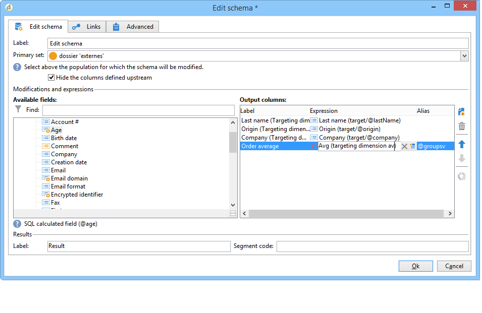
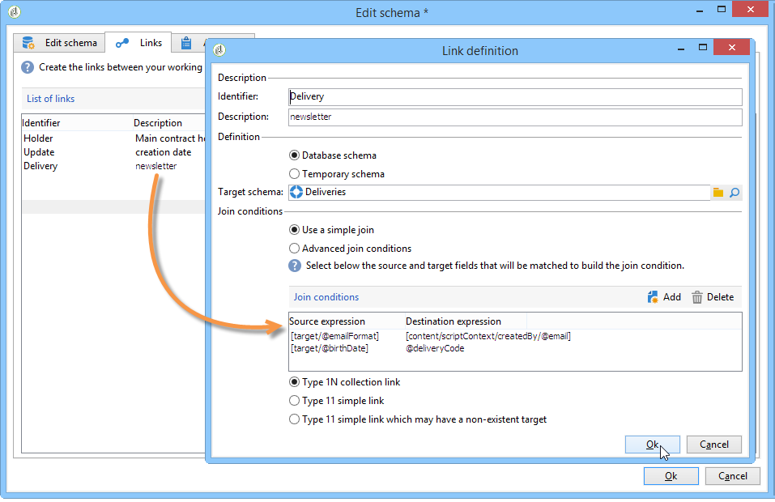

# Edit schema{#edit-schema}

Data can be transformed, normalized and, if necessary, enriched in the workflow using the **[!UICONTROL Edit schema]** activity. It is generally used to normalize the data structure: you can rename the output columns or modify their content, by calculating the average values of a field or aggregate for example.

This activity does not change the data in the work table, it changes only its schema, i.e. the logical view of the data.

You can also create joins with other worktables, via the **[!UICONTROL Links]** tab.

The lower section lets you configure the list of joining conditions, i.e. the criteria used for reconciling the data from the two tables.
