# Email enrichment with custom date fields{#email-enrichment-with-custom-date-fields}


In this example, we want to send an email with custom data fields to recipients who will celebrate their birthdays this month. The email will include a coupon valid one week before and after their birthdays.

We need to target recipients from a list who will celebrate their birthdays this month with a **[!UICONTROL Split]** activity. Then, using the **[!UICONTROL Enrichment]** activity, the custom data field will act as validity dates in the email for the customer's special offer.

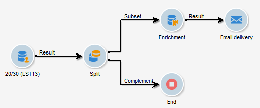

To create this example, apply the following steps:

1. In the **[!UICONTROL Targeting and workflows]** tab of your campaign, drag and drop a **[!UICONTROL Read list]** activity to target your list of recipients.
1. The list to be processed can be specified explicitly, computed by a script or localized dynamically, according to options selected and parameters defined here.

   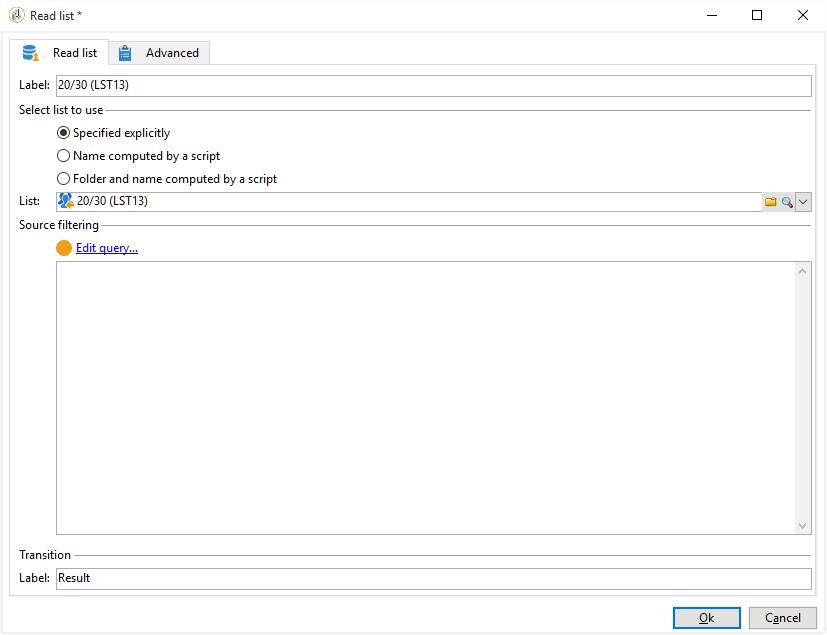

1. Add a **[!UICONTROL Split]** activity to differentiate recipients who will celebrate their birthdays this month from other recipients.
1. To split your list, in the **[!UICONTROL Filtering of selected records]** category, select **[!UICONTROL Add a filtering condition on the inbound population]**. Then, click **[!UICONTROL Edit]**.

   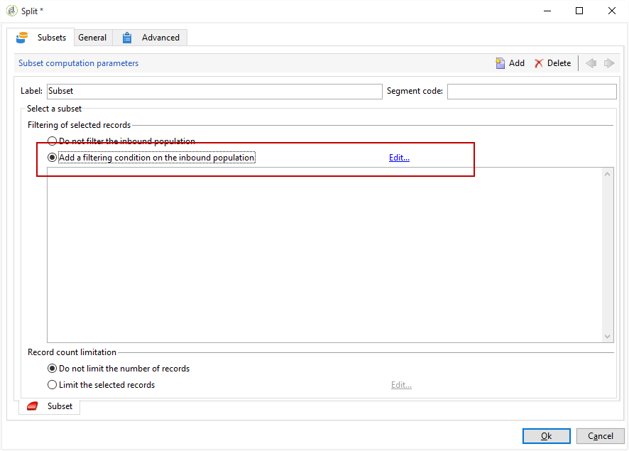

1. Select **[!UICONTROL Filtering conditions]** then click the **[!UICONTROL Edit expression]** button to filter the month of the recipient's birthday.

   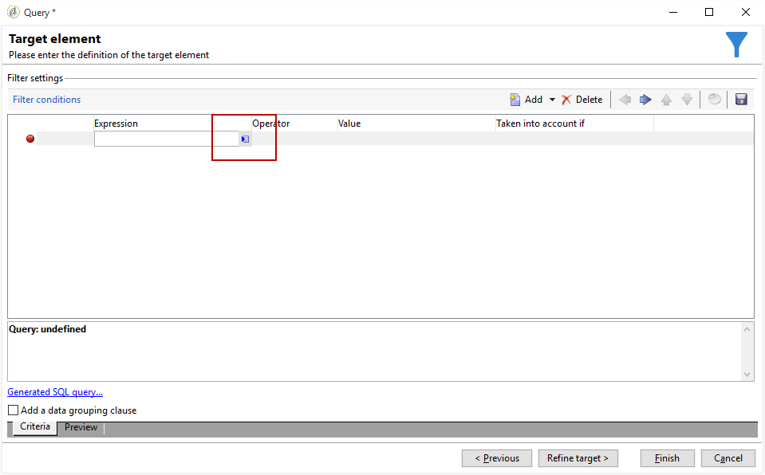

1. Click **[!UICONTROL Advanced Selection]** then **[!UICONTROL Edit the formula using an expression]** and add the following expression: Month(@birthDate).
1. In the **[!UICONTROL Operator]** column, select the **[!UICONTROL equal to]**.
1. Further filter your condition, by adding the **[!UICONTROL Value]** month of the current date: Month(GetDate()).

   This will query recipients whose birthday's month corresponds to the current month.

   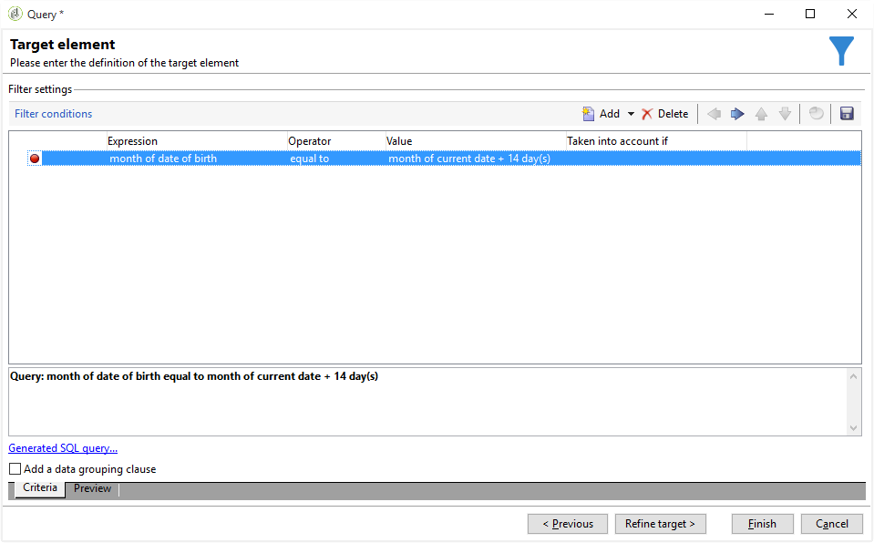

1. Click **[!UICONTROL Finish]**. Then, in the **[!UICONTROL General]** tab of your **[!UICONTROL Split]** activity, click the **[!UICONTROL Generate complement]** in the **[!UICONTROL Results]** category.

   With the **[!UICONTROL Complement]** result, you can add a delivery activity or update a list. Here, we just added an **[!UICONTROL End]** activity.

   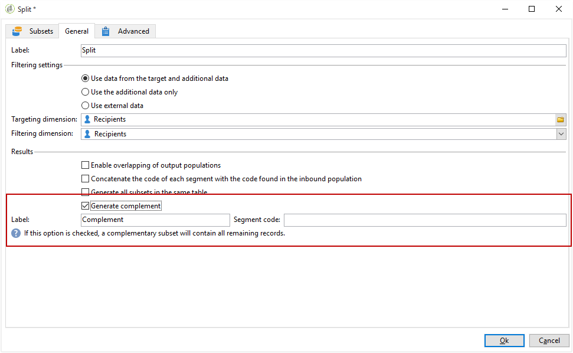

You now need to configure your **[!UICONTROL Enrichment]** activity:

1. Add an **[!UICONTROL Enrichment]** activity after your subset to add your custom date fields.

   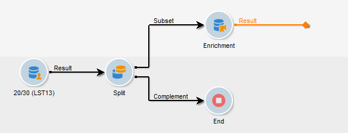

1. Open your **[!UICONTROL Enrichment]** activity. In the **[!UICONTROL Complementary information]** category, click **[!UICONTROL Add data]**.

   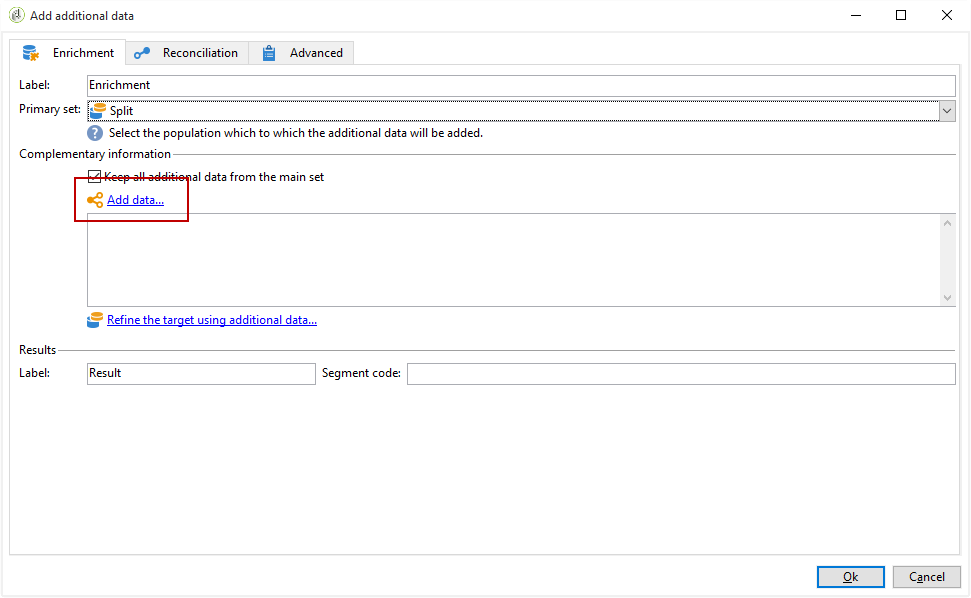

1. Select **[!UICONTROL Data linked to the filtering dimension]** then **[!UICONTROL Data of the filtering dimension]**.
1. Click the **[!UICONTROL Add]** button. 

   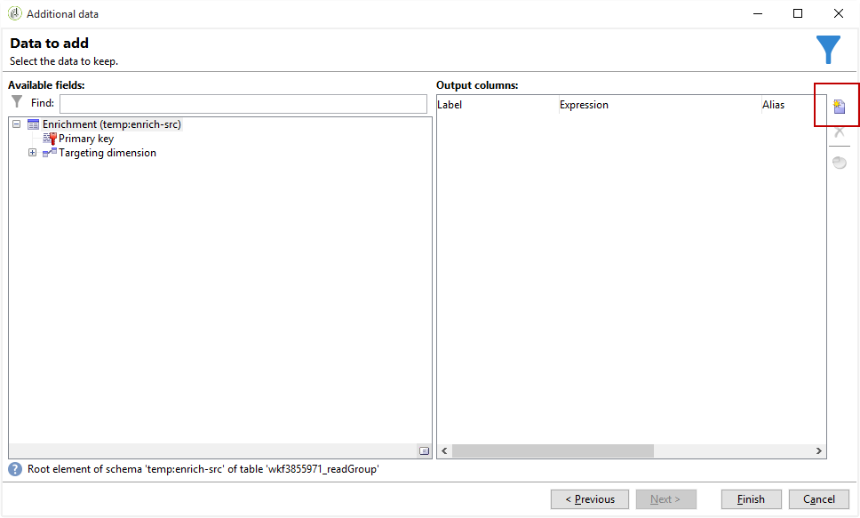

1. Add a **[!UICONTROL Label]**. Then, in the **[!UICONTROL Expression]** column, click **[!UICONTROL Edit expression]**.

   

1. First, we need to target the week before the birthdate as the **Validity start date** with the following **[!UICONTROL Expression]**: `SubDays([target/@birthDate], 7)`.

   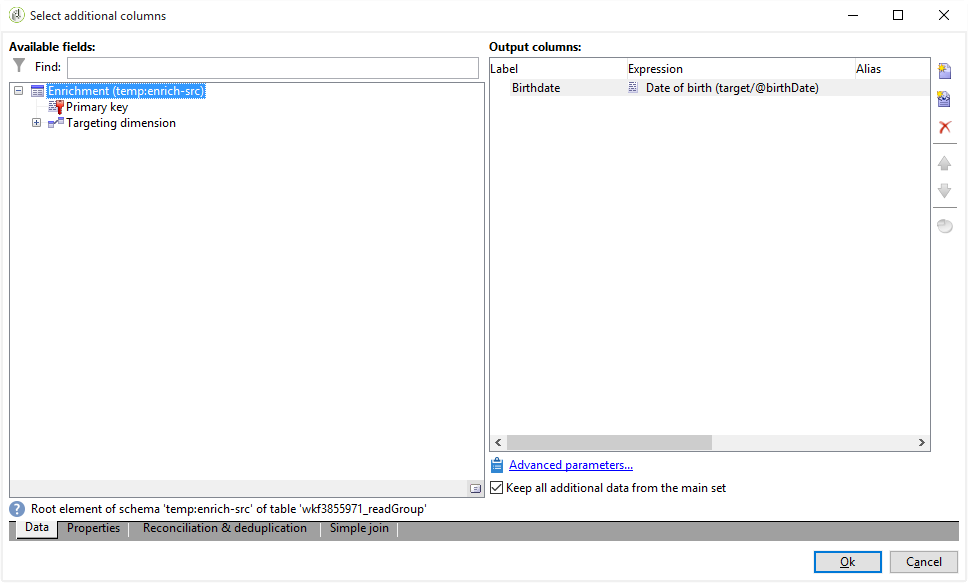

1. Then, to create the custom date field **Validity end date** which will target the week after the birthdate, you need to add the **[!UICONTROL Expression]**: `AddDays([target/@birthDate], 7)`.

   You can add a label to your expression.

   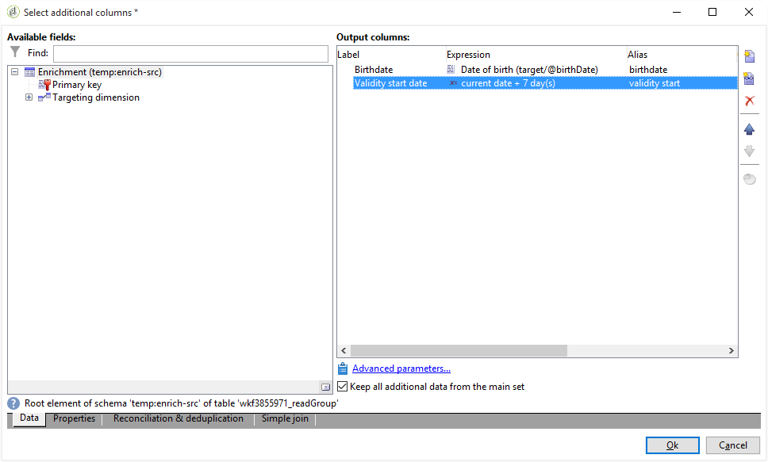

1. Click **[!UICONTROL Ok]**. Your enrichment is now ready.

After your **[!UICONTROL Enrichment]** activity, you can add a delivery. In this case, we added an email delivery to send recipients a special offer with validity dates to customers celebrating their birthdays this month.

1. Drag and drop an **[!UICONTROL Email delivery]** activity after your **[!UICONTROL Enrichment]** activity.

   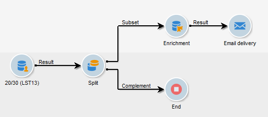

1. Double-click your **[!UICONTROL Email delivery]** activity to start personalizing your delivery.
1. Add a **[!UICONTROL Label]** to your delivery and click **[!UICONTROL Continue]**.
1. Click **[!UICONTROL Save]** to create your email delivery.
1. Check in the **[!UICONTROL Approval]** tab of the email delivery **[!UICONTROL Properties]** that the **[!UICONTROL Confirm delivery before sending option]** is checked.

   Then, start your workflow to enrich your outbound transition with the targeted information.

   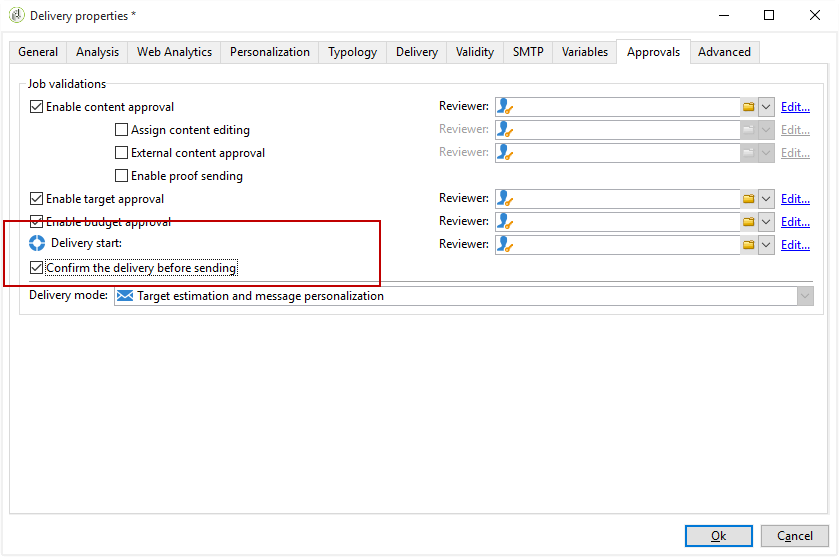

You can now start designing your email delivery with the custom date fields created in the **[!UICONTROL Enrichment]** activity.

1. Double-click your **[!UICONTROL Email delivery]** activity.
1. Add your target extensions to your email. It should be inside the following expression in order to configure the format of your validity dates:

   ```
   <%=
           formatDate(targetData.alias of your expression,"%2D.%2M")  %>
   ```

1. Click 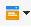 . Select **[!UICONTROL Target extension]** then the previously created custom validity dates with the **[!UICONTROL Enrichment]** activity to add your extension to the formatDate expression.

   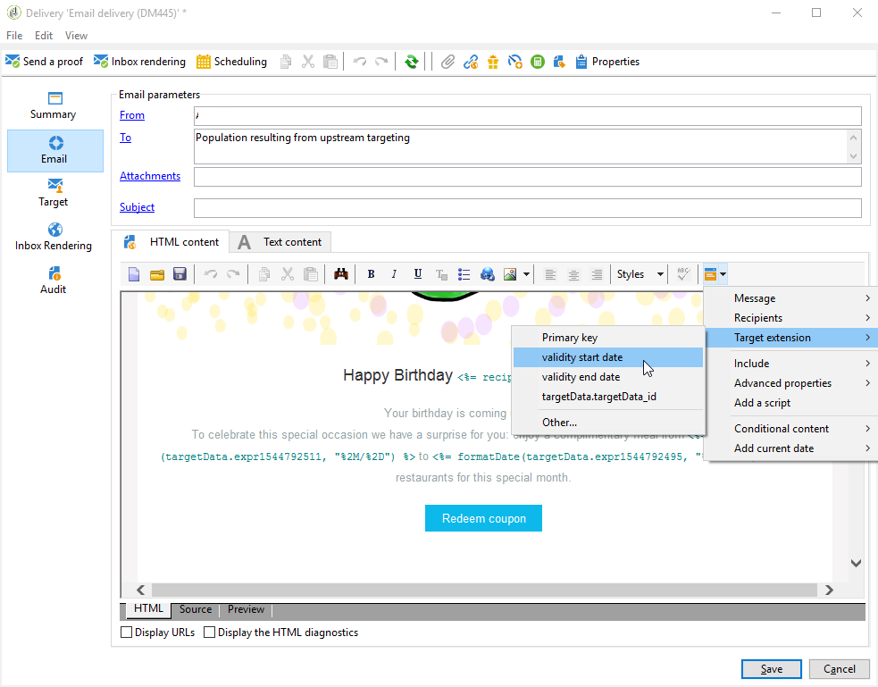

1. Configure your email content as needed.

   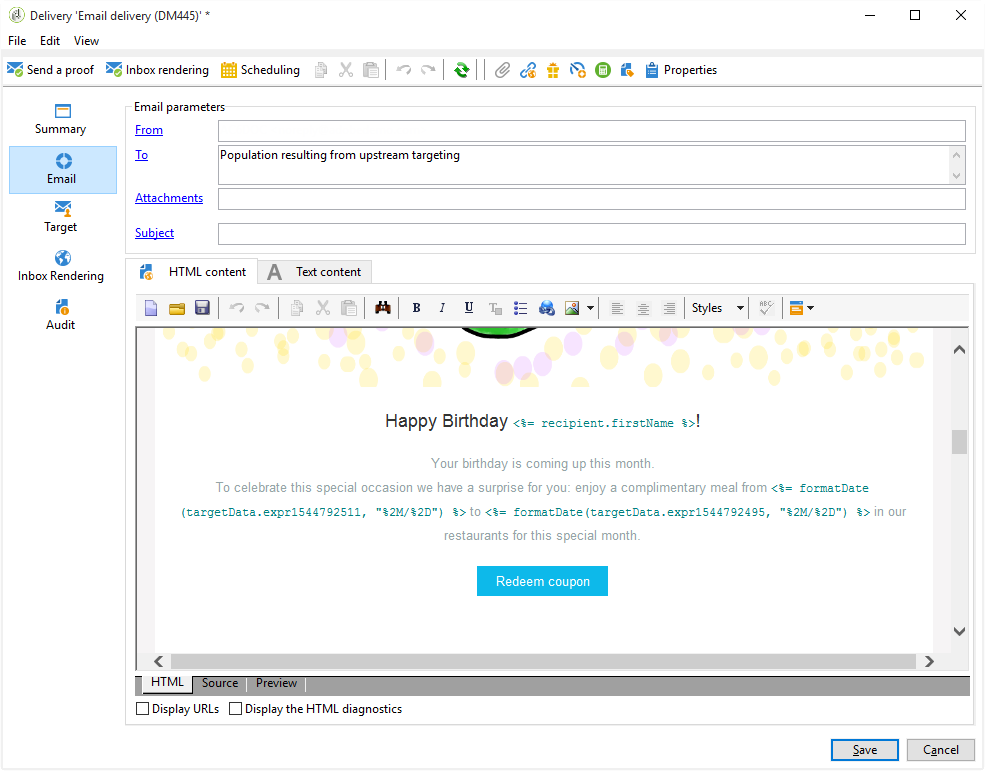

1. Preview your email to check if your custom date fields were correctly configured

   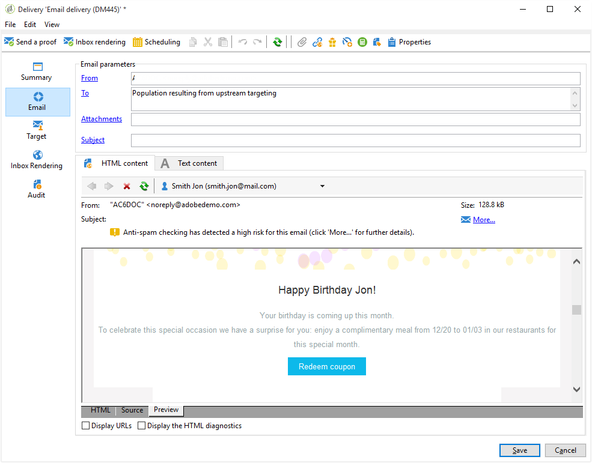

Your email is now ready. You can start sending your proofs and confirm your delivery to send your birthday emails.
