# Enriching data{#enriching-data}

## About enriching data {#about-enriching-data}

This use case details possible uses of the **[!UICONTROL Enrichment]** activity in a targeting workflow. For more on using the **[!UICONTROL Enrichment]** activity, refer to: [Enrichment](enrichment.md).

A use case on how to enrich an email delivery with custom dates is also available in [this section](email-enrichment-with-custom-date-fields.md).

The contacts in the marketing database are sent an invitation to take part in a competition via a web application. The results of the competition are recovered in the **[!UICONTROL Competition results]** table. This table is linked to the contact table (**[!UICONTROL Recipients]**). The **[!UICONTROL Competition results]** table contains the following fields:

* Competition name (@game)
* Trial number (@trial)
* Score (@score)

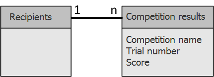

A contact found in the **[!UICONTROL Recipients]** table can be linked to several lines in the **[!UICONTROL Competition results]** table. The relationship between these two tables is of 1-n type. Here is an example of the result logs for a recipient:

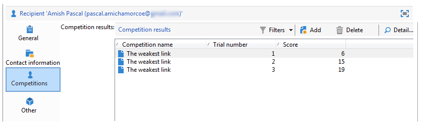

The purpose of this use case it to send personalized deliveries to people who took part in the latest competition depending on their highest scores. The recipient with the highest score gets first prize, the recipient with the second highest score gets a consolation prize and all the others get a message wishing them better luck next time.

To set up this use case, we created the following targeting workflow:

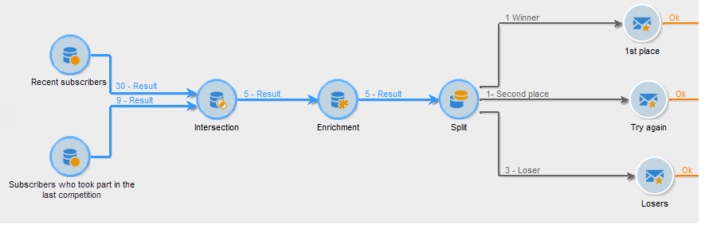

To create the workflow, apply the following steps:

1. Two **[!UICONTROL Query]** activities and one **[!UICONTROL Intersection]** activity are added to target new subscribers who entered last the competition. 
1. The **[!UICONTROL Enrichment]** activity enables us to add data stored in the **[!UICONTROL Competition results]** table. The **[!UICONTROL Score]** field which our delivery personalization will take place on is added to the work table of the workflow. 
1. The **[!UICONTROL Split]** type activity enables us to create recipient subsets based on scores.
1. For each subset, a **[!UICONTROL Delivery]** type activity is added.

## Step 1: Targeting {#step-1--targeting}

The first query enables us to target recipients who were added to the database within the last six months.

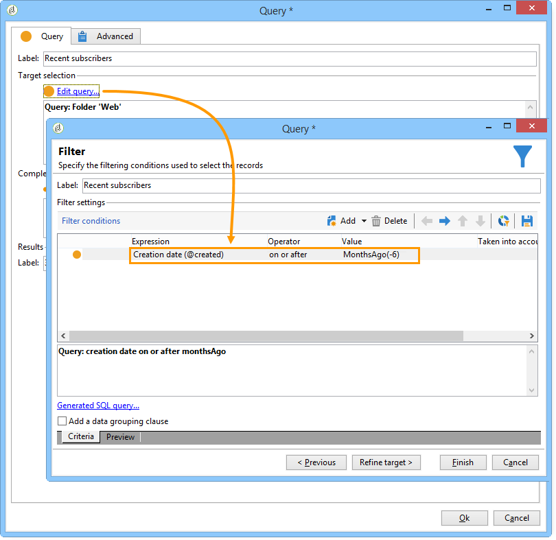

The second query enables us to target the recipients who took part in the last competition.

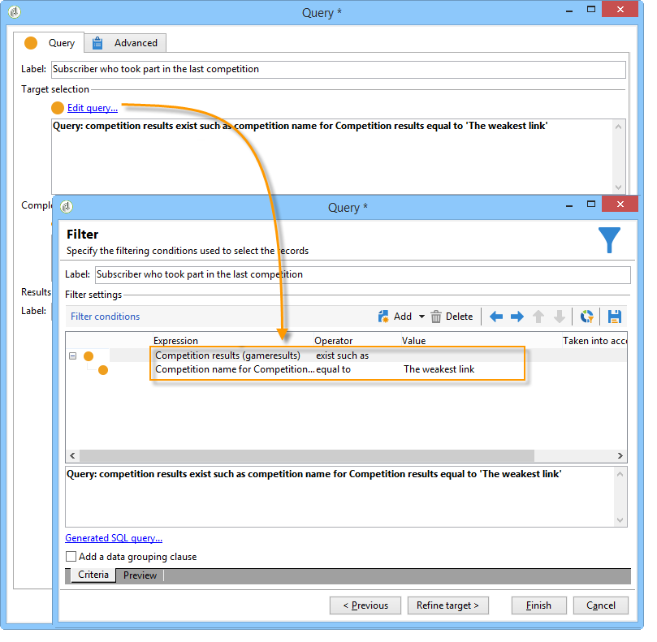

An **[!UICONTROL Intersection]** type activity is then added to target the recipients added to the database within the last six months and who entered the last competition.

## Step 2: Enrichment {#step-2--enrichment}

In this example, we want to personalize deliveries according to the **[!UICONTROL Score]** field stored in the **[!UICONTROL Competition results]** table. This table has a 1-n type relationship with the recipients table. The **[!UICONTROL Enrichment]** activity enables us to add data from a table linked to the filtering dimension to the work table of the workflow.

1. In the editing screen of the enrichment activity, select **[!UICONTROL Add data]**, then **[!UICONTROL Data linked to the filtering dimension]** and click **[!UICONTROL Next]**.

   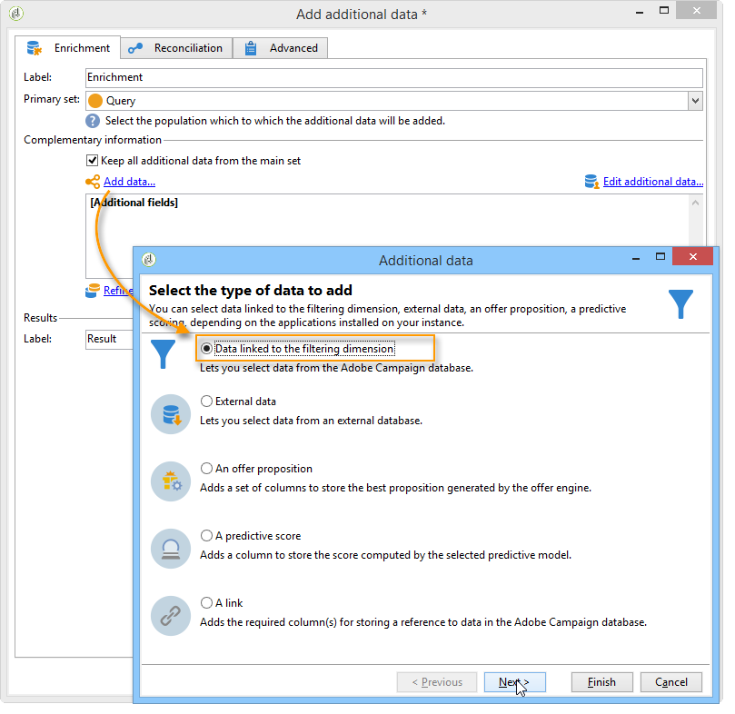

1. Then select the **[!UICONTROL Data linked to the filtering dimension]** option, select the **[!UICONTROL Competition results]** table and click **[!UICONTROL Next]**.

   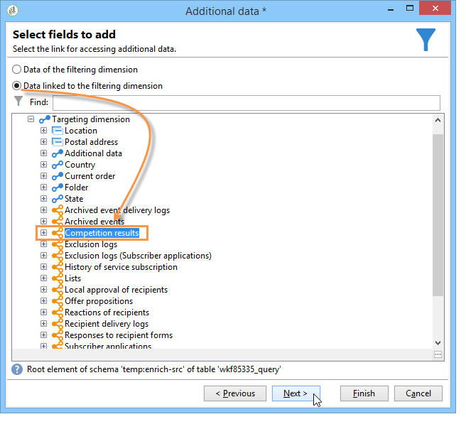

1. Enter an ID and a label, and select the **[!UICONTROL Limit the line count]** option in the **[!UICONTROL Data collected]** field. In the **[!UICONTROL Lines to retrieve]** field, select '1' as a value. For each recipient, the enrichment activity will add a single line from the **[!UICONTROL Competition results]** table to the work table of the workflow. Click **[!UICONTROL Next]**.

   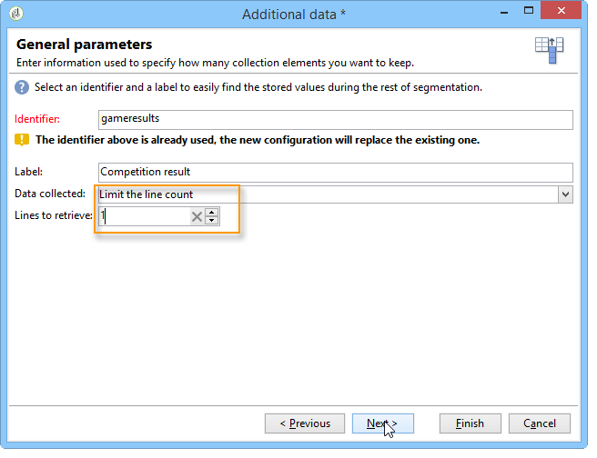

1. In this example, we want to recover the recipient's highest score, but only for the last competition. To do this, add a filter to the **[!UICONTROL Competition name]** field to exclude all lines related to previous competitions. Click **[!UICONTROL Next]**.

   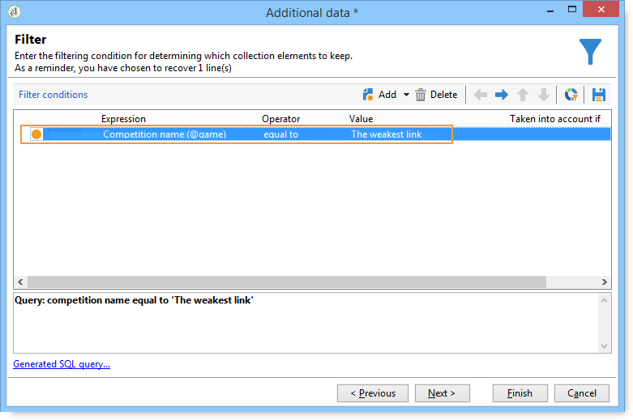

1. Go to the **[!UICONTROL Sort]** screen and click the **[!UICONTROL Add]** button, select the **[!UICONTROL Score]** field and check the box in the **[!UICONTROL descending]** column to sort items of the **[!UICONTROL Score]** fields in descending order. For each recipient, the enrichment activity adds a line that matches the highest score for the last game. Click **[!UICONTROL Next]**.

   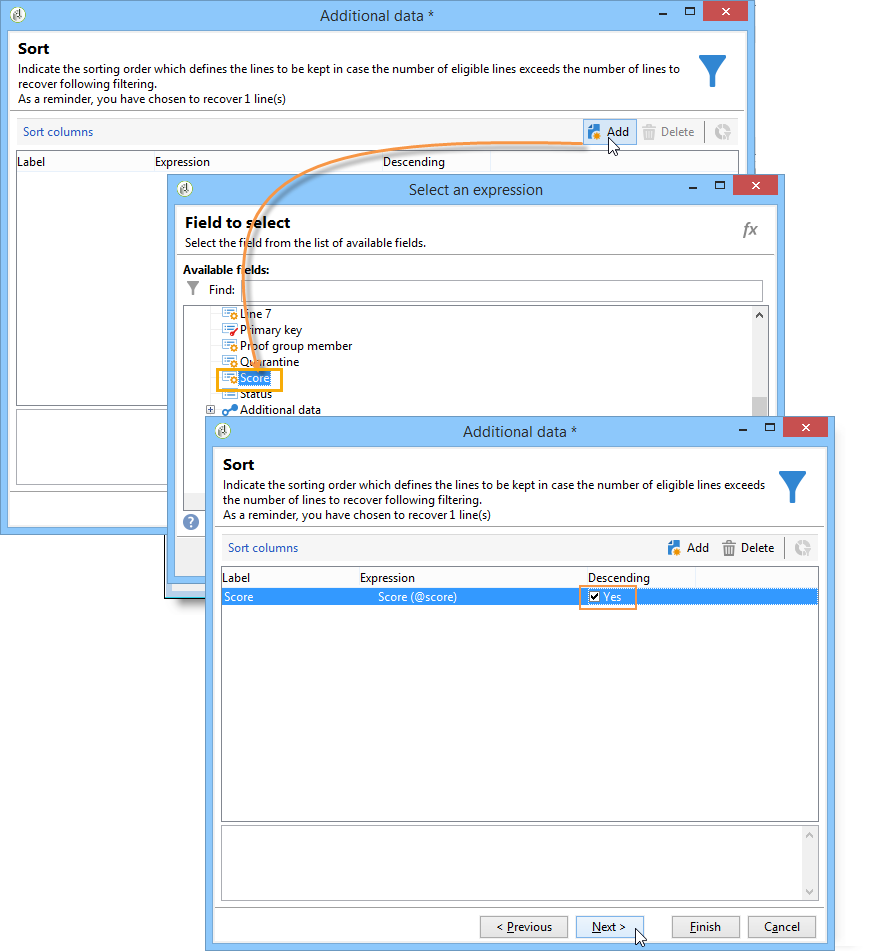

1. In the **[!UICONTROL Data to add]** window, double-click the **[!UICONTROL Score]** field. For each recipient, the enrichment activity will add only the **[!UICONTROL Score]** field. Click **[!UICONTROL Finish]**.

   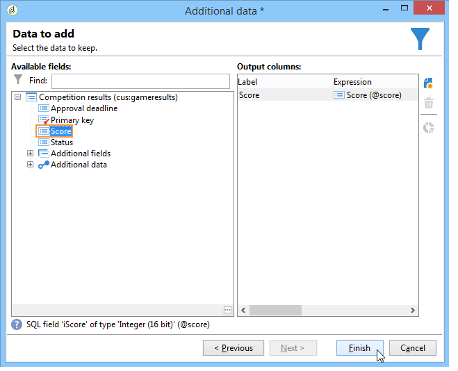

Right-click the inbound transition of the enrichment activity and select **[!UICONTROL Display the target]**. The work table contains the following data:

The linked schema is:

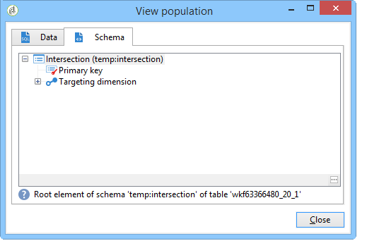

Renew this operation on the outbound transition of the enrichment activity. We can see that the data linked to the recipient scores has been added. The highest score of each recipient has been recovered.

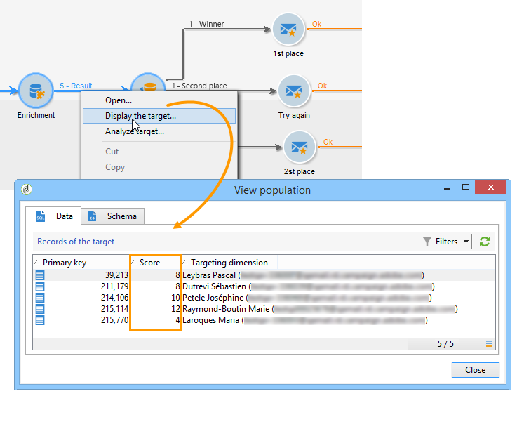

The matching schema has also been enriched.

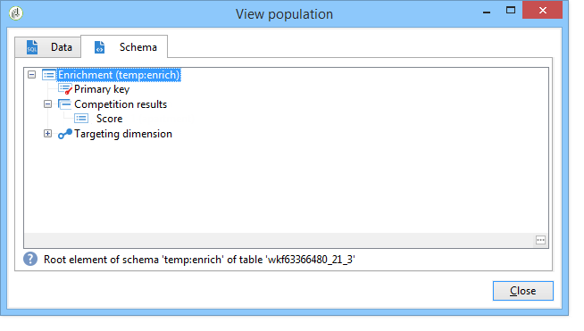

## Step 3: Split and delivery {#step-3--split-and-delivery}

To sort the recipients based on their scores, a **[!UICONTROL Split]** activity is added after the enrichment. 

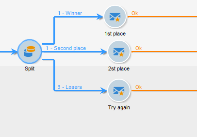

1. A first (**Winner**) subset has been defined to include the recipient with the highest score. To do this, define a limitation of the number of records, apply a descending sort to the score, and limit the number of records to 1.

   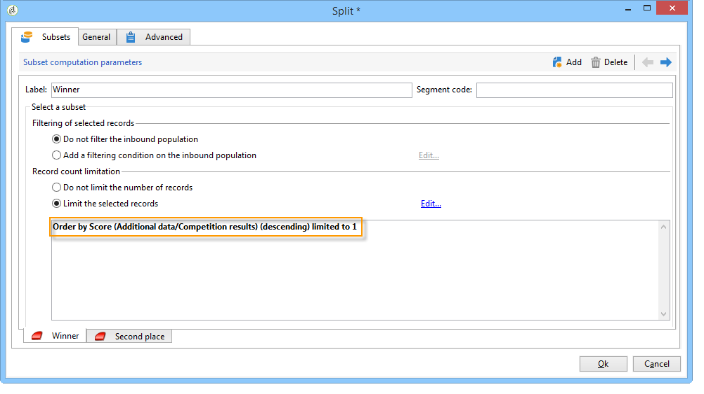

1. The second (**Second place**) subset includes the recipient with the second highest score. Configuration is the same as for the first subset.

   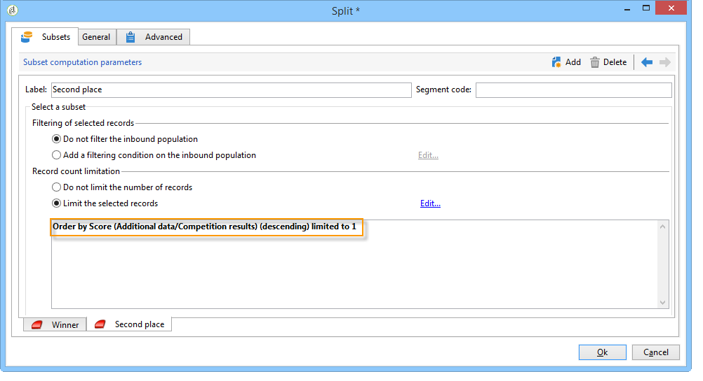

1. The third (**losers**) subset contains all other recipients. Go to the **[!UICONTROL General]** tab and check the **[!UICONTROL Generate complement]** box to target all recipients who did not achieve the two highest scores.

   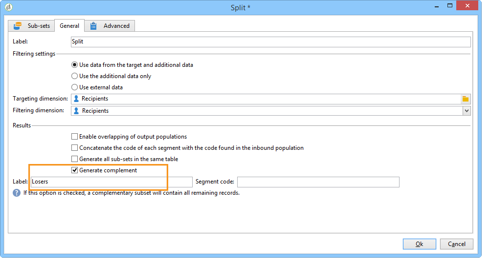

1. Add a **[!UICONTROL Delivery]** type activity for each subset, using a different delivery template for each.

   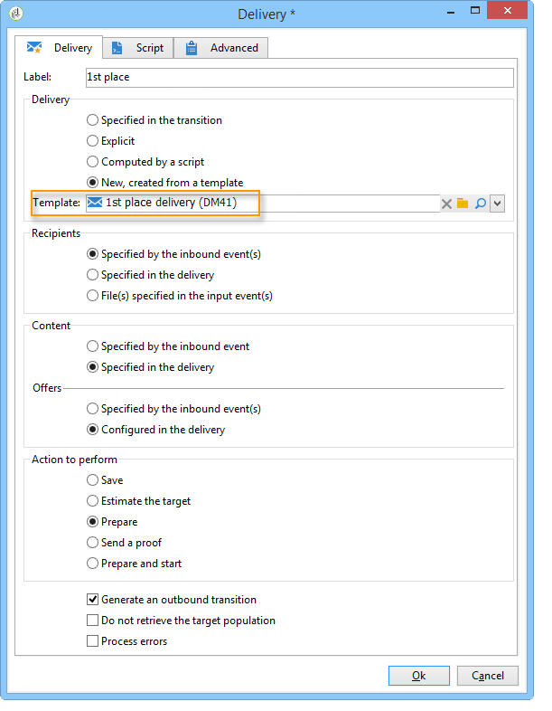
