# Enrichment{#enrichment}


The **[!UICONTROL Enrichment]** activity lets you add information to a profile list and links to an existing table (create a new join). Reconciliation criteria with profiles in the database can also be defined.

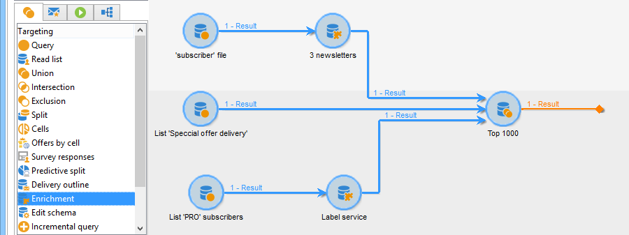

## Definitions {#definitions}

To use the enrichment activity, you need to be familiar with the various options available when adding data.

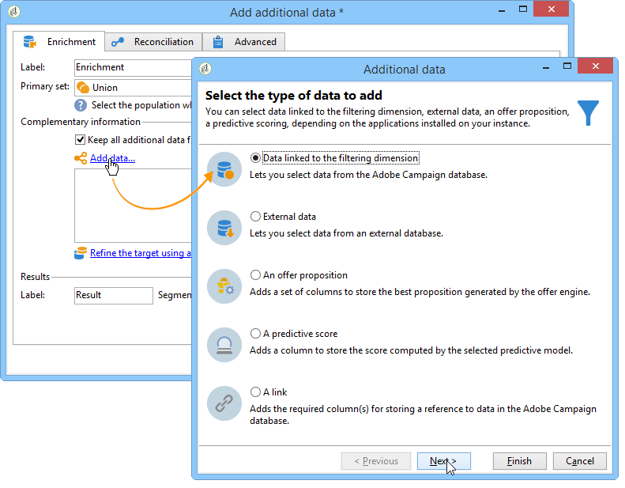

The **[!UICONTROL Data linked to the filtering dimension]** option gives you access to:

* Data of the filtering dimension: access to the work table data
* Data linked to the filtering dimension: access to data linked to the work table

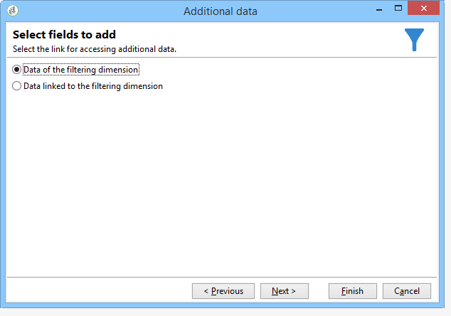

The **[!UICONTROL A link]** option lets you create a join on any table of the database.

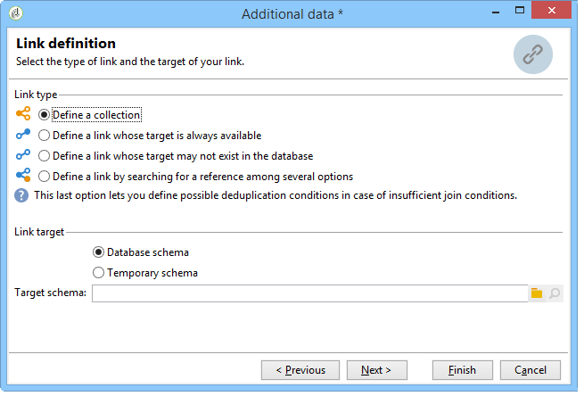

There are four types of links:

* **[!UICONTROL Define a collection]**: lets you define a link with a 1-N cardinality between the tables.
* **[!UICONTROL Define a link whose target is still available]**: lets you define a link with a 1-1 cardinality between tables. The join conditions must be defined by a single record in the target table.
* **[!UICONTROL Define a link whose target does not necessarily exist in the base]**: lets you define a link with a 0-1 cardinality between tables. The join condition must be defined by 0 or 1 (max.) record in the target table.

  This option is configured in the **[!UICONTROL Simple Join]** tab that can be accessed via the **[!UICONTROL Edit additional data]** link of the **[!UICONTROL Enrichment]** activity.

* **[!UICONTROL Define a link by searching for a reference among several options]**: this type of link defines a reconciliation towards a unique record. Adobe Campaign creates a link to a target table by adding a foreign key in the target table for storing a reference to the unique record.

  This option is configured in the **[!UICONTROL Reconciliation and deduplication]** tab that can be accessed via the **[!UICONTROL Edit additional data]** link of the **[!UICONTROL Enrichment]** activity.

Use cases detailing the operating of Enrichment activities in their context are also available in these sections:

* [Email enrichment with custom date fields](email-enrichment-with-custom-date-fields.md).
* [Enriching data](enriching-data.md)
* [Creating a summary list](creating-a-summary-list.md)

## Adding information {#adding-information}

Use the **[!UICONTROL Enrichment]** activity to add columns to a work table: this activity can be used as a complement to a query activity.

The configuration of additional columns is detailed in [Adding data](query.md#adding-data).

The **[!UICONTROL Primary set]** field lets you select the inbound transition: the data of this activity's worktable will be enriched.

Click the **[!UICONTROL Add data]** link and select the type of data to add. The list of data types offered depends on the modules and options installed on your platform. In a minimal configuration, you can always add data linked to the filtering dimension and a link.


In the example below, the outbound transition will be enriched with information on the age of the targeted profiles.

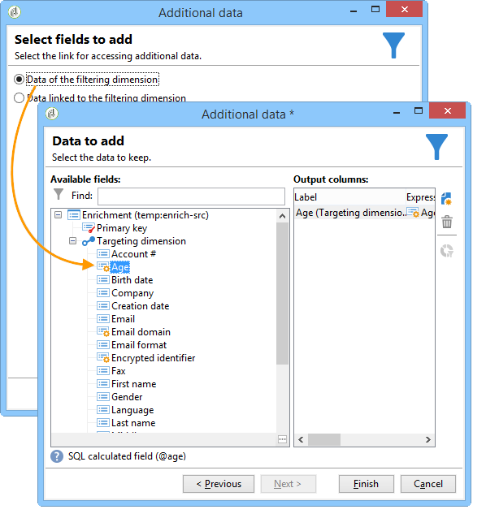

Right-click on the enrichment activity's inbound transition to view the data before the enrichment stage. 

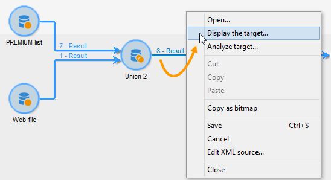

The worktable contains the following data and the associated schema:

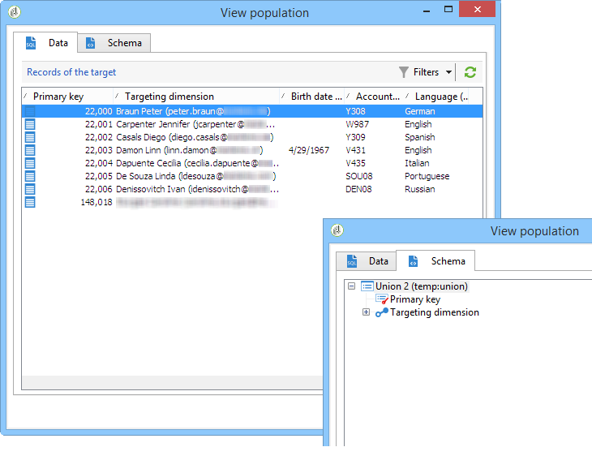

Repeat this operation at the enrichment stage output.

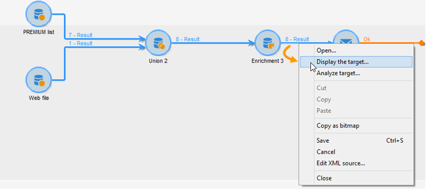

You can see that the data related to profile ages has been added:

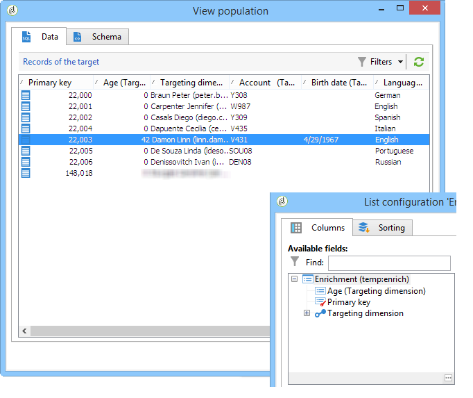

The matching schema has also been enriched.

## Managing additional data {#managing-additional-data}

Deselect the **[!UICONTROL Keep all additional data from the main set]** option if you do not want to keep the previously defined additional data. In this case, only the additional columns that were selected in the enrichment activity will be added to the outgoing work table. The additional information added to the activities upstream will not be saved.

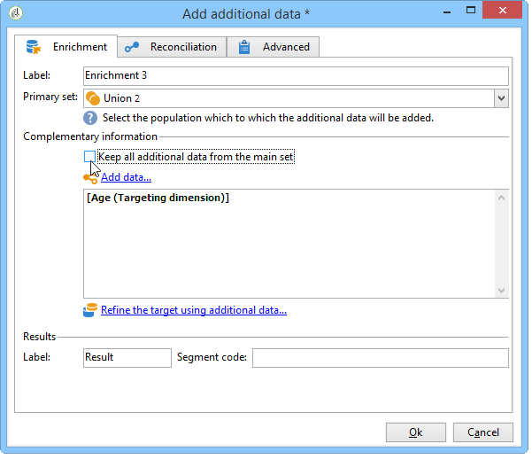

The data and the schema at the enrichment stage output will be as follows:

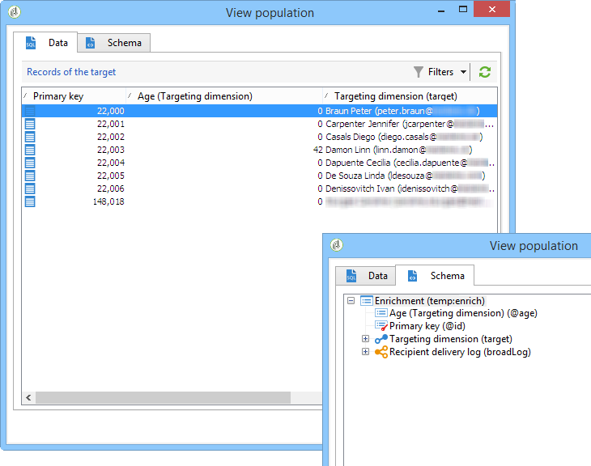

## Creating a link {#creating-a-link}

You can use the enrichment activity to create a link between the working data and the Adobe Campaign database: this will be a local link to the workflow between the inbound data.

For example, if you load data of a file which contains the account number, country and email of recipients, you will have to create a link towards the country table in order to update this information in their profiles.

To do this, apply the following steps:

1. Collect and load the following type of file:

   ```
   Account number;Country;Email
   18D65;FRANCE;agnes@gmail.com
   243PP;RUSSIA;paul@gmail.com
   55H87;CROATIA;dave@gmail.com
   56U81;USA;susan@gmail.com
   853PI;ITALY;anna@gmail.com
   890LP;FRANCE;robert@gmail.com
   83TY2;SWITZERLAND;mike@gmail.com
   ```

1. Edit the enrichment activity and click the **Add data...** link to create a join with the Country table.

   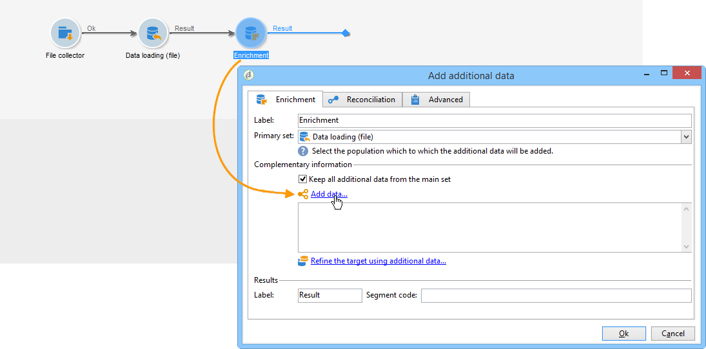

1. Select the **[!UICONTROL Link definition]** option and click the **[!UICONTROL Next]** button. Specify the type of link to be created. In this example, we want to reconcile the file recipient's country with a country in the list of available countries in the dedicated table of the database. Choose the **[!UICONTROL Define a link by searching for a reference among several options]** option. Select the country table in the **[!UICONTROL Target schema]** field. 

   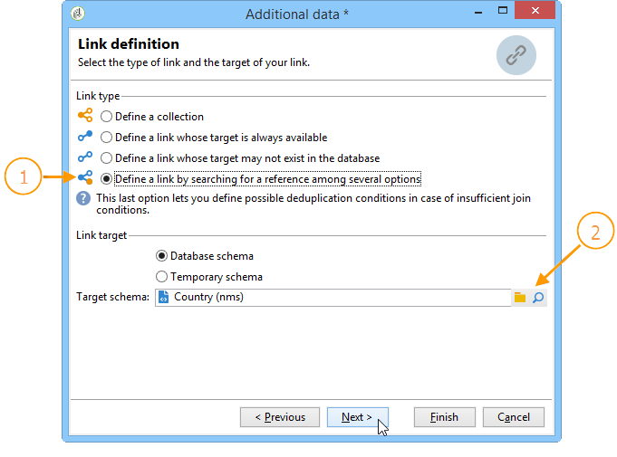

1. Finally, select the field(s) which will let you link the source file values to those in the database.

   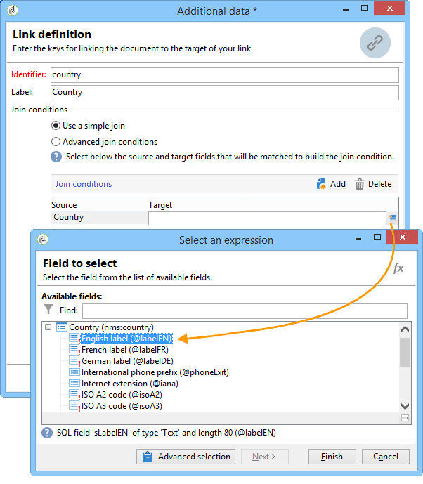

At the output of this enrichment activity, the temporary schema will contain the link to the country table:

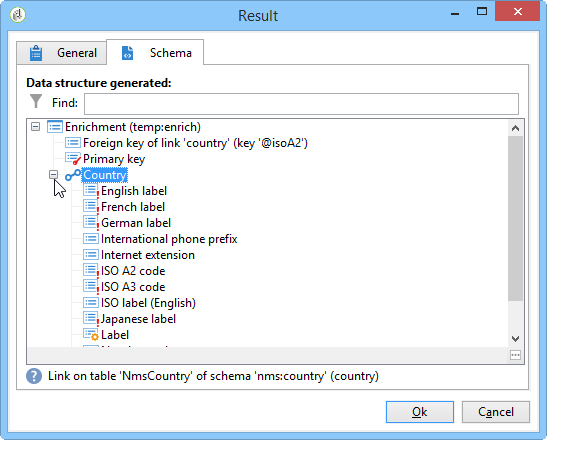

## Data reconciliation {#data-reconciliation}

The enrichment activity can be used to configure data reconciliation, including once data has been loaded into the database. In this case, the **[!UICONTROL Reconciliation]** tab lets you define the link between the data in the Adobe Campaign database and the data in the work table.

Select the **[!UICONTROL Identify the targeting document based on work data]** option, specify the schema you want to create a link to and define the joining conditions: to do this, select the fields to be reconciled in the work data (**[!UICONTROL Source expression]**) and in the targeting dimension (**[!UICONTROL Destination expression]**).

You can use one or more reconciliation criteria.

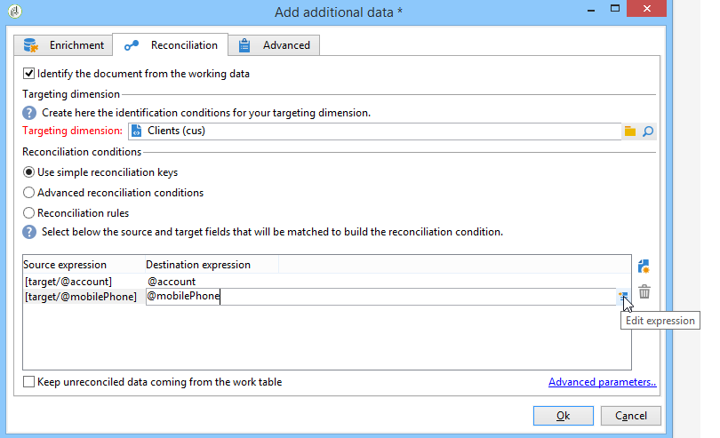

If several join conditions are specified, they must ALL be verified so that the data can be linked together.

## Inserting an offer proposition {#inserting-an-offer-proposition}

The enrichment activity lets you add offers or links to offers for delivery recipients.

For more information on the enrichment activity, refer to this [section](enrichment.md).

For example, you can enrich the data for a recipient query before a delivery.

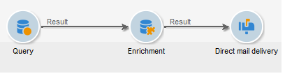

After configuring your query (refer to this [section](query.md)):

1. Add and open an enrichment activity.
1. In the **[!UICONTROL Enrichment]** tab, select **[!UICONTROL Add data]**.
1. Select **[!UICONTROL An offer proposition]** in the types of data to add.

   

1. Specify an identifier as well as a label for the proposition that will be added.
1. Specify the offer selection. There are two possible options for this:

    * **[!UICONTROL Search for the best offer in a category]**: check this option and specify the offer engine call parameters (offer space, category or theme(s), contact date, number of offers to keep). The engine will automatically calculate the offer(s) to add according to these parameters. We recommend completing either the **[!UICONTROL Category]** or the **[!UICONTROL Theme]** field, rather than both at the same time.
    
      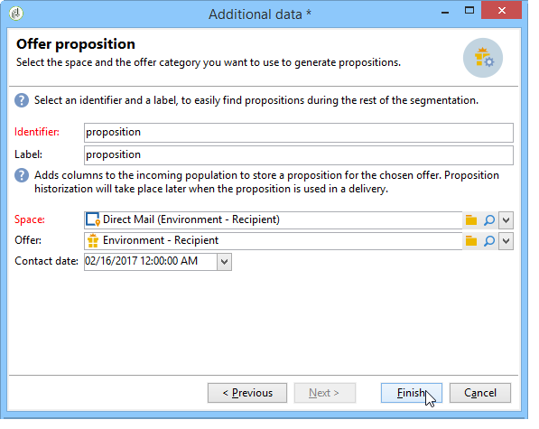

    * **[!UICONTROL A predefined offer]**: check this option and specify an offer space, a specific offer, and a contact date to directly configure the offer that you would like to add, without calling the offer engine.
    
      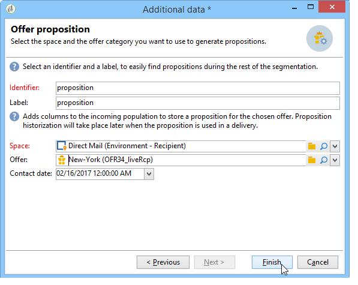

1. Then configure a delivery activity that corresponds to your chosen channel. Refer to [Cross-channel deliveries](cross-channel-deliveries.md).

   The number of propositions available for the preview depends on the configuration carried out in the enrichment activity rather than any possible configuration carried out directly in the delivery.

To specify offer propositions, you can also choose to reference a link to an offer. For more on this, refer to the following section [Referencing a link to an offer](#referencing-a-link-to-an-offer).

## Referencing a link to an offer {#referencing-a-link-to-an-offer}

You can also reference a link to an offer in an enrichment activity.

To do this:

1. Select **[!UICONTROL Add data]** in the activity's **[!UICONTROL Enrichment]** tab.
1. In the window where you choose the type of data to add, select **[!UICONTROL A link]**.
1. Select the type of link you want to establish as well as its target. In this case, the target is the offer schema.

   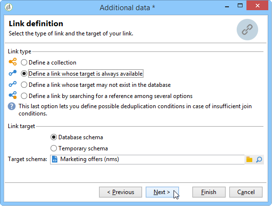

1. Specify the join between the inbound table data in the enrichment activity (here the recipient table) and the offer table. For example, you can link an offer code to a recipient.

   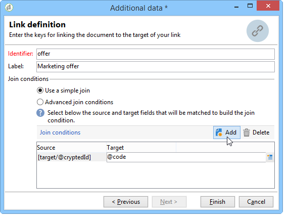

1. Then configure a delivery activity that corresponds to your chosen channel. Refer to [Cross-channel deliveries](cross-channel-deliveries.md).

   >[!NOTE]
   >
   >The number of propositions available for the preview depends on the configuration carried out in the delivery.

## Storing offer rankings and weights {#storing-offer-rankings-and-weights}

By default, when an **enrichment** activity is used to deliver offers, their rankings and their weights are not stored in the proposition table.

The **[!UICONTROL Offer engine]** activity does store this information by default.

However, you can store this information as follows:

1. Create a call to the offer engine in an enrichment activity placed after a query and before a delivery activity.
1. In the activity's main window, select **[!UICONTROL Edit additional data...]**.

   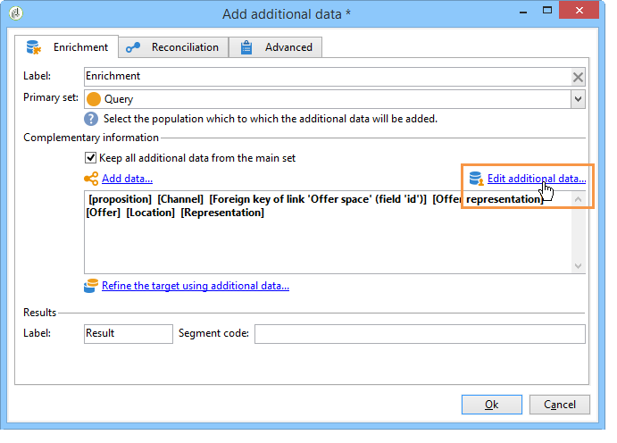

1. Add the **[!UICONTROL @rank]** columns for the ranking and **[!UICONTROL @weight]** for the offer weight.

   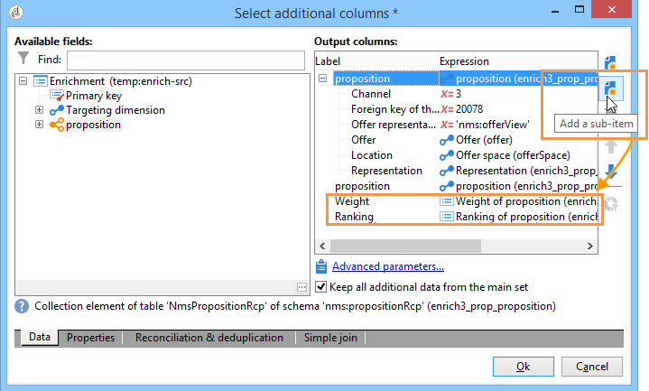

1. Confirm your addition and save your workflow.

The delivery automatically stores the ranking and weight of offers. This information is visible in the delivery's **[!UICONTROL Offers]** tab.
