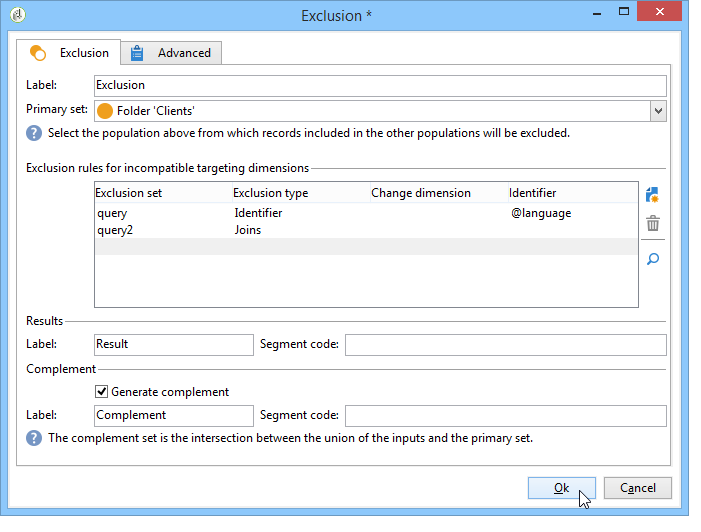
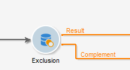

# Exclusion{#exclusion}

An **Exclusion**-type activity creates a target based on a main target from which one or more other targets are extracted.

To configure this activity, enter its label and select the main recipient set: the population from the main set lets you construct the result. Profiles shared by the main set and at least one of the entry activities will be excluded.

>[!NOTE]
>
>For more on configuring and using the exclusion activity, refer to [Excluding a population (Exclusion)](targeting-data.md#excluding-a-population--exclusion-).

Check the **[!UICONTROL Generate complement]** option if you wish to exploit the remaining population. The complement will contain the main incoming population minus the outgoing population. An additional output transition will then be added to the activity, as follows:

## Exclusion examples {#exclusion-examples}

The following example seeks to compile a list of recipients aged between 18 and 30 years old, while excluding residents of Paris.

1. Insert and open an **[!UICONTROL Exclusion]** -type activity following two queries. The first query targets recipients living in Paris. The second query targets those aged 18 to 30.
1. Enter the main set. Here the main set is the **18-30 years old** query. Elements pertaining to the second set will be excluded from the final result.
1. Check the **[!UICONTROL Generate complement]** option if you wish to exploit the data that remains after the exclusion. In this case, the complement is made up of recipients aged 18 to 30 that live in Paris.
1. Approve the exclusion configuration then insert an update list activity to the result. You can also insert an additional list update to the complement where necessary.
1. Execute the workflow. In this example, the result is made up of recipients aged 18 to 30, but those living in Paris are excluded and sent to the complement.

   

## Input parameters {#input-parameters}

* tableName
* schema

Each inbound event must specify a target defined by these parameters.

## Output parameters {#output-parameters}

* tableName
* schema
* recCount

This set of three values identifies the target resulting from the exclusion. **[!UICONTROL tableName]** is the name of the table that records the target identifiers, **[!UICONTROL schema]** is the schema of the population (usually nms:recipient) and **[!UICONTROL recCount]** is the number of elements in the table.

The transition associated with the complement has the same parameters.
