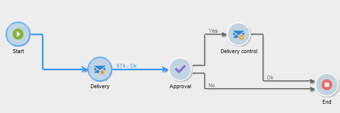

# Executing a workflow{#executing-a-workflow}

## Starting a workflow {#starting-a-workflow}

A workflow is always started manually. When started, it can however remain inactive depending on the information specified via a scheduler (see [Scheduler](../../workflow/using/scheduler.md)) or activity scheduling.

Actions related to targeting workflow execution (launch, stop, pause, etc.) are **asynchronous** processes: the order is recorded and will be effective as soon as the server is available to apply it.

The toolbar allows you to start and track the execution of the workflow.

The list of options available in the **[!UICONTROL Actions]** menu and the right-click menu are detailed below.

### Actions toolbar {#actions-toolbar}

The toolbar buttons are detailed in this [section](../../campaign/using/setting-up-marketing-campaigns.md#building-the-main-target-in-a-workflow). The **[!UICONTROL Actions]** button gives you access to additional execution options for acting on selected workflows. You can also use the **[!UICONTROL File > Actions]** menu, or right-click a workflow and select **[!UICONTROL Actions]**.


* **[!UICONTROL Start]**

  This action lets you start the execution of a workflow: a workflow that is **Finished**, **Being edited** or **Paused** changes status to **Started**. The workflow engine then handles the execution of this workflow. If the workflow was paused, it is resumed, otherwise the workflow is started from the beginning and the initial activities are activated.

  Starting is an asynchronous process: The request is saved and is processed as soon as possible by a workflow server.

* **[!UICONTROL Pause]**

  This action sets the status of the workflow to **Paused**. No activities are activated until the workflow is resumed; however the operations in progress are not paused.

* **[!UICONTROL Stop]**

  This action stops a workflow currently being executed. The status of the instance is set to **Finished**. Operations in progress are stopped, if possible. Imports and SQL queries are canceled immediately.

  Stopping is an asynchronous process. The request is registered, then the workflow server or servers cancel operations in progress. Stopping a workflow instance can therefore take time, especially if the workflow is running on multiple servers, each one of which must take control to cancel the tasks in progress.

* **[!UICONTROL Restart]**

  This action stops then restarts the workflow. In most cases, it makes it possible to restart faster. It is also useful to automate restarting when stopping takes a certain amount of time: this is because the 'Stop' command is not available when the workflow is being stopped.

  The **[!UICONTROL Start / Pause / Stop / Restart]** actions are also available via the execution icons in the toolbar. For more on this, refer to this [section](../../campaign/using/setting-up-marketing-campaigns.md#creating-a-targeting-workflow).

* **[!UICONTROL Purge history]**

  This action lets you purge the workflow history. For more on this, refer to [Purging the logs](../../workflow/using/monitoring-workflows.md#purging-the-logs).

* **[!UICONTROL Start in simulation mode]**

  This option lets you start the workflow in simulation mode as opposed to real mode. This means that when you enable this mode, only activities that do not impact the database or the file system are executed (e.g. **[!UICONTROL Query]**, **[!UICONTROL Union]**, **[!UICONTROL Intersection]**, etc.). Activities that do have an impact (e.g. **[!UICONTROL Export]**, **[!UICONTROL Import]**, etc.) as well as those after them (in the same branch) are not executed.

* **[!UICONTROL Execute pending tasks now]**

  This action lets you start all pending tasks as soon as possible. To start a specific task, right-click its activity and select **[!UICONTROL Execute pending task(s) now]**.

* **[!UICONTROL Unconditional stop]**

  This option changes the workflow status to **[!UICONTROL Finished]**. This action should only be used as a last resort if the normal stop process fails after several minutes. Only use the unconditional stop if you are sure there are no actual workflow jobs in progress.

  >[!CAUTION]
  >
  >This option is reserved for expert users.

* **[!UICONTROL Save as template]**

  This action creates a new workflow template based on the selected workflow. You need to specify the folder where it will be saved (in the **[!UICONTROL Folder]** field).

  The **[!UICONTROL Mass update of selected lines]** and **[!UICONTROL Merge selected lines]** options are generic platform options available in all **[!UICONTROL Actions]** menus. For more on this, refer to this [section](../../platform/using/updating-data.md).

### Right-click menu {#right-click-menu}

When one or more workflow activities are selected, you can right-click to act on your selection. 


The following options are available in the right-click menu:

**[!UICONTROL Open]**: this option lets you access the activity properties.

**[!UICONTROL Display logs:]** this option lets you view the task execution log for the selected activity. Refer to [Displaying logs](../../workflow/using/monitoring-workflows#displaying-logs).

**[!UICONTROL Execute pending task(s) now:]** this action lets you start pending tasks as soon as possible.

**[!UICONTROL Workflow restart from a task:]** this option lets you restart the workflow using the results previously stored for this activity.

**[!UICONTROL Cut/Copy/Paste/Delete:]** these options let you cut, copy, paste and delete activities.

**[!UICONTROL Copy as bitmap:]** this option lets you take a screenshot of all activities.

**[!UICONTROL Normal execution / Enable but do not execute / Do not enable:]** these options are also available in the **[!UICONTROL Advanced]** tab of the activity properties. They are detailed in [Execution](../../workflow/using/advanced-parameters.md#execution).

**[!UICONTROL Save / Cancel:]** lets you save or cancel the changes made to a workflow.

>[!NOTE]
>
>You can select a group of activities and apply one of these commands to them.

The right-click menu is also detailed in this [section](../../campaign/using/setting-up-marketing-campaigns.md#executing-a-workflow).

## Workflow life cycle {#workflow-life-cycle}

The workflow cycle has three main steps.

* **Being edited**

  This is the initial design phase: When is new workflow is created, its status is 'Being edited'. The workflow is not yet handled by the server and can be modified without risk.

* **Started**

  Once the initial design phase is complete, the workflow can be started. In this phase, the instance is handled by the server and the individual tasks are executed. The workflow can still be modified with certain precautions.

* **Finished**

  A workflow is 'Finished' when there are no longer any tasks in progress or when an operator has explicitly stopped the instance.

For example, the **Start** and **Delivery** activities are outlined while the **Approval** activity flashes in the worfklow below.



This means that the first two activities have been successfully executed and that approval is in progress, i.e. it has been created but not yet completed.

The characters **574 -Ok** displayed above the transition following the **Delivery** activity mean that the delivery preparation has targeted 574 recipients and that the operation was completed successfully. This information, which is added to the transitions when they are executed, is computed by the activities that process data.

The workflow is started and is waiting for an operator belonging to the group specified in the **Approval** activity to make a decision. The operators belonging to the group and who have an email address or mobile telephone number are notified.

Operator management is detailed in this [section](../../platform/using/access-management.md).

## Data life cycle {#data-life-cycle}

### Work table {#work-table}

In workflows, data transported from one activity to another is stored in a temporary work table.

This data can be displayed and analyzed by right-clicking the appropriate transition. 


To do this, select the relevant menu:

* Displaying the target

  This menu displays the available data on the target population as well as the structure of the work table (**[!UICONTROL Schema]** tab).

  

  For more on this, refer to [Worktables and workflow schema](../../workflow/using/monitoring-workflows.md#worktables-and-workflow-schema).

* Analyzing the target

  This menu lets you access the descriptive analysis wizard which lets you produce statistics and reports on the transition data.

  For more on this, refer to this [section](../../reporting/using/using-the-descriptive-analysis-wizard.md).

The target data is purged as the workflow is executed. Only the last work table is accessible. You can configure the workflow so that all work tables remain accessible: check the **[!UICONTROL Keep the result of interim populations between two executions]** option in the workflow properties.

However, we recommend that you avoid activating this option in case of significant amounts of data. 


### Target data {#target-data}

The data stored in the workflow's work table is accessible in the personalization fields.

This lets you use data collected via a list or based on answers to a survey in a delivery. To do this, use the following syntax:

```
%= targetData.FIELD %
```

**[!UICONTROL Target extension]** (targetData) type personalization elements are not available for targeting workflows. The delivery target has to be built in the workflow and specified in the inbound transition of the delivery.

If you want to create delivery proofs, the proof target needs to be built based on the **[!UICONTROL Address substitution]** mode so that the personalization data can be entered. For more on this, refer to this [section](../../delivery/using/key-steps-when-creating-a-delivery.md#using-address-substitution-in-proof).

In the following example, we are going to collect a list of information on customers, to be used in a personalized email.

Apply the following steps:

1. Create a workflow to collect information, reconcile it with the data already in the database, then start a delivery. 

   

   In our example, the file content is as follows:

   ```
   Music,First name,Last name,Account,CD/DVD,Card
   Pop,David,BLAIR,4323,CD,0
   Rock,Daniel,ARCARI,3222,DVD,1
   Disco,Uma,ALTON,0488,DVD,0
   Jazz,Paul,BOLES,6475,CD,1
   Jazz,David,BOUKHARI,0841,DVD,1
   [...]
   ```

   To load the file, apply the following steps:

   

1. Configure the **[!UICONTROL Enrichment]** type activity to reconcile the collected data with that already in the Adobe Campaign database.

   Here, the reconciliation key is the account number:

   

1. Then configure the **[!UICONTROL Delivery]**: it is created based on a template, and the recipients are specified by the inbound transition. 

   

   >[!CAUTION]
   >
   >Only data contained in the transition may be used to personalize the delivery. **targetData** type personalization fields are only available for the inbound population of the **[!UICONTROL Delivery]** activity.

1. In the delivery template, use the fields collected in the workflow.

   To do this, insert **[!UICONTROL Target extension]** type personalization fields.

   

   Here, we want to insert the customer's favorite music genre and media type (CD or DVD) as stated in the file collected by the workflow.

   As a plus, we are going to add a coupon for loyalty card holders, i.e. recipients for whom the 'Card' value equals 1.

   

   **[!UICONTROL Target extension]** (targetData) type data is inserted into deliveries using the same characteristics as all personalization fields. They may also be used in the subject, link labels, or the links themselves.

   Messages addressed to collected recipients will contain the following data:

   

## Defining approvals {#defining-approvals}

Approvals enable operators to make decisions governing a workflow or to confirm its continued execution.

A message is sent to a group of operators and the workflow waits for a response before resuming. The workflow is not stopped and other operations can take place. For example, there may be multiple simultaneous approvals pending.

An approval can contain multiple options for the operator to choose. However, it is possible to restrict the number of choices to one in order to submit a task to be performed to an operator, such as performing targeting. The operator can then respond once the task is performed (the process then resumes). The following example illustrates these types of approvals:


In operations, all stages that require approval are based on the same principle. 


Approval examples can be found in this [section](../../campaign/using/setting-up-marketing-campaigns.md#checking-and-approving-deliveries).

An operator can respond in one of two ways: validating using the Web page linked in the email message, or via the console.

>[!NOTE]
>
>Once the response is saved it may not be modified.

### Sending emails {#sending-emails}

It is possible to receive an approval message containing a link to a Web page via which it is possible to respond. For the targeted operator to receive an approval email, the operator email address must be complete. If this is not the case, the operator must use the console to respond

Operator management is detailed in this [section](../../platform/using/access-management.md).

Approval emails are sent continuously. The default delivery template is **[!UICONTROL notifyAssignee]**: It is saved in the **[!UICONTROL Administration > Campaign management > Technical delivery templates]** folder. This scenario can be customized and it is also recommended to make a copy and to change templates for each activity.

Deliveries created via this template are stored in the **[!UICONTROL Administration > Production > Objects created automatically > Technical deliveries > Workflow notifications]** folder.

### Approval via the console {#approval-via-the-console}

In operations, elements to be approved are displayed on the campaign dashboard.

For technical workflows, the tasks that the user can approve can be accessed from the tree structure in the **[!UICONTROL Administration > Production > Objects created automatically > Pending approvals]** folder.


### Groups {#groups}

An approval is assigned to a group of operators, a single operator or a set of operators selected via a filtering condition.

1. For the simplest form of approval, the task is finished as soon as an operator responds. Any other operator who tries to respond will be notified that someone has already done it.
1. For multiple approvals, refer to [Multiple approval](../../workflow/using/executing-a-workflow.md#multiple-approval).

The operator groups for approvals should be designated as roles or functions rather than named individuals. For example, a "Campaign budget" group is preferable to "Harry's group". We recommend having at least two persons in a group who can approve a task. In this way, if one is absent, the other can respond.

### Expirations {#expirations}

Expirations are specific transitions that are used in different types of activity, and particularly in approvals. An expiration can be used to trigger an action after a given lapse of time in the absence of a response or to pursue the workflow (and assign an approval to a different group, for example).

The second tab in the activity approval properties lets you define one or more expirations. In fact, you can define multiple expiration types.


To add a new expiration, click **[!UICONTROL Add]**. A transition is added to each of the expirations created. You can:

* modify the typical parameters directly by clicking on a cell in the list (or by pressing F2),
* or edit the expression by clicking the **[!UICONTROL Detail...]** button.

>[!NOTE]
>
>It is not necessary to specify an order for the expirations as they are processed in chronological order.

The **[!UICONTROL Do not terminate the task]** option leaves the approval active when the delay is overrun. This mode makes it possible to manage reminders while leaving the approval active: operators can still respond. This option is disabled by default meaning that the task is considered finished on expiration and that the operators may no longer respond.

You can create four types of expirations:

* **Delay after task start**: The expiration is calculated by adding a specified length of time to the date on which the approval is activated.
* **Delay after a given date**: The expiration is calculated by adding a length of time to a date that you specify.
* **Delay before a given date**: The expiration is calculated by subtracting a length of time from a date that you specify.
* **Expiration calculated by script**: The expiration is calculated using JavaScript.

  The following example calculates an expiration 24 hours before the date a delivery is started (identified by **vars.deliveryId**):

  ```
  var delivery = nms.delivery.get(vars.deliveryId)
  var expiration = delivery.scheduling.contactDate
  var oneDay = 1000*60*60*24
  expiration.setTime(expiration.getTime() - oneDay)
  return expiration
  ```

### Multiple approval {#multiple-approval}

Multiple approval is a mechanism enabling all approval operators to respond. A transition is activated for each response.

Multiple approval is useful for vote or survey mechanisms. You can count answers and process their result after a given period by adding a deadline.

### Required rights {#required-rights}

The operators in a group must at least have the following rights in order to be able to respond to an approval request:

* Write permissions for workflow.
* Read and write permissions for the folder containing the tasks to approve.

The 'Workflow execution' group has these rights. An operator added to this group has the rights to respond to an approval request.

## Monitoring technical workflows {#monitoring-technical-workflows}

Technical workflows need to be monitored, and actions need to be taken when they fail.

### Instance monitoring dashboard {#instance-monitoring-dashboard}

The instance monitoring dashboard can be accessed via the **[!UICONTROL Monitoring]** universe.


Under System Indicators and core files, check that no indicators are highlighted in red. If this is the case and some are, you should:

* Check that the necessary processes are always running,
* Check that none of the process are too old,
* Check that the different processes' log files do not contain alarming and recurring errors.

### Technical workflows {#technical-workflows}

Technical workflows are available from **[!UICONTROL Administration]** > **[!UICONTROL Production]** > **[!UICONTROL Technical workflows]**.

Depending on the technical workflow, follow the steps detailed below to ensure that everything is working as expected.

To better understand what each technical workflow is supposed to do, refer to this [section](../../workflow/using/about-technical-workflows.md).

For **[!UICONTROL Database Cleanup workflow (‘cleanup’)]**:

1. Check that the **[!UICONTROL Database Cleanup]** workflow runs and finishes successfully every day. For more on this, refer to this [page](../../workflow/using/delivery.md).
1. Look at the journal to verify that the elapsed time is relatively constant over time and does not interfere with other workflows.
1. For more information, check this [page](../../production/using/database-cleanup-workflow.md).

For **[!UICONTROL Tracking workflow (‘tracking’)]**:

Check that the Tracking workflow runs as scheduled (every hour by default), and that the journal does not highlight recurrent errors. For more on this, refer to this [section](../../workflow/using/delivery.md).

For **[!UICONTROL Deliverability update (‘deliverabilityUpdate’)]**:

1. Check that the **[!UICONTROL Deliverability update]** workflow runs and finishes successfully every day. For more on this, refer to this [page](../../workflow/using/delivery.md).
1. Verify in the journal that rules are being updated regularly.

For **[!UICONTROL Campaign process ('operationMgt', 'deliveryMgt', ...)]**:

1. Look at all the workflows located under the **[!UICONTROL Campaign process]** folder. For more on this, refer to this [page](../../workflow/using/campaign.md).
1. Check that the workflows runs as scheduled and that the journal does not highlight recurrent errors.

### Workflow supervision {#workflow-supervision}

The **[!UICONTROL Workflow supervisors]** group should contain operators that need to be kept informed of failures and who can take action in time.


An alert should be generated and sent to the correct group in case of problem.

Make sure that each operator has a valid email address.

Any workflow that should be running in order to keep the platform working, such as daily data imports, should be declared as “Production” (checkbox) and appear in bold.

### Workflow maintenance list {#workflow-maintenance-list}

All custom technical workflows should be documented in a worksheet that contains:

* Workflow's name and location.
* Purpose.
* Scheduling and dependencies.
* Operator in charge of monitoring.
* Instructions about what to do in case of error.


### Planning and automation of monitoring {#planning-and-automation-of-monitoring}

Planning workflow monitoring improves its efficiency. Some tasks need to happen daily while other tasks can be done weekly or monthly.

Setting workflows in folders named by recurrence and sorted by execution schedule improves efficiency of monitoring.

Automation of monitoring reduces resources overhead and ensures that tasks are scheduled at the appropriate frequency.

You can build a monitoring workflow to send an e-mail whenever certain tasks fail or when a critical table becomes too large.

You can create a view so that all workflows across a functional area or system wide can be monitored.

You can also use the Adobe Campaign job or report functionality to build documentation on demand, which is always up to date.

## Architecture {#architecture}

Workflows are handled by a specific module. This module can be started on multiple servers in order to share the processing load.


* The 'Workflow Instance Runner' (runwf) process executes all the tasks of a given workflow instance. When there are no tasks to be executed for the time being, it becomes 'passive', that is to say it saves its status in the database, then stops.
* The 'Workflow Server' (wfserver) module monitors current workflow instances. When there is a task to perform, this module creates a process to activate (or reactivate) the corresponding instance.

When an operator performs an action on a workflow (start, stop, pause, etc.), the action is not executed straightaway by the 'nlserver' module, but instead placed in a queue in order to be processed by the workflow module.
