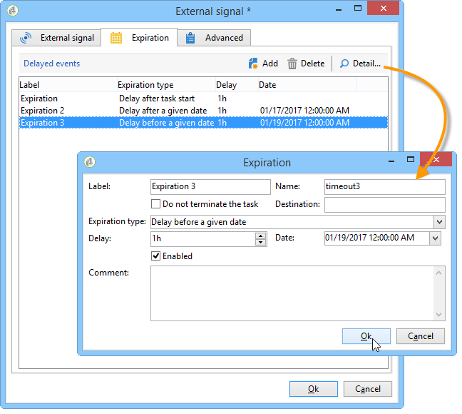
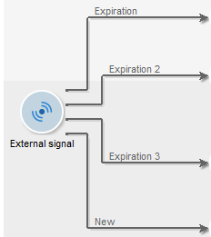

# External signal{#external-signal}

The **External signal** activity lets you trigger execution of a set of tasks in a workflow to a schedule.

When an 'External signal' task is activated, it is paused indefinitely or until the end of the specified time period. Its transition is activated by the SOAP call **PostEvent(sessionToken, workflowId, activity, transition, parameters, complete).** The **[!UICONTROL complete]** parameter allows the task to be finished, so it will not react to subsequent calls.

Refer to the online documentation concerning SOAP calls for further information on the PostEvent function.

You can configure this activity in order to define events if no signal is received. To do this, edit the activity and click the **[!UICONTROL Expiration]** tab. Click the **[!UICONTROL Insert]** button to create and configure an event.

The configuration of expirations is detailed in [Expirations](defining-approvals.md).

The **Delay** field lets you specify an expiration delay in the units of your choice. See [Wait](wait.md).

Each line represents a type of expiration and coincides with a transition.

