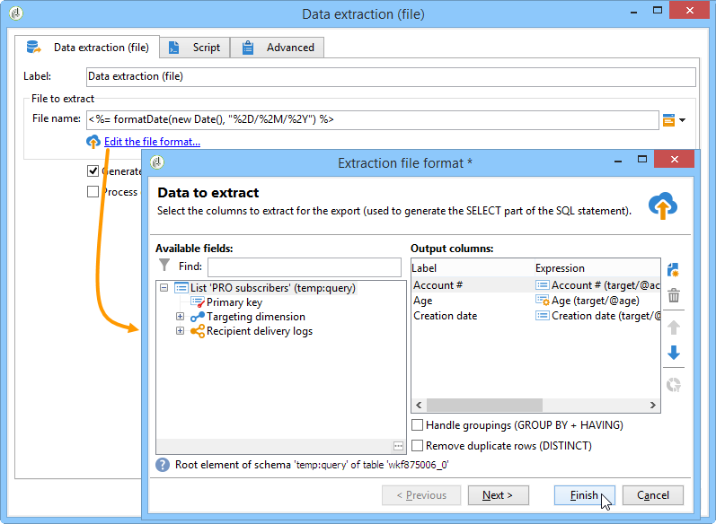
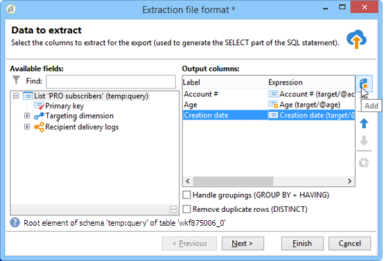
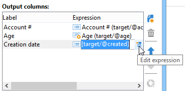
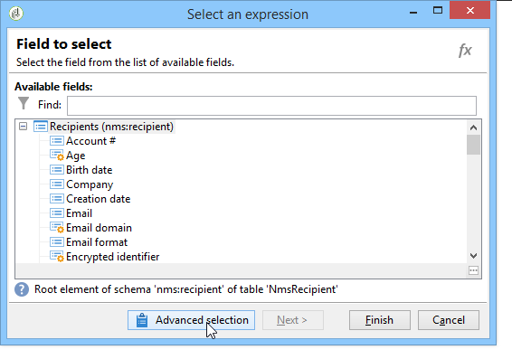
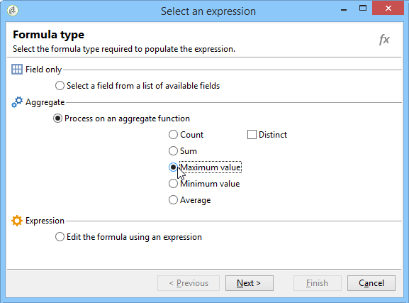
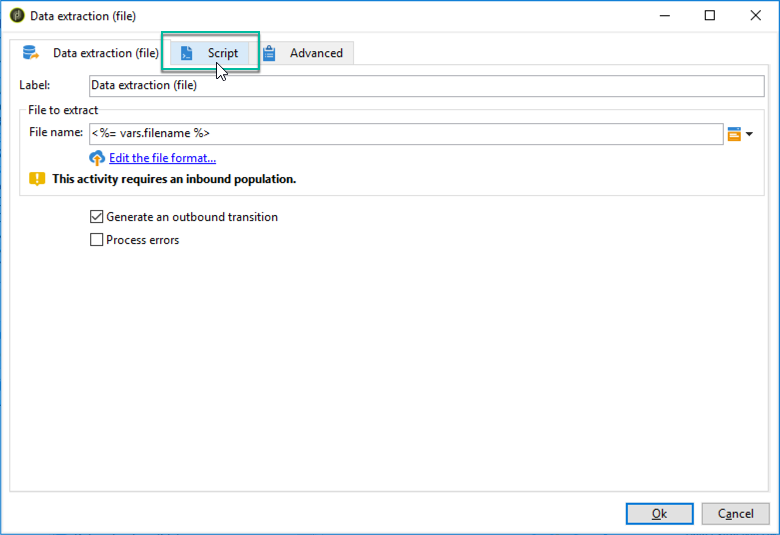

# Data extraction (file){#extraction-file}

You can extract data from a workflow table in an external file using the **[!UICONTROL Data extraction (file)]** activity.

>[!CAUTION]
>
>This activity must always have an inbound transition which contains the data to be extracted.

To configure data extraction, apply the following steps:

1. Specify the name of the output file: this name can contain variables, inserted via the personalization button to the right of the field.
1. Click **[!UICONTROL Edit the file format...]** to select the data to be extracted.

   

   The **[!UICONTROL Handle groupings (GROUP BY + HAVING)]** option adds an extra step to filter the final result of the aggregate, for example on a given purchase order type, customers who have ordered more than 10 times, etc.

1. If necessary, you can add new columns to the output file, such as computing or processing results for example. To do this, click the **[!UICONTROL Add]** icon.

   

   In the additional line, click the **[!UICONTROL Edit expression]** icon to define the content of the new column. 

   

   You will then access the selection window. Click **[!UICONTROL Advanced selection]** to choose the process to be applied to the data.

   

   Choose the desired formula from the list.

   

You can define a post-process to be executing during the data extraction, allowing you to zip or to encrypt the files. To do this, the desired command must be added in the **[!UICONTROL Script]** tab of the activity.

For more on this, refer to this section: [Zipping or encrypting a file](how-to-use-workflow-data.md#zipping-or-encrypting-a-file).

## List of aggregate functions {#list-of-aggregate-functions}

The following is a list of available aggregate functions:

* **[!UICONTROL Count]** to count all non-null values of the field to be aggregated, including duplicate values (of the aggregated field),

  **[!UICONTROL Distinct]** to count the total number of different and non-null values of the field to aggregate (duplicate values are excluded before the calculation),

* **[!UICONTROL Sum]** to calculate the sum of values of a numerical field,
* **[!UICONTROL Minimum value]** to calculate the minimum values of a field (numerical or otherwise),
* **[!UICONTROL Maximum value]** to calculate the maximum values of a field (numerical or otherwise),
* **[!UICONTROL Average]** to calculate the average of the values of a numerical field.
