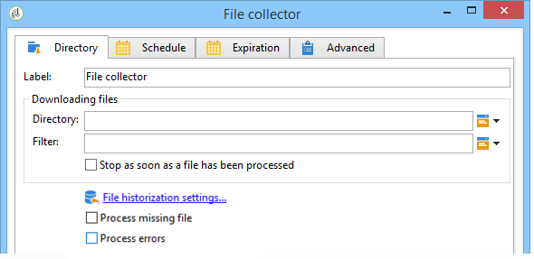
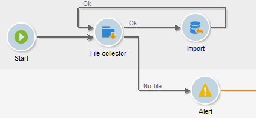

# File collector{#file-collector}

The **File collector** monitors the arrival of one or more files in a directory and activates its transition for each file received. For each event, a **[!UICONTROL filename]** variable contains the full name of the file received. The collected files are moved to another directory for archiving purposes and to make sure they are only counted once.

By default, the file collector is a persistent task that tests the presence of files at the times specified by the schedule.

The files must be on the server on which the wfserver module in charge of this workflow is executed. If several wfserver modules are deployed on a single instance, either the affinity of the activities using these files or the overall affinity of the workflow must be specified.

## Properties {#properties}

The first tab of the **[!UICONTROL File collector]** activity lets you select the source directory and, if necessary, filter the collected files. The other tabs are detailed in [Inbound Emails](inbound-emails.md) (**[!UICONTROL Schedule]** and **[!UICONTROL Expiry]** tabs).

1. **Downloading files**

    * **[!UICONTROL Directory]**

      Directory containing the file(s) to be downloaded. This directory must be created beforehand on the server: if it does not exist, an error will be raised.
    
    * **[!UICONTROL Filter]**

      Only files matching this filter are taken into account. The other files in the directory are ignored. If the filter is empty, all files in the directory are taken into account. Filter examples: **&#42;.zip**, **import-&#42;.txt**.
    
    * **[!UICONTROL Stop as soon as a file has been processed]**

      If this option is enabled, the task ends after reception of the first file. If several files corresponding to the filter are present in the directory, only one will be taken into account. This option guarantees that only one event will be sent. The file taken into account is the first in the list in alphabetical order.

      For an unscheduled activity, if no file matching the filter is found in the specified directory, and if the **[!UICONTROL Process file nonexistence]** option is not enabled, an error will be raised.
    
    * **[!UICONTROL Execution schedule]**

      Determines the frequency of the file presence check via the parameters of the **[!UICONTROL Schedule]** tab.

1. **Error handling**

   The following two options are available:

    * **[!UICONTROL Process file nonexistence]**

      This option initiates a special transition each time no file matching the filter is found in the specified directory.

      If the task is not scheduled, this transition will be activated once only. 
    
    * **[!UICONTROL Processing errors]**

      This option makes a special transition appear, to be activated if an error is generated. In this case, the workflow does not change to error status, and continues execution

      Errors taken into account are file system errors (file could not be moved, directory could not be accessed, etc.).

      This option does not process errors related to activity configuration, i.e. invalid values.

1. **Historization**

   Refer to the **[!UICONTROL File historization]** step here: [Web download](web-download.md).

The file processing order cannot be determined. To process a set of files sequentially, use the **[!UICONTROL Stop as soon as a file has been processed]** option and create a loop. In this case, the files will be processed in alphabetical order. The **[!UICONTROL Process file nonexistence]** option lets you finish the iteration.

## Output parameters {#output-parameters}

* filename: Complete filename. This is the filename after it has been moved to the historization directory. The path is therefore different, but the name is also different if another file with the same name already exists in the directory. The extension is kept.
