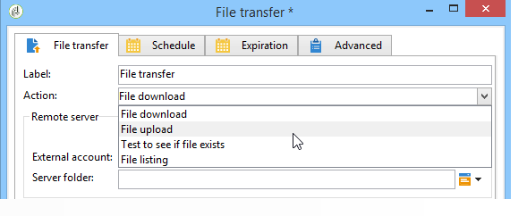
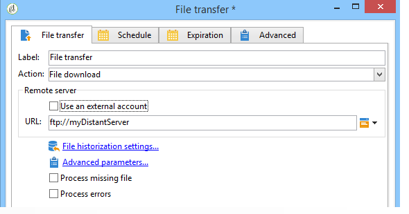
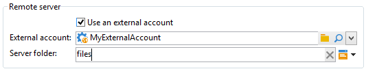
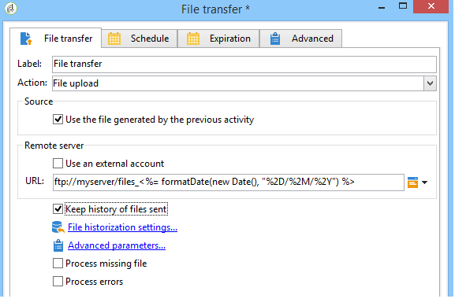
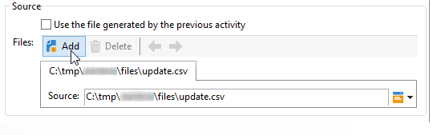
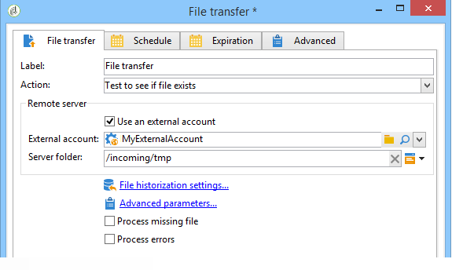
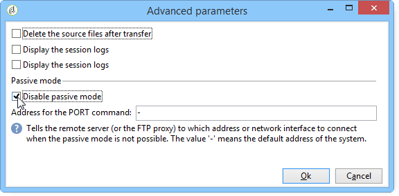

# File transfer{#file-transfer}

The **File transfer** activity lets you receive or send files, test for file presence, or list files on a server. The protocol used is either Amazon Simple Storage Service (S3), FTP or SFTP.
With S3 or SFTP connection, you can also import segment data to Adobe Campaign with Adobe Real-time Customer Data platform. For more on this, refer to this [documentation](https://docs.adobe.com/content/help/en/experience-platform/rtcdp/destinations/destinations-cat/adobe-destinations/adobe-campaign-destination.html).

>[!NOTE]
>
>Best practices and troubleshooting on SFTP server usage are detailed [in this page](../../platform/using/sftp-server-usage.md).

## Properties {#properties}

Use the drop-down list of the **[!UICONTROL Action]** field to select the action of the activity.

The configuration depends on the action selected.

1. **Receiving files**

   To receive files stored on a remote server, select **[!UICONTROL File download]** in the **[!UICONTROL Action]** field. You must specify its URL in the relevant field.

   

   Check **[!UICONTROL Use an external account]** to select an account from the S3, FTP or SFTP accounts configured in the **[!UICONTROL Administration > Platform > External accounts]** node of the tree. Then specify which directory on the server contains the file(s) to be downloaded.

   

1. **File transfer**

   To send a file to a server, select **[!UICONTROL File upload]** in the **[!UICONTROL Action]** field. You must specify the target server in the **[!UICONTROL Remote server]** section of the editor. The parameters are the same as for inbound files. See above.

   The source file can come from the previous activity. In this case, the **[!UICONTROL Use the file generated by the previous activity]** option must be selected.

   

   This may also concern one or more other files. To select them, uncheck the option and then click **[!UICONTROL Insert]**. Specify the access path of the file to be sent. To add another file, click **[!UICONTROL Insert]** again. The files now each have their own tab. 

   

   Use the arrows to change the order of the tabs. This relates to the order in which files are sent to the server.

   The **[!UICONTROL Keep history of files sent]** option lets you track the files sent. This history is accessible from the directory.

1. **Test to see if file exists**

   To test for the existence of a file, select the **[!UICONTROL Test to see if file exists]** option in the **[!UICONTROL Action]** field. Configuration of the remote server is the same as for file download. For more information, refer to this [section](#properties).

   

1. **Listing of files**

   To list the files, select the **[!UICONTROL File listing]** option from the **[!UICONTROL Action]** field. Configuration of the remote server is the same as for receiving files. For more information, refer to this [section](#properties).

   The **[!UICONTROL List all files]** option, available when selecting the **[!UICONTROL File listing]** action, allows you to store all files present on the server in the event variable **vars.filenames** wherein the file names are separated by `\n` characters.

There are two possible options for all file transfer options:

* The **[!UICONTROL Process missing file]** option adds a transition which is activated if no file is found in the specified directory.
* The **[!UICONTROL Process errors]** option is detailed in [Processing errors](../../workflow/using/monitoring-workflow-execution.md#processing-errors).

The **[!UICONTROL Advanced parameters...]** link lets you access the following options:

* **[!UICONTROL Delete the source files after transfer]**

  Erases the files on the remote server.

* **[!UICONTROL Use SSL]**

  Allows you to use a secure connection via the SSL protocol during file transfers.

* **[!UICONTROL Display the session logs]**

  Allows you to recover the logs of the S3, FTP or SFTP transfer and to include them in the workflow logs.

* **[!UICONTROL Disable passive mode]**

  Allows you to specify the connection port to be used for data transfer.

The **[!UICONTROL File historization settings...]** link gives access to the options detailed in [Web download](../../workflow/using/web-download.md) (**[!UICONTROL File historization]** step).

## Input parameters {#input-parameters}

* filename

  Complete name of the sent file.

## Output parameters {#output-parameters}

* filename

  Complete name of received file if the **[!UICONTROL Use the file generated by the previous activity]** option is selected.
