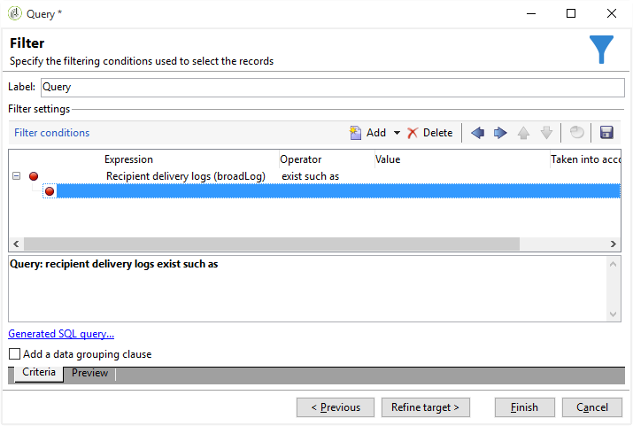
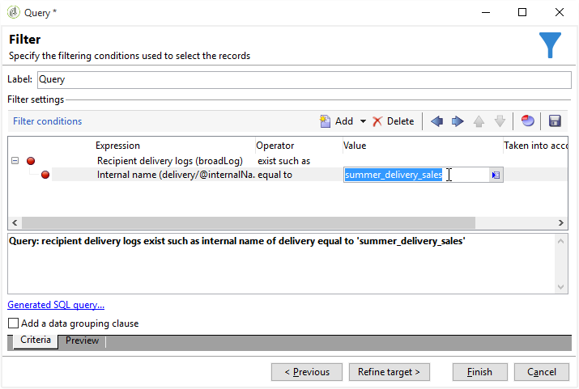

# Filtering duplicated recipients {#filtering-duplicated-recipients}

In this example, we want to filter recipients who appear twice or more in a delivery in order to recover duplicated profiles.

To create this example, apply the following steps:

1. Drag and drop a **[!UICONTROL Query]** activity in a workflow and open the activity.
1. Click **[!UICONTROL Edit query]** and set the target and filtering dimensions to **[!UICONTROL Recipients]**.

   

1. Define the following filter condition to target recipient who exist in the delivery log. Choose **Recipient delivery log (broadlog)** in the **Expression** column, choose **exist such as** in the **Operator** column.

   

1. Define the following filter condition to target your delivery. Choose **[!UICONTROL Internal name]** in the Expression column and **[!UICONTROL equal to]** in the Operator column. 
1. In the value column, add the internal name of the targeted delivery.

   

1. With an **[!UICONTROL AND]** operator, repeat the same operations to target other deliveries.

   

Your outbound transition contains the duplicate recipients targeted in the deliveries.
