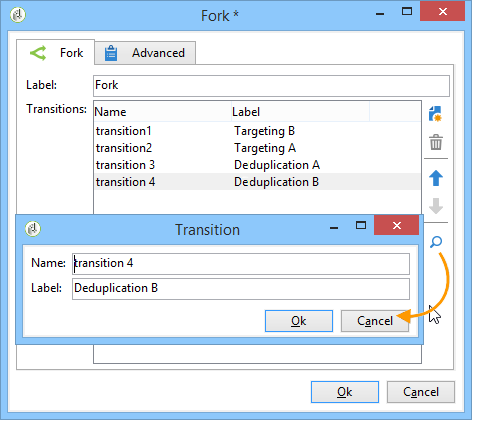
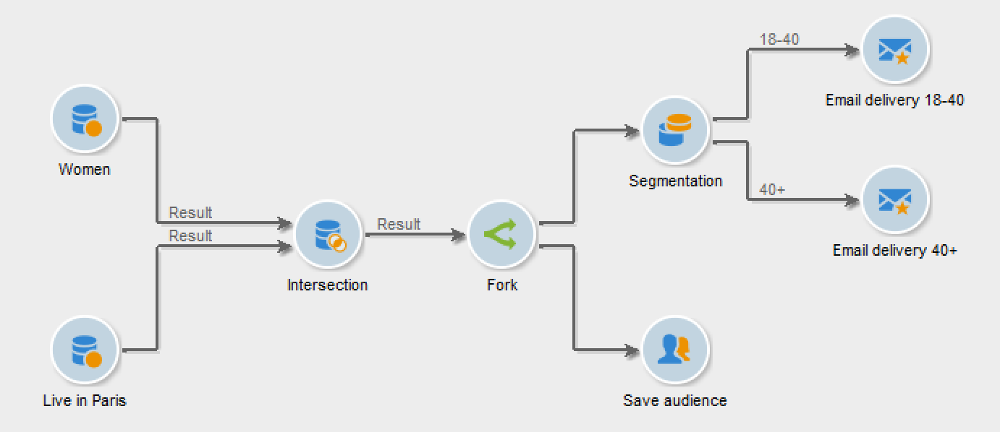

# Fork{#fork}

You can use the **[!UICONTROL Fork]** activity to create multiple outbound transitions and to run several activities independently within the same workflow.

>[!IMPORTANT]
>
>The outbound transitions that you add after a **[!UICONTROL Fork]** activity do not run simultaneously. This behavior can impact the workflow performance. Use the **[!UICONTROL Fork]** activity if you need to run several activities independently. Optionally, you can join the outbound activities before the subsequent part of the workflow.

To configure a **[!UICONTROL Fork]** activity and its related activities, follow these steps:

1. Open the **[!UICONTROL Fork]** activity and define the name and the label of the outbound transitions.

    

1. Open each outbound transition and configure it.
1. Optionally, to join outbound transitions, add an AND-join activity. [Learn more](and-join.md).

   The subsequent part of the workflow runs only upon completion of the joined outbound transitions.

## Example: segmentation

In this example, different emails are sent to different population groups. A **[!UICONTROL Fork]** activity is used after a query, to perform two actions in parallel:

* Save the query result
* Segment the result to send multiple deliveries

    

The workflow comprises these activities:

1. **[!UICONTROL Query]** activity

   Two population groups are selected: women and Parisians.

1. **[!UICONTROL Intersection]** activity

   The intersection of the query results, that is, Parisian women, is selected.

1. **[!UICONTROL Fork]** activity

   The calculated population is saved and, in parallel, segmented into two groups:

   1. Parisian women who are aged between 18 and 40
   1. Parisian women over 40

1. **[!UICONTROL Delivery]** activity

   A different email is sent to each population group.

## Use case: send a birthday email

A recurring email is sent to a list of recipients on their birthday. A **[!UICONTROL Fork]** activity is used to include recipients who were born on February 29 on a leap year. [Learn more](sending-a-birthday-email.md) about this use case.

## Use case: automate content with a workflow

The creation and the delivery of a content block is automated. A **[!UICONTROL Fork]** activity is used to calculate the target and, in parallel, to create the content. [Learn more](../../delivery/using/automating-via-workflows.md#creating-the-delivery-and-its-content) about this use case.

You can then configure each outbound transitions, then join them together using an [AND-join](and-join.md) activity, if needed. This way, the rest of the workflow will execute only once the **[!UICONTROL Fork]** activity's outbound transitions are finished.

## Related topics

* [AND-join activity](and-join.md)
* [Use case: birthday email](sending-a-birthday-email.md)
* [Use case: content creation and delivery](../../delivery/using/automating-via-workflows.md#creating-the-delivery-and-its-content)