# Workflow HeatMap {#workflow-heatmap}

Adobe Campaign Workflow HeatMap consists in a color-coded graphical representation of all the workflows that are currently running. It is available to the instance Administrators only.

Additional ways of monitoring the different Campaign processes are presented in [this page](../../production/using/monitoring-guidelines.md).

## About the Workflow HeatMap {#about-the-workflow-heatmap}

By providing a quick overview on the number of concurrent workflows, the Workflow HeatMap enables the Adobe Campaign platform administrators to monitor the load on the instance and plan workflows accordingly.

More precisely, it helps the platform administrators to:

* See and understand concurrent workflows
* Filter workflows by duration to see which workflows may encounter issues
* Filter activities by duration to see which activities may encounter issues
* Easily find individual workflows and all related activities (with their duration)
* Search by workflow type ([technical workflows](../../workflow/using/building-a-workflow.md#technical-workflows) or [campaign workflows](../../workflow/using/building-a-workflow.md#campaign-workflows))
* Look for a specific workflow to analyze

>[!NOTE]
>
>In addition to the **Workflow Heatmap**, you can create a workflow that will let you monitor the status of a set of workflows and send recurring messages to supervisors. For more on this, refer to the [dedicated section](../../workflow/using/supervising-workflows.md).

Using the Workflow HeatMap requires to have a good understanding of the following concepts: [Workflows](../../workflow/using/about-workflows.md), [Activities](../../workflow/using/about-activities.md) and [Workflow Best Practices](../../workflow/using/workflow-best-practices.md).

<!--The Workflow HeatMap is available by default in Adobe Campaign starting 18.10 release. If you have a build between 8700 and 8977 (18.10), you can also benefit from this capability. To request the corresponding package, contact the [Adobe Customer Care](https://helpx.adobe.com/enterprise/admin-guide.html/enterprise/using/support-for-experience-cloud.ug.html) and follow the instructions from [this page](https://helpx.adobe.com/campaign/kb/install-workflow-heatmap-package.html) to understand how to install it.-->

## Using the HeatMap {#using-the-heatmap}

>[!NOTE]
>
>Only users with administration rights can access the Campaign Workflow HeatMap.

1. Go to **[!UICONTROL Monitoring]** and click the **[!UICONTROL Workflow HeatMap]** link to display the **[!UICONTROL Campaign Workflow HeatMap]** page.

   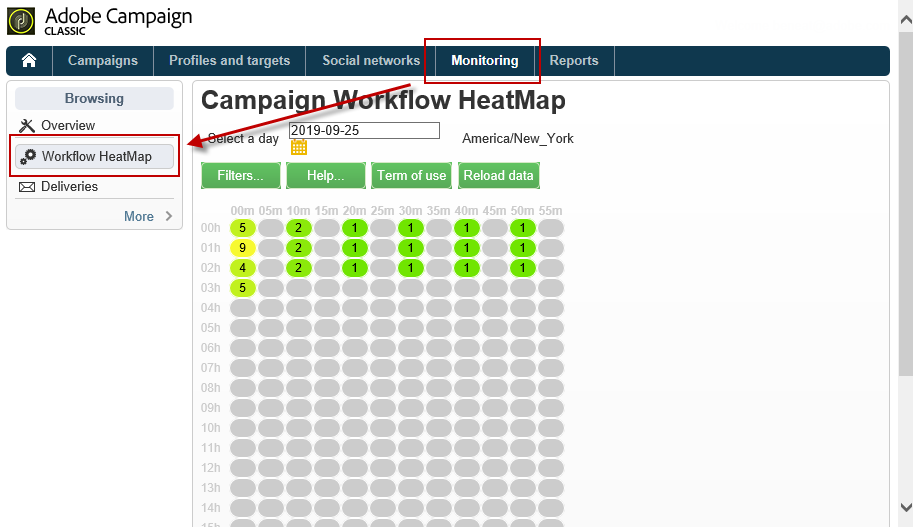

1. Click the calendar to select a day.

   By default, the page shows the workflow activity for the current day. You can change it and select any day in the past.

   >[!NOTE]
   >
   >Only the workflows that have not been deleted by the **[!UICONTROL Database cleanup]** workflow are visible. For more on the Database cleanup workflow, refer to [this section](../../production/using/database-cleanup-workflow.md).  
   >By default, the Workflow HeatMap time zone is the one defined for the current administrator user. For example, you may want to change it if you are not in the same area as the marketing users you are working with.

1. Click the **[!UICONTROL Filters]** button.

   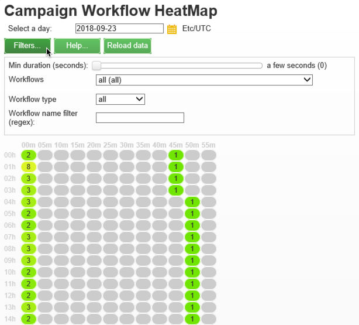

1. Use the slider to set the minimum duration from 0 second to 1 hour. This enables you to search only workflows running for more than a certain number of seconds or minutes.

   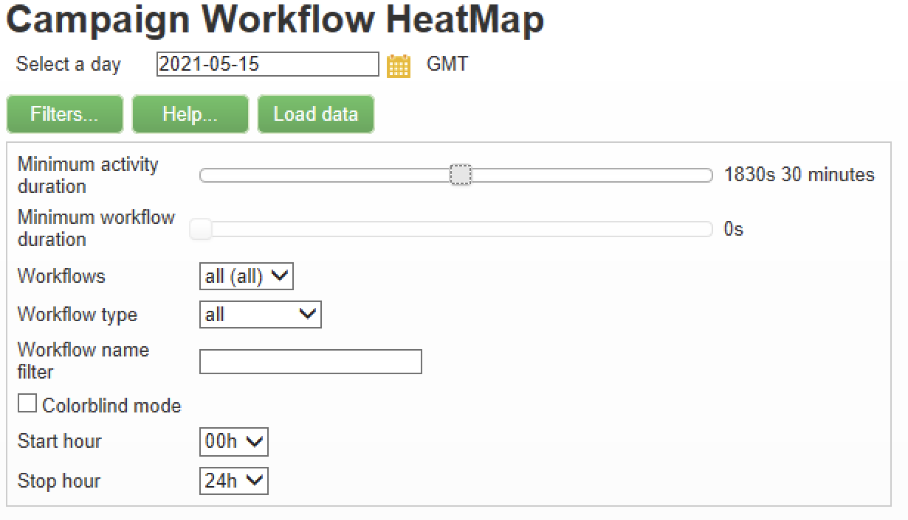

1. You can also choose a specific workflow from the **[!UICONTROL Workflows]** list.

   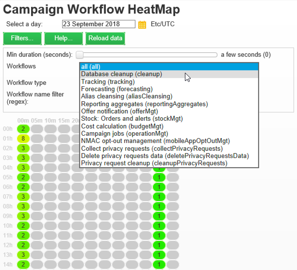

   >[!NOTE]
   >
   >The **[!UICONTROL Min duration]** filter is applied. If you cannot find a specific workflow, reset the minimum duration to 0 so that all workflows are displayed in the list.

1. You can also filter on the **[!UICONTROL Workflow type]** :

    * **[!UICONTROL Technical]** : Only [out-of-the box-technical workflows](../../workflow/using/building-a-workflow.md#technical-workflows) and [data management workflows](../../workflow/using/targeting-data.md#data-management) are displayed.
    * **[!UICONTROL Marketing]** : Only workflows linked to a marketing campaign, known as [campaign workflows](../../workflow/using/building-a-workflow.md#campaign-workflows), are displayed.

1. To search a specific workflow by name, you can also use the **[!UICONTROL Workflow name filter]** field.

   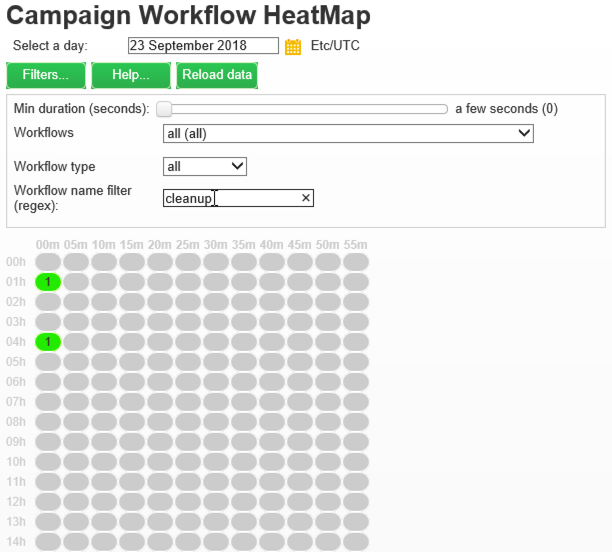

1. If you edited some workflows in the time between, click the **[!UICONTROL Reload data]** button to refresh the data that are displayed in the grid.

## Reading the HeatMap {#reading-the-heatmap}

The Campaign Workflow HeatMap is a grid naturally readable from upper left to bottom right, allowing to find the "hot zones" with a green to red color-coded range.

* The darker red cells correspond to periods when a high number of workflows are running at the same time.
* The grey cells correspond to periods when no workflow is running.

To learn how the color code is applied and how to navigate the HeatMap, click the **[!UICONTROL Help]** button.

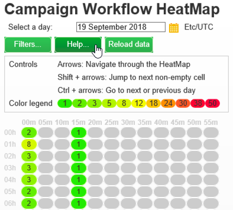

Each row represents an hour of the day and each cell represents 5 minutes of that hour.

The grid shows all the workflows that are running at the same time for each of these 5-minute periods.

In the example below, between 8am and 8:05am, three workflows are running (no matter their individual duration):

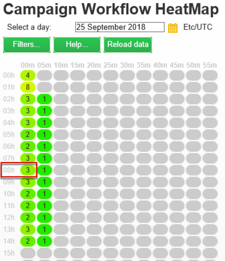

1. Click a colored cell to display the details of all concurrent workflows running during this period.

   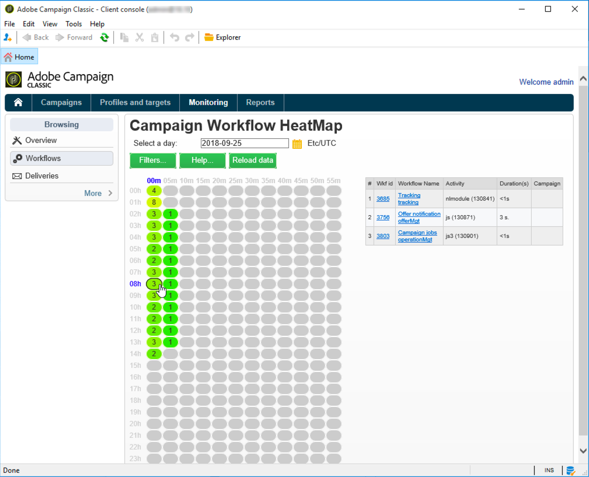

   For each workflow, all the activities that it contains are listed, with their duration.

1. Click the workflow ID or name to directly open a workflow.
1. To go back to the **[!UICONTROL Campaign Workflow HeatMap]** view, click the **[!UICONTROL Home]** button.

## Use cases: using the HeatMap to take actions {#use-cases--using-the-heatmap-to-take-actions}

There are two main cases where the Campaign Workflow HeatMap can be useful.

### Reducing the number of concurrent workflows {#reducing-the-number-of-concurrent-workflows}

As a Campaign administrator, the Workflow HeatMap can help you to understand the load on the instance and plan existing or new workflows at appropriate times.

1. From the **[!UICONTROL Campaign Workflow HeatMap]** view, click the **[!UICONTROL Filters]** button.
1. Set duration to a few seconds or a few minutes.
1. Exclude the shortest workflows that are not significant by increasing the duration filter.

   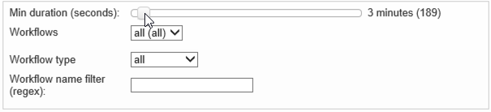

1. Explore the results to understand the load on the instance and take appropriate actions:

    * If you encounter performance issues and if one or more red cells are displayed in the grid, consider changing several workflows' starting times. Ask the marketing users to move manually workflows from busy ("hot") periods to more available time slots. This should maintain a stable level of activity along the day.
    * To avoid peaks and prevent the instance from overload, look at the HeatMap before planning new workflows and choose the best time. Consider time slots corresponding to grey or green cells in the grid to start new workflows.

### Finding long-running workflows that impact performance {#finding-long-running-workflows-that-impact-performance}

As a Campaign administrator, the Workflow HeatMap helps you to find the longest workflows which can slow down the activity.

1. From the **[!UICONTROL Campaign Workflow HeatMap]** view, click the **[!UICONTROL Filters]** button.
1. Set duration to 1 hour.

   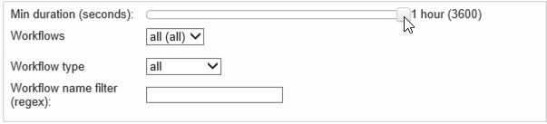

1. Include more results by decreasing the **[!UICONTROL Min duration]** filter.
1. Explore the results to find the longest workflows, who can potentially have more impact on the server and database resources (CPU, RAM, network, IOPS, and so on).
1. Take appropriate actions:

    * Advise marketing users to split the longest workflows to reduce processing time.
    * Start a deeper analyze on specific workflows and specific activities (such as JavaScript, import, export, and so on) to isolate the issues and solve them more easily.

## Example: Using the HeatMap to improve workflow planning {#example--using-the-heatmap-to-improve-workflow-planning}

The example below shows how planning can be more efficient and how performance can be improved when using the Adobe Campaign Workflow HeatMap.

In this case, many users are complaining about workflow performance. You need to check what is slowing down the activity and how to solve the problem.

1. Go to **[!UICONTROL Monitoring]** and click the **[!UICONTROL Workflows]** link to display the **[!UICONTROL Campaign Workflow HeatMap]** page.
1. Set the **[!UICONTROL Min duration]** filter to 5 minutes.
1. Set the **[!UICONTROL Workflow type]** filter to **[!UICONTROL Marketing]** .
1. From the HeatMap grid, observe the following:

   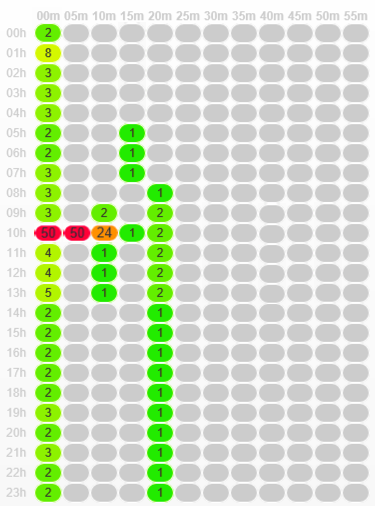

    * Fifty long-lasting (more than 5 minutes) campaign workflows are running at 10am.
    * Most of them have a pending state (by default, the concurrency limit is set to 20).
    * The pending workflows need to be manually restarted every day.
    * Performance is low.

1. Instead of having fifty workflows starting at 10am, distribute the workflows' starting times evenly throughout the rest of the day.
1. Go back to the **[!UICONTROL Campaign Workflow HeatMap]** page and click the **[!UICONTROL Reload data]** button.
1. Now observe the following:

   

    * Only eighteen long-lasting campaign workflows are still running at 10am.
    * No more workflows are in pending state (the concurrency limit is still set to 20).
    * Workflow starting times are evenly distributed throughout the day.
    * No more users are complaining about performance issues.
