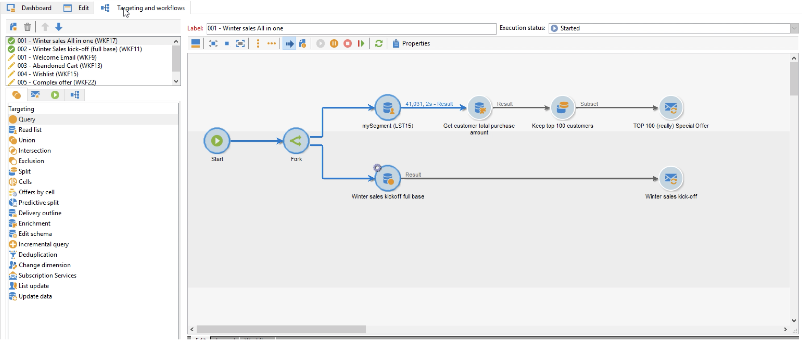

# Campaign workflows

This guide provides helpful information, guidance and best practices about Campaign workflows.

## What's new?

* The **[!UICONTROL Fork]** activity section has been enriched with best practices. [Read more](using/fork.md)
* The list of technical workflows with their associated packages has been enhanced and centralized into one single page. [Read more](about-technical-workflows.md)
* A use case has been added on how to use the **[!UICONTROL Deduplication]** activity's merge functionality. [Read more](deduplication-merge.md)

## Key articles

Refer to these sections to find guidance and best practices to automate processes with workflows:

* [Workflow activities](how-to-use-workflow-data.md)
* [Build a workflow](building-a-workflow.md)
* [Import data with a workflow](../../platform/using/import-export-workflows.md)
* [Workflow best practices](workflow-best-practices.md)
* [Start a workflow](starting-a-workflow.md)
* [Monitor Campaign workflows](monitoring-workflow-execution.md)
* [Grant user permissions](managing-rights.md)

## More Campaign user guides

[Campaign User Guides](../../campaign-classic-home.md)
