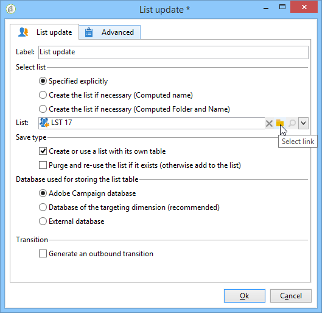
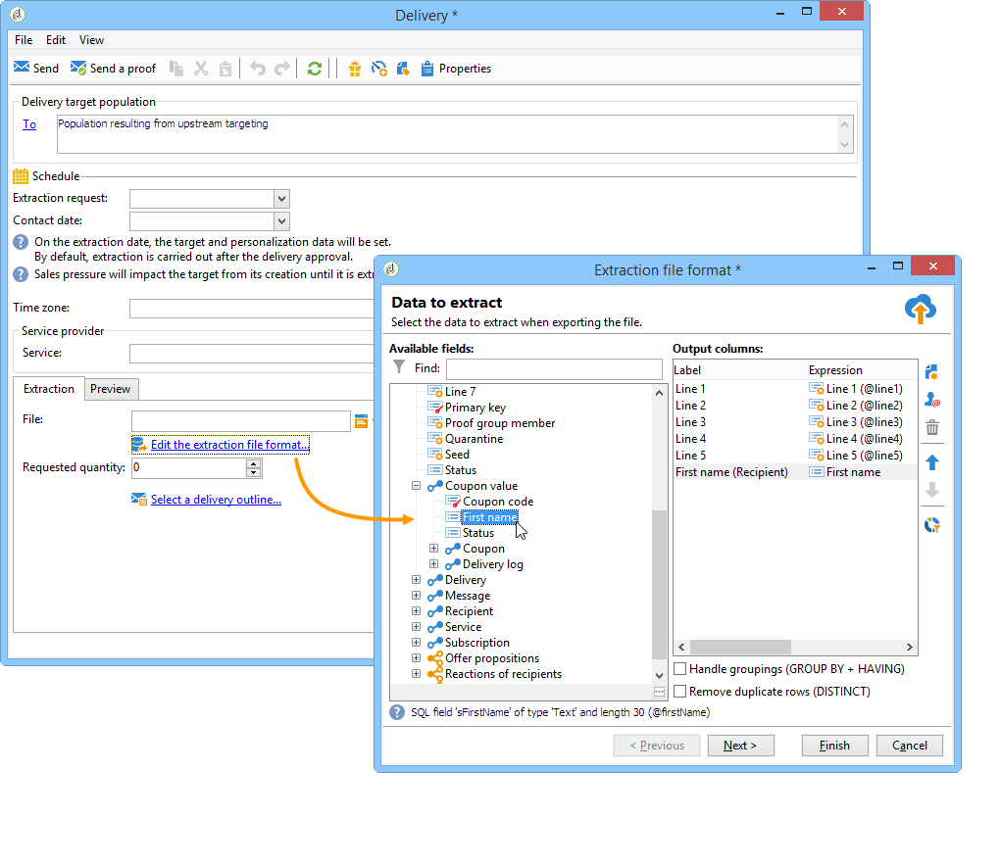
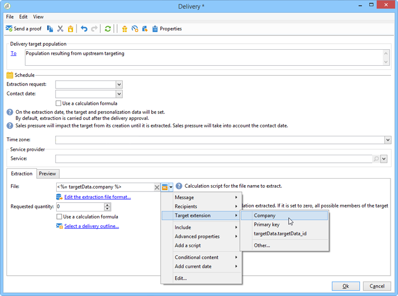
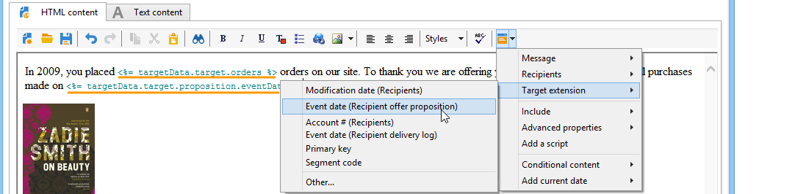
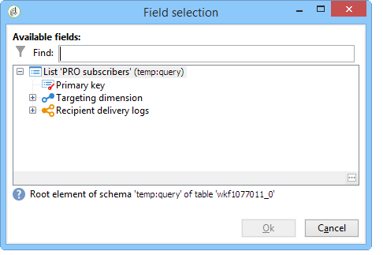

# How to use workflow data{#how-to-use-workflow-data}

## Updating the database {#updating-the-database}

All collected data can be used to update the database, or in deliveries. For example, you can enrich message content personalization possibilities (include the number of contracts in the message, specify the average shopping cart over the last year, etc.) or detail population targeting (send a message to contract co-holders, target the 1,000 best subscribers to online services, etc.). This data can also be exported or archived in a list.

### Lists and direct updates {#lists-and-direct-updates}

The data of the Adobe Campaign database and the existing lists can be updated using two dedicated activities:

* The **[!UICONTROL List update]** activity lets you store worktables in a datalist.

  You can select an existing list or create it. In this case, the name and possibly the record folder are computed.

  

  Refer to [List update](list-update.md).

* The **[!UICONTROL Update data]** activity performs a mass update of the fields in the database.

  For more on this, refer to [Update data](update-data.md).

### Subscription/unsubscription management {#subscription-unsubscription-management}

To find out about subscribing and unsubscribing recipients to an information service via a workflow, refer to [Subscription Services](subscription-services.md).

## Sending via a workflow {#sending-via-a-workflow}

### Delivery activity {#delivery-activity}

The delivery activity is detailed in [Delivery](delivery.md).

### Enriching and targeting deliveries {#enriching-and-targeting-deliveries}

Deliveries can process data from workflows in order to customize content or within the framework of target population selection.

For example, within the framework of a direct mail delivery, you can include the additional data, taken from data manipulation carried out in the workflow, in the extraction file:

In addition to the usual personalization fields, you can add personalization fields from workflow stages to the delivery content. The additional data defined in the workflow activities can be kept and made accessible in the delivery wizard, as shown in the example below, for defining the name of the output file within the framework of direct mail delivery:

The data contained in the workflow table is identified by its name: it is always made up of the **targetData** link. For more on this, refer to [Target data](data-life-cycle.md#target-data).

Within the framework of email delivery, personalization fields can also use data from target extension performed in the targeting workflow stages, as shown in the example below: 

If a segment code is specified in a targeting activity, it is added to a specific column of the workflow table and will be offered along with the personalization fields. To display all personalization fields, click the **[!UICONTROL Target extension > Other...]** link accessible via the personalization button.

