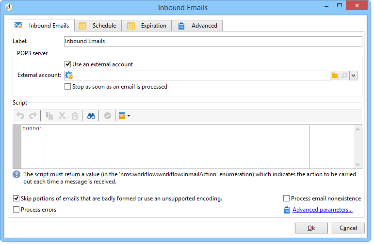
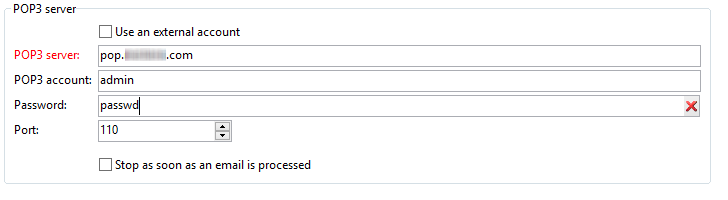
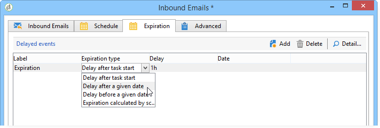

# Inbound Emails{#inbound-emails}

The **Inbound emails** activity lets you download and process email messages from a POP3 mail server.

The first tab of the **Inbound Emails** activity lets you enter the parameters of the POP3 server and enter the script to be executed upon receipt of each message. The second tab lets you assign a schedule to the activity, and the third tab defines the activity expiration conditions.

1. **Inbound Emails**

    * **Use an external account**

      When this option is activated, you can select an external POP3 account instead of entering the connection parameters. The **External account** field specifies the external POP3 account to be used to connect to the email service. This field is visible only if the 'Use an external account' option is enabled.

      If this option is not selected, you must specify the following parameters:
    
      

        * **POP3 server**

          Name of the POP3 server.
        
        * **POP3 account**

          Name of the user.
        
        * **Password**

          User account password.
        
        * **Port**

          POP3 connection port number. The default port is 110.

    * **Stop as soon as email is processed**

      This option lets you process emails one by one. The activity activates its transition once only and then finishes processing, leaving unprocessed messages on the server.

1. **Script**

   The script lets you process the message and perform various operations that depend on the content of the message. The script is executed for each message and can determine the operation to be performed on messages (leave or delete the message) and activation of the outbound transition.

   The return code must be one of the following values:

    * 1 - Deletes the message from the server and activates the outbound transition.
    * 2 - Leaves the message on the server and activates the outbound transition.
    * 3 - Deletes the message from the server.
    * 4 - Leaves the message on the server.

   The content of the message is accessible from the global **mailMessage** variable.

1. **Schedule**

   To define a schedule for the activity, click the **Scheduling** tab and check **Plan execution**. Click the **Change** button to configure the schedule.

   Schedule configuration is the same as for the scheduling activity. Refer to [Scheduler](../../workflow/using/scheduler.md).

1. **Expiration**

   You can define expiration delays via the **Expiration** tab.

   

   Configuration is the same as for the scheduling activity. Refer to [Expirations](../../workflow/using/inbound-emails.md#expirations).

