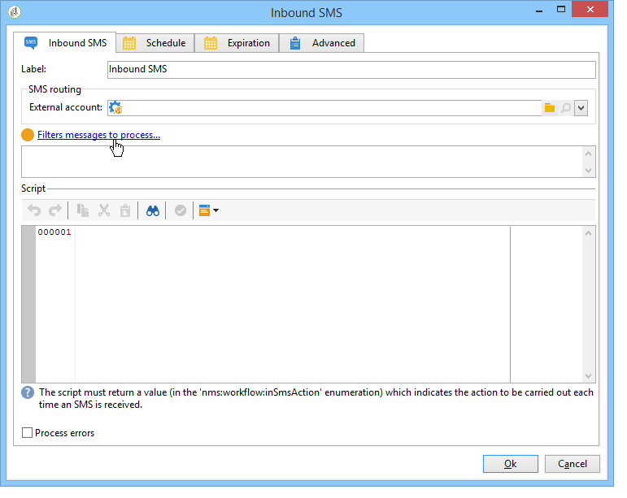
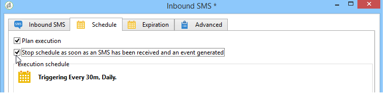

# Inbound SMS{#inbound-sms}

The **Inbound SMS** activity lets you download and process text messages from an external account.

## Properties {#properties}

The first tab of the **Inbound SMS** activity lets you enter the routing parameters for SMS messages and enter the script to be executed on receiving each message. The second tab lets you assign a schedule to the activity, and the third tab defines the expiration conditions of the activity.

1. **[!UICONTROL SMS routing]**: Select the external account to be used for SMS recovery. External accounts are configured via the **[!UICONTROL Administration > Platform > External accounts]** node of the tree.
1. **[!UICONTROL Script]** 
1. **[!UICONTROL Schedule]** 

   

1. **[!UICONTROL Expiration]**

The **[!UICONTROL Script]**, **[!UICONTROL Schedule]** and **[!UICONTROL Expiry]** tabs are detailed in [Inbound Emails](inbound-emails.md).
