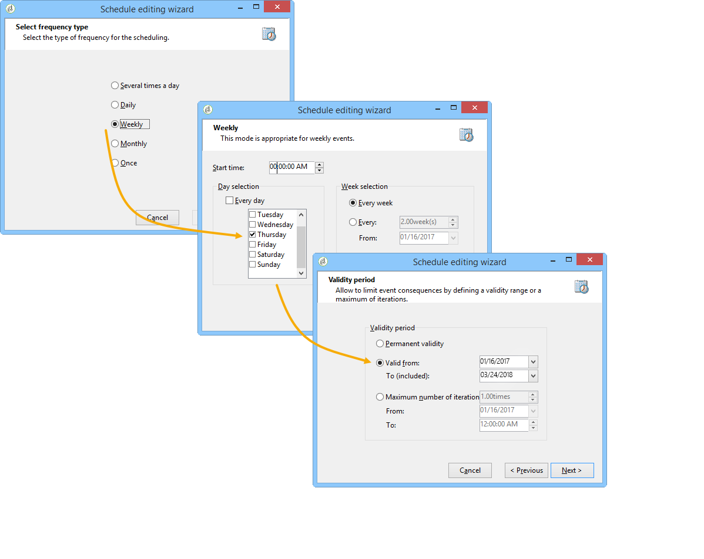
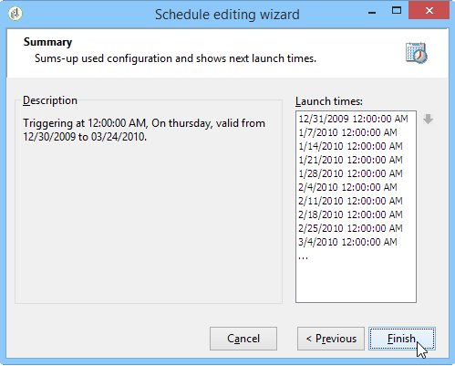
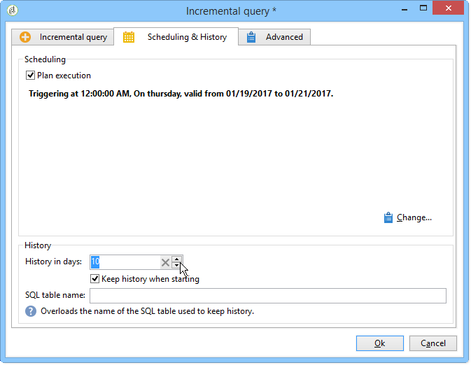

# Incremental query{#incremental-query}

An incremental query lets you periodically select a target based on a criterion, while excluding the people already targeted for this criterion.

The population already targeted is stored in the memory by workflow instance and by activity, i.e. two workflows started from the same template do not share the same log. On the other hand, two tasks based on the same incremental query for the same workflow instance will use the same log.

The query is defined in the same way as for standard queries, but its execution is scheduled.

**Related topics:**

* [Use case: Quarterly list update using an incremental query](quarterly-list-update.md)
* [Creating a query](query.md#creating-a-query)

>[!CAUTION]
>
>If the result of an incremental query is equal to **0** during one of its executions, the workflow is paused until the query's next programmed execution. The transitions and activities that follow the incremental query are therefore not processed before the following execution.

To do this:

1. In the **[!UICONTROL Scheduling & History]** tab, select the **[!UICONTROL Schedule execution]** option. The task remains active once it has been created and will only be triggered at the times specified by the schedule for executing the query. However, if the option is disabled, the query is executed immediately **and in one go**.
1. Click the **[!UICONTROL Change]** button.

   In the **[!UICONTROL Schedule editing wizard]** window, you can configure the type of frequency, event recurrence and event validity period.

   

1. Click **[!UICONTROL Finish]** to save the schedule.

   

1. The lower section of the **[!UICONTROL Scheduling & History]** tab allows you to select the number of days to be taken into account in the history.

   

    * **[!UICONTROL History in days]**

      Recipients already targeted can be logged a maximum number of days from the day they were targeted. If this value is zero, the recipients are never purged from the log.
    
    * **[!UICONTROL Keep history when starting]**

      This option lets you not purge the log when the activity is enabled.
    
    * **[!UICONTROL SQL table name]**

      This parameter lets you overload the default SQL table containing the history data.

## Output parameters {#output-parameters}

* tableName
* schema
* recCount

This set of three values identifies the population targeted by the query. **[!UICONTROL tableName]** is the name of the table that records the target identifiers, **[!UICONTROL schema]** is the schema of the population (usually nms:recipient) and **[!UICONTROL recCount]** is the number of elements in the table.
