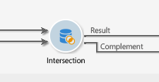
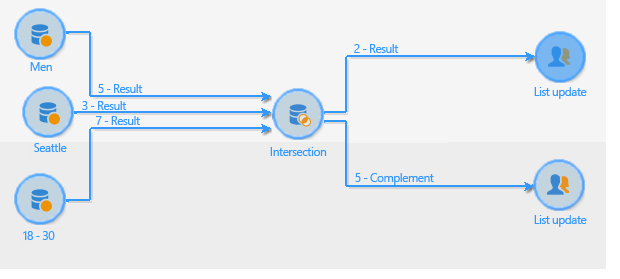

# Intersection{#intersection}

An **Intersection**-type activity creates a target from the intersection of the targets received.

An intersection lets you extract only the population that is common to all inbound activity results. The target is created with all results received: all prior activities must therefore be finished before the intersection can be executed. To configure this activity, you need to enter a label for it as well as the options concerning the result.

For more on configuring and using the intersection activity, refer to [Extracting joint data (Intersection)](targeting-data.md#extracting-joint-data--intersection-).

Check the **[!UICONTROL Generate complement]** option if you wish to process the remaining population. The complement will contain the union of the results of all inbound activities minus the intersection. An additional outbound transition will then be added to the activity, as follows:

## Intersection example {#intersection-example}

In the following example, the aim of the intersection is to calculate the recipients common to three simple queries in order to create a list.

1. After three simple queries, insert an **[!UICONTROL Intersection]** -type activity.

   In this example; the queries respectively target men, recipients living in Paris and recipients aged between 18 and 30 years old.

1. Configure the intersection. To do this, select the **[!UICONTROL Keys only]** reconciliation method since the populations resulting from the queries contain consistent data.
1. If you have inputted additional data for the queries, you may choose to keep only those that are shared by recipients by checking the relevant box.
1. If you wish to use the rest of the data (in regard to the queries but not their intersection), check the **[!UICONTROL Generate complement]** box.
1. Add a list update activity after the intersection result. You can also add a list update to the complement should you wish to use this too.
1. Execute the workflow. Here, two recipients apply to all three inputted queries at the same time. The complement is made up of five recipients who only apply to one or two of the three queries.

   The intersection result is sent to the first list update. If you have chosen to use the complement, it is also sent to the second list update.

   

## Input parameters {#input-parameters}

* tableName
* schema

Each inbound event must specify a target defined by these parameters.

## Output parameters {#output-parameters}

* tableName
* schema
* recCount

This set of three values identifies the target resulting from the intersection. **[!UICONTROL tableName]** is the name of the table that records the target identifiers, **[!UICONTROL schema]** is the schema of the population (usually **[!UICONTROL nms:recipient]**) and **[!UICONTROL recCount]** is the number of elements in the table.
