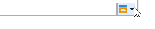
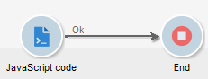
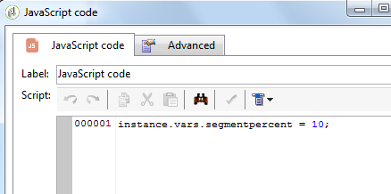
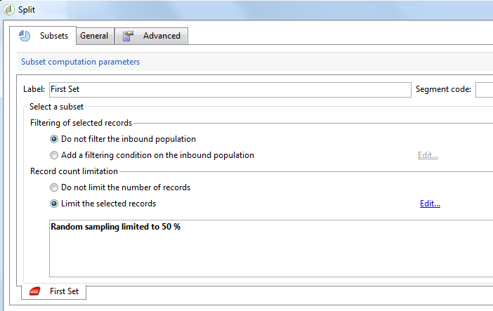
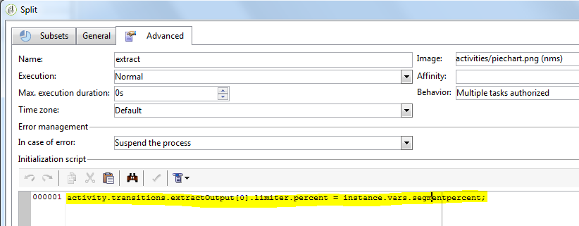
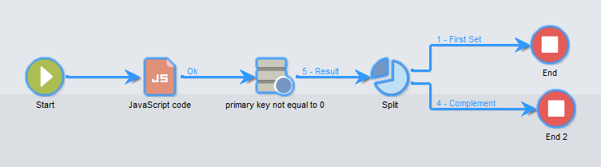
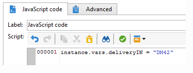
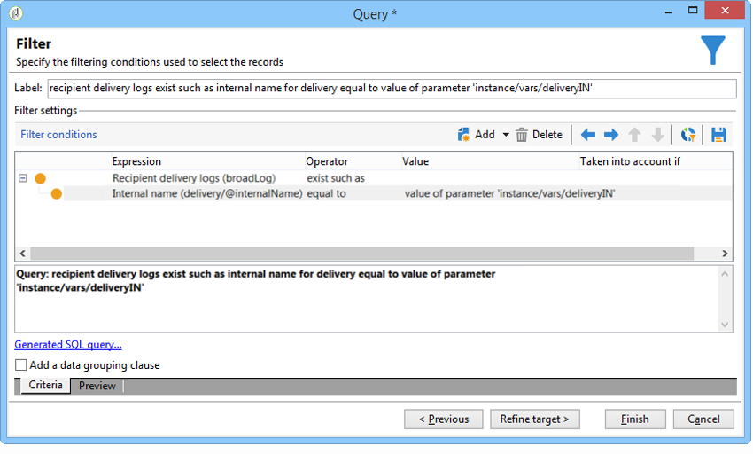

# JavaScript scripts and templates{#javascript-scripts-and-templates}

Scripts make it possible to calculate values, exchange data between different tasks in the process and to execute specific operations using SOAP calls.

Scripts are ubiquitous in a workflow diagram:

* All activities have initialization scripts. An initialization script is executed when the activity is activated and can be used to initialize variables and to modify the properties.
* The 'JavaScript code' activity is simply used to execute a script. 
* The 'Test' activity evaluates JavaScript expressions in order to activate the appropriate transition.
* Most text fields are JavaScript templates: JavaScript expressions can be included between <%= and %>. These fields offer a button that opens a drop-down list to help you enter expressions.

  

## Objects exposed {#objects-exposed}

JavaScripts executed in the context of a workflow access a series of additional global objects.

* **instance**: Represents the workflow being executed. The schema of this object is **xtk:workflow**.
* **task**: Represents the tasks being executed. The schema of this object is **xtk:workflowTask**.
* **event**: Represents the events that activated the task being executed. The schema of this object is **xtk:workflowEvent**. This object is not initialized for **AND-join** type activities that have been activated from multiple transitions.
* **events**: Represents the list of events which activated the current task. The schema of this object is **xtk:workflowEvent**. This table usually contains one element but may contain several for **AND-join** type activities which have been activated based on several transitions.
* **activity**: Represents the model of the task being executed. The schema of this object depends on the activity type. This object can be modified by the initialization script, in other scripts, modifications with have indeterminable effects.

The properties available for these objects are can be viewed in a drop-down list by clicking the button at the right of the script toolbar.

>[!CAUTION]
>
>The properties of these objects are read-only except for the sub-properties of the vars property. 
>  
>Most of these properties are only updated after executing an elementary task or when the instance is passivated. The values that are read do not necessarily match the current status but the previous status.

**Example**

In this example, and in the following examples, create a workflow that includes a **JavaScript code** activity and an **End** activity as shown in the following diagram.



Double-click the **JavaScript code** activity and insert the following script:

```
logInfo("Label: " + instance.label)
logInfo("Start date: " + task.creationDate)
```

The **[!UICONTROL logInfo(message)]** function inserts a message into the log.

Click **[!UICONTROL OK]** to close the creation wizard, then start the workflow using the action buttons situated at the top right of the list of workflows. At the end of execution, consult the log. You should see two messages corresponding to the script: one displays the label of the workflow, the other displays the date that the script was activated.

## Variables {#variables}

The variables are the free properties of the **[!UICONTROL instance]**, **[!UICONTROL task]** and **[!UICONTROL event]** objects. The JavaScript types authorized for these variables are **[!UICONTROL string]**, **[!UICONTROL number]** and **[!UICONTROL Date]**.

### Instance variables {#instance-variables}

The instance variables (**[!UICONTROL instance.vars.xxx]**) are comparable to global variables. They are shared by all activities.

### Task variables {#task-variables}

The task variables (**[!UICONTROL task.vars.xxx]**) are comparable to local variables. They are only used by the current task. These variables are used by persistent activities to keep data and are sometimes used to exchange data between the different scripts of a same activity.

### Event variables {#event-variables}

The event variables (**[!UICONTROL vars.xxx]**) enable the exchange of data between the elementary tasks of a workflow process. These variables are passed by the task that activated the task in progress. It is possible to modify them and to define new ones. They are then passed to the following activities.

>[!CAUTION]
>
>In the case of [AND-join](and-join.md) type activities, the variables are merged but if a same variable is defined twice, there is a conflict and the value remains undetermined.

Event are the most often used variables, and they should be used in preference to instance variables.

Certain event variables are modified or read by the various activities. These are all string-type variables. For example, an export sets the **[!UICONTROL vars.filename]** variable with the full name of the file that has just been exported. All these read or modified variables are documented in [About activities](about-activities.md), in the sections **Input parameters** and **Output parameters** of the activities.

### Use cases {#example}

>[!NOTE]
>
>Additional worklow use cases are available in [this section](about-workflow-use-cases.md).

**Example 1**

In this example, an instance variable is used to compute dynamically the split percentage to apply on a population.

1. Create a workflow and add a Start activity.

1. Add and configure a JavaScript code activity to define an instance variable.

    For example: `instance.vars.segmentpercent = 10;`

    

1. Add a Query activity and target recipients according to your needs.

1. Add a Split activity and configure it to perform a random sampling of the incoming population. The sampling percentage can be anything of your choice. It is set to 50% in this example.

    It is this percentage which is updated dynamically thanks to the instance variable defined previously.

    

1. Inside the Initialization script section of the Advanced tab of the Split activity, define a JS condition. The JS condition selects the random sampling percentage of the first transition coming out of the Split activity and updates it to a value set by the instance variable created previously.

    ```
    activity.transitions.extractOutput[0].limiter.percent = instance.vars.segmentpercent;
    ```

    

1. Make sure that the complement is generated in a separate transition of the Split activity and add End activities after each of the outbound transitions.

1. Save and execute the workflow. The dynamic sampling gets applied according to the instance variable.

    

**Example 2**

1. Take the workflow from the preceding example and replace the script of the **JavaScript Code** activity with the following script:

    ```
    instance.vars.foo = "bar1"
    vars.foo = "bar2"
    task.vars.foo = "bar3"
    ```

1. Add the following script to the initialization script of the **End** activity:

    ```
    logInfo("instance.vars.foo = " + instance.vars.foo)
    logInfo("vars.foo = " + vars.foo)
    logInfo("task.vars.foo = " + task.vars.foo)
    ```

1. Start the workflow, and then look at the log.

    ```
    Workflow finished
    task.vars.foo = undefined
    vars.foo = bar2
    instance.vars.foo = bar1
    Starting workflow (operator 'admin')
    ```

This example shows that the activity following **JavaScript Code** accesses the instance variables and event variables, but the task variables are not accessible from the outside ('undefined').

### Calling an instance variable in a query {#calling-an-instance-variable-in-a-query}

Once you have specified an instance variable in an activity, you can re-use it in a workflow query.

Thus, to call a variable **instance.vars.xxx = "yyy"** in a filter, enter **$(instance/vars/xxx)**.

For example:

1. Create an instance variable that defines a delivery's internal name via the **[!UICONTROL JavaScript code]**: **instance.vars.deliveryIN = "DM42"**.

   

1. Create a query whose targeting and filtering dimensions are the recipients. In the conditions, specify that you would like to find all the recipients that were sent the delivery specified by the variable.

   As a reminder, this information is stored in the delivery logs.

   To reference the instance variable in the **[!UICONTROL Value]** column, enter **$(instance/vars/@deliveryIN)**.

   The workflow will return the recipients of the DM42 delivery.

   

## Advanced functions {#advanced-functions}

In addition to the standard JavaScript functions, special functions are available for manipulating files, reading or modifying data in the database, or adding messages to the log.

### Journal {#journal}

**[!UICONTROL logInfo(message)]** was detailed in the above examples. This function adds an information message to the journal.

**[!UICONTROL logError(message)]** adds an error message to the log. The script interrupts its execution and the workflow changes to error status (by default, the instance will be paused).

## Initialization script {#initialization-script}

Under certain conditions, you can modify a property of an activity at the time of execution.

Most properties of activities can be calculated dynamically, either using a JavaScript template or because the workflow properties explicitly allow the value to be calculated by a script.

For other properties, however, you must use the initialization script. This script is evaluated before the task is executed. The **[!UICONTROL activity]** variable references the activity corresponding to the task. The properties of this activity can be modified and will affect this task only.
