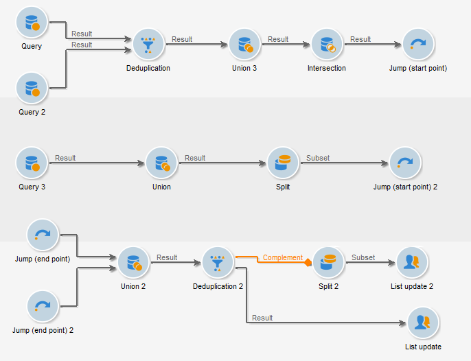
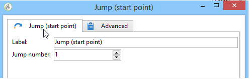

# Jump (start point and end point){#jump-start-point-and-end-point}

 **[!UICONTROL Jump]** -type graphical objects are used to improve the readability of a complex diagram, particularly one with crossing transitions.

Jumps are transitions without arrows.

They go from one activity to another, as in the following example:

For each "start point"-type transition, an "end point"-type transition must be positioned.

You can insert several start point and end point jumps in the same workflow. They are identified by a number that must be entered in the parameters:

To improve the readability of the diagram, you can change the image associated with jumps to display the related number. See [Managing activity images](managing-activity-images.md).
