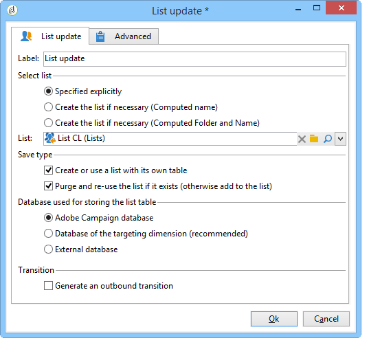
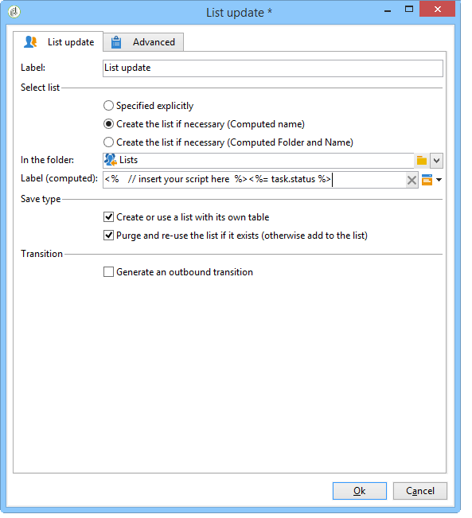
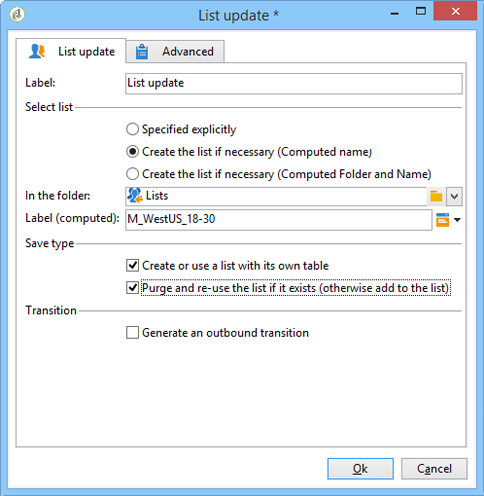

# List update{#list-update}

A **List update** activity stores the population specified in the transition in a list of recipients.

The list can be selected from the list of existing groups.

It can also be created using the **[!UICONTROL Create the list if necessary (Computed name)]** and **[!UICONTROL Create the list if necessary (Computed Folder and Name)]** options. These options allow you to select the label of your choice to create a list, and later, the folder in which it will be saved. The label can also be automatically generated by inserting dynamic fields or a script. The different dynamic fields are available in the pop-up menu to the right of the label.

If the list already exists, recipients will be added to the existing content, unless you check the **[!UICONTROL Purge the list if it exists (otherwise add to the list)]** option. In this case, the content of the list is deleted before the update.

If you want the created or updated list to use a table other than the recipient table then check the **[!UICONTROL Create or use a list with its own table]** option.

To use the option, the specific tables concerned must have been configured in your Adobe Campaign instance.

Generally, saving a target in a list marks the end of a workflow. By default, the **[!UICONTROL List update]** activity therefore does not have an outbound transition. Check the **[!UICONTROL Generate an outbound transition]** option to add one.

## Example: List update {#example--list-update}

In the following example, the list update activity follows a query which targets men over 30 living in France. The list will initially be created from the results of the query. It will then be updated every time it is launched from the workflow. It may, for example, be used regularly for targeted promotional offers for campaigns.

1. Add a **[!UICONTROL list update activity]** directly after a query then open it up to edit it.

   For more on creating a query in a workflow, refer to [Query](../../workflow/using/query.md).

1. You may select a label for the activity.
1. Select the **[!UICONTROL Create the list if necessary (Calculated name)]** option to show that the list will be created once the first workflow has been executed, then updated with the following executions.
1. Select the folder where you wish to save the list.
1. Enter a label for the list. You can insert dynamic fields to automatically generate the name from the list. In this example, the list has the same name as the query to easily identify its content.
1. Leave the **[!UICONTROL Purge the list if it exists (otherwise add to the list)]** option checked to delete recipients that do not match the targeting criteria and to insert the new ones into the list.
1. Also leave the **[!UICONTROL Create or use a list with its own table]** option checked.
1. Leave the **[!UICONTROL Generate an outbound transition]** option unchecked.
1. Click **[!UICONTROL Ok]** then start the workflow.

   

   The list of matching recipients is then created or updated.

For more on this, refer to the [Creating a list of recipients](https://docs.adobe.com/content/help/en/campaign-classic-learn/tutorials/profile-management/creating-a-list-of-recipients.html) video.

## Input parameters {#input-parameters}

* tableName
* schema

Identifies the population to be saved in the group.

## Output parameters {#output-parameters}

* groupId: Group identifier.
