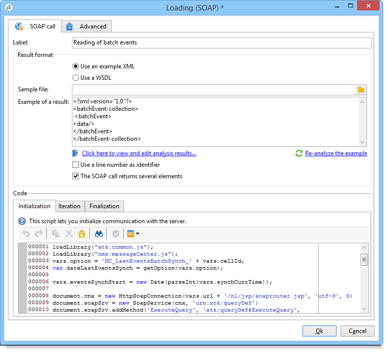
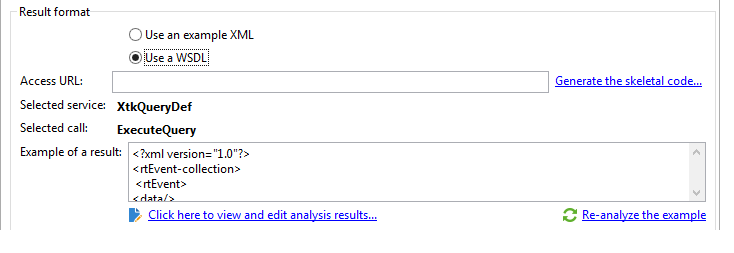
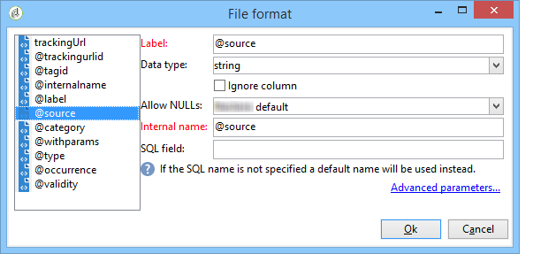

# Loading (SOAP){#loading-soap}

>[!CAUTION]
>
>The **Loading (SOAP)** activity is only available if you have the **FDA (Federated Data Access)** module installed. Please check your license agreement.

The **Loading (SOAP)** activity is used in addition to the **data loading (RDBMS)** activity when it is not possible to collect data directly via the FDA in an external database.

Operation is as follows:

1. Select between using an XML example or a WSDL.

   The following example comes from a technical workflow of the Message Center module.

   

1. For an XML example, select a sample file. The file is analyzed to establish a result example.

   For a WSDL, enter the matching access URL then generate the skeletal code. The service and call selected are automatically updated and displayed.

   

1. Select **[!UICONTROL Click here to view and edit analysis results]** to specify each identified column.

   

   If you wish to update the example, select **[!UICONTROL Re-analyze the example]**.

   You can also personalize the format of column data via the **[!UICONTROL Advanced parameters]** link. For more on formatting imported data, refer to this [section](../../platform/using/executing-import-jobs.md).

1. You can use the line number as an identifier and/or specify that the SOAP call returns several elements.
1. Enter the following tab scripts according to their function:

    * **[!UICONTROL Initialization]**: establishes an SOAP connection.
    * **[!UICONTROL Iteration]**: performs the call to SOAP service. The return for this function must be an XML object that is compatible with the description of the example or the WSDL.

      The code of this tab will be called in a loop by Adobe Campaign until a null XML object is returned.
    
    * **[!UICONTROL Finalization]**: closes connection and/or frees other resources created during processing.
