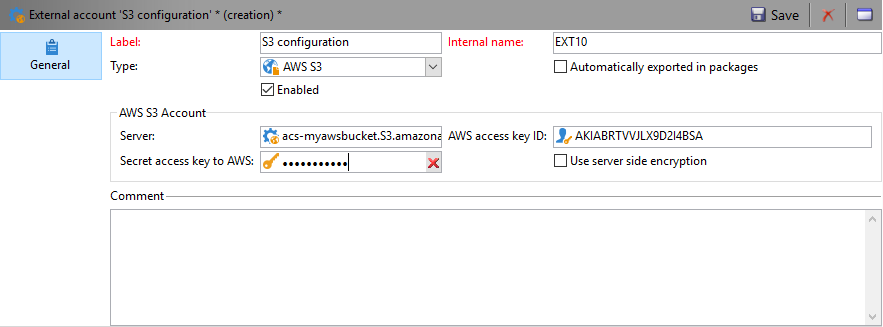
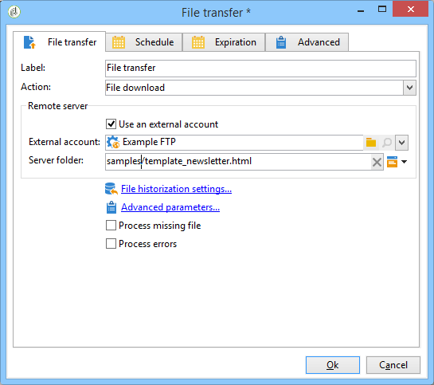
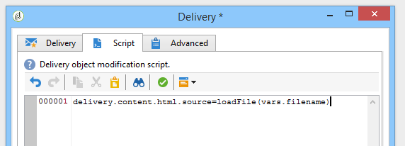

# Loading delivery content{#loading-delivery-content}

If your delivery content is available in an HTML file located on Amazon S3, FTP or SFTP servers, you can easily load this content into Adobe Campaign deliveries.

To do this:

1. If you haven't already defined a connection between Adobe Campaign and the (S)FTP server hosting the content files, create a new S3, FTP or SFTP external account in **[!UICONTROL Administration]** > **[!UICONTROL Platform]** > **[!UICONTROL External Accounts]**. Specify in this external account the address and credentials used to establish the connection to the S3 or (S)FTP server.

   Here is an example of an S3 external account:

   

1. Create a new workflow, for example from **[!UICONTROL Profiles and Targets]** > **[!UICONTROL Jobs]** > **[!UICONTROL Targeting workflows]**.
1. Add a **[!UICONTROL File transfer]** activity into your workflow, and configure it by specifying

    * The external account to use to connect to the S3 or (S)FTP server.
    * The path of the file on the S3 or (S)FTP server.

   

1. Add a **[!UICONTROL Delivery]** activity and connect it to the outbound transition of the **[!UICONTROL File transfer]** activity. Configure it as follows:

    * Delivery: According to your needs, it can be a specific delivery that is already created in the system, or a new delivery based on an existing template.
    * Recipients: In this example, it is considered that the target is specified in the delivery itself.
    * Content: Even if the content is imported in the previous activity, select **[!UICONTROL Specified in the delivery]**. As the content is imported directly from a file located on a remote server, it has no identifier when processed by the workflow and cannot be identified as coming from the inbound event.
    * Action to perform: Select **[!UICONTROL Save]** to save the delivery and be able to access it from **[!UICONTROL Campaign management]** > **[!UICONTROL Deliveries]** once the workflow is executed.

   

1. In the **[!UICONTROL Script]** tab of the **[!UICONTROL Delivery]** activity, add the following command to load the content of the imported file in the delivery:

   ```
   delivery.content.md.source=loadFile(vars.filename)
   ```

   

1. Save and execute the workflow. A new delivery with the loaded content is created under **[!UICONTROL Campaign management]** > **[!UICONTROL Deliveries]**.

>[!NOTE]
>
>Best practices and troubleshooting on SFTP server usage are detailed [in this page](../../platform/using/sftp-server-usage.md).
