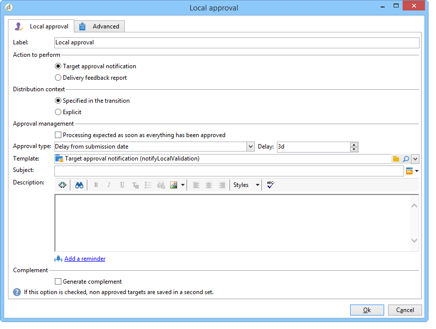
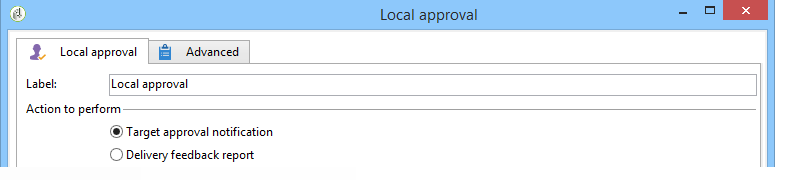
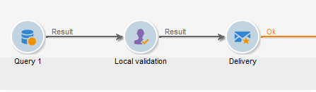
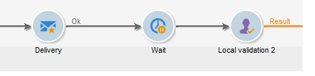
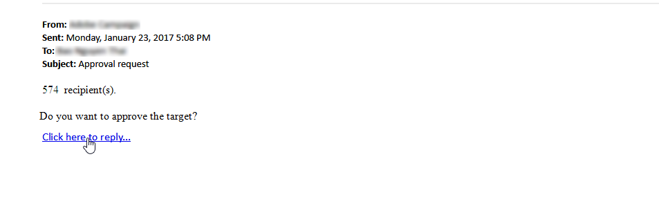
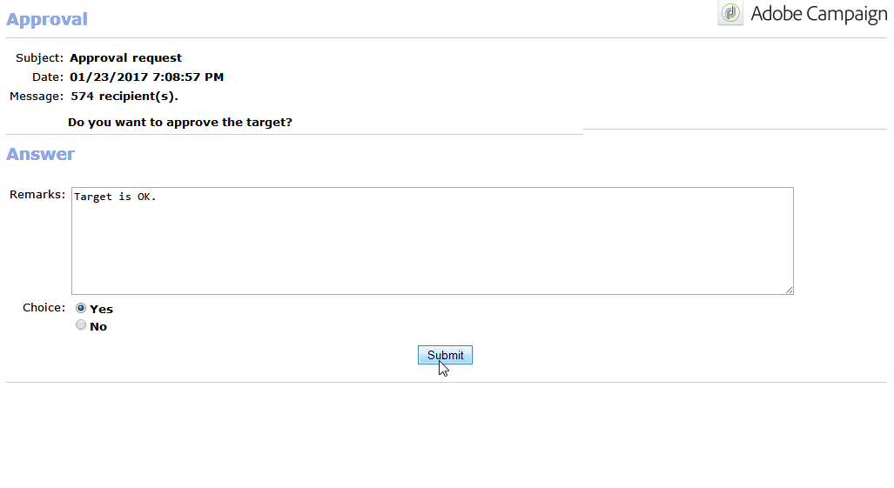
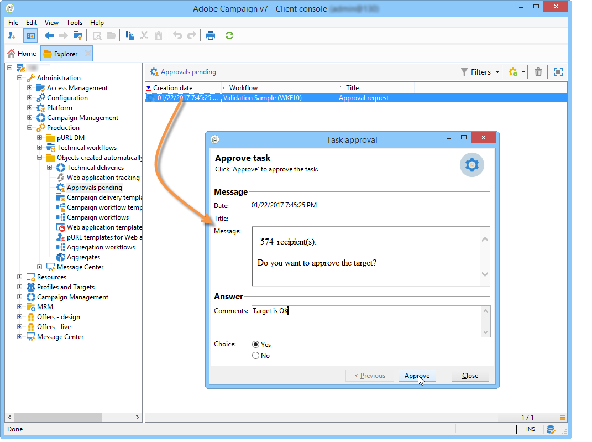
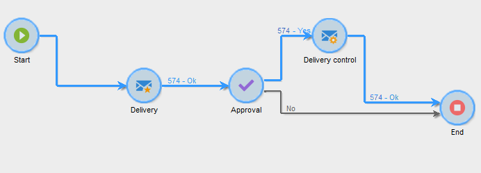

# Local approval{#local-approval}

When integrated into a targeting workflow, the **[!UICONTROL Local approval]** activity lets you set up a recipient approval process before the delivery is sent. 

>[!CAUTION]
>
>To use this activity, you need to have purchased the Distributed Marketing module, which is a Campaign option. Please check your license agreement.

For an example of the **[!UICONTROL Local approval]** activity with a distribution template, refer to [Using the local approval activity](using-the-local-approval-activity.md).

Start by entering a label for the activity and the **[!UICONTROL Action to execute]** field:

* Select the **[!UICONTROL Target approval notification]** option to send a notification email to local supervisors before the delivery, asking them to approve the recipients assigned to them.

  

* **Incremental query**: lets you perform a query and plan its execution. Refer to the [Incremental query](incremental-query.md) section. 

  

## Target approval notification {#target-approval-notification}

In this case, the **[!UICONTROL Local approval]** activity is placed between upstream targeting and the delivery: 

The fields to be entered in case of a notification for target approval are:

* **[!UICONTROL Distribution context]**: select the **[!UICONTROL Specified in the transition]** option if you are using a **[!UICONTROL Split]** type activity to limit the targeted population. In this case, the distribution template is entered in the split activity. If you are not limiting the targeted population, select the **[!UICONTROL Explicit]** option here and enter the distribution template in the **[!UICONTROL Data distribution]** field.

  For more on creating a data distribution template, refer to [Limiting the number of subset records per data distribution](split.md#limiting-the-number-of-subset-records-per-data-distribution).

* **[!UICONTROL Approval management]**

    * Select the delivery template and the subject that will be used for the email notification. A default template is available: **[!UICONTROL Local approval notification]**. You can also add a description that will appear above the recipient lists in the approval and feedback notifications.
    * Specify the **[!UICONTROL Approval type]** that corresponds to the approval deadline (date or deadline from the start of the approval). On this date, the workflow starts again and the recipients who have not been approved are not taken into account in the targeting. Once the notifications have been sent, the activity is queued so that the local supervisors can approve their contacts.

      >[!NOTE]
      >
      >By default, when the approval process is started, the activity is pended for three days.

      You can also add one or more reminders to inform local supervisors that the deadline is approaching. To do this, click the **[!UICONTROL Add a reminder]** link.

* **[!UICONTROL Complementary set]**: the **[!UICONTROL Generate complement]** option lets you generate a second set that includes all non-approved targets.

  >[!NOTE]
  >
  >This option is disabled by default.

## Delivery feedback report {#delivery-feedback-report}

In this case, the **[!UICONTROL Local approval]** activity is placed after the delivery: 

In case of a delivery feedback report, the following fields must be entered:

* Select the **[!UICONTROL Specified in the transition]** option if the delivery was entered during a previous activity. Select **[!UICONTROL Explicit]** to specify the delivery in the local approval activity.
* Select the delivery template and the object of the notification email. There is a default template: **[!UICONTROL Local approval notification]**.

## Example: Approving a workflow delivery {#example--approving-a-workflow-delivery}

This example shows how to set up an approval process for a workflow delivery. For more information about creating delivery workflows, refer to the [Example: delivery workflow](delivery.md#example--delivery-workflow) section.

An operator can approve a delivery in one of two ways: using the Web page linked in the email message, or via the console.

* Web approval

  The email sent to operators of the Administrator group lets you approve the delivery target. The message uses the defined text and the JavaScript expression is replaced by the calculated value (in this case, '574')

  To approve the delivery, click the relevant link and log on to the Adobe Campaign console.

  

  Make a choice and click the **[!UICONTROL Submit]** button.

  

* Approval via the console

  In the tree structure, the **[!UICONTROL Administration > Production > Objects created automatically > Approvals pending]** node contains the list of tasks to be approved by the operator currently connected. The list should display one line. Double-click this line to respond. The following window is displayed:

Select **Yes**, then click **[!UICONTROL Approve]**. A message will inform you that the response has been recorded.

Go back to the workflow screen: After ten seconds or so, the diagram is displayed as follows:

The workflow has executed the **[!UICONTROL Delivery control]** task, which in this case means starting the delivery previously created. The workflow has finished without errors.
