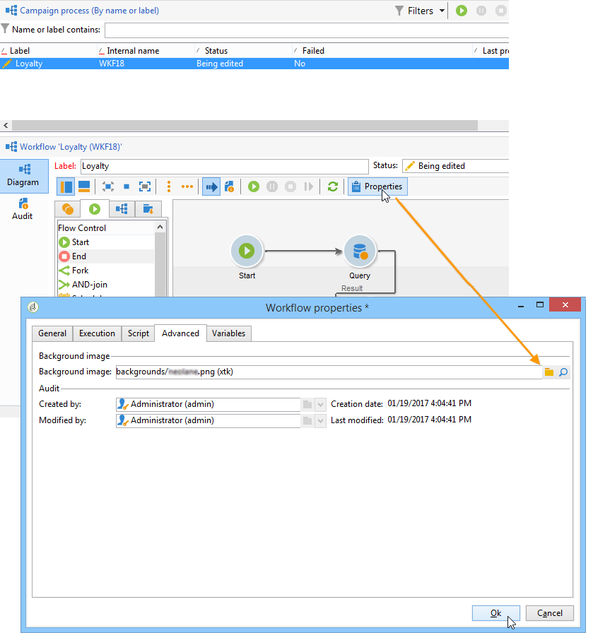
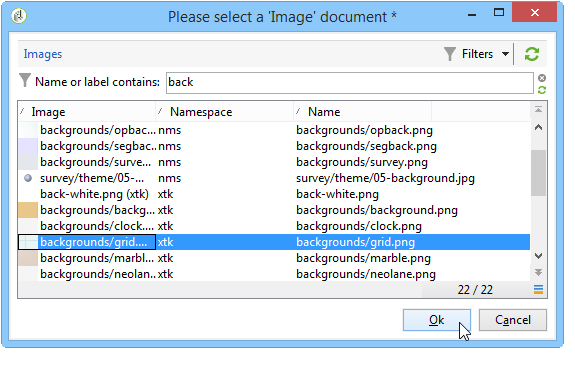
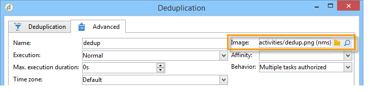
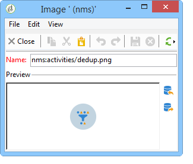

# Managing activity images{#managing-activity-images}

The images used in the diagrams of the various workflows can be changed. However they must comply with certain constraints. Here are the implementation stages:

* To change the background image, select the desired targeting workflow, then click the **[!UICONTROL Properties]** tab.

  

  To select the image to be used, click the **[!UICONTROL Select link]** icon to the right of the **[!UICONTROL Background image]** field.

  >[!NOTE]
  >
  >The width in pixels of the background image must be a multiple of 4.

  

  The **[!UICONTROL Edit link]** icon lets you view the selected image.

* To change the image associated with an activity, double-click the object, then click the **[!UICONTROL Advanced]** tab.

  To select the image to be used, click the **[!UICONTROL Select link]** icon to the right of the **[!UICONTROL Image]** field. 

  

  The **[!UICONTROL Edit link]** icon lets you view the selected image.

  

>[!NOTE]
>
>The images saved in the **[!UICONTROL Administration > Configuration > Images]** node of the tree are available for selection. 
>  
>Images must be in PNG format, with 48x48 pixels, 16 million colors, and a transparent background.
