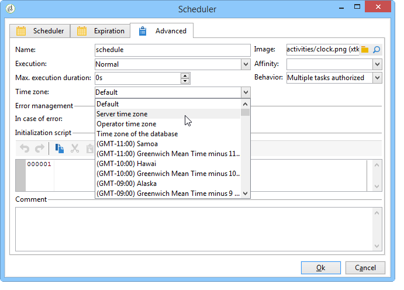

# Managing time zones{#managing-time-zones}

Adobe Campaign lets you manage time-lags between various countries concerned by the same instance. The applied configuration is configured during instance creation.

For more on configuring time zones in Adobe Campaign, refer to this [section](../../installation/using/time-zone-management.md).

In a workflow, you can adapt activity execution schedules and link a specific time zone to an activity or to the entire workflow. This configuration can be useful when importing the file, or within the framework of delivery scheduling.

## Execution scheduling {#execution-scheduling}

You can schedule the execution of tasks using the scheduler (refer to [Scheduler](../../workflow/using/scheduler.md)). You can also use the scheduling options available in the activities which offer this functionality. These activities offer a **[!UICONTROL Schedule]** tab: **[!UICONTROL File collector]**, **[!UICONTROL File transfer]**, **[!UICONTROL Web download]**, **[!UICONTROL Email reception]** & **[!UICONTROL SMS]**, etc.

For all scheduled tasks, i.e. all activities with scheduling options, you can select the time zone to apply. The time zone is selected via the **[!UICONTROL Advanced]** tab of the concerned activity:

Possible values are:

* Server time zone

  Uses the time zone of the Adobe Campaign application server.

* User time zone

  Uses the time zone of the Adobe Campaign operator who executes the workflow.

* Database time zone

  Uses the time zone of the database server used.

* Specific time zones

  Uses the selected time zone.

If the **[!UICONTROL By default]** value is selected, the time zone of the workflow is applied, or, otherwise, that of the application server.

## Linking a time zone to an activity {#linking-a-time-zone-to-an-activity}

The **[!UICONTROL Advanced]** tab of the workflow activities lets you select its time zone. Although most of the time, the workflows' time zone is enough, it can be necessary to overload it now and again for a specific activity, such as data import, in order to link dates to their correct time zone.
