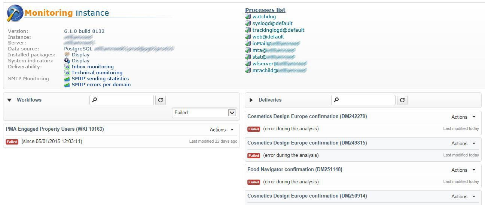
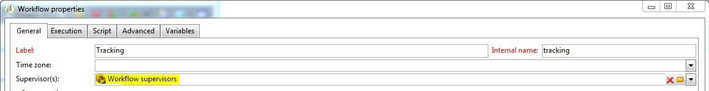
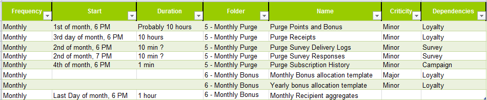

# Monitoring technical workflows {#monitoring-technical-workflows}

Technical workflows need to be monitored, and actions need to be taken when they fail.

Additional ways of monitoring the different Campaign processes are presented in [this page](../../production/using/monitoring-guidelines.md).

## Instance monitoring dashboard {#instance-monitoring-dashboard}

The instance monitoring dashboard can be accessed via the **[!UICONTROL Monitoring]** tab.

Under System Indicators and core files, check that no indicators are highlighted in red. If this is the case and some are, you should:

* Check that the necessary processes are always running,
* Check that none of the process are too old,
* Check that the different processes' log files do not contain alarming and recurring errors.

## Technical workflows {#technical-workflows}

Technical workflows are available from **[!UICONTROL Administration]** > **[!UICONTROL Production]** > **[!UICONTROL Technical workflows]**.

Depending on the technical workflow, follow the steps detailed below to ensure that everything is working as expected.

To better understand what each technical workflow is supposed to do, refer to this [section](../../workflow/using/about-technical-workflows.md).

For **[!UICONTROL Database Cleanup workflow (‘cleanup’)]**:

1. Check that the **[!UICONTROL Database Cleanup]** workflow runs and finishes successfully every day. For more on this, refer to this [page](../../workflow/using/delivery.md).
1. Look at the journal to verify that the elapsed time is relatively constant over time and does not interfere with other workflows.
1. For more information, check this [page](../../production/using/database-cleanup-workflow.md).

For **[!UICONTROL Tracking workflow (‘tracking’)]**:

Check that the Tracking workflow runs as scheduled (every hour by default), and that the journal does not highlight recurrent errors. For more on this, refer to this [section](../../workflow/using/delivery.md).

For **[!UICONTROL Deliverability update (‘deliverabilityUpdate’)]**:

1. Check that the **[!UICONTROL Deliverability update]** workflow runs and finishes successfully every day. For more on this, refer to this [page](../../workflow/using/delivery.md).
1. Verify in the journal that rules are being updated regularly.

For **[!UICONTROL Campaign process ('operationMgt', 'deliveryMgt', ...)]**:

1. Look at all the workflows located under the **[!UICONTROL Campaign process]** folder. For more on this, refer to this [page](../../workflow/using/about-technical-workflows.md).
1. Check that the workflows runs as scheduled and that the journal does not highlight recurrent errors.

## Workflow supervision {#workflow-supervision}

The **[!UICONTROL Workflow supervisors]** group should contain operators that need to be kept informed of failures and who can take action in time.

An alert should be generated and sent to the correct group in case of problem.

Make sure that each operator has a valid email address.

Any workflow that should be running in order to keep the platform working, such as daily data imports, should be declared as “Production” (checkbox) and appear in bold.

## Workflow maintenance list {#workflow-maintenance-list}

All custom technical workflows should be documented in a worksheet that contains:

* Workflow's name and location.
* Purpose.
* Scheduling and dependencies.
* Operator in charge of monitoring.
* Instructions about what to do in case of error.

## Planning and automation of monitoring {#planning-and-automation-of-monitoring}

Planning workflow monitoring improves its efficiency. Some tasks need to happen daily while other tasks can be done weekly or monthly.

Setting workflows in folders named by recurrence and sorted by execution schedule improves efficiency of monitoring.

Automation of monitoring reduces resources overhead and ensures that tasks are scheduled at the appropriate frequency.

You can build a monitoring workflow to send an e-mail whenever certain tasks fail or when a critical table becomes too large.

You can create a view so that all workflows across a functional area or system wide can be monitored.

You can also use the Adobe Campaign job or report functionality to build documentation on demand, which is always up to date.
