# Monitoring workflow execution {#monitoring-workflow-execution}

This section presents information on how to monitor your workflows' execution.

A use case on how to create a workflow that lets you monitor the status of a set of workflows that are "paused", "stopped" or "with errors" is also available in [this section](../../workflow/using/supervising-workflows.md#supervising-workflows).

Additionnally, administrators of the instance can use the **Audit trail** to check activities and last modifications done to workflows, the state of your workflows. For more on this, refer to the [dedicated section](../../production/using/audit-trail.md).

Additional ways of monitoring the different Campaign processes are presented in [this page](../../production/using/monitoring-guidelines.md).

## Displaying progress {#displaying-progress}

You can monitor execution by displaying progress using the appropriate icon on the toolbar.

The **[!UICONTROL Display progress information]** icon lets you display the status and the activity result in the execution screen.

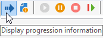

When this option is selected, executed activities are shown in blue, pending activities blink, warnings are shown in orange and errors in red. This option also displays the result of activities on their outbound transition, followed by the label of the result as defined in the activity properties and the duration of the job if it exceeds one second 

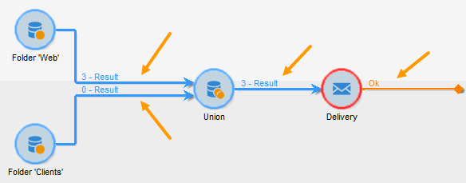

## Displaying logs {#displaying-logs}

The log contains the history or audit trail of the workflow. It registers all user actions, all operations performed and errors encountered. You can:

* Select the **[!UICONTROL Tracking]** tab in the detail. This list contains all workflow messages.

  

* Filter the log messages by activity. To do this, click **[!UICONTROL Display the tasks and the log]** on the toolbar above the diagram in order to display the **[!UICONTROL Log]** and **[!UICONTROL Tasks]** tabs below the diagram. Select an activity to view all related messages. This list contains all the messages when no activity is selected.

  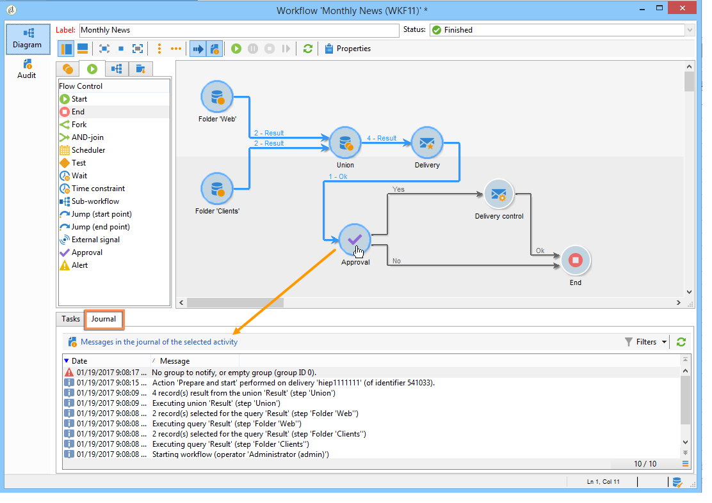

  >[!NOTE]
  >
  >Click the background of the diagram to unselect all elements.

* View only those messages linked to a given task. To do this, select the **[!UICONTROL Tasks]** tab, and then select an activity in the diagram in order to restrict the list. Double-click a task to display the information; the last tab in the window contains the log.

  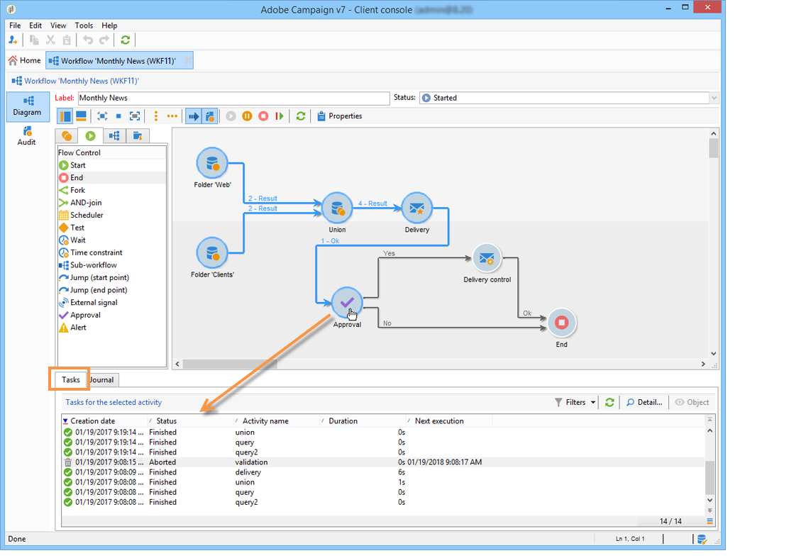

  The **[!UICONTROL Details...]** button lets you display all additional information on activity execution. For example, you can view the validating operator and when applicable, the comment they entered during approval, as in the following example:

  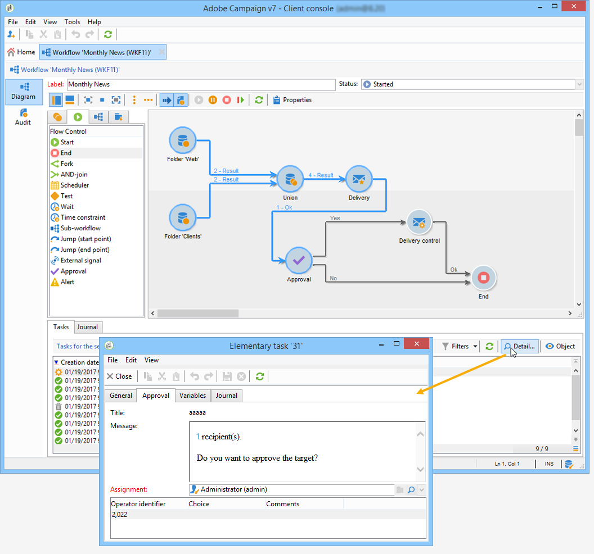

>[!NOTE]
>
>The log is not purged when a workflow is restarted. All messages are kept. If you wish to discard the messages from a previous execution, you must purge the history.

The log shows the chronological list of execution messages related to targeting workflow activities.

* Log of a targeting campaign

  Once a targeting campaign has been executed, click the **[!UICONTROL Tracking]** tab to view the execution trace. 

  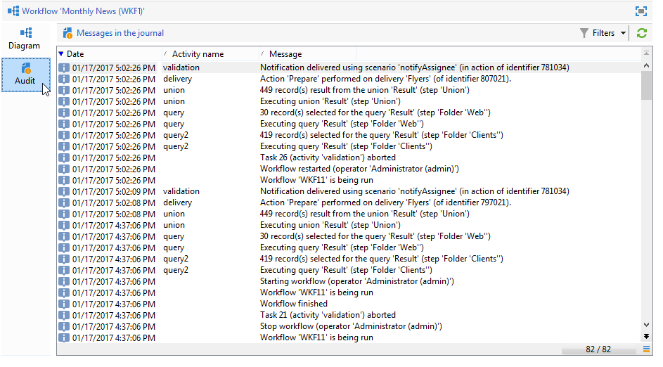

  All campaign messages are shown: campaigns carried out as well as warnings or errors.

* Log of an activity

  You can also view the execution log and details of each activity. There are two ways of doing this:

    1. Select the targeted activity and click the **[!UICONTROL Display the tasks and the log]** icon.
    
       

       The lower section of the diagram shows two tabs: Log and Tasks.

       Activities selected within the diagram act as filters on the log and task list.
    
       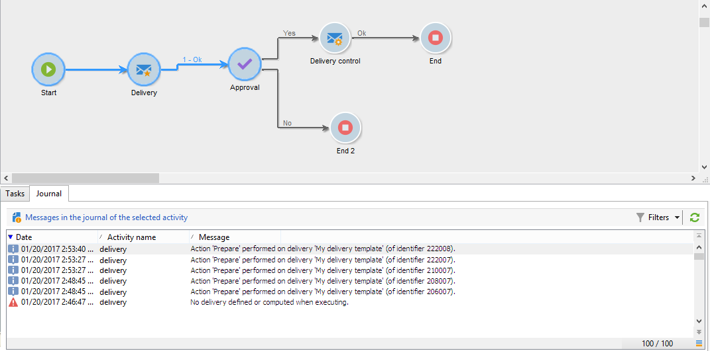

    1. Right-click the targeted activity and select **[!UICONTROL Display logs]**.
    
       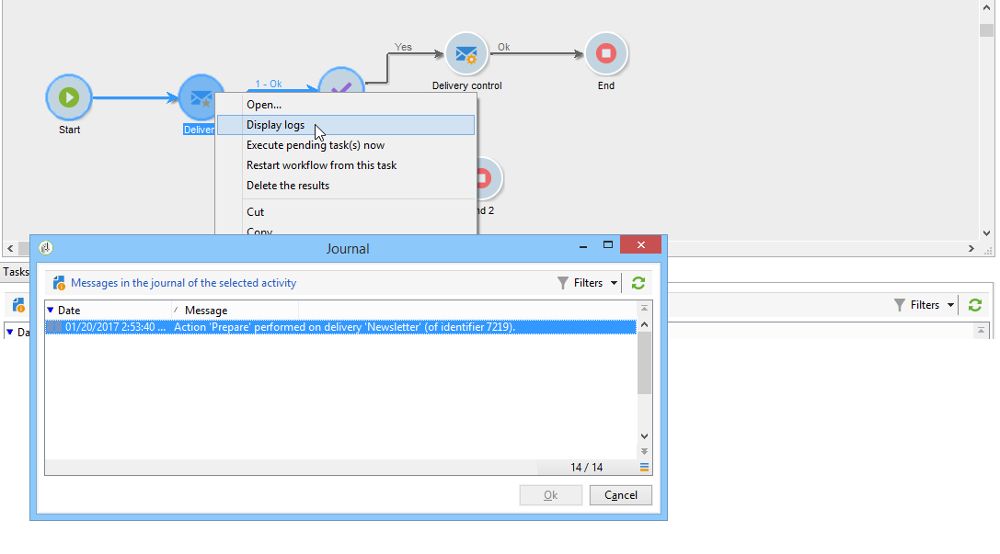

       The log is shown in a separate window.

## Purging the logs {#purging-the-logs}

Workflow history is not purged automatically: all messages are kept by default. History can be purged via the **[!UICONTROL File > Actions]** menu or by clicking the **[!UICONTROL Actions]** button located in the toolbar above the list. Select **[!UICONTROL Purge history]**. The options available in the **[!UICONTROL Actions]** menu is detailed in the [Actions toolbar](../../workflow/using/starting-a-workflow.md) section.

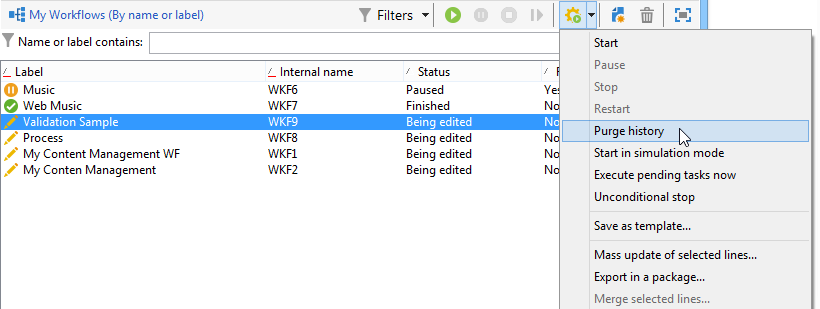

## Worktables and workflow schema {#worktables-and-workflow-schema}

The workflow conveys worktables that can be manipulated via certain activities. Adobe Campaign enables you, via Data Management activities, to modify, rename and enrich the columns of the workflow worktables, for example to align them with the nomenclature depending on the client's needs, for collecting additional information on the co-beneficiary of a contract, etc.

It is also possible to create links between various work dimensions and to define dimension changes. For example, for each contract recorded in the database, address the main holder and use co-holder data in the additional information.

The worktables of the workflow are deleted automatically when the workflow passivates. If you wish to keep a work table, save it in a list via the **[!UICONTROL List update]** activity (refer to [List update](../../workflow/using/list-update.md)).

## Managing errors {#managing-errors}

When an error occurs, the workflow is paused and the activity being executed when the error occurred flashes red. In the workflow overview, under the **[!UICONTROL Monitoring]** tab  -  **[!UICONTROL Workflows]** link, you can display workflows with errors only, as shown below.

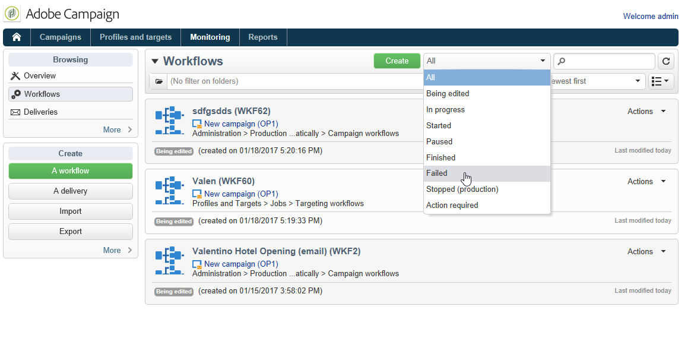

In the Adobe Campaign Explorer, the workflow list displays a **[!UICONTROL Failed]** column by default. 

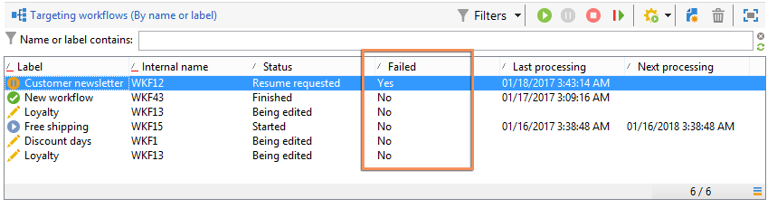

When a workflow is in error, the operator(s) belonging to the workflow supervision group are notified by email, as long as their email address is listed in their profile. This group is selected in the **[!UICONTROL Supervisor(s)]** field of the workflow properties.


The notification content is configured in the **[!UICONTROL Workflow manager notification]** default template: This template is selected in the **[!UICONTROL Execution]** tab of the workflow properties. The notification shows the name of the error workflow and the concerned task.

Notification example:

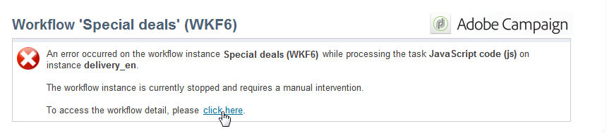

The link lets you access the Adobe Campaign console in Web mode and work on the error workflow once you have logged on.

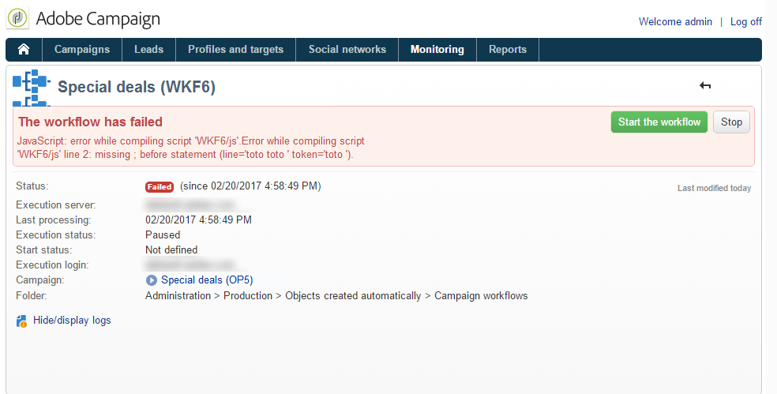

You can configure the workflow so that it does not pause and continues execution in case of errors. To do this, edit workflow **[!UICONTROL Properties]** and, in the **[!UICONTROL Error management]** section, select the **[!UICONTROL Ignore]** option in the **[!UICONTROL In case of error]** field. You may then specify the number of consecutive errors that can be ignored before the process is paused.

In this case, the error task is aborted. This mode is particularly suited to workflows designed to reattempt the campaign later (periodic actions).

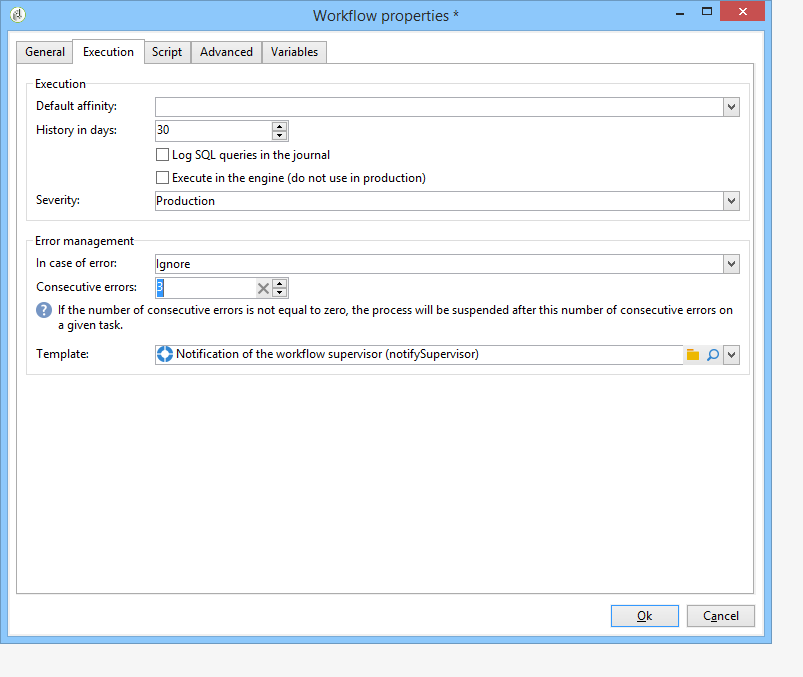

>[!NOTE]
>
>You can apply this configuration individually for each activity. To do this, edit activity properties and select the error management mode in the **[!UICONTROL Advanced]** tab.

For more on workflows' execution troubleshooting, refer to the [dedicated section](../../production/using/workflow-execution.md).

## Processing errors {#processing-errors}

Concerning activities, the **[!UICONTROL Process errors]** option displays a specific transition which will be enabled if an error is generated. In this case, the workflow does not go into error mode and execution continues.

Errors taken into account are file system errors (file could not be moved, directory could not be accessed, etc.).

This option does not process errors related to activity configuration, i.e. invalid values. Errors related to faulty configuration will not enable this transition (directory does not exist, etc.).

If a workflow is paused (manually or automatically after an error), the **[!UICONTROL Start]** button restarts the workflow execution where it was stopped. The erroneous activity (or paused activity) will be re-executed. The previous activities are not re-executed.

To re-execute all of the workflow activities, use the **[!UICONTROL Restart]** button.

If you modify activities that were already executed, the changes are not taken into account when the workflow execution is restarted.

If you modify unexecuted activities, they are taken into account when the workflow execution is restarted.

If you modify paused activities, the changes cannot be taken into account correctly when the workflow is restarted.

If possible, we recommend completely restarting the workflow after having carried out modifications.

## Instance supervision {#instance-supervision}

The **[!UICONTROL Instance supervision]** page lets you view the Adobe Campaign server activity and display the list of workflows and deliveries with errors.

To access this page, go to the **[!UICONTROL Monitoring]** tab and click the **[!UICONTROL General view]** link.

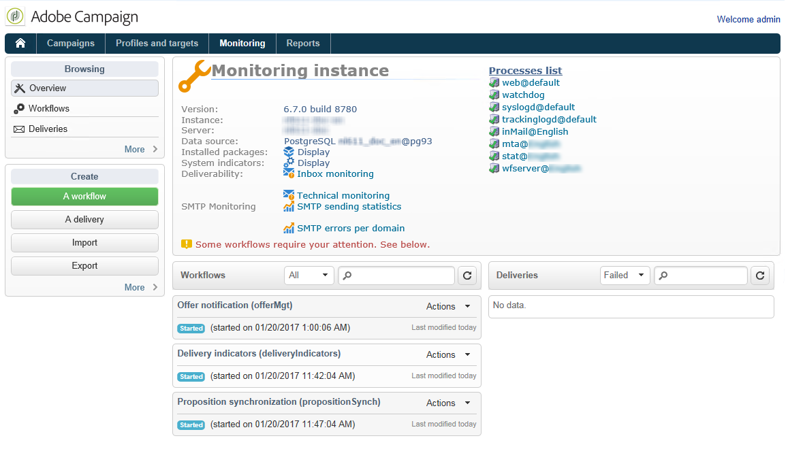

To display all the workflows, click the **[!UICONTROL Workflows]** link. Use the drop-down list to display the workflows in the platform based on their state.

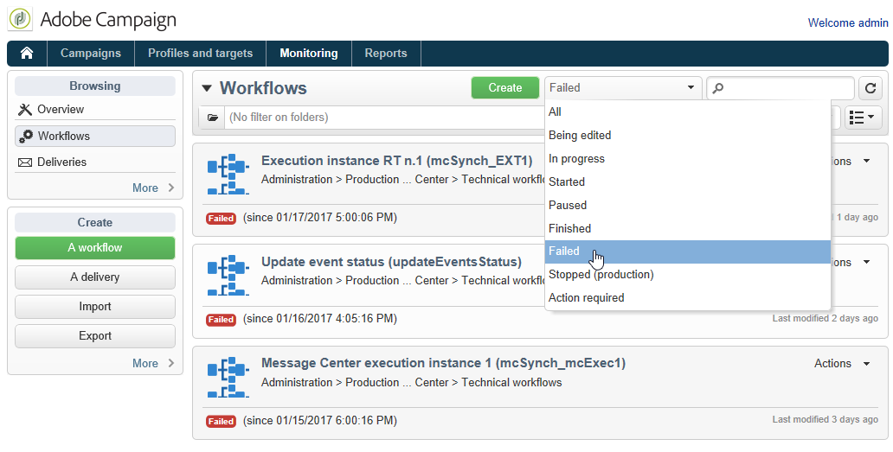

Click the link on a workflow with errors in order to open it and view its log.

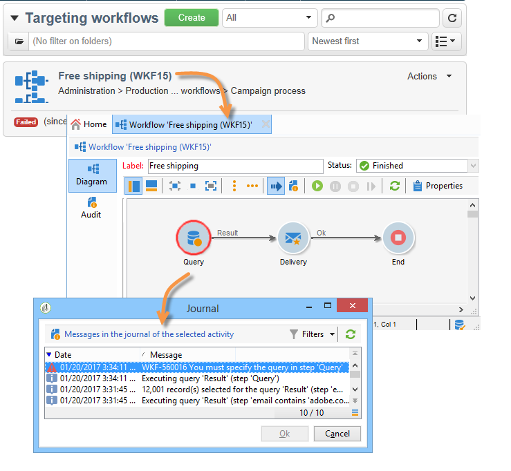

## Preventing simultaneous multiple executions {#preventing-simultaneous-multiple-executions}

A single workflow can have several executions running at the same time. In some cases you should prevent this from happening.

For instance, you can have a scheduler triggering the workflow execution every hour, but sometimes the execution of the whole workflow takes more than an hour. You may want to skip the execution if the workflow is already running.

If you have a signal activity at the start of the workflow you may want to skip the signal if the workflow is running.

The general principle is as follows:

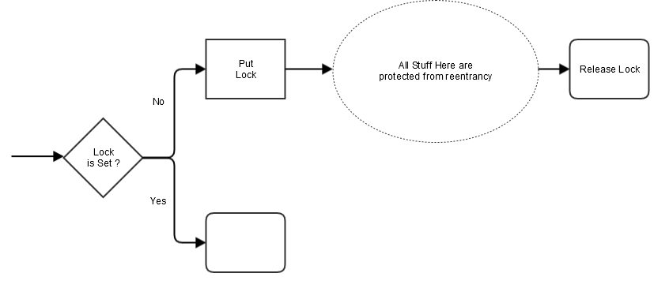

The solution is to use an instance variable. Instance variables are shared by all the parallel executions of the workflows.

Here is a simple test workflow:

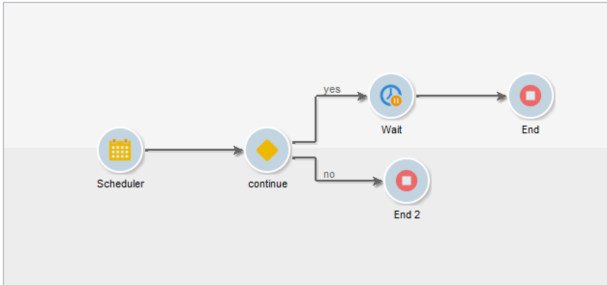

The **[!UICONTROL Scheduler]** is triggering an event every minute. The following **[!UICONTROL Test]** activity is going to test the **isRunning** instance variable to decide whether or not to continue the execution:

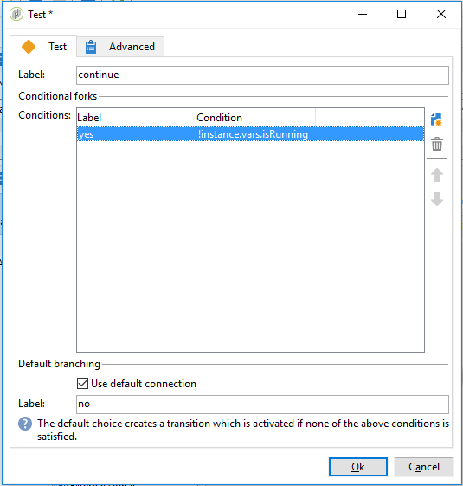

>[!NOTE]
>
>**isRunning** is a variable name chosen for this example. This is not a built-in variable.

The activity immediately following the **[!UICONTROL Test]** in the **yes** branch must set the instance variable in its **Initialization script**:

```
instance.vars.isRunning = true
```

The very last activity in the **yes** branch must revert the variable to false in its **Initialization script**:

```
instance.vars.isRunning = false
```

Note that:

* You can check the current value of the instance variable via the **Variables** tab in the workflow **Properties**.
* Instance variables are reset when you restart a workflow.
* In JavaScript, an undefined value is false in a test, allowing to test the instance variable even before having initialized it.
* You can monitor the activities that are not processed due to this mechanism by adding a logging instruction to the initialization script of the "no" ending.

  ```
  logInfo("Workflow already running, parallel execution not allowed.");
  ```

A use case is presented in this section: [Coordinating data updates](../../workflow/using/coordinating-data-updates.md).

## Database maintenance {#database-maintenance}

Workflows use a lot of work tables that consume space and end up slowing down the entire platform if not maintained. For more about database maintenance, refer to this [section](../../production/using/tables-to-maintain.md) .

The **Database cleanup** workflow accessible via the **Administration > Production > Technical workflows** node, lets you delete obsolete data to avoid exponential growth of the database. The workflow is triggered automatically without user intervention. Refer to this [section](../../production/using/database-cleanup-workflow.md).

You can also create specific technical workflows to purge unnecessary data consuming space. Refer to this [section](../../production/using/application-objects.md) and this [page](#purging-the-logs).

## Handling of paused workflows {#handling-of-paused-workflows}

By default, if a workflow is paused, its working tables are never purged. From build 8880, workflows that have been in a paused state for too long are automatically stopped and their working tables are purged. This behaviour is triggered as follows:

* Workflows that have been paused since more than 7 days appear as a warning in the monitoring dashboard (and monitoring API) and a notification is sent to the supervisor group.
* The same happens every week, when the **[!UICONTROL cleanupPausedWorkflows]** technical workflow is triggered. For more details on the workflow, refer to [this section](../../workflow/using/delivery.md).
* After 4 notifications (i.e. one month in paused state by default), the workflow is stopped unconditionnally. A log appears in the workflow after it has been stopped. The tables are purged at the next execution **[!UICONTROL cleanup]** workflow

These periods can be configured via the NmsServer_PausedWorkflowPeriod option.

Workflow supervisors are notified. The creator and last user who modified the workflow are notified as well. Administrators don't receive the notifications.

## Filtering workflows according to their status {#filtering-workflows-status}

Campaign Classic interface allows you to monitor the execution status of all workflows on your instance using predefined **views**. To access these views, open the **[!UICONTROL Administration]** / **[!UICONTROL Audit]** / **[!UICONTROL Workflows Status]** node.

The following views are available:

* **[!UICONTROL Running]**: lists all running workflows.
* **[!UICONTROL Paused]**: lists all paused workflows.
* **[!UICONTROL Failed]**: lists all failed workflows.
* **[!UICONTROL Start Pending]**: lists all workflows that are waiting to be started by the operationMgt process. This view is available with the **Marketing campaigns** package only (see [Installing Campaign standard packages](../../installation/using/installing-campaign-standard-packages.md)).

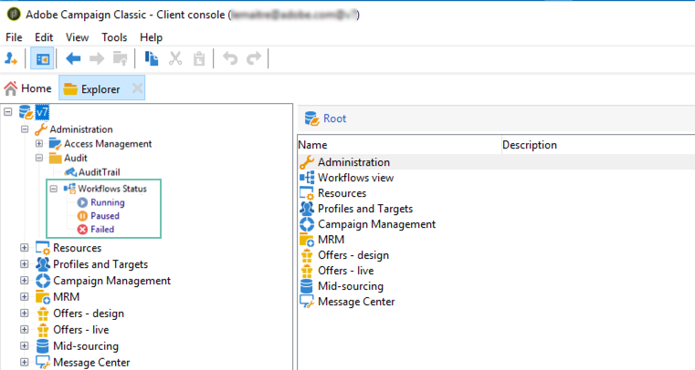

By default, these views are accessible in the **[!UICONTROL Audit]** folder. However, you can recreate them at the location of your choice in the folders tree. This way, they will be available to standard users with no administration right.

To do this:

1. Right-click on the folder where you want to add the view.
1. In **[!UICONTROL Add new folder]** / **[!UICONTROL Administration]**, select the view that you want to add.
1. Once the folder is added to the tree, make sure you configure it as a view, so that it displays all workflows, whatever their origin folder is.For more on how to configure views, refer to [this section](../../platform/using/access-management-folders.md).

Additionally to these views, you can set up filters folders that will allow you to filter the list of workflows according to their execution status. To do this:

1. Access a workflow-type folder, then select the **[!UICONTROL Filters]** / **[!UICONTROL Advanced filter]** menu.
1. Configure the filter so that the workflow's **[!UICONTROL @status]** field is equal to the state of your choice.
1. Save and name the filter. It will then be directly available from the filters list.

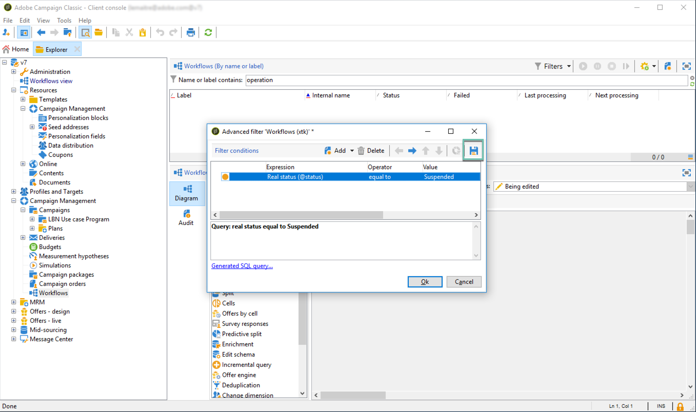

For more information, refer to these sections:

* [Creating advanced filters](../../platform/using/creating-filters.md#creating-an-advanced-filter)
* [Saving filters](../../platform/using/creating-filters.md#saving-a-filter)
