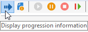
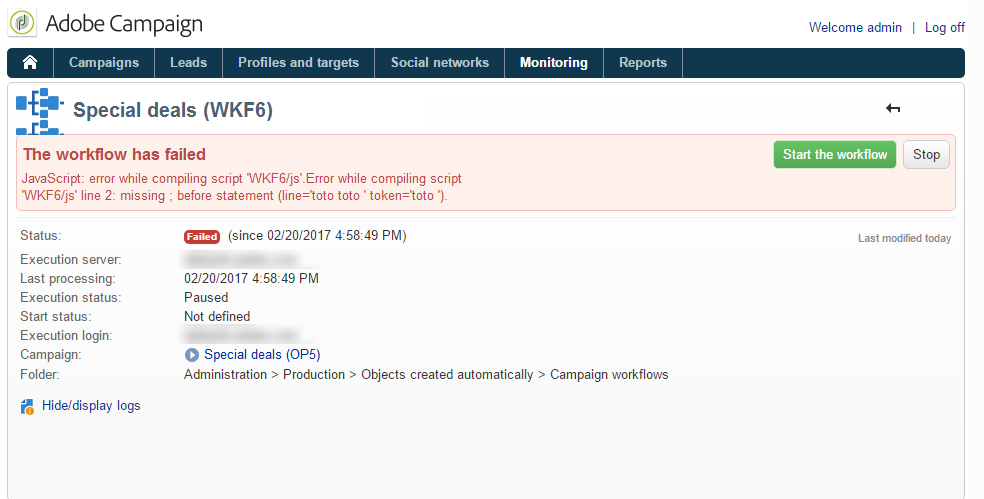
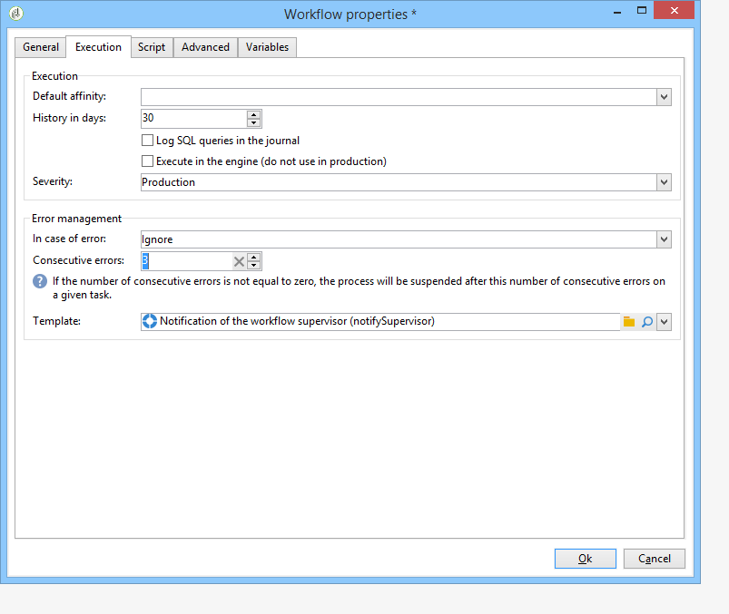
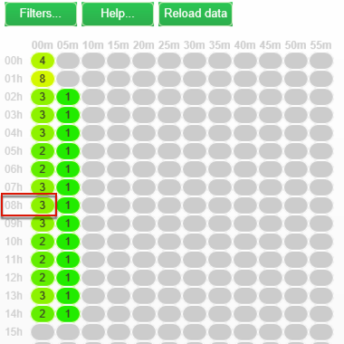

# Monitoring workflows {monitoring-workflows}

## Monitoring workflow execution {#monitoring-workflow-execution}

### Displaying progress {#displaying-progress}

You can monitor execution by displaying progress using the appropriate icon on the toolbar.

The **[!UICONTROL Display progress information]** icon lets you display the status and the activity result in the execution screen.



When this option is selected, executed activities are shown in blue, pending activities blink, warnings are shown in orange and errors in red. This option also displays the result of activities on their outbound transition, followed by the label of the result as defined in the activity properties and the duration of the job if it exceeds one second 


### Displaying logs {#displaying-logs}

The log contains the history or audit trail of the workflow. It registers all user actions, all operations performed and errors encountered. You can:

* Select the **[!UICONTROL Tracking]** tab in the detail. This list contains all workflow messages.

  

* Filter the log messages by activity. To do this, click **[!UICONTROL Display the tasks and the log]** on the toolbar above the diagram in order to display the **[!UICONTROL Log]** and **[!UICONTROL Tasks]** tabs below the diagram. Select an activity to view all related messages. This list contains all the messages when no activity is selected.

  

  >[!NOTE]
  >
  >Click the background of the diagram to unselect all elements.

* View only those messages linked to a given task. To do this, select the **[!UICONTROL Tasks]** tab, and then select an activity in the diagram in order to restrict the list. Double-click a task to display the information; the last tab in the window contains the log.

  

  The **[!UICONTROL Details...]** button lets you display all additional information on activity execution. For example, you can view the validating operator and when applicable, the comment they entered during approval, as in the following example:

  

>[!NOTE]
>
>The log is not purged when a workflow is restarted. All messages are kept. If you wish to discard the messages from a previous execution, you must purge the history.

The log shows the chronological list of execution messages related to targeting workflow activities.

* Log of a targeting campaign

  Once a targeting campaign has been executed, click the **[!UICONTROL Tracking]** tab to view the execution trace. 

  

  All campaign messages are shown: campaigns carried out as well as warnings or errors.

* Log of an activity

  You can also view the execution log and details of each activity. There are two ways of doing this:

    1. Select the targeted activity and click the **[!UICONTROL Display the tasks and the log]** icon.
    
       

       The lower section of the diagram shows two tabs: Log and Tasks.

       Activities selected within the diagram act as filters on the log and task list.
    
       

    1. Right-click the targeted activity and select **[!UICONTROL Display logs]**.
    
       

       The log is shown in a separate window.

### Purging the logs {#purging-the-logs}

Workflow history is not purged automatically: all messages are kept by default. History can be purged via the **[!UICONTROL File > Actions]** menu or by clicking the **[!UICONTROL Actions]** button located in the toolbar above the list. Select **[!UICONTROL Purge history]**. The options available in the **[!UICONTROL Actions]** menu is detailed in the [Actions toolbar](../../workflow/using/executing-a-workflow.md#actions-toolbar) section.


### Worktables and workflow schema {#worktables-and-workflow-schema}

The workflow conveys worktables that can be manipulated via certain activities. Adobe Campaign enables you, via Data Management activities, to modify, rename and enrich the columns of the workflow worktables, for example to align them with the nomenclature depending on the client's needs, for collecting additional information on the co-beneficiary of a contract, etc.

It is also possible to create links between various work dimensions and to define dimension changes. For example, for each contract recorded in the database, address the main holder and use co-holder data in the additional information.

The worktables of the workflow are deleted automatically when the workflow passivates. If you wish to keep a work table, save it in a list via the **[!UICONTROL List update]** activity (refer to [List update](../../workflow/using/list-update.md)).

### Managing errors {#managing-errors}

When an error occurs, the workflow is paused and the activity being executed when the error occurred flashes red. In the workflow overview (**[!UICONTROL Monitoring]** universe > **[!UICONTROL Workflows]** link) you can display workflows with errors only, as shown below.


In the Adobe Campaign Explorer, the workflow list displays a **[!UICONTROL Failed]** column by default. 


When a workflow is in error, the operator(s) belonging to the workflow supervision group are notified by email, as long as their email address is listed in their profile. This group is selected in the **[!UICONTROL Supervisor(s)]** field of the workflow properties.


The notification content is configured in the **[!UICONTROL Workflow manager notification]** default template: This template is selected in the **[!UICONTROL Execution]** tab of the workflow properties. The notification shows the name of the error workflow and the concerned task.

Notification example:


The link lets you access the Adobe Campaign console in Web mode and work on the error workflow once you have logged on.



You can configure the workflow so that it does not pause and continues execution in case of errors. To do this, edit workflow **[!UICONTROL Properties]** and, in the **[!UICONTROL Error management]** section, select the **[!UICONTROL Ignore]** option in the **[!UICONTROL In case of error]** field. You may then specify the number of consecutive errors that can be ignored before the process is paused.

In this case, the error task is aborted. This mode is particularly suited to workflows designed to reattempt the campaign later (periodic actions).



>[!NOTE]
>
>You can apply this configuration individually for each activity. To do this, edit activity properties and select the error management mode in the **[!UICONTROL Advanced]** tab.

### Processing errors {#processing-errors}

Concerning activities, the **[!UICONTROL Process errors]** option displays a specific transition which will be enabled if an error is generated. In this case, the workflow does not go into error mode and execution continues.

Errors taken into account are file system errors (file could not be moved, directory could not be accessed, etc.).

This option does not process errors related to activity configuration, i.e. invalid values. Errors related to faulty configuration will not enable this transition (directory does not exist, etc.).

If a workflow is paused (manually or automatically after an error), the **[!UICONTROL Start]** button restarts the workflow execution where it was stopped. The erroneous activity (or paused activity) will be re-executed. The previous activities are not re-executed.

To re-execute all of the workflow activities, use the **[!UICONTROL Restart]** button.

If you modify activities that were already executed, the changes are not taken into account when the workflow execution is restarted.

If you modify unexecuted activities, they are taken into account when the workflow execution is restarted.

If you modify paused activities, the changes cannot be taken into account correctly when the workflow is restarted.

If possible, we recommend completely restarting the workflow after having carried out modifications.

### Instance supervision {#instance-supervision}

The **[!UICONTROL Instance supervision]** page lets you view the Adobe Campaign server activity and display the list of workflows and deliveries with errors.

To access this page, go to the **[!UICONTROL Monitoring]** universe and click the **[!UICONTROL General view]** link.


To display all the workflows, click the **[!UICONTROL Workflows]** link. Use the drop-down list to display the workflows in the platform based on their state.


Click the link on a workflow with errors in order to open it and view its log.


### Preventing simultaneous multiple executions {#preventing-simultaneous-multiple-executions}

A single workflow can have several executions running at the same time. In some cases you should prevent this from happening.

For instance, you can have a scheduler triggering the workflow execution every hour, but sometimes the execution of the whole workflow takes more than an hour. You may want to skip the execution if the workflow is already running.

If you have a signal activity at the start of the workflow you may want to skip the signal if the workflow is running.

The general principle is as follows:


The solution is to use an instance variable. Instance variables are shared by all the parallel executions of the workflows.

Here is a simple test workflow:


The **[!UICONTROL Scheduler]** is triggering an event every minute. The following **[!UICONTROL Test]** activity is going to test the **isRunning** instance variable to decide whether or not to continue the execution:


>[!NOTE]
>
>**isRunning** is a variable name chosen for this example. This is not a built-in variable.

The activity immediately following the **[!UICONTROL Test]** in the **yes** branch must set the instance variable in its **Initialization script**:

```
instance.vars.isRunning = true
```

The very last activity in the **yes** branch must revert the variable to false in its **Initialization script**:

```
instance.vars.isRunning = false
```

Note that:

* You can check the current value of the instance variable via the **Variables** tab in the workflow **Properties**.
* Instance variables are reset when you restart a workflow.
* In JavaScript, an undefined value is false in a test, allowing to test the instance variable even before having initialized it.
* You can monitor the activities that are not processed due to this mechanism by adding a logging instruction to the initialization script of the "no" ending.

  ```
  logInfo("Workflow already running, parallel execution not allowed.");
  ```

A use case is presented in this section: [Coordinating data updates](../../workflow/using/coordinating-data-updates.md).

### Database maintenance {#database-maintenance}

Workflows use a lot of work tables that consume space and end up slowing down the entire platform if not maintained. For more about database maintenance, refer to this [section](../../production/using/tables-to-maintain.md) .

The **Database cleanup** workflow accessible via the **Administration > Production > Technical workflows** node, lets you delete obsolete data to avoid exponential growth of the database. The workflow is triggered automatically without user intervention. Refer to this [section](../../production/using/database-cleanup-workflow.md).

You can also create specific technical workflows to purge unnecessary data consuming space. Refer to this [section](../../production/using/application-objects.md) and this [page](../../workflow/using/monitoring-workflows.md#purging-the-logs).

### Handling of paused workflows {#handling-of-paused-workflows}

By default, if a workflow is paused, its working tables are never purged. From build 8880, workflows that have been in a paused state for too long are automatically stopped and their working tables are purged. This behaviour is triggered as follows:

* Workflows that have been paused since more than 7 days appear as a warning in the monitoring dashboard (and monitoring API) and a notification is sent to the supervisor group.
* The same happens every week, when the **[!UICONTROL cleanupPausedWorkflows]** technical workflow is triggered. For more details on the workflow, refer to [this section](../../workflow/using/delivery.md).
* After 4 notifications (i.e. one month in paused state by default), the workflow is stopped unconditionnally. A log appears in the workflow after it has been stopped. The tables are purged at the next execution **[!UICONTROL cleanup]** workflow

These periods can be configured via the NmsServer_PausedWorkflowPeriod option.

Workflow supervisors are notified. The creator and last user who modified the workflow are notified as well. Administrators don't receive the notifications.

## Workflow HeatMap {#workflow-heatmap}

The Adobe Campaign Workflow HeatMap consists in a color-coded graphical representation of all the workflows that are currently running.

### About the Workflow HeatMap {#about-the-workflow-heatmap}

By providing a quick overview on the number of concurrent workflows, the Workflow HeatMap enables the Adobe Campaign platform administrators to monitor the load on the instance and plan workflows accordingly.

More precisely, it helps the platform administrators to:

* See and understand concurrent workflows
* Filter workflows by duration to see which workflows may encounter issues
* Filter activities by duration to see which activities may encounter issues
* Easily find individual workflows and all related activities (with their duration)
* Search by workflow type ( [technical workflows](../../workflow/using/building-a-workflow.md#technical-workflows) or [campaign workflows](../../workflow/using/building-a-workflow.md#campaign-workflows))
* Look for a specific workflow to analyze

>[!NOTE]
>
>In addition to the **Workflow Heatmap**, you can create a workflow that will let you monitor the status of a set of workflows and send recurring messages to supervisors. For more on this, refer to the [dedicated section](../../workflow/using/supervising-workflows.md).

Using the Workflow HeatMap requires to have a good understanding of the following concepts: [Workflows](../../workflow/using/about-workflows.md), [Activities](../../workflow/using/about-activities.md) and [Workflow Best Practices](../../workflow/using/workflow-best-practices.md).

The Workflow HeatMap is available by default in Adobe Campaign starting 18.10 release. If you have a build between 8700 and 8977 (18.10), you can also benefit from this capability. To request the corresponding package, contact the [Adobe Customer Care](https://support.neolane.net/) and follow the instructions from [this page](https://helpx.adobe.com/campaign/kb/install-workflow-heatmap-package.md) to understand how to install it.

When you first access Worfklow HeatMap the following pop-up window will appear. This agreement allows the transfer and storage in the United States allowing Adobe Campaign to:

* monitor instances to investigate any performance issues.
* collect data for anomaly detection.

Note that the transfer of your data is only available for users connecting to Adobe Campaign using their Adobe ID. 


Three options are available:

* **[!UICONTROL Accept]** : By accepting this agreement, you authorize Adobe Campaign to collect your data and to transfer it to the United States to be able to help you in case of anomaly detections.
* **[!UICONTROL Refuse]** : By declining the agreement, your data will not be transferred but you can still use Workflow Heatmap.
* **[!UICONTROL Do not show this message again]** : By clicking **[!UICONTROL Do not show this message again]** , the pop-up window will stop showing when accessing Workflow Heatmap but is still available from the **[!UICONTROL Term of use]** button.

This choice is not final, you can always change it by clicking the **[!UICONTROL Term of use]** button.

### Using the HeatMap {#using-the-heatmap}

>[!NOTE]
>
>Only users with administration rights can access the Campaign Workflow HeatMap.

1. Go to **[!UICONTROL Monitoring]** and click the **[!UICONTROL Workflows]** link to display the **[!UICONTROL Campaign Workflow HeatMap]** page.

   

1. Click the calendar to select a day.

   By default, the page shows the workflow activity for the current day. You can change it and select any day in the past.

   >[!NOTE]
   >
   >Only the workflows that have not been deleted by the **[!UICONTROL Database cleanup]** workflow are visible. For more on the Database cleanup workflow, refer to [this section](../../production/using/database-cleanup-workflow.md).  
   >By default, the Workflow HeatMap time zone is the one defined for the current administrator user. For example, you may want to change it if you are not in the same area as the marketing users you are working with.

1. Click the **[!UICONTROL Filters]** button.

   

1. Use the slider to set the minimum duration from 0 second to 1 hour. This enables you to search only workflows running for more than a certain number of seconds or minutes.

   

1. You can also choose a specific workflow from the **[!UICONTROL Workflows]** list.

   

   >[!NOTE]
   >
   >The **[!UICONTROL Min duration]** filter is applied. If you cannot find a specific workflow, reset the minimum duration to 0 so that all workflows are displayed in the list.

1. You can also filter on the **[!UICONTROL Workflow type]** :

    * **[!UICONTROL Technical]** : Only [out-of-the box-technical workflows](../../workflow/using/building-a-workflow.md#technical-workflows) and [data management workflows](../../workflow/using/targeting-data.md#data-management) are displayed.
    * **[!UICONTROL Marketing]** : Only workflows linked to a marketing campaign, known as [campaign workflows](../../workflow/using/building-a-workflow.md#campaign-workflows), are displayed.

1. To search a specific workflow by name, you can also use the **[!UICONTROL Workflow name filter]** field.

   

1. If you edited some workflows in the time between, click the **[!UICONTROL Reload data]** button to refresh the data that are displayed in the grid.

### Reading the HeatMap {#reading-the-heatmap}

The Campaign Workflow HeatMap is a grid naturally readable from upper left to bottom right, allowing to find the "hot zones" with a green to red color-coded range.

* The darker red cells correspond to periods when a high number of workflows are running at the same time.
* The grey cells correspond to periods when no workflow is running.

To learn how the color code is applied and how to navigate the HeatMap, click the **[!UICONTROL Help]** button.


Each row represents an hour of the day and each cell represents 5 minutes of that hour.

The grid shows all the workflows that are running at the same time for each of these 5-minute periods.

In the example below, between 8am and 8:05am, three workflows are running (no matter their individual duration):



1. Click a colored cell to display the details of all concurrent workflows running during this period.

   

   For each workflow, all the activities that it contains are listed, with their duration.

1. Click the workflow ID or name to directly open a workflow.
1. To go back to the **[!UICONTROL Campaign Workflow HeatMap]** view, click the **[!UICONTROL Home]** button.

### Use cases: using the HeatMap to take actions {#use-cases--using-the-heatmap-to-take-actions}

There are two main cases where the Campaign Workflow HeatMap can be useful.

#### Reducing the number of concurrent workflows {#reducing-the-number-of-concurrent-workflows}

As a Campaign administrator, the Workflow HeatMap can help you to understand the load on the instance and plan existing or new workflows at appropriate times.

1. From the **[!UICONTROL Campaign Workflow HeatMap]** view, click the **[!UICONTROL Filters]** button.
1. Set duration to a few seconds or a few minutes.
1. Exclude the shortest workflows that are not significant by increasing the duration filter.

   

1. Explore the results to understand the load on the instance and take appropriate actions:

    * If you encounter performance issues and if one or more red cells are displayed in the grid, consider changing several workflows' starting times. Ask the marketing users to move manually workflows from busy ("hot") periods to more available time slots. This should maintain a stable level of activity along the day.
    * To avoid peaks and prevent the instance from overload, look at the HeatMap before planning new workflows and choose the best time. Consider time slots corresponding to grey or green cells in the grid to start new workflows.

#### Finding long-running workflows that impact performance {#finding-long-running-workflows-that-impact-performance}

As a Campaign administrator, the Workflow HeatMap helps you to find the longest workflows which can slow down the activity.

1. From the **[!UICONTROL Campaign Workflow HeatMap]** view, click the **[!UICONTROL Filters]** button.
1. Set duration to 1 hour.

   

1. Include more results by decreasing the **[!UICONTROL Min duration]** filter.
1. Explore the results to find the longest workflows, who can potentially have more impact on the server and database resources (CPU, RAM, network, IOPS, and so on).
1. Take appropriate actions:

    * Advise marketing users to split the longest workflows to reduce processing time.
    * Start a deeper analyze on specific workflows and specific activities (such as JavaScript, import, export, and so on) to isolate the issues and solve them more easily.

### Example: Using the HeatMap to improve workflow planning {#example--using-the-heatmap-to-improve-workflow-planning}

The example below shows how planning can be more efficient and how performance can be improved when using the Adobe Campaign Workflow HeatMap.

In this case, many users are complaining about workflow performance. You need to check what is slowing down the activity and how to solve the problem.

1. Go to **[!UICONTROL Monitoring]** and click the **[!UICONTROL Workflows]** link to display the **[!UICONTROL Campaign Workflow HeatMap]** page.
1. Set the **[!UICONTROL Min duration]** filter to 5 minutes.
1. Set the **[!UICONTROL Workflow type]** filter to **[!UICONTROL Marketing]** .
1. From the HeatMap grid, observe the following:

   

    * Fifty long-lasting (more than 5 minutes) campaign workflows are running at 10am.
    * Most of them have a pending state (by default, the concurrency limit is set to 20).
    * The pending workflows need to be manually restarted every day.
    * Performance is low.

1. Instead of having fifty workflows starting at 10am, distribute the workflows' starting times evenly throughout the rest of the day.
1. Go back to the **[!UICONTROL Campaign Workflow HeatMap]** page and click the **[!UICONTROL Reload data]** button.
1. Now observe the following:

   

    * Only eighteen long-lasting campaign workflows are still running at 10am.
    * No more workflows are in pending state (the concurrency limit is still set to 20).
    * Workflow starting times are evenly distributed throughout the day.
    * No more users are complaining about performance issues.
