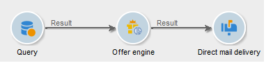
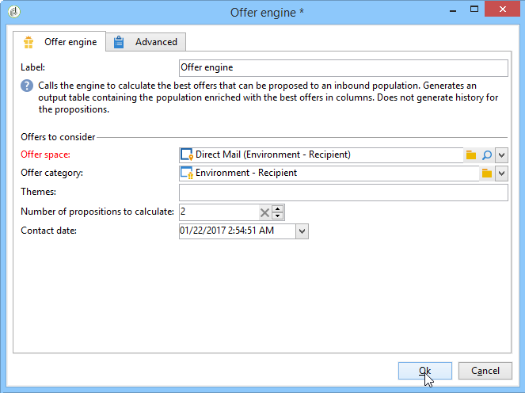

# Offer engine{#offer-engine}

The **[!UICONTROL Offer engine]** activity lets you define a call to the offer engine prior to a delivery.

This activity works on the same principle as the enrichment activity with an engine call, by enriching the inbound population data with an offer calculated by the engine, before a delivery.

After configuring your query (refer to this [section](query.md)):

1. Add and open an **[!UICONTROL Offer engine]** activity.
1. Complete the various available fields to specify the call to offer engine parameters (offer space, category or theme(s), contact date, number of offers to keep). The engine will automatically calculate the offer(s) to add according to these parameters.

   >[!CAUTION]
   >
   >If you use this activity, only the offer propositions used in the delivery will be stored.

   

1. Then configure a delivery activity that corresponds to your chosen channel. Refer to [Cross-channel deliveries](cross-channel-deliveries.md).
