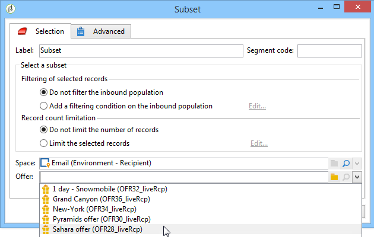

# Offers by cell{#offers-by-cell}

The **[!UICONTROL Offers by cell]** activity lets you distribute the inbound population (from a query for example) into several segments and to specify an offer to present for each of these segments.

This activity can only be used with **Interaction**. For more information, refer to this [section](../../interaction/using/about-outbound-channels.md).

To do this:

1. Add the **[!UICONTROL Offers by cell]** activity once you have specified the target population, then open it.
1. In the **[!UICONTROL General]** tab, select the offer space on which you want to present the offers.
1. In the **[!UICONTROL Cells]** tab, specify the different sub-sets using the **[!UICONTROL Add]** button:

    * Specify the subset population using the available filtering and limiting rules.
    * Next, select the offer that you want to present to the sub-set. The available offers are those that are eligible on the offer space that was selected at the previous step.
    
      

1. Then configure a delivery activity that corresponds to your chosen channel. Refer to [Cross-channel deliveries](../../workflow/using/cross-channel-deliveries.md).

