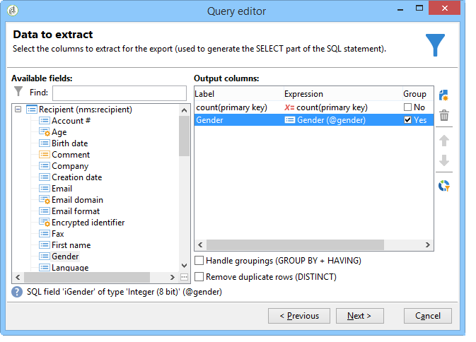
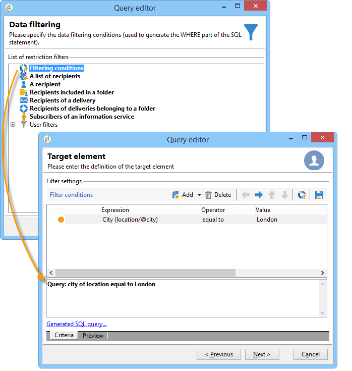
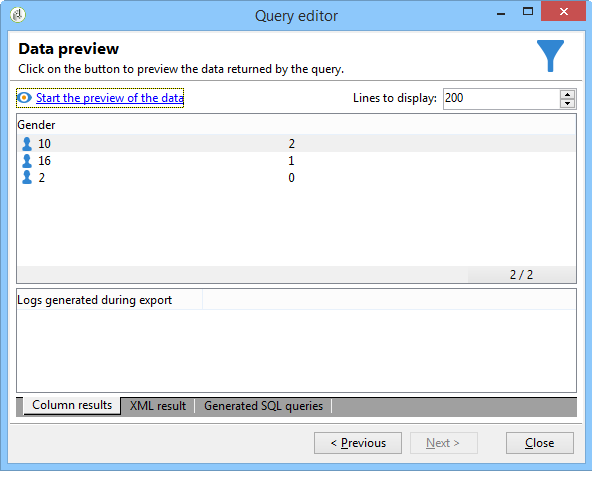

# Performing aggregate computing {#performing-aggregate-computing}

In this example, we want to count the number of recipients living in London, according to gender.

* Which table needs to be selected?

  The recipient table (**nms:recipient**)

* Which fields should be selected in the output column?

  Primary key (with count) and Gender

* What conditions is the information filtered based on?

  Based on the recipients who live in London

To create this example, apply the following steps:

1. In **[!UICONTROL Data to extract]**, define a count for the primary key (as shown in the previous example). Add the **[!UICONTROL Gender]** field in the output column. Check the **[!UICONTROL Group]** option in the **[!UICONTROL Gender]** column. This way recipients will be grouped by gender.

   

1. In the **[!UICONTROL Sorting]** window, click **[!UICONTROL Next]**: no sorting is necessary here.
1. Configure data filtering. Here, you want to restrict the selection to contacts who live in London.

   

   >[!NOTE]
   >
   >Values are case-sensitive. If the 'London' value is entered in the condition without a capital letter and the list of recipients contains the word "London" with a capital letter, the query will fail.

1. In the **[!UICONTROL Data formatting]** window, click **[!UICONTROL Next]**: no formatting is required for this example.
1. In the preview window, click **[!UICONTROL Launch data preview]**.

   There are three separate values for each sort by gender: **2** for female, **1** for male and **0** when the gender is unknown. In this example, the list contains 10 women, 16 men and 2 people whose gender is not known.

   
