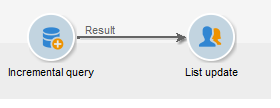

# Quarterly list update using an incremental query {#quarterly-list-update}

In the following example, an [incremental query](../../workflow/using/incremental-query.md) is used to automatically update a recipient list. These recipients are targeted as part of seasonal marketing campaigns.

As these campaigns are launched at the beginning of every season in order to offer relevant sports activities, these lists are updated every quarter. However, a recipient here must only be targeted once every 9 months by this campaign. This allows you to space out the recipient's eligibility frequency and to offer activities for different seasons over the years.

1. Add an incremental query as well as a list update activity into a new workflow.
1. Configure the **[!UICONTROL Incremental query]** tab of the activity as specified in [Creating a query](../../workflow/using/query.md#creating-a-query).
1. Select the **[!UICONTROL Scheduling & History]** tab and then specify a 270-day history. A recipient that has already been targeted will no longer be targeted for a period of 270 days, or roughly 9 months.

   Then click the **[!UICONTROL Change...]** button.

1. To ensure the list is updated before the start of each season, select **[!UICONTROL Monthly]**.
1. On the next screen, select March, June, September and December. Choose the 20th of the month and choose what time you would like to launch the workflow.
1. Next select the validity period for the query. For example, if you want this activity to be permanently active, select **[!UICONTROL Permanent validity]**.

   

1. After approving the incremental query, configure the list update activity as explained in [List update](../../workflow/using/list-update.md).

The workflow will therefore be automatically launched just before the start of each season. The list will be updated with new, eligible recipients to receive the offers.
