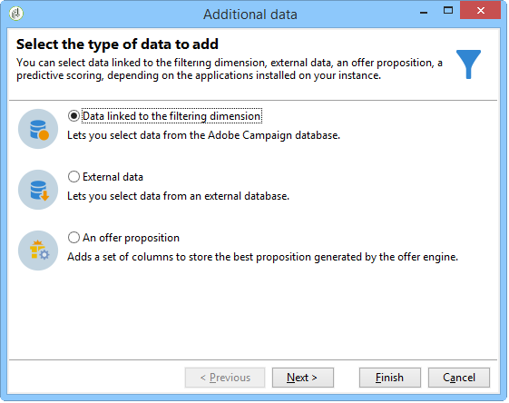

# Query{#query}

## Creating a query {#creating-a-query}

A query lets you select a target according to criteria. You can associate a segment code to the query result and insert additional data into it.
For more information on query samples, refer to this [this section](../../workflow/using/querying-recipient-table.md).

>[!NOTE]
>
>Query activities are not compatible with CLOB fields when using Oracle.

For more on using and managing additional data, refer to [Adding data](#adding-data).

The **[!UICONTROL Edit query...]** link lets you define the targeting type, the restrictions, and the selection criteria for the population in the following way:

1. Select the targeting and filtering dimension. By default, the target is selected from the recipients. The list of restriction filters is the same as those used for delivery targeting.

   The targeting dimension coincides with the type of element we will be working on, e.g. the population targeted by the operation.

   The filtering dimension enables to collect these elements, e.g. information related to the targeted person (contracts, full and final settlements, etc.).

   For more on this, refer to [Targeting and filtering dimensions](../../workflow/using/building-a-workflow.md#targeting-and-filtering-dimensions).

   

   A query can be based on data from the inbound transition, if necessary, by selecting **[!UICONTROL Temporary schema]** when choosing targeting and filtering dimensions.

   

1. Define the populations using the wizard. The fields to be entered can differ according to the type of target. You can preview the targeted population with your current criteria using the **[!UICONTROL Preview]** tab.

   For more on creating and using filters or queries, refer to this [section](../../platform/using/filtering-options.md).

   

1. If you have selected **[!UICONTROL Filtering conditions]** at step 1 or using the **[!UICONTROL Filters]** > **[!UICONTROL Advanced filter...]** option, then you will have to manually add filtering criteria later on.

   You can also add data grouping conditions by checking the corresponding box. To do this, the filtering dimension must be different to the query's targeting dimension. For more information on grouping, refer to this [section](../../workflow/using/querying-using-grouping-management.md).

   You can also add more criteria by using the Expression builder and combining it with the logical options AND, OR, and EXCEPT. You can then preview the **[!UICONTROL Corresponding SQL query...]** for your criteria combination. For more on this refer to this [section](../../platform/using/defining-filter-conditions.md#building-expressions).

   Save your filter if you wish to re-use it later.

   

## Adding data {#adding-data}

The additional columns let you collect additional information on the targeted population, e.g. contract numbers, subscriptions to newsletters or origin. This data can be stored in the Adobe Campaign database or in an external database.

The **[!UICONTROL Add data...]** link lets you select the additional data to collect.

Start by selecting the type of data to add:

* Select **[!UICONTROL Data linked to the filtering dimension]** to select the data in the Adobe Campaign database.
* Select **[!UICONTROL External data]** to add data from an external database. This option is only available if you have purchased the **Federated Data Access** option. For more on this, refer to [Accessing an external database (FDA)](../../workflow/using/accessing-an-external-database--fda-.md).
* Select the **[!UICONTROL An offer proposition]** option to add a set of columns which let you store the best proposition generated by the offer engine. This option is only available if you have purchased the **Interaction** module.

If no optional module is installed on the platform, this stage is not displayed. You will be taken straight to the next stage.

To add data from the Adobe Campaign database:

1. Select the type of data you want to add. This can be data belonging to the filtering dimension or data stored in linked tables.

   

1. If the data belongs to the query's filtering dimension, simply select it in the list of available fields to display it in the output columns.

   

   You can add:

    * A field computed based on data taken from the targeted population or an aggregate (number of pending purchases within the last month, average amount of a receipt, etc.). For an example, go to [Selecting data](../../workflow/using/targeting-data.md#selecting-data).
    * A new field, created using the **[!UICONTROL Add]** button to the right of the list of output columns.

      You can also add a collection of information, for example a list of contracts, the last 5 deliveries, etc. Collections coincide with fields that can have multiple values for the same profile (1-N relationship). For more on this, refer to [Editing additional data](../../workflow/using/targeting-data.md#editing-additional-data).

To add a collection of information linked to a targeted population:

1. At the first step of the wizard, select the **[!UICONTROL Data linked to the filtering dimension]** option:
1. Select the table which contains the information you want to collect and click **[!UICONTROL Next]**.

   

1. If necessary, specify the number of elements of the collection that you want to keep by selecting one of the values in the **[!UICONTROL Data collected]** field. By default, all the lines of the collection are recovered then filtered according to the conditions specified at the following step.

    * If a single element of the collection coincides with the filtering conditions for this collection, select **[!UICONTROL Single row]** in the **[!UICONTROL Data collected]** field.

      >[!IMPORTANT]
      >
      >This mode optimizes the SQL query generated thanks to a direct juncture on the collection elements.  
      >
      >If the initial condition is not respected, the result may be flawed (missing or overlapping lines).

    * If you choose to recover several lines (**[!UICONTROL Limit the line count]**) you can specify the number of lines to collect. 
    * If the collected columns contain aggregates, for example the number of failures declared, average expenditure on a site, etc. you can use the **[!UICONTROL Aggregates]** value.

   

1. Specify the sub-selection of the collection. For example: purchases over the last 15 days only.

   

1. If you have selected the **[!UICONTROL Limit the line count]** option, define the order in which the collected data is to be filtered. Once the number of lines collected is more than the number of lines that you specified to keep, the filtering order allows you to specify which lines to keep.

## Example: Targeting on simple recipient attributes {#example--targeting-on-simple-recipient-attributes}

In the following example, the query seeks to identify men aged between 18 and 30 and living in France. This query will be used in a workflow that aims to make them an exclusive offer for example.

>[!NOTE]
>
>Additional query samples are presented in [this section](../../workflow/using/querying-recipient-table.md).

1. Name your query then select the **[!UICONTROL Edit query...]** link.
1. Select **[!UICONTROL Filtering conditions]** in the list of types of filter available.
1. Enter the different criteria for the proposed target. Here criteria are combined using the AND option. To be included in the selection, the recipients will have to fulfill following four conditions:

    * Recipients whose title is "Mr" (can also be found using the **Gender** field and selecting **Male** as a value).
    * Recipients aged under 30.
    * Recipients aged over 18.
    * Recipients living in France.

   

   You can view the SQL matching your criteria combination:

   

1. You can check your criteria is correct by previewing the recipients that match your query in the relevant tab:

   

1. Save your filters so that you can use them again at a later date by clicking **[!UICONTROL Finish]** > **[!UICONTROL OK]**.
1. Continue editing your workflow by adding other activities to it. Once it has been launched and the previous query step finished, the number of recipients found will be displayed. You can display further details using the mouse pop-up menu (right click the transition > **[!UICONTROL Display the target...]**).

   

## Output parameters {#output-parameters}

* tableName
* schema
* recCount

This set of three values identifies the population targeted by the query. **[!UICONTROL tableName]** is the name of the table that records the target identifiers, **[!UICONTROL schema]** is the schema of the population (usually nms:recipient) and **[!UICONTROL recCount]** is the number of elements in the table.

This value is the schema of the work table. This parameter is valid for all transitions with **[!UICONTROL tableName]** and **[!UICONTROL schema]**.

## Optimizing your queries {#optimizing-queries}

The section below provides best practices to optimize the queries running on Adobe Campaign to limit the workload on the database and improve user experience.

### Joins and indexes {#joins-and-indexes}

* Efficient queries rely on indexes.
* Use an index for all joins.
* Defining links on the schema will determine the join conditions. The linked table should have an unique index on the primary key and the join should be on this field.
* Perform joins by defining keys on numeric fields instead of string fields.
* Avoid performing outer joins. Whenever possible, use the Zero ID record to achieve outer join functionality.
* Use the correct data type for joins.

  Ensure that the `where` clause is the same type as the field.

  A common mistake is: `iBlacklist='3'` where `iBlacklist` is a numeric field, and `3` signifies a text value.
  
  Make sure you know what the execution plan of your query will be. Avoid full table scans, especially for real-time queries or near real-time queries running every minute.

For more on this, refer to the[Data model best practices](https://helpx.adobe.com/campaign/kb/acc-data-model-best-practices.html) and [Database mapping](../../configuration/using/database-mapping.md) sections.

### Functions {#functions}

* Beware of functions like `Lower(...)`. When the Lower function is used, the Index is not used.
* Check queries using the "like" instruction or the "upper" or "lower" instructions carefully. Apply "Upper" on the user input, not on the database field.

  For more on functions, refer to [this section](../../platform/using/defining-filter-conditions.md#list-of-functions).

### Filtering dimensions {#filtering-dimensions}

Use the query's filtering dimension instead of using the "exists such as" operator.

In queries, "exists such as" conditions in filters are not efficient. They are the equivalent of a sub-query in SQL:

`select iRecipientId from nmsRecipient where iRecipientId IN (select iRecipientId from nmsBroadLog where (...))`

The best practice is to use the query's filtering dimension instead:

The equivalent of the filtering dimension in SQL is the inner join:

`select iRecipientId from nmsRecipient INNER JOIN nmsBroadLog ON (...)`

For more on filtering dimensions, refer to [this section](../../workflow/using/building-a-workflow.md#targeting-and-filtering-dimensions).

### Architecture {#architecture}

* Build a development platform with similar volumes, parameters, and architecture as the production platform.
* Use the same values for the development and production environments. As much as possible, use the same:

  * Operating System,
  * Version,
  * Data,
  * Application,
  * Volumes.

  >[!NOTE]
  >
  >A feature that works in a development environment may not work in a production environment where the data may be different. Try to identify the main differences in order to anticipate risks and to prepare solutions.

* Make configurations that match the target volumes. Large volumes require specific configurations. A configuration that worked for 100,000 recipients may not work for 10,000,000 recipients.

  Consider how the system will scale when it goes live. Just because something works on a small scale does not mean that it will be suitable with greater volumes. Testing should be done with similar volumes to the volume in production. You should also evaluate the effect of changes in volumes (number of calls, size of the database) at peak hours, peak days, and across the life of the project.
