# Querying delivery information {#querying-delivery-information}

## Number of clicks for a specific delivery {#number-of-clicks-for-a-specific-delivery}

In this example, we are looking to recover the number of clicks for a specific delivery. These clicks are recorded thanks to recipient tracking logs taken over a given period. The recipient is identified via their email address. This query uses the **[!UICONTROL Recipient tracking logs]** table.

* Which table needs to be selected?

  The recipient log tracking table (**[!UICONTROL nms:trackingLogRcp]**)

* Fields to be selected for output columns?

  Primary key (with count) and Email

* What criteria will information be filtered based on?

  A specific period and an element of the delivery label

To carry out this example, apply the following steps:

1. Open the **[!UICONTROL Generic query editor]** and select the **[!UICONTROL Recipient tracking logs]** schema.

   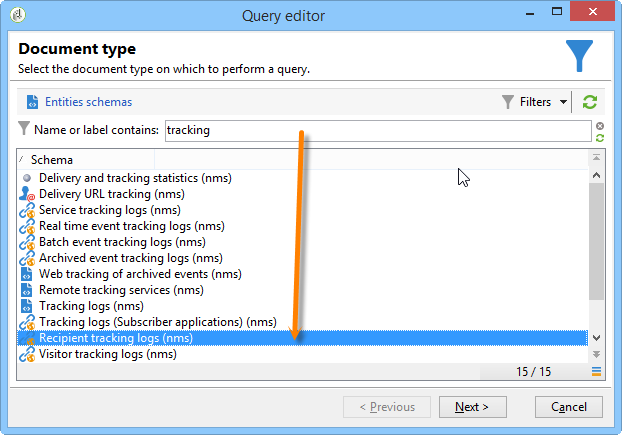

1. In the **[!UICONTROL Data to extract]** window, we want to create an aggregate to collect information. To do this, add the primary key (located above the main **[!UICONTROL Recipient tracking logs]** element): Tracking log count is carried out on this **[!UICONTROL Primary key]** field. The edited expression will be **[!UICONTROL x=count(primary key)]**. It links the sum of various tracking logs to a single email address.

   To do this:

    * Click the **[!UICONTROL Add]** icon to the right of the **[!UICONTROL Output columns]** field. In the **[!UICONTROL Formula type]** window, select the **[!UICONTROL Edit the formula using an expression]** option and click **[!UICONTROL Next]**. In the **[!UICONTROL Field to select]** window, click **[!UICONTROL Advanced selection]**.
    
      

    * In the **[!UICONTROL Formula type]** window, run a process on the aggregate function. This process will be a primary key count.

      Select **[!UICONTROL Process on an aggregate function]** in the **[!UICONTROL Aggregate]** section and click **[!UICONTROL Count]**.
    
      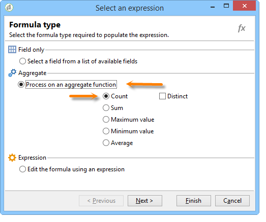

      Click **[!UICONTROL Next]**.
    
    * Select the **[!UICONTROL Primary key (@id)]** field. The **[!UICONTROL count (primary key)]** output column is configured.
    
      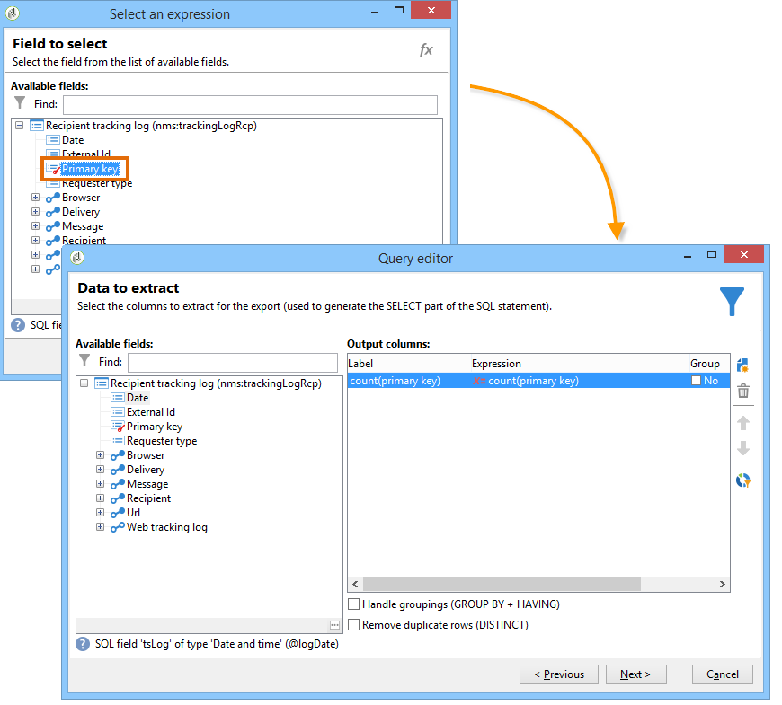

1. Select the other field to be displayed in the output column. In the **[!UICONTROL Available fields]** column, open the **[!UICONTROL Recipient]** node and choose **[!UICONTROL Email]**. Check the **[!UICONTROL Group]** box to **[!UICONTROL Yes]** to group the tracking logs by email address: this group links each log to its recipient.

   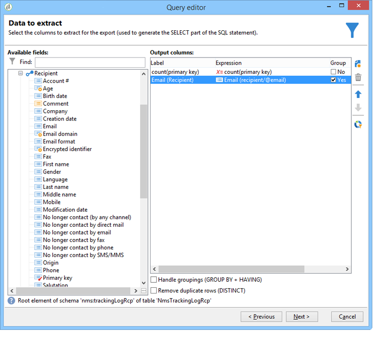

1. Configure column sorting so that the most active recipients (with the most tracking logs) are displayed first. Check **[!UICONTROL Yes]** in the **[!UICONTROL Descending sort]** column.

   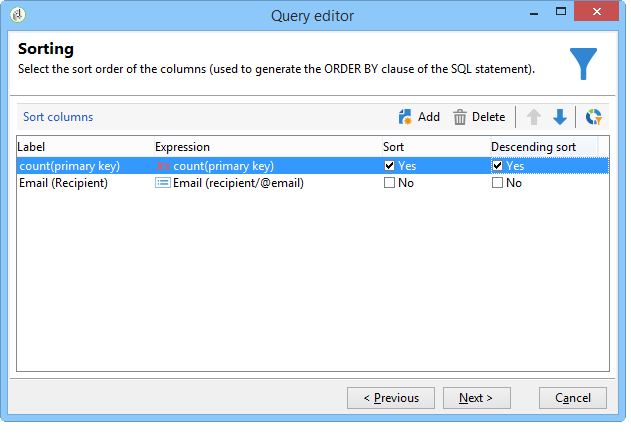

1. You must then filter the logs which interest you, i.e. those which are under 2 weeks old and which concern sales-related deliveries.

   To do this:

    * Configure data filtering. To do this, select **[!UICONTROL Filter conditions]** then click **[!UICONTROL Next]**.
    
      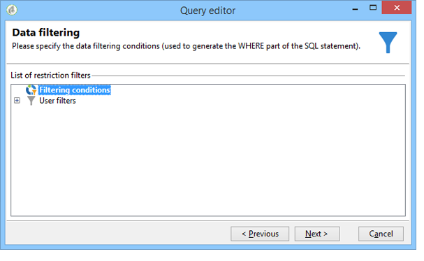

    * Recover tracking logs over a given period for a specific delivery. Three filtering conditions are necessary: two date conditions to set the search period between 2 weeks before the current date and the day before the current date; and another condition to restrict the search to a specific delivery.

      In the **[!UICONTROL Target element]** window, configure the date starting from which tracking logs will be taken into account. Click **[!UICONTROL Add]**. A condition line is displayed. Edit the **[!UICONTROL Expression]** column by clicking the **[!UICONTROL Edit expression]** function. In the **[!UICONTROL Field to select]** window, choose **[!UICONTROL Date (@logDate)]**.
    
      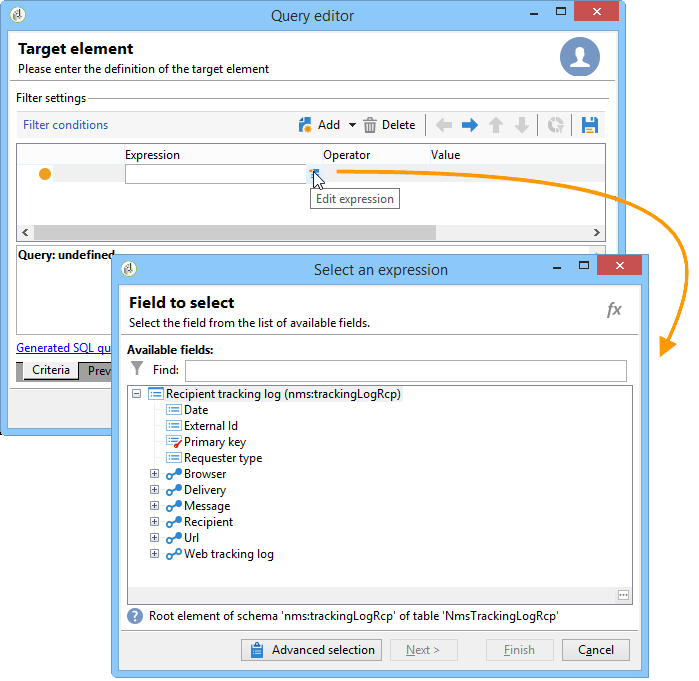

      Select the **[!UICONTROL greater than]** operator. In the **[!UICONTROL Value]** column, click **[!UICONTROL Edit expression]**, and in the **[!UICONTROL Formula type]** window, select **[!UICONTROL Process on dates]**. Finally, in **[!UICONTROL Current date minus n days]**, enter "15".

      Click **[!UICONTROL Finish]**.
    
      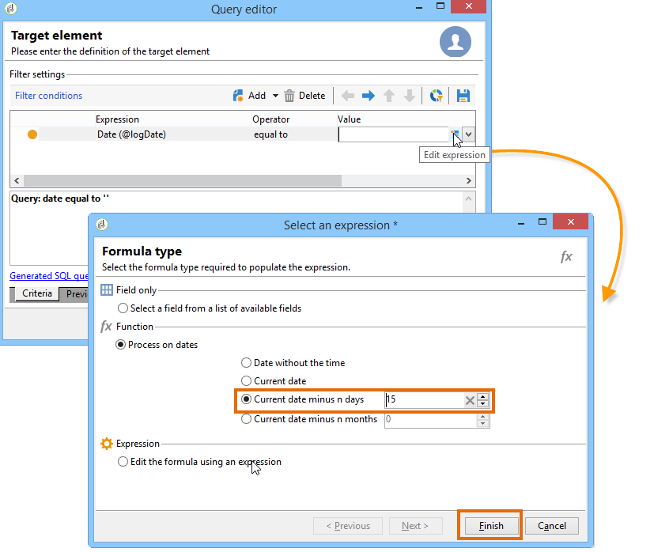

    * To select the tracking log search end date, create a second condition by clicking **[!UICONTROL Add]**. In the **[!UICONTROL Expression]** column, choose **[!UICONTROL Date (@logDate)]** again.

      Select the **[!UICONTROL less than]** operator. In the **[!UICONTROL Value]** column, click **[!UICONTROL Edit expression]**. For date processing, go to the **[!UICONTROL Formula type]** window, enter "1" in **[!UICONTROL Current date minus n days]**.

      Click **[!UICONTROL Finish]**.
    
      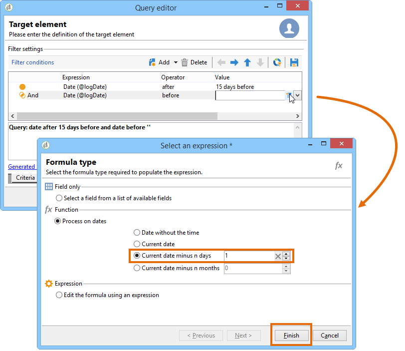

      Now we want to configure the third filter condition, i.e. the delivery label which our query concerns.
    
    * Click the **[!UICONTROL Add]** function to create another filtering condition. In the **[!UICONTROL Expression]** column, click **[!UICONTROL Edit expression]**. In the **[!UICONTROL Field to select]** window, choose **[!UICONTROL Label]** in the **[!UICONTROL Delivery]** node.

      Click **[!UICONTROL Finish]**.
    
      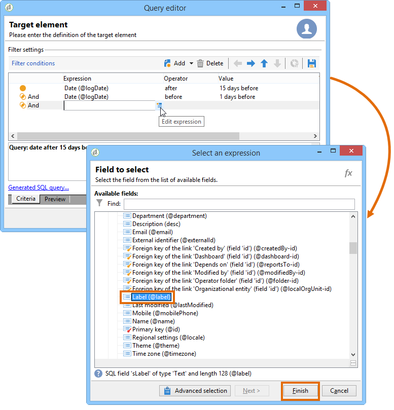

      Look for a delivery containing the word "sales". Since you don't remember its exact label, you can choose the **[!UICONTROL contains]** operator and enter "sales" in the **[!UICONTROL Value]** column.
    
      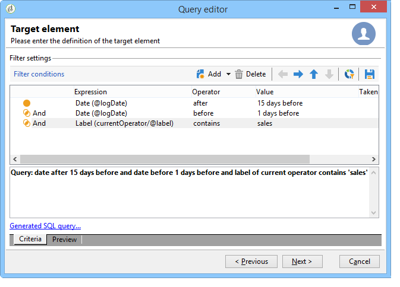

1. Click **[!UICONTROL Next]** until you get to the **[!UICONTROL Data preview]** window: no formatting is necessary here.
1. In the **[!UICONTROL Data preview]** window, click **[!UICONTROL Start the preview of the data]** to see the number of tracking logs for each delivery recipient.

   The result is displayed in descending order.

   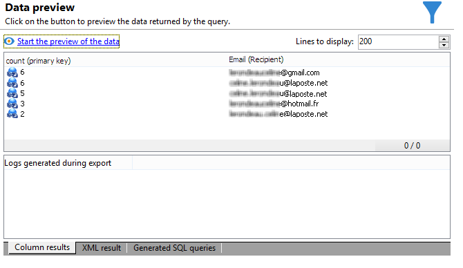

   The highest number of logs for a user is 6 for this delivery. 5 different users opened the delivery email or clicked one of the links in the email.

## Recipients who did not open any delivery {#recipients-who-did-not-open-any-delivery}

In this example, we want to filter recipients who didn't open an email in the last 7 days.

To create this example, apply the following steps:

1. Drag and drop a **[!UICONTROL Query]** activity in a workflow and open the activity.
1. Click **[!UICONTROL Edit query]** and set the target and filtering dimensions to **[!UICONTROL Recipients]**.

   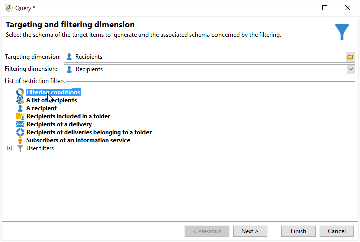

1. Select **[!UICONTROL Filtering conditions]** then click **[!UICONTROL Next]**.
1. Click the **[!UICONTROL Add]** button and select **[!UICONTROL Tracking logs]**.
1. Set the **[!UICONTROL Operator]** of the **[!UICONTROL Tracking logs]** expression to **[!UICONTROL Do not exist such as]**.

   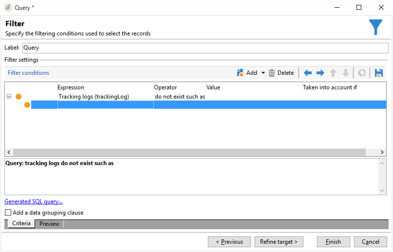

1. Add another expression. Select **[!UICONTROL Type]** in the **[!UICONTROL URL]** category.
1. Then, set its **[!UICONTROL Operator]** to **[!UICONTROL equal to]** and its **[!UICONTROL Value]** to **[!UICONTROL Open]**.

   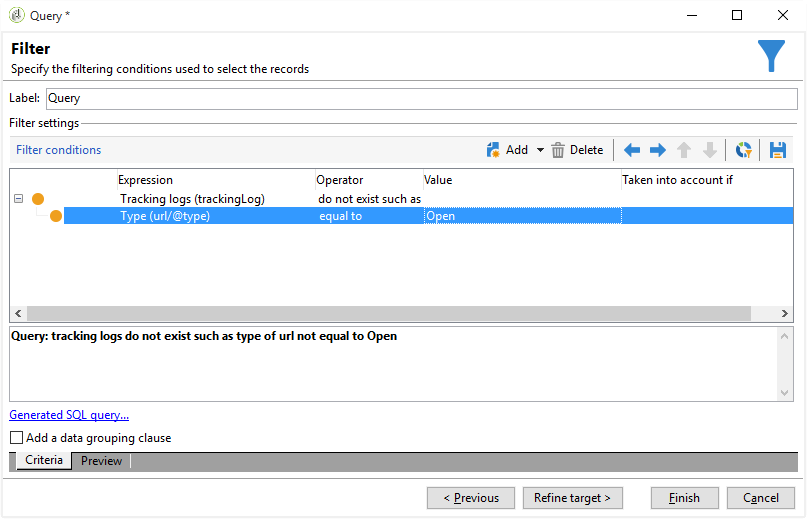

1. Add another expression and select **[!UICONTROL Date]**. **[!UICONTROL Operator]** should be set to **[!UICONTROL on or after]**.

   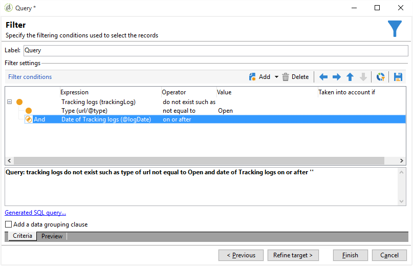

1. To set the value last 7 days, click the **[!UICONTROL Edit expression]** button in the **[!UICONTROL Value]** field.
1. In the **[!UICONTROL Function]** category, select **[!UICONTROL Current date minus n days]** and add the number of days you want to target. Here, we want to target the last 7 days.

   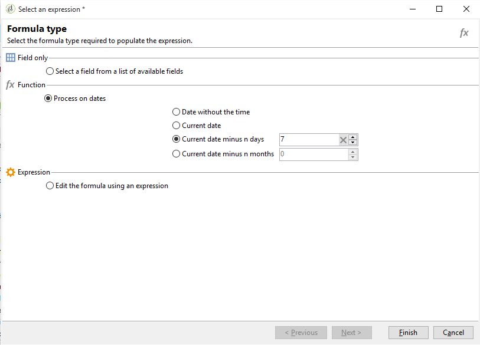

Your outbound transition will contain recipients who didn't open an email in the last 7 days.

If, on the opposite, you want to filter recipients who opened at least one email your query should be as follows. Please note that, in this case, the **[!UICONTROL Filtering dimension]** shoud be set to **[!UICONTROL Tracking logs (Recipients)]**.

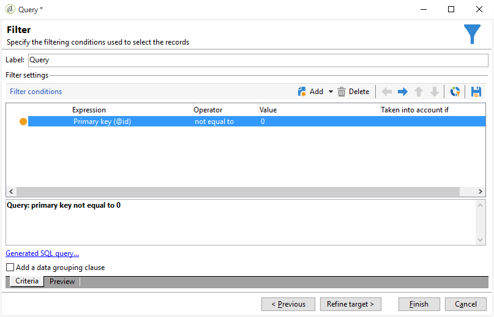

## Recipients who have opened a delivery {#recipients-who-have-opened-a-delivery}

The following example shows how to target profiles who have opened a delivery within the last 2 weeks:

1. To target profiles having opened a delivery, you need to use tracking logs. they are stored in a linked table: start by selecting this table in the drop-down list of the **[!UICONTROL Filtering dimension]** field, as shown below:

   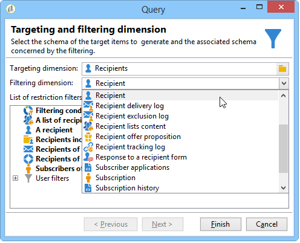

1. Concerning filtering conditions, click the **[!UICONTROL Edit expression]** icon of the criteria shown in the sub-tree structure of the tracking logs. Select the **[!UICONTROL Date]** field.

   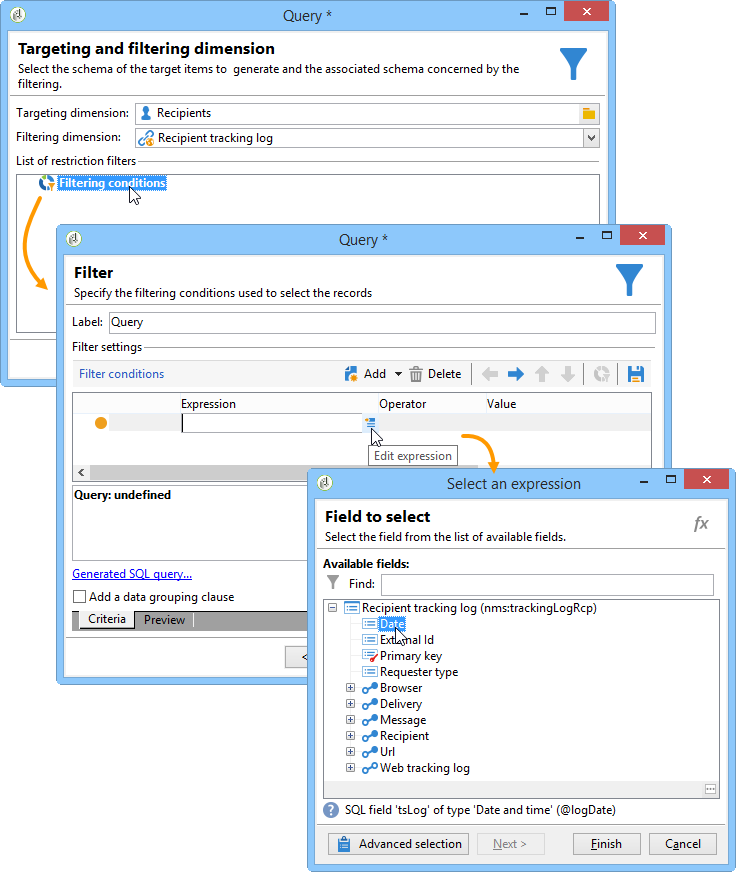

   Click **[!UICONTROL Finish]** to confirm selection.

   In order to recover only the tracking logs less than two weeks old, select the **[!UICONTROL Greater than]** operator.

   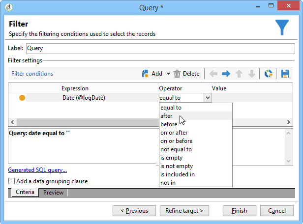

   Then click the **[!UICONTROL Edit expression]** icon in the **[!UICONTROL Value]** column to define the calculation formula to be applied. Select the **[!UICONTROL Current date minus n days]** formula and enter 15 in the related field.

   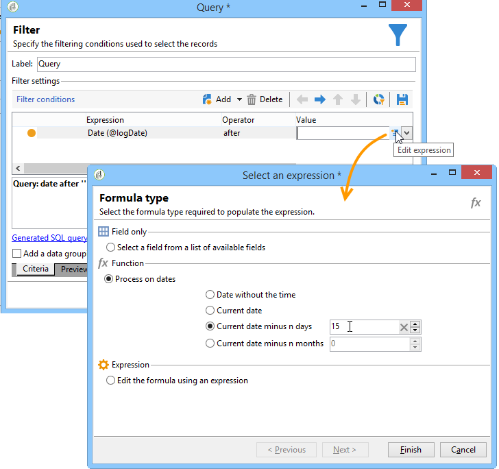

   Click the **[!UICONTROL Finish]** button of the formula window. In the filtering window, click the **[!UICONTROL Preview]** tab to check targeting criteria.

   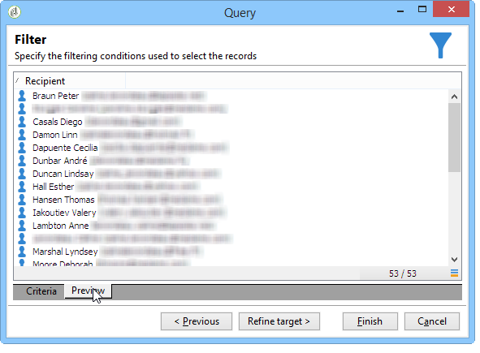

## Filtering recipients' behavior folllowing a delivery {#filtering-recipients--behavior-folllowing-a-delivery}

In a workflow, the **[!UICONTROL Query]** and **[!UICONTROL Split]** boxes let you select a behavior following a previous delivery. This selection is carried out via the **[!UICONTROL Delivery recipient]** filter.

* Aim of the example

  In a delivery workflow, there are several ways of following up a first email communication. This type of operation involves using the **[!UICONTROL Split]** box.

* Context

  A "Summer sports offer" delivery is sent. Four days after the delivery, two other deliveries are sent. One of them is "watersports offer", the other is a follow-up to the first "Summer sports offer" delivery.

  The "Watersports offer" delivery is sent to recipients who clicked the "watersports" link in the first delivery. These clicks show that the recipient is interested in the topic. It makes sense to steer them towards similar offers. However, recipients who did not click in the "Summer sports offer" will receive the same content again.

The following steps show you how to configure the **[!UICONTROL Split]** box by integrating two different behaviors:

1. Insert the **[!UICONTROL Split]** box into the workflow. This box will break down the recipients of the first delivery into the next two deliveries. Breakdown occurs based on the filtering conditions linked to recipient behavior during the first delivery.

   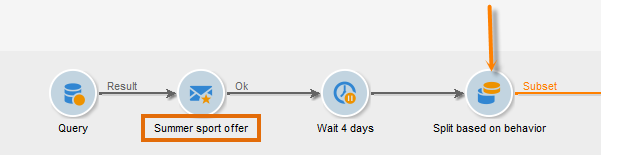

1. Open the **[!UICONTROL Split]** box. In the **[!UICONTROL General]** tab, enter a label: **Split based on behavior** for instance.

   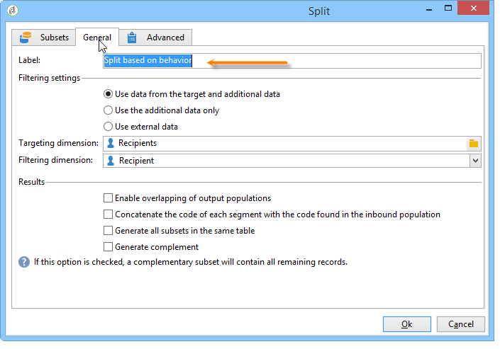

1. In the **[!UICONTROL Subsets]** tab, define the first split branch. For example, enter the **Clicked** label for this branch.
1. Select the **[!UICONTROL Add a filtering condition on the incoming population]** option. Click **[!UICONTROL Edit]**.
1. In the **[!UICONTROL Targeting and filtering dimension]** window, double-click the **[!UICONTROL Recipients of a delivery]** filter.

   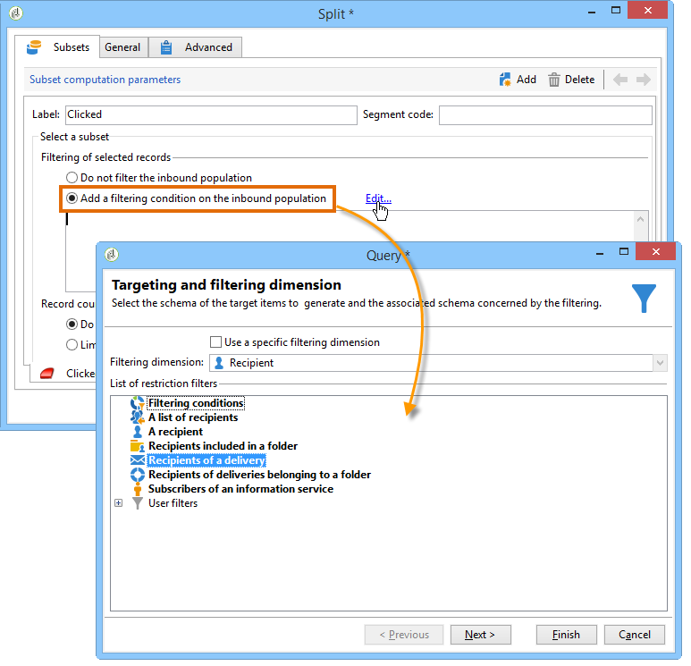

1. In the **[!UICONTROL Target element]** window, select the behavior you want to apply to this branch: **[!UICONTROL Recipients having clicked (email)]**.

   Below, select the **[!UICONTROL Delivery specified by the transition]** option. This functionality will automatically recover the people targeted during the first delivery.

   This is the "Watersports offer" delivery.

   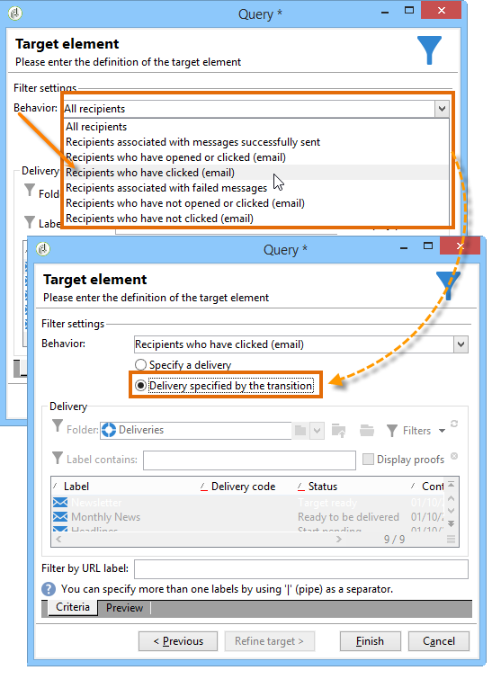

1. Define the second branch. This branch will include the follow-up email with the same content as for the first delivery. Go to the **[!UICONTROL Subsets]** tab and click **[!UICONTROL Add]** to create it.

   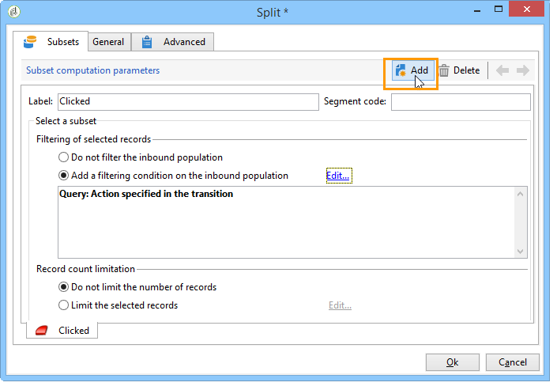

1. Another sub-tab is displayed. Name it "**Did not click**".
1. Click **[!UICONTROL Add a filtering condition for the incoming population]**. Then click **[!UICONTROL Edit...]**.

   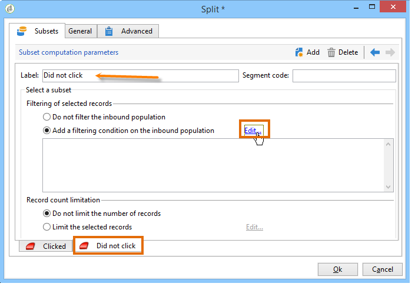

1. Click **[!UICONTROL Delivery recipients]** in the **[!UICONTROL Targeting and filtering dimension]** window. 
1. In the **[!UICONTROL Target element]** window, select the **[!UICONTROL Recipients who did not click (email)]** behavior. Select the **[!UICONTROL Delivery specified by the transition]** option as shown for the last branch.

   The **[!UICONTROL Split]** box is now fully configured.

   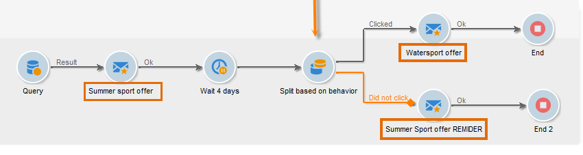

Below is the list of the various components configured by default:

* **[!UICONTROL All recipients]** 
* **[!UICONTROL Recipients of successfully sent messages,]** 
* **[!UICONTROL Recipients who opened or clicked (email),]** 
* **[!UICONTROL Recipients who clicked (email),]** 
* **[!UICONTROL Recipients of a failed message,]** 
* **[!UICONTROL Recipients who didn't open or click (email),]** 
* **[!UICONTROL Recipients who didn't click (email).]** 

  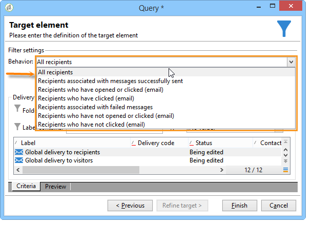
