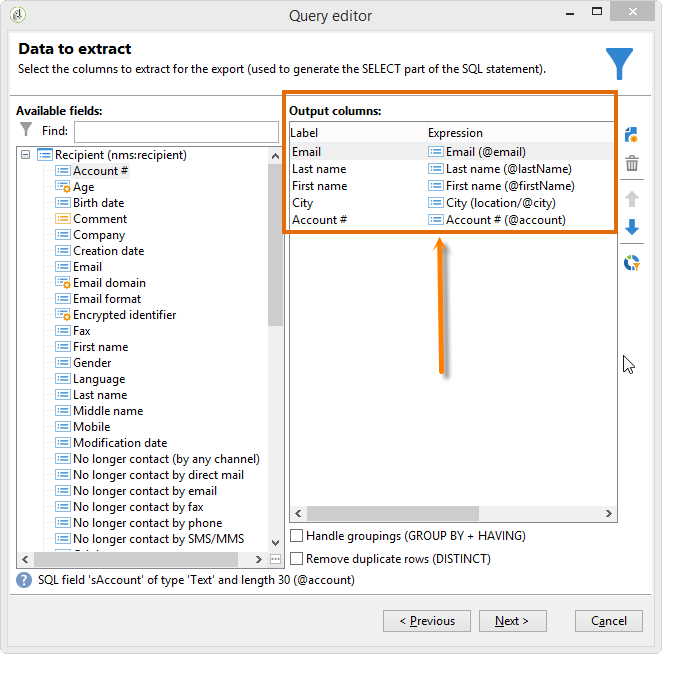
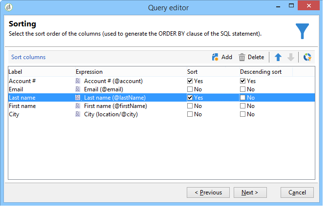
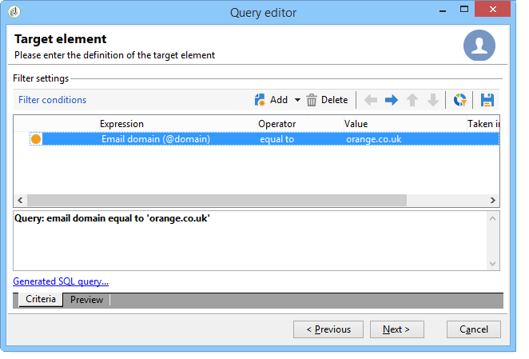
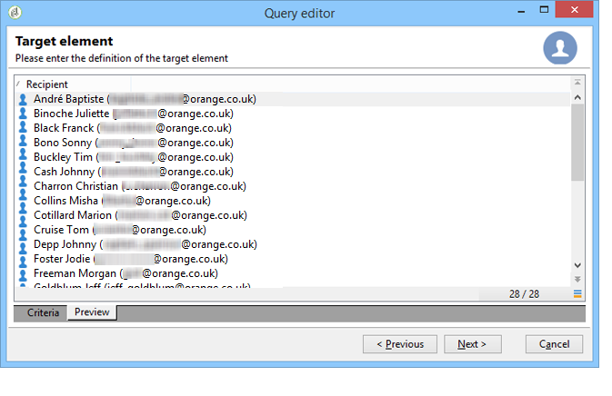
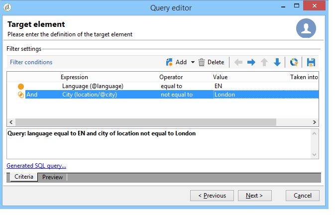
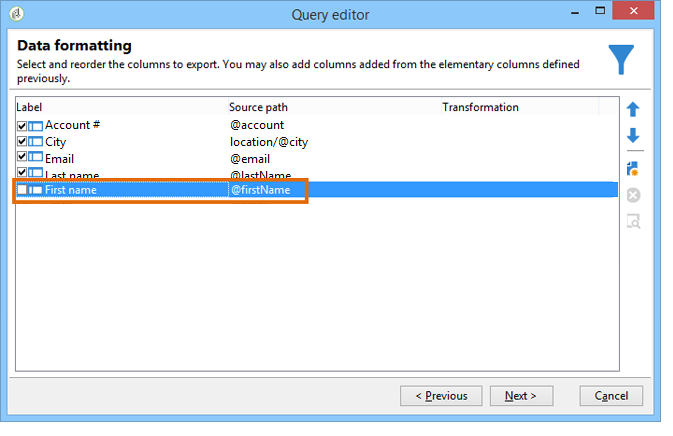
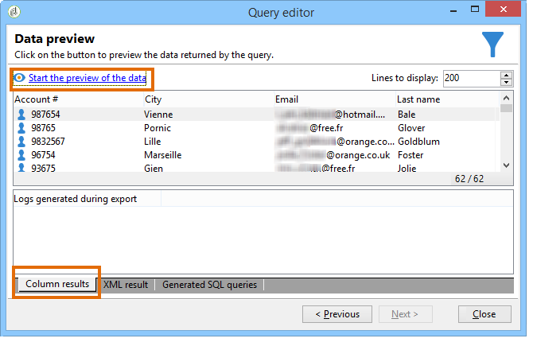
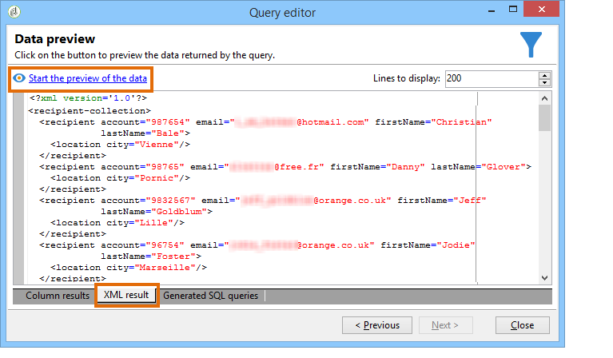
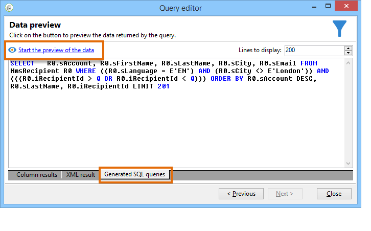

# Querying the recipient table {#querying-recipient-table}

In this example, we want to recover the names and emails of recipients whose email domain is "orange.co.uk" and who don't live in London.

* Which table should we select?

  The recipient table (nms:recipient)

* Fields to be selected as output columns

  Email, Name, City and Account number

* What are the filtering conditions of the recipients?

  city and email domain

* Is a sort configured?

  Yes, based on **[!UICONTROL Account number]** and **[!UICONTROL Last name]**

To create this example, apply the following steps:

1. Click **[!UICONTROL Tools > Generic query editor...]** and choose the **Recipients** (**nms:recipient**) table. Then click **[!UICONTROL Next]**.
1. Choose: **[!UICONTROL Last name]**, **[!UICONTROL First name]**, **[!UICONTROL Email]**, **[!UICONTROL City]** and **[!UICONTROL Account number]**. These fields are added to **[!UICONTROL Output columns]**. Then click **[!UICONTROL Next]**.

   

1. Sort the columns to display them in the right order. Here we want to sort account numbers in descending order and names in alphabetical order. Then click **[!UICONTROL Next]**.

   

1. In the **[!UICONTROL Data filtering]** window, refine your search: choose **[!UICONTROL Filtering conditions]** and click **[!UICONTROL Next]**.
1. The **[!UICONTROL Target element]** window lets you enter the filter settings.

   Define the following filter condition: recipients with an email domain equal to "orange.co.uk". To do this, choose **Email domain (@email)** in the **[!UICONTROL Expression]** column, choose **equal to** in the **[!UICONTROL Operator]** column and enter "orange.co.uk" in the **[!UICONTROL Value]** column.

   

1. If needed, click the **[!UICONTROL Distribution of values]** button to view a distribution based on the email domain of prospects. A percentage is available for each email domain in the database. Domains other than "orange.co.uk" are displayed until the filter is applied.

   A summary of the query is displayed at the bottom of the window: **Email domain equal to 'orange.co.uk'**. 

1. Click the **[!UICONTROL Preview]** to get an idea of the query result: only "orange.co.uk" email domains are displayed.

   

1. We will now change the query to find contacts not living in London.

   Select **[!UICONTROL City (location/@city)]** in the **[!UICONTROL Expression]** column, **[!UICONTROL different from]** as an operator and enter **[!UICONTROL London]** in the **[!UICONTROL Value]** column.

   

1. This will take you to the **[!UICONTROL Data formatting]** window. Check the column order. Move the "City" column up under the "Account number" column.

   Uncheck the "First name" column to remove it from the list.

   

1. In the **[!UICONTROL Data preview]** window, click **[!UICONTROL Start the preview of the data]**. This function calculates the result of the query.

   The **[!UICONTROL Column results]** tab shows the query result in columns.

   The result shows all recipients with an "orange.co.uk" email domain who do not live in London. The "First name" column is not shown because it was unchecked during the previous stage. Account numbers are sorted in descending order.

   

   The **[!UICONTROL XML result]** tab shows the result in XML format.

   

   The **[!UICONTROL Generated QSL queries]** tab shows the query result in SQL format.

   
