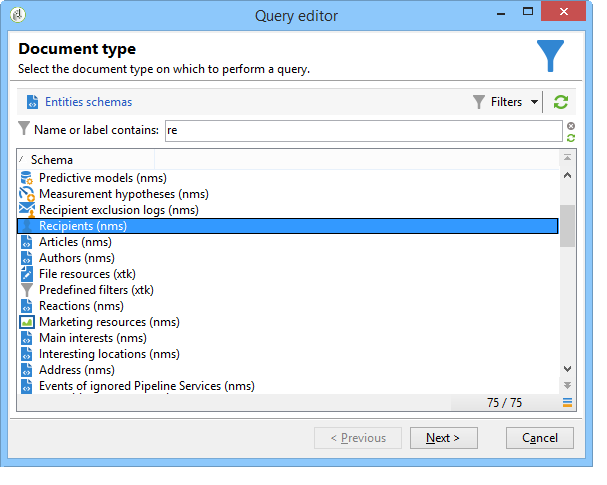
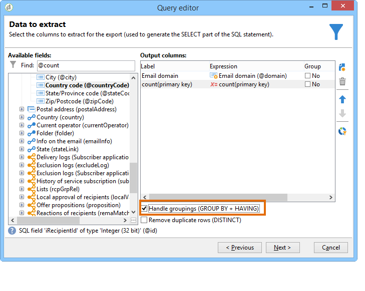
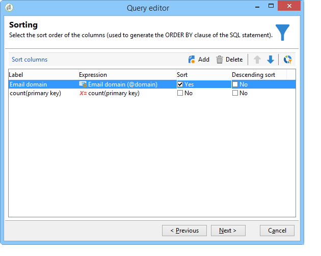
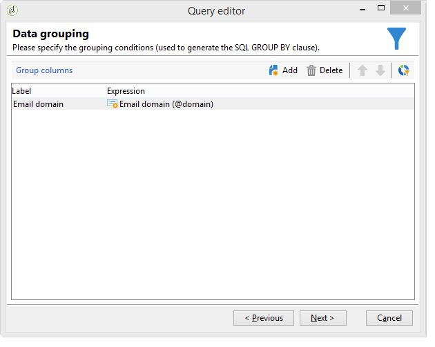
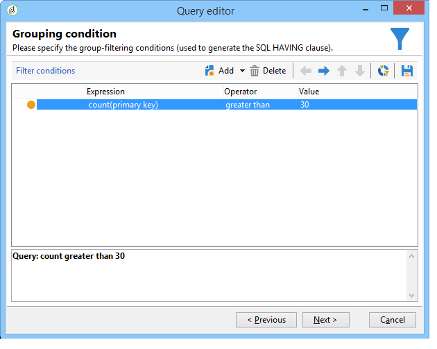
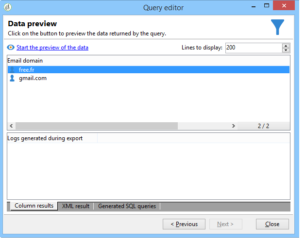

# Querying using grouping management {#querying-using-grouping-management}

In this example, we want to run a query to find all email domains targeted over 30 times during previous deliveries.

* Which table needs to be selected?

  The recipient table (nms:recipient)

* Fields to be selected in output columns?

  Email domain and primary key (with count)

* Data grouping?

  Based on email domain with a count of primary keys above 30. This operation is carried out with the **[!UICONTROL Group by + Having]** option. **[!UICONTROL Group by + Having]** lets you group data ("group by") and make a selection of what was grouped ("having").

To create this example, apply the following steps:

1. Open the **[!UICONTROL Generic query editor]** and choose the Recipient table (**nms:recipient**).

   

1. In the **[!UICONTROL Data to extract]** window, select the **[!UICONTROL Email domain]** and **[!UICONTROL Primary key]** fields. Run a count on the **[!UICONTROL Primary key]** field.

   For more on primary key counts, refer to [this section](../../platform/using/defining-filter-conditions.md#building-expressions).

1. Check the **[!UICONTROL Handle groupings (GROUP BY + HAVING)]** box.

   

1. In the **[!UICONTROL Sorting]** window, sort email domains in descending order. To do this, check **[!UICONTROL Yes]** in the **[!UICONTROL Descending sort]** column. Click **[!UICONTROL Next]**.

   

1. In **[!UICONTROL Data filtering]**, select **[!UICONTROL Filtering conditions]**. Go to the **[!UICONTROL Target elements]** window and click **[!UICONTROL Next]**.
1. In the **[!UICONTROL Data grouping]** window, select the **[!UICONTROL Email domain]** by clicking **[!UICONTROL Add]**.

   This data grouping window is only displayed if the **[!UICONTROL Handle groupings (GROUP BY + HAVING]**) box was checked.

   

1. In the **[!UICONTROL Grouping condition]** window, indicate a primary key count greater than 30 since we only want email domains targeted more than 30 times to be returned as results.

   This window appears when the **[!UICONTROL Manage groupings (GROUP BY + HAVING)]** box was checked: this is where the grouping result is filtered (HAVING).

   

1. In the **[!UICONTROL Data formatting]** window, click **[!UICONTROL Next]**: no formatting is necessary here.
1. In the data preview window, click **[!UICONTROL Launch data preview]**: here, three different email domains targeted over 30 times are returned.

   
