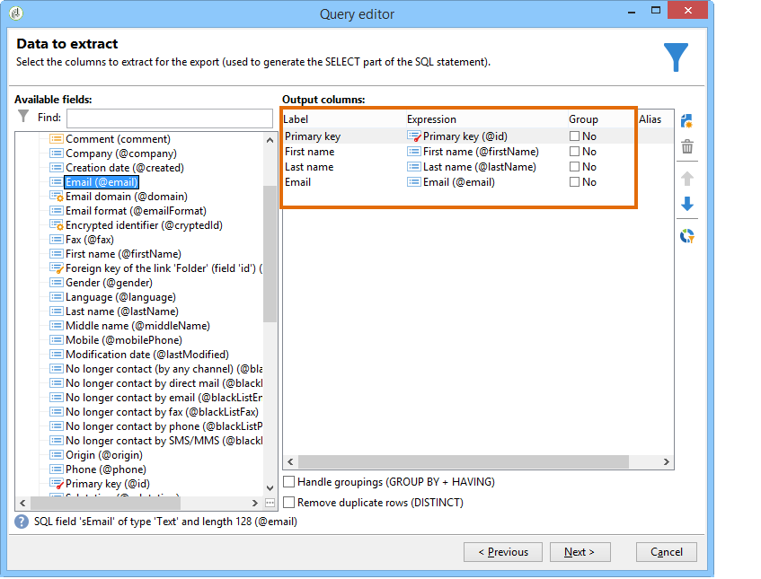
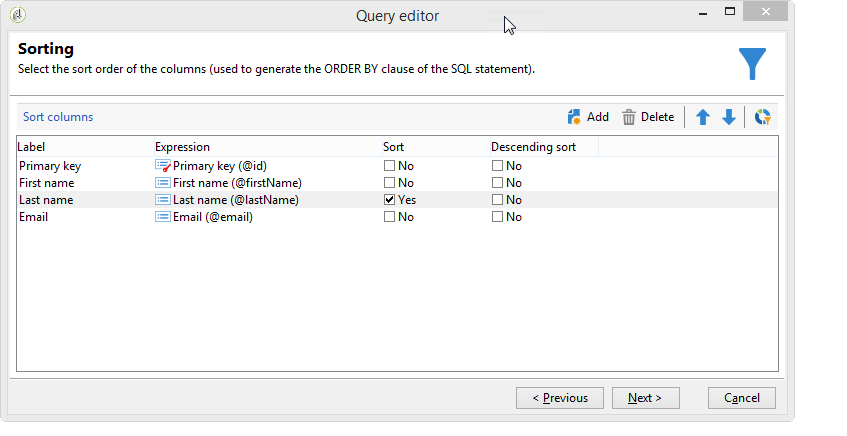
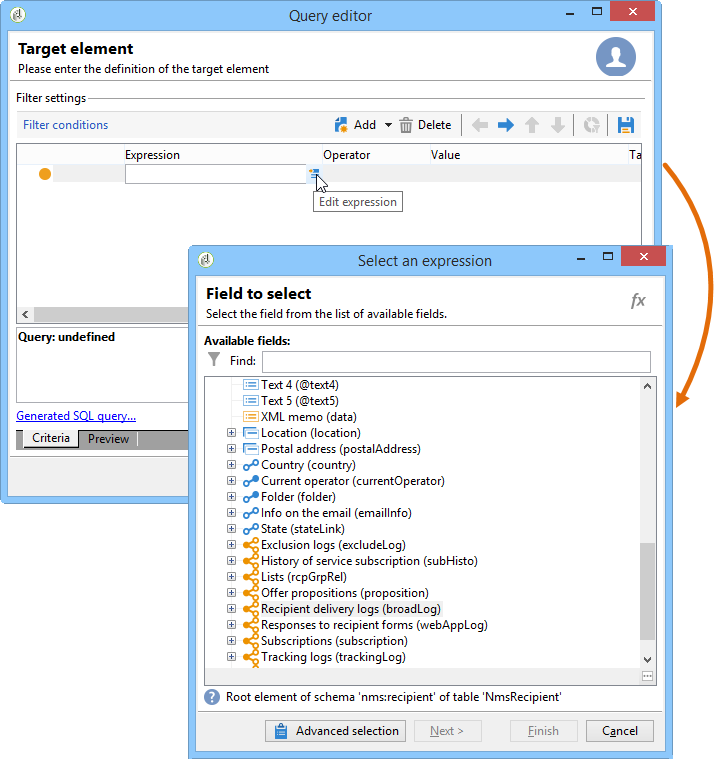
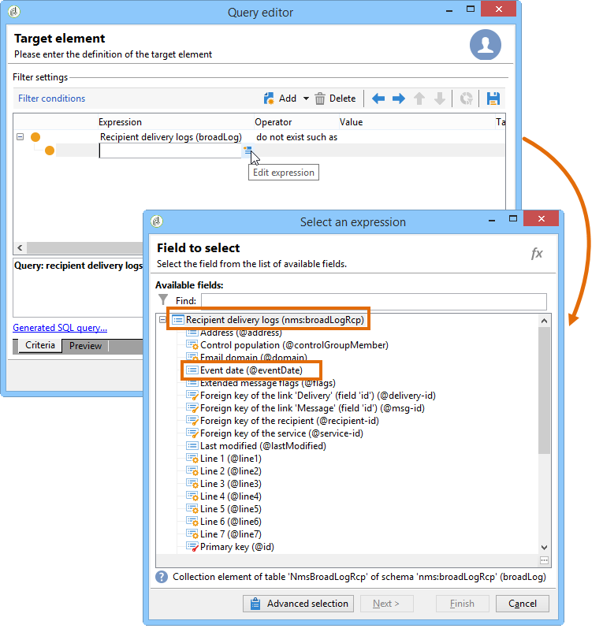
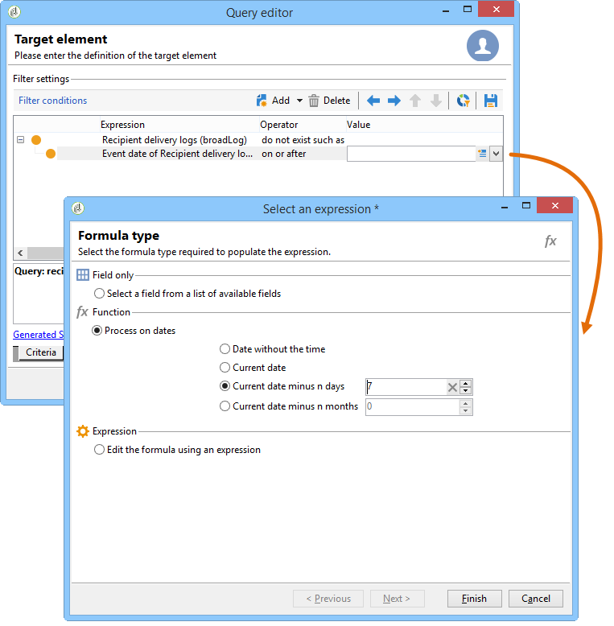
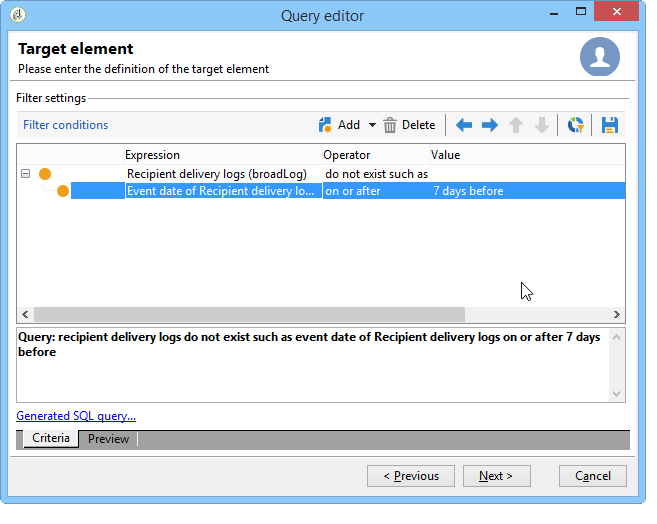
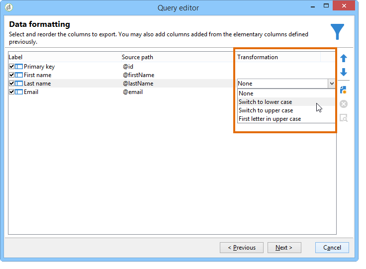
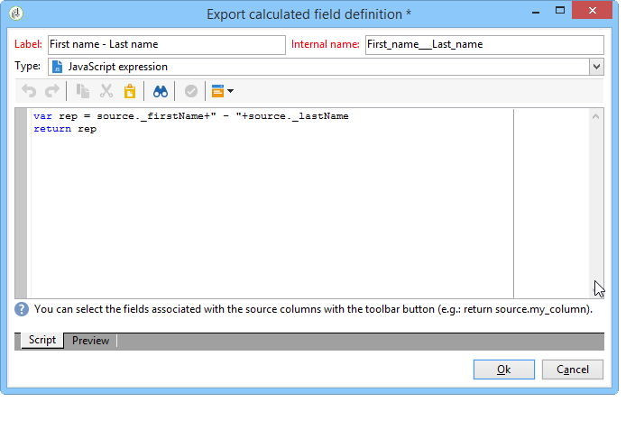
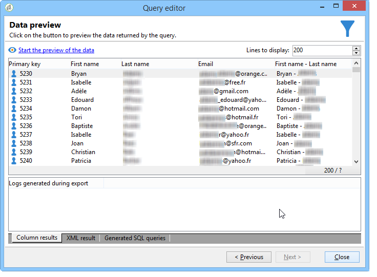

# Querying using a many-to-many relationship {#querying-using-a-many-to-many-relationship}

In this example, we want to recover recipients not contacted during the last 7 days. This query concerns all deliveries.

This example also shows how to configure a filter related to the choice of a collection element (or orange node). Collection elements are available in the **[!UICONTROL Field to select]** window.

* Which table needs to be selected?

  The recipient table (**nms:recipient**)

* Fields to be selected for the output column

  Primary key, Last name, First name and Email

* Based on which criteria is the information filtered

  Based on the delivery logs of recipients going back 7 days before today

Apply the following steps:

1. Open the Generic query editor and select the Recipient table **[!UICONTROL (nms:recipient)]**.
1. In the **[!UICONTROL Data to extract]** window, select **[!UICONTROL Primary key]**, **[!UICONTROL First name]**, **[!UICONTROL Last name]** and **[!UICONTROL Email]**.

   

1. In the sorting window, sort the names alphabetically.

   

1. In the **[!UICONTROL Data filtering]** window, select **[!UICONTROL Filtering conditions]**.
1. In the **[!UICONTROL Target element]** window, the filtering condition for extracting profiles with no tracking log for the last 7 days involves two steps. The element you need to select is a many-to-many link.

    * Start by selecting the **[!UICONTROL Recipient delivery logs (broadlog)]** collection element (orange node) for the first **[!UICONTROL Value]** column.
    
      

      Choose the **[!UICONTROL do not exist as]** operator. There is no need to select a second value in this line.
    
    * The content of the second filtering condition depends on the first. Here, the **[!UICONTROL Event date]** field is offered directly in the **[!UICONTROL Recipient delivery logs]** table since there is a link to this table.
    
      

      Select **[!UICONTROL Event date]** with the **[!UICONTROL greater than or equal to]** operator. Select the **[!UICONTROL DaysAgo (7)]** value. To do this, click **[!UICONTROL Edit expression]** in the **[!UICONTROL Value]** field. In the **[!UICONTROL Formula type]** window, select **[!UICONTROL Process on dates]** and **[!UICONTROL Current date minus n days]**, giving "7" as a value.
    
      

      The filter condition is configured.
    
      

1. In the **[!UICONTROL Data formatting]** window, switch the last names to upper-case. Click the **[!UICONTROL Last name]** line in the **[!UICONTROL Transformation]** column and select **[!UICONTROL Switch to upper case]** in the drop-down menu.

   

1. Use the **[!UICONTROL Add a calculated field]** function to insert a column into the data preview window.

   In this example, add a calculated field with the first and last names of the recipients in a single column. Click the **[!UICONTROL Add a calculated field]** function. In the **[!UICONTROL Export calculated field definition]** window, enter a label and an internal name and choose the **[!UICONTROL JavaScript Expression]** type. Then enter the following expression:

   ```
   var rep = source._firstName+" - "+source._lastName
   return rep
   ```

   

   Click **[!UICONTROL OK]**. The **[!UICONTROL Data formatting]** window is configured.

   For more on adding calculated fields, refer to this section.

1. The result is shown in the **[!UICONTROL Data preview]** window. Recipients which not have been contacted in the last 7 days are displayed in alphabetical order. Names are displayed in upper case and the column with first and last names has been created.

   
