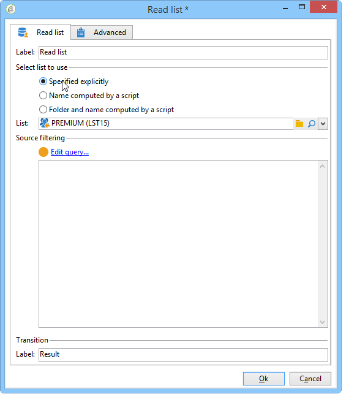
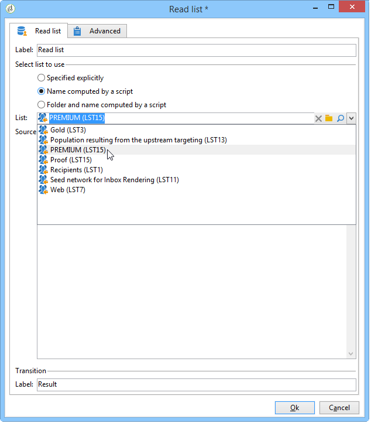
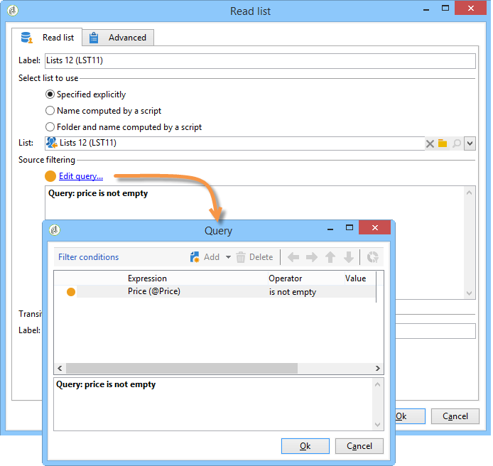
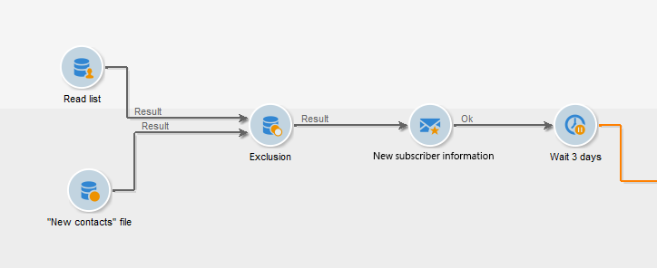
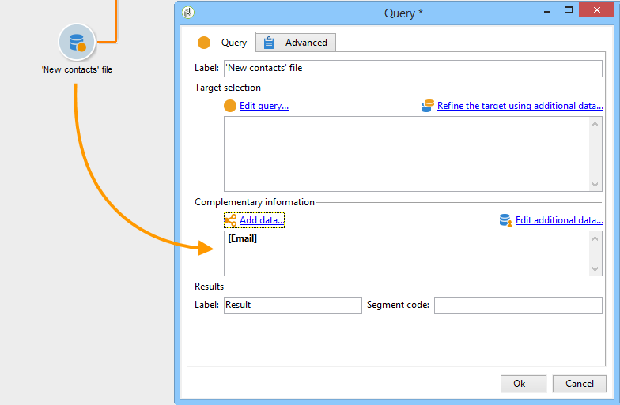
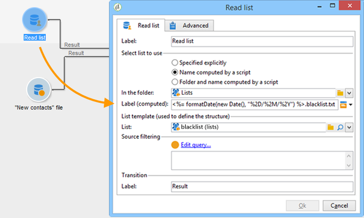
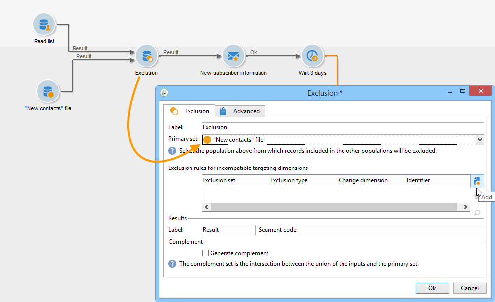
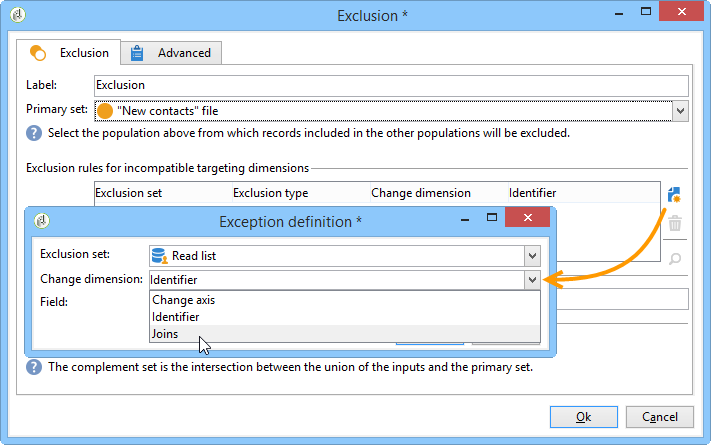

# Read list{#read-list}

Data processed in a workflow can come from lists whereby the data has been prepared or structured beforehand (after a previous segmentation or file upload).

The **Read list** activity lets you copy the data from a list in the workflow worktable, like data from a query. It is then accessible throughout the workflow.

The list to be processed can be specified explicitly, computed by a script or localized dynamically, according to options selected and parameters defined in a **Read list** activity.

If the list is not explicitly specified, you must provide a list to be used as a template to find out its structure.

Once the list selection has been configured, you can add a filter using the **Edit query** option to keep one part of the population for the next workflow.

>[!CAUTION]
>
>To be able to create a filter in a read list activity, the relevant list must be a "file" type.

The lists can be created directly in Adobe Campaign via the **Profiles and Targets > Lists** link of the home page. They can also be created in a workflow using the **List update** activity.

**Example: Exclude a list of send addresses**

The following example lets you use a list of email addresses to exclude from the email delivery target. 

The profiles contained in the **New Contacts** folder must be targeted by a delivery action. The email addresses to be excluded from the target are stored in an external list. In our example, only the information on email addresses is required for exclusion.

1. The **New Contacts** folder selection query must enable you to load the selected profiles' email addresses, in order to enable alignment with the information in the list.

   

1. Here, the list is stored in the **Lists** folder and its label is calculated.

   

1. In order to exclude the email addresses of the external list from the main target, you must configure the exclusion activity and specify that the **New Contacts** folder contains the data to be kept. The joint data between this set and any other inbound set from the exclusion activity will be deleted from the target.

   

   Exclusion rules are configured in the central section of the editing tool. Click the **Add** button to define the type of exclusion to be applied.

   You can define several exclusions depending on the number of incoming transitions of the activity.

1. In the **Exclusion set** field, select the **Read list** activity: the data in this activity is to be excluded from the main set.

   In our example, we have an exclusion on joins: the data contained in the list will be reconciled with the data of the main set via the field containing the email address. To configure the join, select **Joins** in the **Change dimension** field.

   

1. Then select the field corresponding to the email address in the two sets (Source and Destination). The columns will then be linked and the recipients whose email address is in the list of imported addresses will be excluded from the target.

