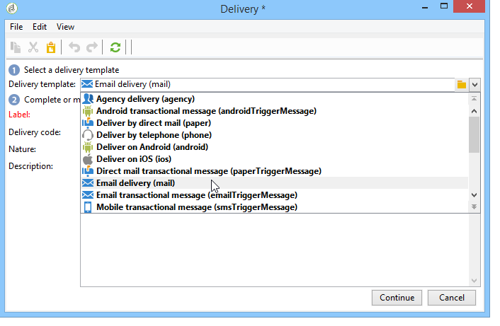

# Recurring delivery{#recurring-delivery}

A **Recurring delivery** activity lets you configure a delivery template occurrence that is specific to a campaign.

This activity is only available from the **Targeting and workflows** tab found in a campaign.

To do this:

1. Select the delivery template that the activity will be based on.

   

1. Configure the delivery template.

The configuration process for this activity is similar to that of creating a delivery template in terms of the options available. For more on this, refer to this [section](../../delivery/using/about-templates.md).

For an example of this activity being used, refer to this [section](../../campaign/using/setting-up-marketing-campaigns.md#creating-a-recurring-delivery-in-a-targeting-workflow).

>[!NOTE]
>
>It is not possible to send a proof from a **Recurring delivery** type activity.   
>To directly create a delivery via a campaign workflow, use the channel specific activities that are preconfigured (e.g. **Email delivery**).

