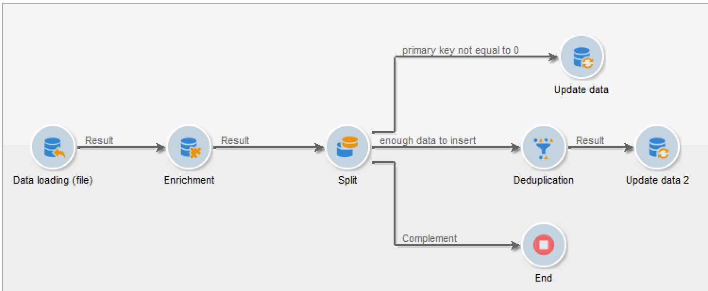
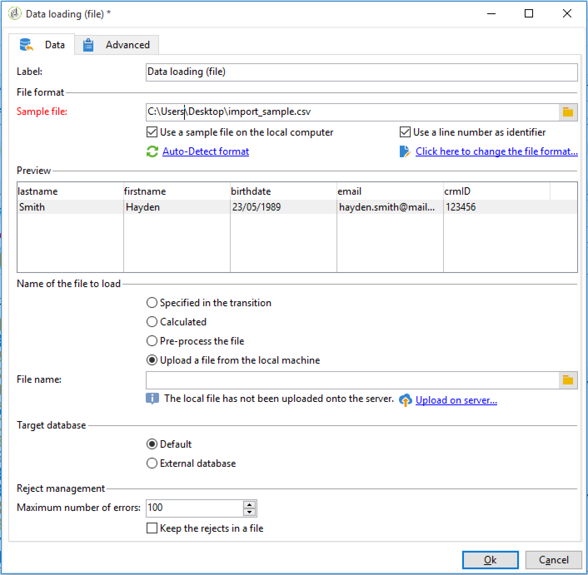
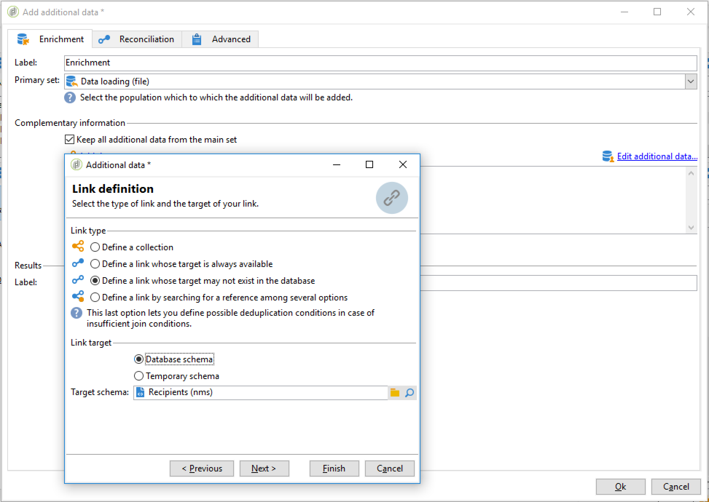
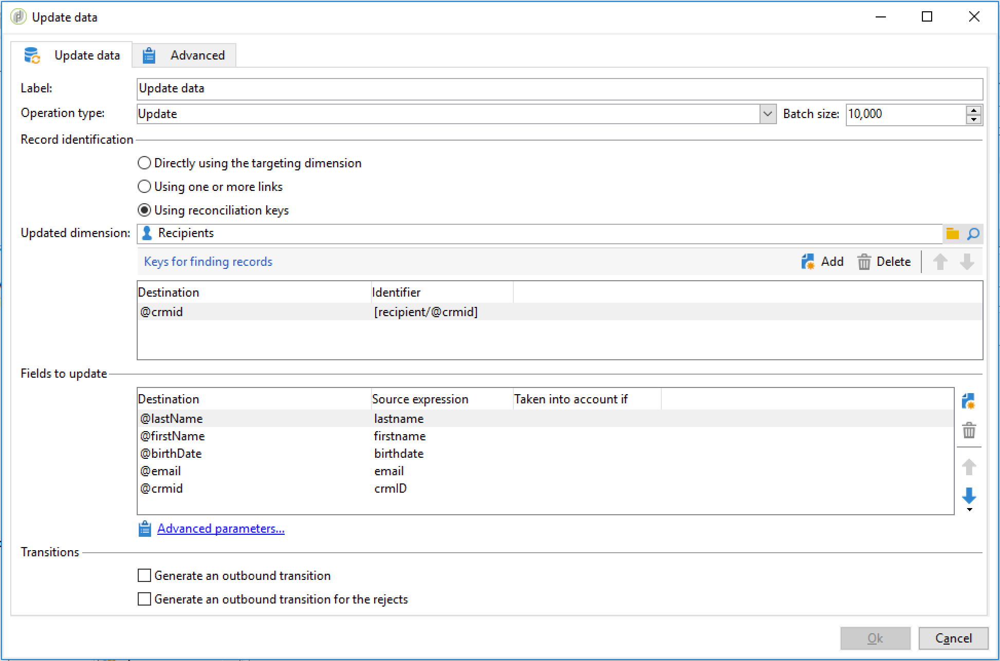
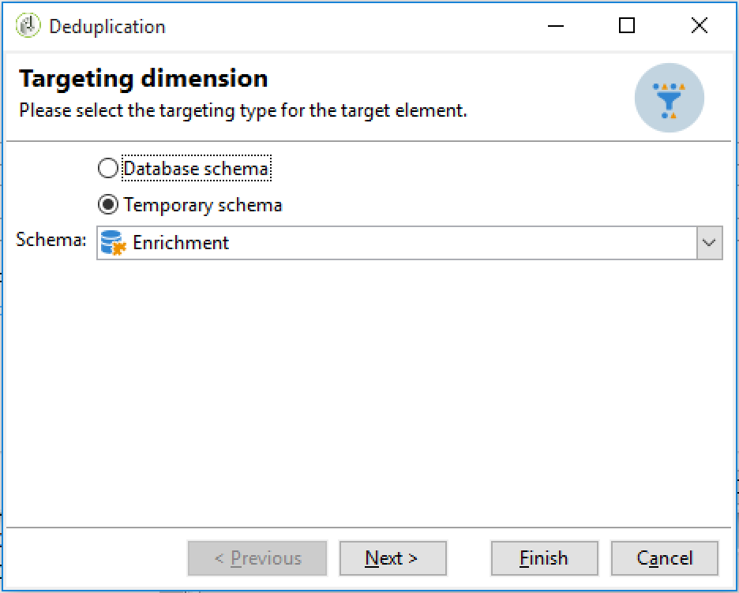
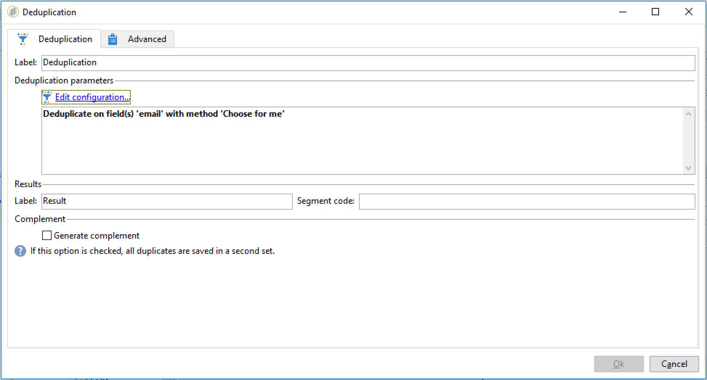

# Setting up a recurring import workflow {#setting-up-a-recurring-import}


Using a workflow template is a best practice if you need to regularly import files with the same structure.

This example shows how to pre-set a workflow that can be reused for importing profiles coming from a CRM in the Adobe Campaign database. For more information about all possible settings for each activity, refer to this [section](about-activities.md).

1. Create a new workflow template from **[!UICONTROL Resources > Templates > Workflow templates]**.
1. Add the following activities:

    * **[!UICONTROL Data loading (file)]**: Define the expected structure of the file containing the data to import.
    * **[!UICONTROL Enrichment]**: Reconcile the imported data with database data.
    * **[!UICONTROL Split]**: Create filters to process records differently depending on whether they could be reconciled or not.
    * **[!UICONTROL Deduplication]**: Deduplicate the data from the incoming file before it is inserted in the database.
    * **[!UICONTROL Update data]**: Update the database with the imported profiles.

   

1. Configure the **[!UICONTROL Data Loading (file)]** activity:

    * Define the expected structure by uploading a sample file. The sample file should contain only a few lines but all the columns necessary for the import. Check and edit the file format to make sure that the type of each column is set correctly: text, date, integer, etc. For example:

      ```    
      lastname;firstname;birthdate;email;crmID
      Smith;Hayden;23/05/1989;hayden.smith@mailtest.com;123456
      ```

    * In the **[!UICONTROL Name of the file to load]** section, select **[!UICONTROL Upload a file from the local machine]** and leave the field blank. Each time a new workflow is created from this template, you can specify here the file you want, as long at it corresponds to the defined structure.

      You can use any of the options but you have to modify the template accordingly. For example, if you select **[!UICONTROL Specified in the transition]**, you can add a **[!UICONTROL File Transfer]** activity before to retrieve the file to import from a FTP/SFTP server. With S3 or SFTP connection, you can also import segment data to Adobe Campaign with Adobe Real-time Customer Data platform. For more on this, refer to this [documentation](https://experienceleague.adobe.com/docs/experience-platform/destinations/catalog/email-marketing/adobe-campaign.html).
    
      

1. Configure the **[!UICONTROL Enrichment]** activity. The purpose of this activity in this context is to identify the incoming data.

    * In the **[!UICONTROL Enrichment]** tab, select **[!UICONTROL Add data]** and define a link between the imported data and the recipients targeting dimension. In this example, the **CRM ID** custom field is used to create the join condition. Use the field or combination of fields you need as long it allows to identify unique records.
    * In the **[!UICONTROL Reconciliation]** tab, leave the **[!UICONTROL Identify the document from the working data]** option unchecked.

   

1. Configure the **[!UICONTROL Split]** activity to retrieve reconciled recipients in one transition and recipients that could not be reconciled but who have enough data in a second transition.

   The transition with reconciled recipients can then be used to update the database. The transition with unknown recipients can then be used to create new recipient entries in the database if a minimum set of information is available in the file.

   Recipients that cannot be reconciled and do not have enough data are selected in a complement outbound transition and can be exported in a separate file or simply ignored.

    * In the **[!UICONTROL General]** tab of the activity, select **[!UICONTROL Use the additional data only]** as filtering setting and make sure that the **[!UICONTROL Targeting dimension]** is automatically set to **[!UICONTROL Enrichment]**.

      Check the **[!UICONTROL Generate complement]** option to be able to see if any record cannot be inserted in the database. If you need, you can then apply further processing to the complementary data: file export, list update, etc.
    
    * In the first subset of the **[!UICONTROL Subsets]** tab, add a filtering condition on the inbound population to select only records for which the recipient primary key is not equal to 0. This way, data from the file that are reconciled with recipients from the database are selected in that subset.
    
      

    * Add a second subset that selects unreconciled records that have enough data to be inserted in the database. For example: email address, first name and last name.

      Subsets are processed in their creation order, meaning that when this second subset is processed, all records that already exist in the database are already selected in the first subset.
    
      

    * All records that are not selected in the first two subsets are selected in the **[!UICONTROL Complement]**.

1. Configure the **[!UICONTROL Update data]** activity located after the first outbound transition of the **[!UICONTROL Split]** activity configured previously.

    * Select **[!UICONTROL Update]** as **[!UICONTROL Operation type]** since the inbound transition only contains recipients already present in the database.
    * In the **[!UICONTROL Record identification]** section, select **[!UICONTROL Using reconciliation keys]** and define a key between the targeting dimension and the link created in the **[!UICONTROL Enrichment]**. In this example, the **CRM ID** custom field is used.
    * In the **[!UICONTROL Fields to update]** section, indicate the fields from the recipients dimension to update with the value of the corresponding column from the file. If the names of the file columns are identical or almost identical to the names of the recipients dimension fields, you can use the magic wand button to automatically match the different fields.
    
      

1. Configure the **[!UICONTROL Deduplication]** activity located after the transition containing unreconciled recipients:

    * Select **[!UICONTROL Edit configuration]** and set the targeting dimension to the temporary schema generated from the **[!UICONTROL Enrichment]** activity of the workflow.
    
      

    * In this is example, the email field is used to find unique profiles. You can use any field you are sure is filled and part of a unique combination.
    * In the **[!UICONTROL Deduplication method]** screen, select **[!UICONTROL Advanced parameters]** and check the **[!UICONTROL Disable automatic filtering of 0 ID records]** option to make sure records that have a primary key equal to 0 (which should be all records of this transition) are not excluded.

   

1. Configure the **[!UICONTROL Update data]** activity located after the **[!UICONTROL Deduplication]** activity configured previously.

    * Select **[!UICONTROL Insert]** as **[!UICONTROL Operation type]** since the inbound transition only contains recipients not present in the database.
    * In the **[!UICONTROL Record identification]** section, select **[!UICONTROL Directly using the targeting dimension]** and choose the **[!UICONTROL Recipients]** dimension.
    * In the **[!UICONTROL Fields to update]** section, indicate the fields from the recipients dimension to update with the value of the corresponding column from the file. If the names of the file columns are identical or almost identical to the names of the recipients dimension fields, you can use the magic wand button to automatically match the different fields.
    
      

1. After the third transition of the **[!UICONTROL Split]** activity, add a **[!UICONTROL Data extraction (file)]** activity and a **[!UICONTROL File transfer]** activity if you want to keep track of data not inserted in the database. Configure those activities to export the column you need and to transfer the file on a FTP or SFTP server where you can retrieve it.
1. Add an **[!UICONTROL End]** activity and save the workflow template.

The template can now be used and is available for every new workflow. All is needed is then to specify the file containing the data to import in the **[!UICONTROL Data loading (file)]** activity.


