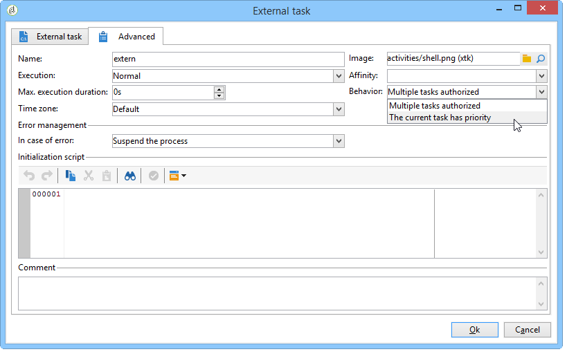

# Scheduler{#scheduler}

The **Scheduler** is a persistent task that activates its transition at the times specified by its schedule.

The **[!UICONTROL Scheduler]** activity should be considered as a scheduled start. The activity positioning rules within the chart are the same as for the **[!UICONTROL Start]** activity. This activity must not have an inbound transition.

It is a best practice not to schedule a workflow to run more than every 15 minutes because it may impede overall system performance and create blocks in the database.

When building your workflow, never use more than one **[!UICONTROL Scheduler]** activity per branch. For more on this, refer to: [Using activities](../../workflow/using/workflow-best-practices.md#using-activities).

The scheduler defines the activation schedule of the transition. To configure it, double-click the graphical object, then click **[!UICONTROL Change...]** 

A wizard lets you define the frequency and validity period of the activity. The configuration steps are as follows:

1. Select the activation frequency and click **[!UICONTROL Next]**.

   

1. Give the activation times and days. The parameters for this step depend on the frequency selected in the previous step. If you choose to launch the activity several times a day, the configuration options will be as follows:

   

1. Define the validity period of the schedule, or specify how many times it will be executed.

   

1. Check the configuration and click **[!UICONTROL Finish]** to save.

   

It is important to configure the frequency of the scheduler and certain parameters of the following activities, because the scheduler can generate cascading tasks. For example, the scheduler followed by an external command can re-execute the command even if it has not finished. To avoid this, modify the **[!UICONTROL Behavior]** field of the activities that have to be finished before a new execution by selecting the **[!UICONTROL The current task has priority]** option.

Note also that the transition can be activated several hours later if the workflow was executing a long-term task, such as an import, or if the wfserver module was stopped for a time. In this case, it may be necessary to restrict the execution of the task activated by the scheduler to a certain time range. 
