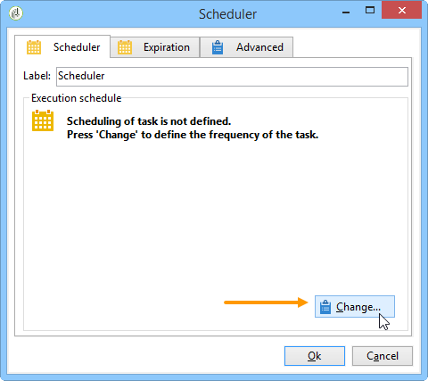
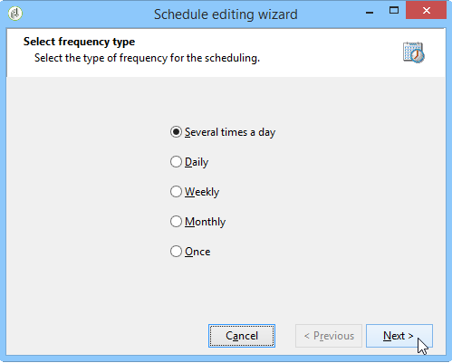
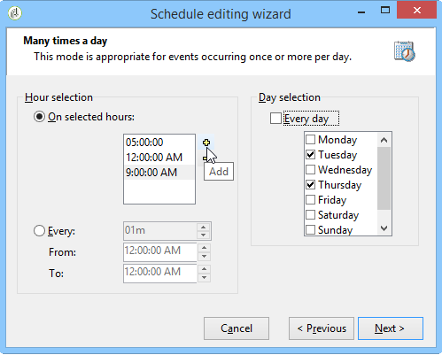
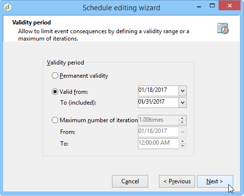
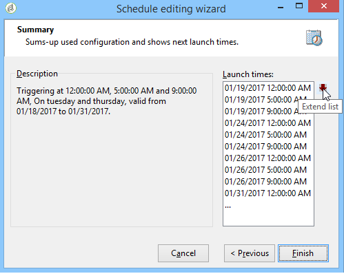

# Scheduler {#scheduler}

The **Scheduler** is a persistent task that activates its transition at the times specified by its schedule.

The **[!UICONTROL Scheduler]** activity should be considered as a scheduled start. The activity positioning rules within the chart are the same as for the **[!UICONTROL Start]** activity. This activity must not have an inbound transition.

## Best practices {#best-practices}

* Do not schedule a workflow to run more than every 15 minutes as it may impede overall system performance and create blocks in the database.

* Never use more than one **[!UICONTROL Scheduler]** activity per branch in a workflow. See [Using activities](workflow-best-practices.md#using-activities).

* Using a scheduler activity may lead to have several executions of a workflow running at the same time. For instance, you can have a scheduler triggering the workflow execution every hour, but sometimes the execution of the whole workflow takes more than an hour.

   You may want to skip the execution if the workflow is already running. For more on how to prevent simultaneous executions of a workflow, refer to [this page](monitoring-workflow-execution.md#preventing-simultaneous-multiple-executions).

* Note that the transition can be activated several hours later if the workflow was executing a long-term task, such as an import, or if the wfserver module was stopped for a time. In this case, it may be necessary to restrict the execution of the task activated by the scheduler to a certain time range.

## Configuring the Scheduler activity {#configuring-scheduler-activity}

The scheduler defines the activation schedule of the transition. To configure it, double-click the graphical object, then click **[!UICONTROL Change...]** 

A wizard lets you define the frequency and validity period of the activity. The configuration steps are as follows:

1. Select the activation frequency and click **[!UICONTROL Next]**.

   

1. Give the activation times and days. The parameters for this step depend on the frequency selected in the previous step. If you choose to launch the activity several times a day, the configuration options will be as follows:

   

1. Define the validity period of the schedule, or specify how many times it will be executed.

   

1. Check the configuration and click **[!UICONTROL Finish]** to save.

   
