# Sending a birthday email{#sending-a-birthday-email}


## Introduction {#introduction}

This use case presents how to plan sending a recurring email to a list of recipients on the day of their birthday.

To set up this use case, we created the following targeting workflow:

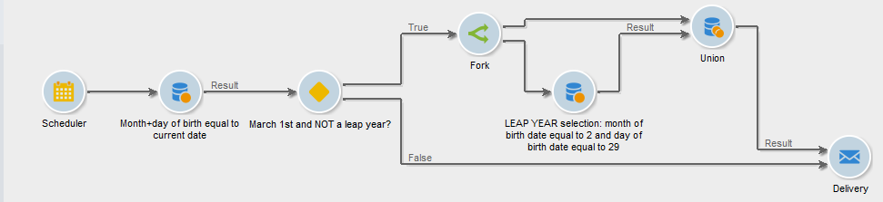

This (daily run) workflow selects all recipients that have their birthday on the current date.

 This use case can also be found in the form of a video. For more on this, refer to the [Creating a workflow](https://experienceleague.adobe.com/docs/campaign-classic-learn/tutorials/automating-with-workflows/creating-a-workflow.html) video.

To do this, create a campaign and click the **[!UICONTROL Targeting and workflows]** tab. For more on this, refer to the [Building the main target in a workflow](../../campaign/using/marketing-campaign-deliveries.md#building-the-main-target-in-a-workflow) section.

Then follow these steps:

## Scheduling the sending {#configuring-the-scheduler}

1. First, add a **Scheduler** to trigger sending the delivery every day. In the example below, the delivery is created every day at 6am.

   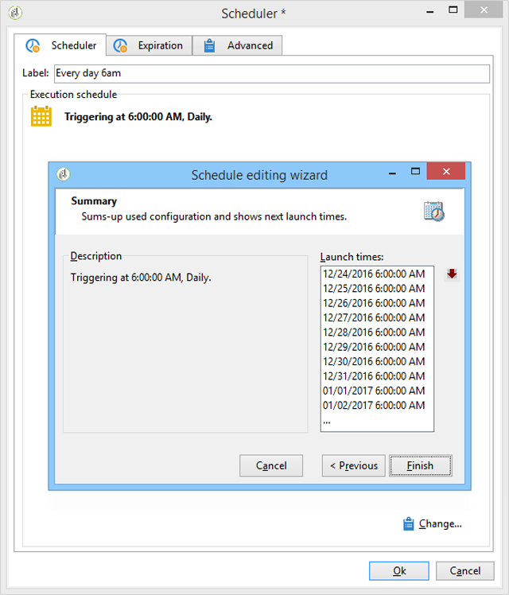


## Identifying recipients whose birthday it is {#identifying-recipients-whose-birthday-it-is}

After configuring the **[!UICONTROL Scheduler]** activity so that the workflow starts every day, identify all of the recipients whose date of birth equals the current date.

To do this, apply the following steps:

1. Drag and drop a **[!UICONTROL Query]** activity into the workflow and double-click it.
1. Click the **Edit query** link and select **[!UICONTROL Filtering conditions]**.

   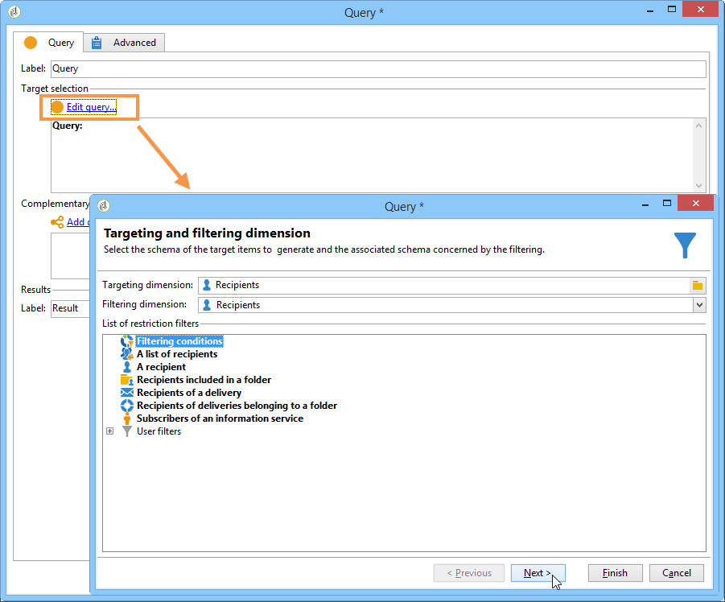

1. Click the first cell of the **[!UICONTROL Expression]** column and click **[!UICONTROL Edit expression]** to open the expression editor.

   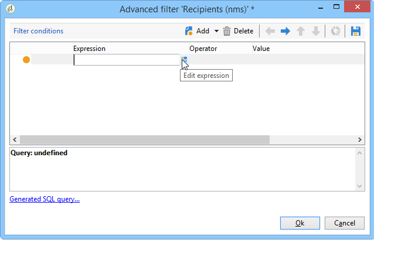

1. Click **[!UICONTROL Advanced selection]** to select the filtering mode.

   

1. Select **[!UICONTROL Edit the formula using an expression]** and click **[!UICONTROL Next]** to display the expression editor.
1. In the list of functions, double-click **[!UICONTROL Day]**, which is accessible via the **[!UICONTROL Date]** node. This function returns the number representing the day corresponding to the date passed as a parameter.

   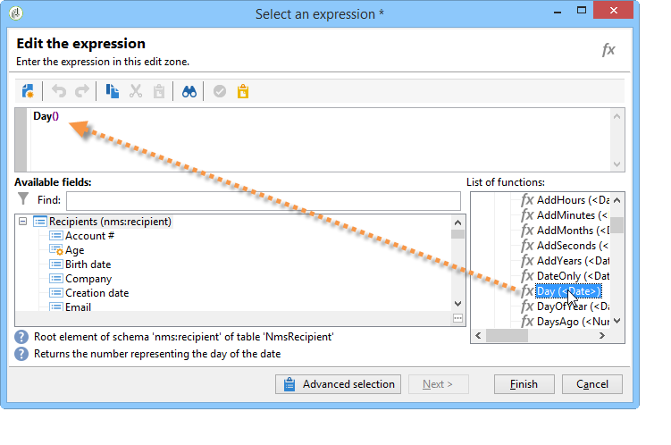

1. In the list of available fields, double-click **[!UICONTROL Birth date]**. The upper section of the editor then displays the following formula:

   ```
   Day(@birthDate)
   ```

   Click **[!UICONTROL Finish]** to confirm.

1. In the query editor, in the first cell of the **[!UICONTROL Operator]** column, select **[!UICONTROL equal to]**.

   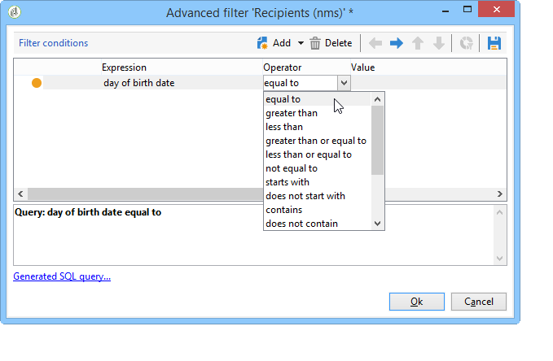

1. Next, click the first cell of the second column (**[!UICONTROL Value]**), and click **[!UICONTROL Edit expression]** to open the expression editor.
1. In the list of functions, double-click **[!UICONTROL Day]**, which is accessible via the **[!UICONTROL Date]** node.
1. Double-click the **[!UICONTROL GetDate]** function to retrieve the current date.

   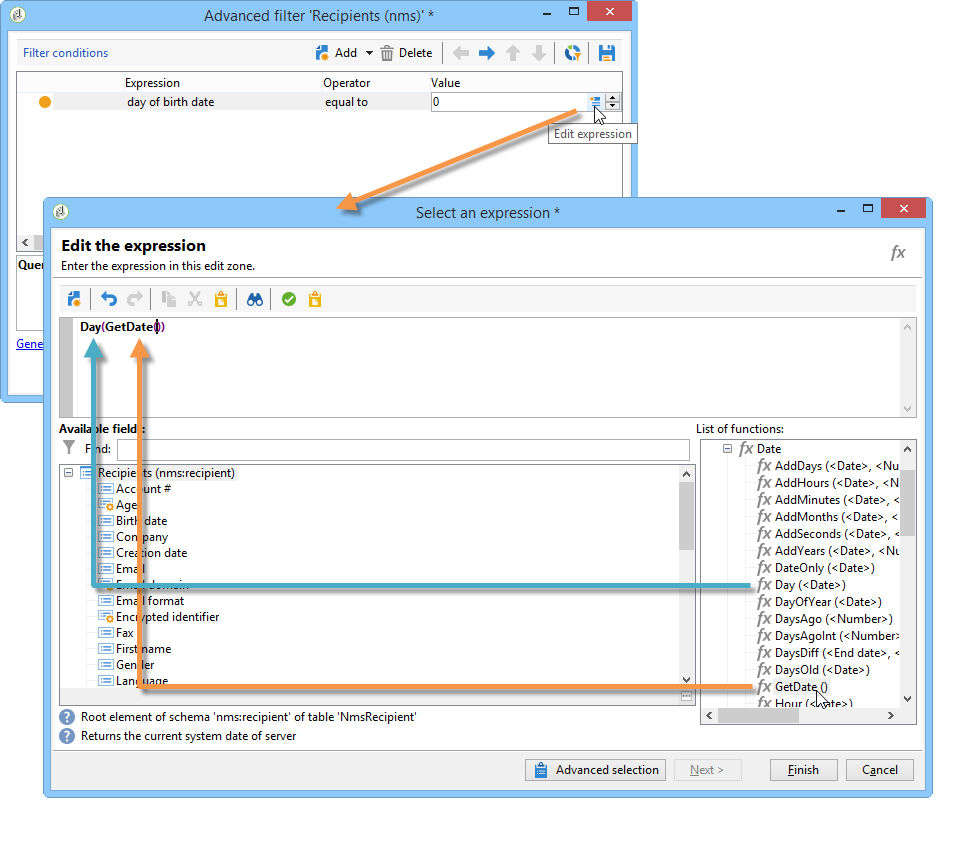

   The upper section of the editor displays the following formula:

   ```
   Day(GetDate())
   ```

   Click **[!UICONTROL Finish]** to confirm.

1. Repeat this procedure to retrieve the month of birth corresponding to the current month. To do this, click the **[!UICONTROL Add]** button and repeat steps 3 to 10, replacing **[!UICONTROL Day]** with **[!UICONTROL Month]**.

   The complete query is as follows:

   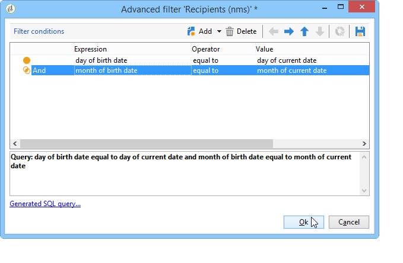

Link the result of the **[!UICONTROL Query]** activity to an **[!UICONTROL Email delivery]** activity to send an email to the list of all of your recipients on their birthday.

## Including recipients born on February 29th (optional) {#including-recipients-born-on-february-29th--optional-}

If you want to include all recipients who were born on February 29th, this use case presents how to plan sending a recurring email to a list of recipients for their birthday - whether it is a leap year or not.

The main implementation steps for this use case are:

* Selecting recipients
* Selecting whether or not it is a leap year
* Selecting any recipients born on February 29th

To set up this use case, we created the following targeting workflow:


If the current year **is not a leap year** and the workflow is run on March 1st, we need to select all recipients that would have had their birthday yesterday (February 29th) and add them to the recipients list. In any other case no additional action is required.

### Step 1: Selecting the recipients {#step-1--selecting-the-recipients}

After configuring the **[!UICONTROL Scheduler]** activity so that the workflow starts every day, identify all of the recipients whose anniversary is the current day.

>[!NOTE]
>
>If the current year is a leap year, all of the recipients born on the 29th of February are automatically included.

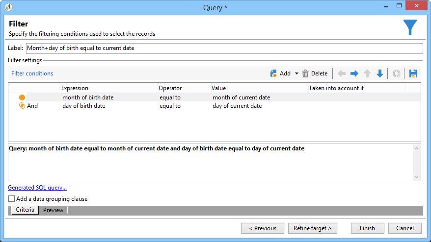

Selecting recipients whose birthday corresponds to the current date is presented in the [Identifying recipients whose birthday it is](#identifying-recipients-whose-birthday-it-is) section.

### Step 2: Select whether or not it is a leap year {#step-2--select-whether-or-not-it-is-a-leap-year}

The **[!UICONTROL Test]** activity allows you to check whether or not it is a leap year and whether the current date is March 1st.

If the test is verified (the year is not a leap year - there is no February 29th - and the current date is indeed March 1st), the **[!UICONTROL True]** transition is enabled and the recipients born on February 29th will be added to the March 1st delivery. Otherwise, the **[!UICONTROL False]** transition is enabled and only the recipients born on the current date will receive the delivery.

Copy and paste the code below into the **[!UICONTROL Initialization script]** section of the **[!UICONTROL Advanced]** tab.

```
function isLeapYear(iYear)
{
    if(iYear/4 == Math.floor(iYear/4))
    {
        if(iYear/100 != Math.floor(iYear/100))
        {
            // Divisible by 4 only -> Leap Year
            return 1;
        }
        else
        {
            if(iYear/400 == Math.floor(iYear/400))
            {
                // Divisible by 4, 100 and 400 -> Leap year
                return 1;
            }
        }
    }
    // all others: no leap year
    return 0;
}

// Return today's date and time
var currentTime = new Date()
// returns the month (from 0 to 11)
var month = currentTime.getMonth() + 1
// returns the day of the month (from 1 to 31)
var day = currentTime.getDate()
// returns the year (four digits)
var year = currentTime.getFullYear()

// is current year a leap year?
vars.currentIsALeapYear = isLeapYear(year);

// is current date the first of march?
if(month == 3 && day == 1) {
  // today is 1st of march
vars.firstOfMarch = 1;
}
```

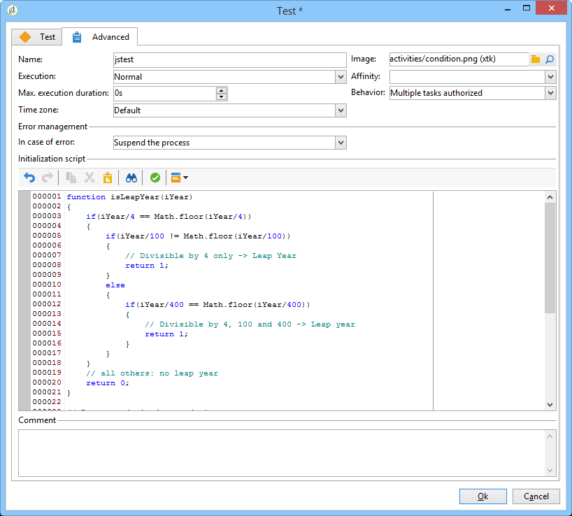

Add the following condition in the **[!UICONTROL Conditional forks]** section:

```
vars.currentIsALeapYear == 0 && vars.firstOfMarch == 1
```

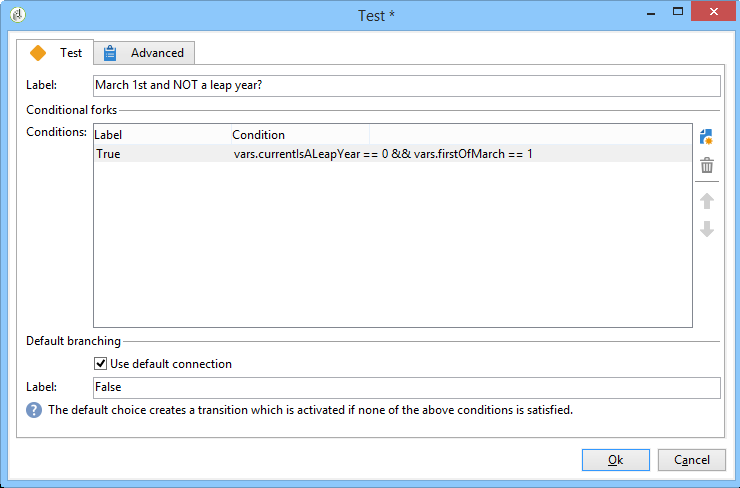

### Step 3: Select any recipients born on February 29th {#step-3--select-any-recipients-born-on-february-29th}

Create a **[!UICONTROL Fork]** activity and link one of the outbound transitions to a **[!UICONTROL Query]** activity.

In this query, select all of the recipients whose date of birth is February 29th.

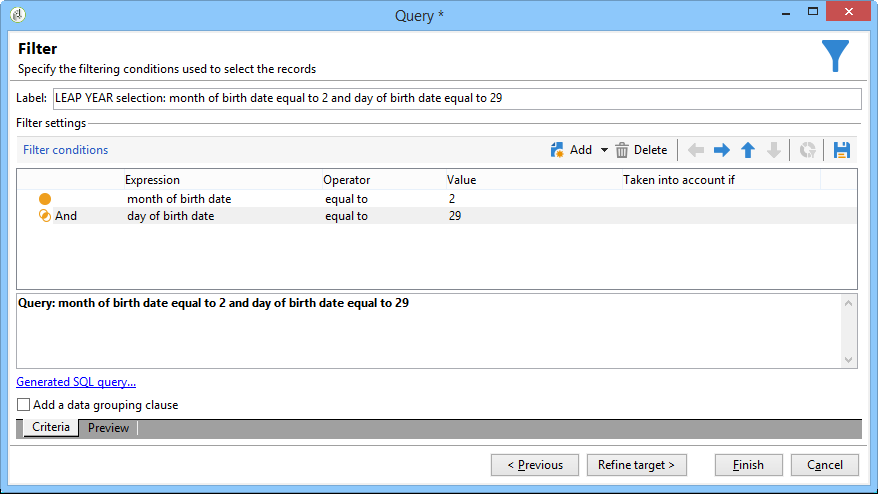

Combine the results with a **[!UICONTROL Union]** activity.

Link the results of the two **[!UICONTROL Test]** activity branches to an **[!UICONTROL Email delivery]** activity to send an email to the list of all of your recipients on their birthday, even to those born on February 29th during a non-leap year.

## Creating a recurring delivery {#creating-a-recurring-delivery-in-a-targeting-workflow}

Add a **Recurring delivery** activity based on the birthday email template that you want to send.

>[!CAUTION]
>
>For the workflows to execute, the technical workflows relating to the Campaign package must be started. For more on this, refer to the [List of technical workflows](about-technical-workflows.md) section.
>
>If the approval steps are enabled for the campaign, the deliveries will only be sent once these steps have been confirmed. For more on this, refer to the [Choosing the processes to be approved](../../campaign/using/marketing-campaign-approval.md#choosing-the-processes-to-be-approved) section.


