# Sending a report to a list{#sending-a-report-to-a-list}

This use case details how to generate a monthly out-of-the-box **[!UICONTROL Tracking indicators]** report in PDF format and how to send it to a list of recipients.


The main implementation steps for this use case are:

* Creating a list of recipients who will receive the delivery (refer to: [Step 1: Creating the recipient list](#step-1--creating-the-recipient-list)). 
* Creating a delivery template that will let you generate a new delivery each time the workflow is executed (refer to: [Step 2: Creating the delivery template](#step-2--creating-the-delivery-template)).
* Creating a workflow that will let you generate the report in PDF format and send it to the list of recipients (refer to: [Step 3: Creating the workflow](#step-3--creating-the-workflow)).

## Step 1: Creating the recipient list {#step-1--creating-the-recipient-list}

Go to the **[!UICONTROL Profiles and targets]** tab, click the **[!UICONTROL Lists]** link, then the **[!UICONTROL Create]** button. Select **[!UICONTROL New list]** and create a new recipient list for the report to be sent to.

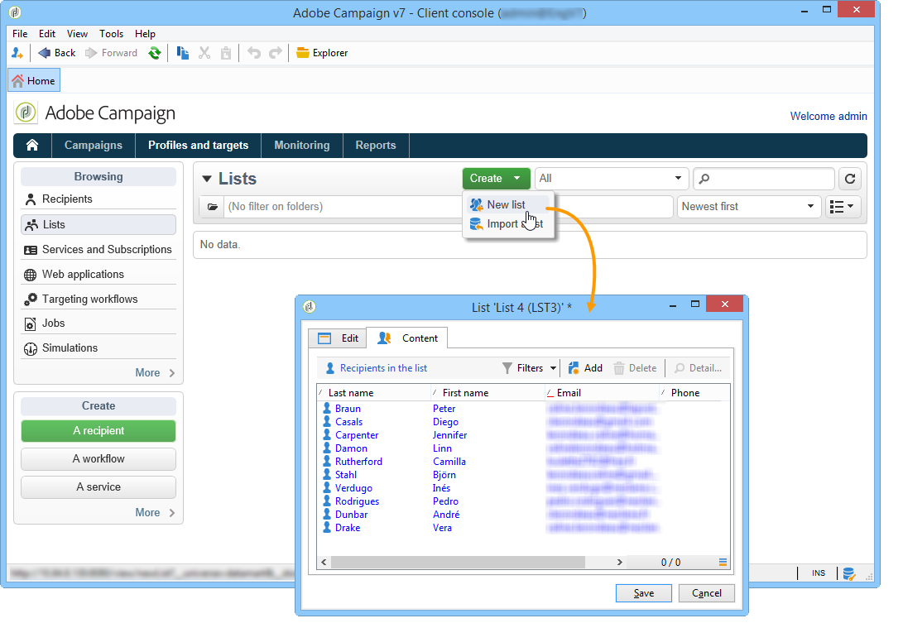

For more on creating lists, refer to this [section](../../platform/using/creating-and-managing-lists.md).

## Step 2: Creating the delivery template {#step-2--creating-the-delivery-template}

1. Go to the **[!UICONTROL Resources > Templates > Delivery templates]** node of the Adobe Campaign explorer and duplicate the **[!UICONTROL Email delivery]** out-of-the-box template.

   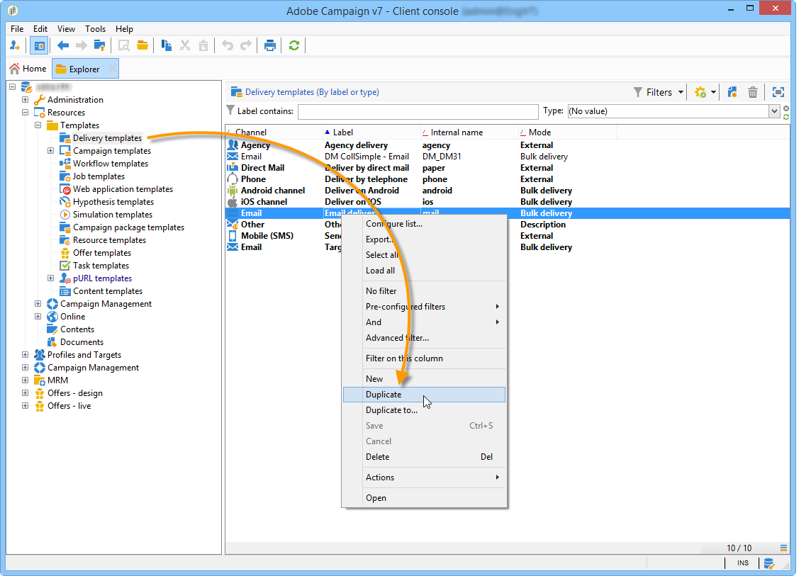

   For more on creating a delivery template, refer to this [section](../../delivery/using/about-templates.md).

1. Enter the various template parameters: label, target (the list of previously created recipients), subject and content.

   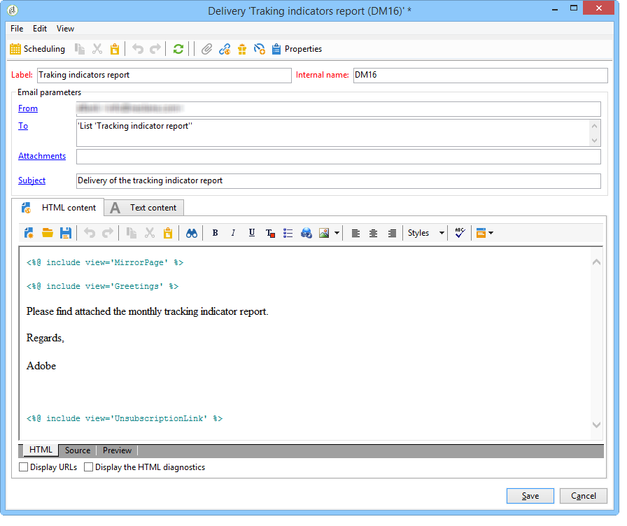

1. Each time the workflow is executed, the **[!UICONTROL Tracking indicators]** report is updated (refer to [Step 3: Creating the workflow](#step-3--creating-the-workflow)). To include the latest version of the report in the delivery, you need to add a **[!UICONTROL Calculated attachment]**:

   For more on creating a calculated attachment, refer to this [section](../../delivery/using/attaching-files.md#creating-a-calculated-attachment).

    * Click the **[!UICONTROL Attachments]** link and click **[!UICONTROL Add]**, then select **[!UICONTROL Calculated attachment]**.
    
      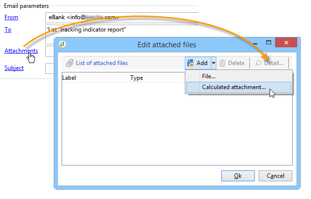

    * Go to the **[!UICONTROL Type]** field and select the fourth option: **[!UICONTROL File name is computed during delivery of each message (it may then depend on the recipient profile)]**. 
    
      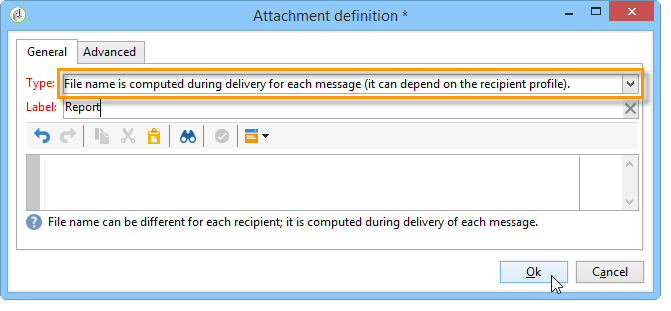

      The value entered in the **[!UICONTROL Label]** field will not appear in the final delivery.
    
    * Go to the edit zone and enter the access path and name of the file. 
    
      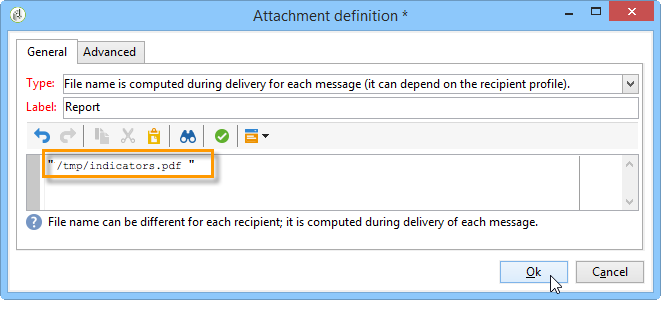

      >[!CAUTION]
      >
      >The file must be present on the server. Its path and name must be identical to those entered in the **[!UICONTROL JavaScript code]** type activity of the workflow (refer to: [Step 3: Creating the workflow](#step-3--creating-the-workflow)).

    * Select the **[!UICONTROL Advanced]** tab and check **[!UICONTROL Script the name of the file name displayed in the mails sent]**. Go to the edit zone and enter the name you want to give the attachment in the final delivery.
    
      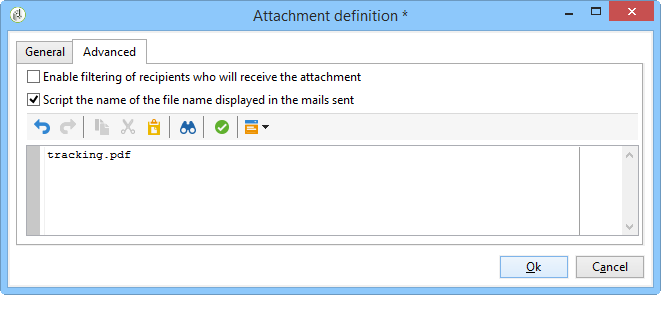

## Step 3: Creating the workflow {#step-3--creating-the-workflow}

The following workflow was created for this use case. It has three activities:

* One **[!UICONTROL Scheduler]** type activity that lets you execute the workflow once a month,
* One **[!UICONTROL JavaScript code]** type activity that lets you generate the report in PDF format,
* one **[!UICONTROL Delivery]** type activity that uses the previously created delivery template.


1. Now go to the **[!UICONTROL Administration > Production > Technical workflows]** node and create a new workflow.

   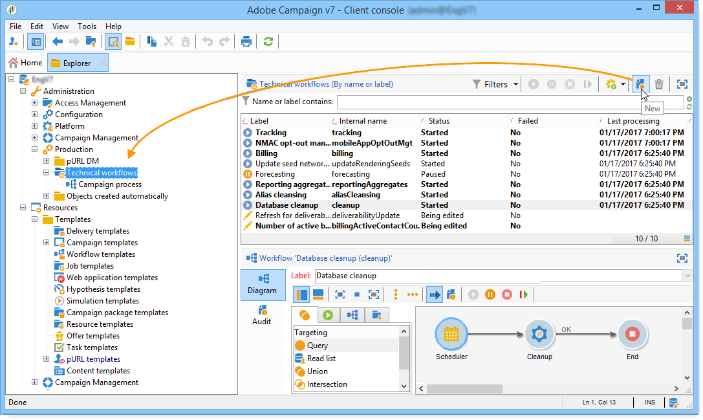

1. Start by adding a **[!UICONTROL Scheduler]** type activity and configure it so that the workflow executes on the first Monday of the month.

   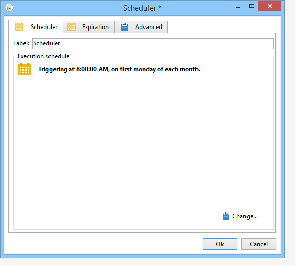

   For more on configuring the scheduler, refer to [Scheduler](scheduler.md).

1. Then add a **[!UICONTROL JavaScript code]** type activity.

   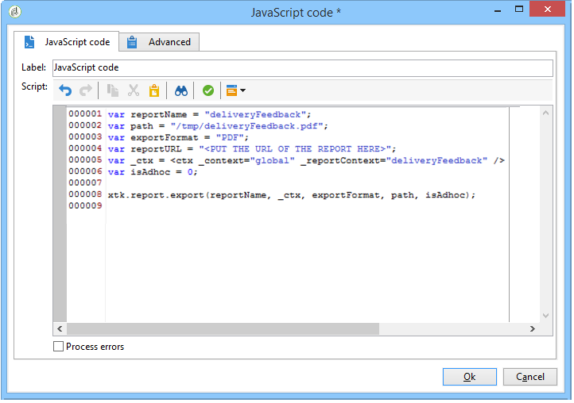

   Enter the following code in the edit zone:

   ```
   var reportName = "deliveryFeedback";
   var path = "/tmp/deliveryFeedback.pdf";
   var exportFormat = "PDF";
   var reportURL = "<PUT THE URL OF THE REPORT HERE>";
   var _ctx = <ctx _context="global" _reportContext="deliveryFeedback" />
   var isAdhoc = 0;
   
   xtk.report.export(reportName, _ctx, exportFormat, path, isAdhoc);
   ```

   The following variables are used:

    * **var reportName**: enter the internal name of the report in double quotes. In this case, the internal name of the **Tracking indicator** report is "deliveryFeedback".
    * **var path**: enter the save path of the file ("tmp/files/"), the name you want to give the file ("deliveryFeedback") and the file extension (".pdf"). In this case, we have used the internal name as the file name. Values need to be between double quotes and separated by the "+" character.

      >[!CAUTION]
      >
      >The file must be saved on the server. You must enter the same path and the same name in the **[!UICONTROL General]** tab of the edit window for the calculated attachment (refer to: [Step 2: Creating the delivery template](#step-2--creating-the-delivery-template)).

    * **var exportFormat**: enter the export format of the file ("PDF").
    * **var _ctx** (context): in this case, we are using the **[!UICONTROL Tracking indicators]** report in its global context.

1. Finish by adding a **[!UICONTROL Delivery]** type activity with the following options:

    * **[!UICONTROL Delivery]**: select **[!UICONTROL New, created from a template]**, and select the delivery template created previously.
    * For the **[!UICONTROL Recipients]** and **[!UICONTROL Content]** fields, select **[!UICONTROL Specified in the delivery]**.
    * **[!UICONTROL Action to execute]**: select **[!UICONTROL Prepare and start]**. 
    * Un-check **[!UICONTROL Generate an outbound transition]** and **[!UICONTROL Process errors]**.

   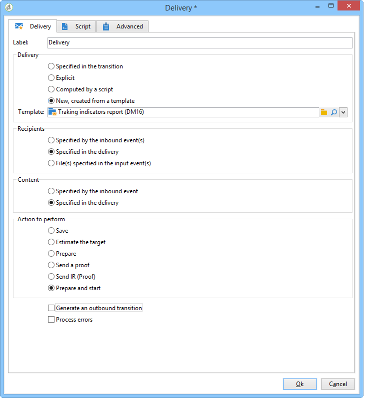
