# Split{#split}

A **Split**-type activity lets you split a target into several subsets. The target is constructed with all the received results: all previous activities must thus have finished in order for this activity to be executed.

This activity does not trigger a union of inbound populations. If several transitions land in one split activity, we recommend inserting a **[!UICONTROL Union]** activity in front of it.

For an example of the split activity being used, refer to [Creating subsets using the Split activity](../../workflow/using/targeting-data.md#creating-subsets-using-the-split-activity).

An example illustrating how to use the Split activity to segment the target into different populations using filtering conditions is described in [this section](../../workflow/using/cross-channel-delivery-workflow.md).

An example showing how to use an instance variable in a Split activity is available in [this section](../../workflow/using/javascript-scripts-and-templates.md).

To configure this activity, define the subset content and label in the **[!UICONTROL Subsets]** tab, then choose the target dimension in the **[!UICONTROL General]** tab.

## Creating subsets {#creating-subsets}

To create a subset:

1. Click the label in the matching field and select the filter to apply.
1. To filter the inbound population, select the **[!UICONTROL Add a filtering condition]** option and click the **[!UICONTROL Edit...]** link.

   Select the type of filter to be applied to the data to include it in this set.

   The process is the same as for a **Query**-type activity.

   >[!NOTE]
   >
   >You can filter the data in a maximum of two external databases (FDA).

1. You can specify the maximum number of records to be extracted from the target to create the subset. To do this, check the **[!UICONTROL Limit the selected records]** option and click the **[!UICONTROL Edit...]** link.

   A wizard lets you choose the selection mode for records of this subset. The steps can be found in [Limiting the number of subset records](#limiting-the-number-of-subset-records).

   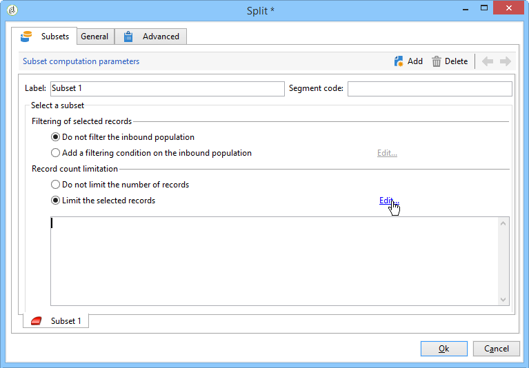

1. If you wish, you can **add other subsets** using the **[!UICONTROL Add]** button. 

   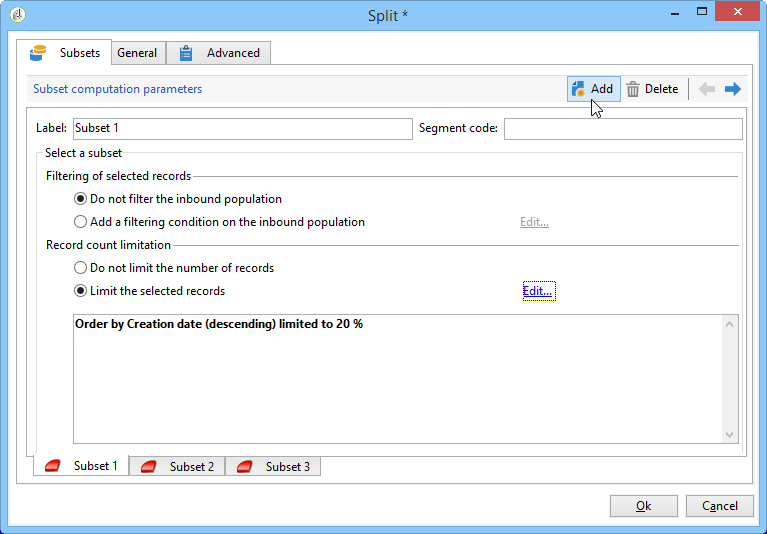

   >[!NOTE]
   >
   >If the **[!UICONTROL Enable overlapping of output populations]** option is not checked, subsets are created in the order of the tabs. Use the arrows in the upper right-hand section of this window to move them. If the first subset recovers 70% of the initial population, for example, then the next subset will apply its selection criteria only to the remaining 30%, and so on.

   For each subset created, an outbound transition will be added to the split activity.

   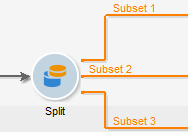

   You can choose to generate a single outbound transition (and identify sets using the segment code, for example): to do this, select the **[!UICONTROL Generate subsets in the same table]** option in the **[!UICONTROL General]** tab.

   If it is completed, the segment code of each subset is automatically stored in an additional column. This column will be accessible in the personalization fields at delivery level.

## Limiting the number of subset records {#limiting-the-number-of-subset-records}

If you do not wish to use the entire population contained in a subset, you can limit the number of records it will contain.

1. In the subset edit window, check the **[!UICONTROL Limit the selected records]** option and click the **[!UICONTROL Edit...]** link.
1. Select the limit type for your choice:

    * **[!UICONTROL Activate random sampling]**: this option takes a random sample of the records. The type of random sampling applied depends on the database engine.
    * **[!UICONTROL Keep only the first records after sorting]**: this option lets you define a limitation based on one or more sorting orders. If you select the **[!UICONTROL Age]** field as a sorting criterion and 100 as the limit, only the youngest 100 recipients will be kept.
    * **[!UICONTROL Keep the first ones after sorting (criteria, random)]**: This option combines the two previous options. It lets you define a limitation based on one or more sorting orders then apply a random selection on the first records if some of the records have the same values as the defined criteria.

      For example, if you select the **[!UICONTROL Age]** field as a sorting criteria, and you then define a limit of 100, but the 2000 youngest recipients in the database are all 18, then 100 recipients will be randomly selected out of those 2000.

   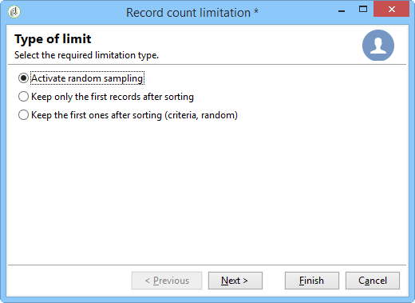

1. If you wish to define sorting criteria, an additional step lets you define the columns and the sorting order.

   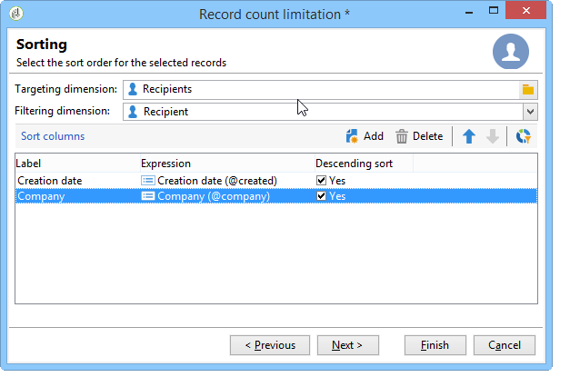

1. Then choose the data limitation method.

   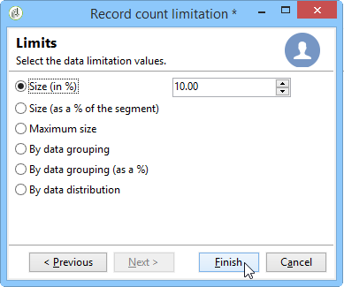

   There are several ways of doing this:

    * **[!UICONTROL Size (in %)]**: a percentage of records. For example, the configuration below extracts 10% of the total population.

      The percentage applies to the initial population, not the result of the activity.
    
    * **[!UICONTROL Size (as a % of the segment)]**: a percentage of records relating only to the subsets and not to the initial population.
    * **[!UICONTROL Maximum size]**: a maximum number of records.
    * **[!UICONTROL By data grouping]**: you can set a limit on the number of records depending on the values in a specified field of the inbound population. For more on this subject, refer to [Limiting the number of subset records by data grouping](#limiting-the-number-of-subset-records-by-data-grouping).
    * **[!UICONTROL By data grouping (in %)]**: you can set a limit on the number of records depending on the values in a specified field of the inbound population using a percentage. For more on this subject, refer to [Limiting the number of subset records by data grouping](#limiting-the-number-of-subset-records-by-data-grouping).
    * **[!UICONTROL By data distribution]**: If your grouping fields have too many values or if you want to avoid entering the values again for each new split activity, Adobe Campaign lets you configure a **[!UICONTROL By data distribution]** limitation (optional Distributed Marketing module). For more on this, refer to [Limiting the number of subset records per data distribution](#limiting-the-number-of-subset-records-per-data-distribution).

1. Click **[!UICONTROL Finish]** to approve the record selection criteria. The defined configuration is then displayed in the middle window of the editor.

## Limiting the number of subset records by data grouping {#limiting-the-number-of-subset-records-by-data-grouping}

You can limit the number of records by data grouping. This limit can be carried out using a fixed value or a percentage.

For instance, if you select the **[!UICONTROL Language]** field as a group field, you can define a list of records for each language.

1. After selecting the data limitation values, select **[!UICONTROL By data grouping]** or **[!UICONTROL By data grouping (as a %)]** and click **[!UICONTROL Next]**. 

   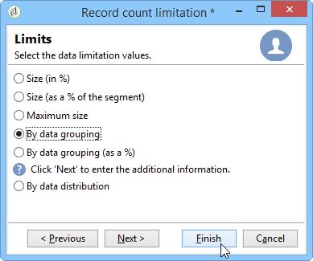

1. Then select the grouping field(s) (the **[!UICONTROL Language]** field for instance) and click **[!UICONTROL Next]**.

   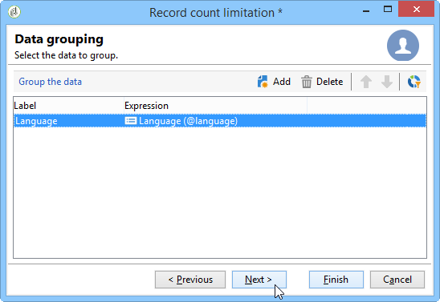

1. Finally, specify the data grouping thresholds (using the fixed values or percentages depending on the previously selected grouping method). To set the same threshold for every value, for example if you wish to set the number of records for each language to 10, select the **[!UICONTROL All data groupings are the same size]** option. To set a different limit for every value, select the **[!UICONTROL Limitations by grouping value]** option. This will allow you to choose a different limitation for English, French, etc. 

   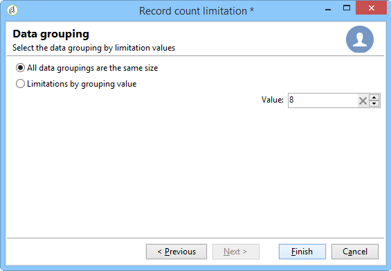

1. Click **[!UICONTROL Finish]** to approve the limitation and return to editing the split activity.

## Limiting the number of subset records per data distribution {#limiting-the-number-of-subset-records-per-data-distribution}

If your grouping fields contain too large a number of values or if you want to avoid resetting values for every new split activity, Adobe Campaign lets you create a limitation per data distribution. When selecting data limitation values (for more on this subject see the [Creating subsets](#creating-subsets) section), select the **[!UICONTROL By data distribution]** option and select a template from the drop-down menu. Creating a data distribution template is demonstrated below.

For an example of the **[!UICONTROL Local approval]** activity with a distribution template, refer to [Using the local approval activity](../../workflow/using/using-the-local-approval-activity.md).

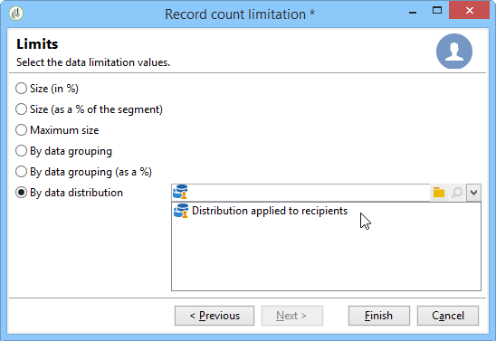

>[!IMPORTANT]
>
>To use this function, you need to purchase the Distributed Marketing module, which is a Campaign option. Please check your license agreement.

The data distribution template lets you limit the number of records using a list of grouping values. To create a data distribution template, apply the following steps:

1. To create the data distribution template, go to the **[!UICONTROL Resources > Campaign management > Data distribution]** node and click **[!UICONTROL New]**.

   

1. The **[!UICONTROL General]** tab lets you enter the label and the execution context of the distribution (targeting dimension, distribution field).

   

   The following fields need to be entered:

    * **[!UICONTROL Label]**: label for the distribution template.
    * **[!UICONTROL Targeting dimension]**: enter the targeting dimension to which the data distribution will be applied, **[!UICONTROL Recipient]** for instance. This schema must always be compatible with the data used in the targeting workflow.
    * **[!UICONTROL Distribution field]**: select a field via the targeting dimension. For instance, if you select the **[!UICONTROL Email domain]** field, the list of recipients will be broken down by domain.
    * **[!UICONTROL Distribution type]**: select the way the limitation value of the target will be broken down in the **[!UICONTROL Distribution]** tab: **[!UICONTROL Percentage]** or **[!UICONTROL Set]**.
    * **[!UICONTROL Assignment type]**: select the data distribution assignment type. You can choose between assignment by group or operator or assignment by local entity. Assignment by local entity is used in **Distributed Marketing**. For more information, refer to this [section](../../campaign/using/about-distributed-marketing.md).
    * **[!UICONTROL Approval storage]**: if you use a **[!UICONTROL Local approval]** activity in your targeting workflow (refer to [Local approval](../../workflow/using/local-approval.md)), enter the schema in which the approval results will be stored. You must specify one storage schema per targeting schema. If you use the **[!UICONTROL Recipients]** targeting schema, enter the default **[!UICONTROL Local approval of recipients]** storage schema.

      In case of a simple limitation by data grouping without local approval, you do not need to enter the **[!UICONTROL Approvals storage]** field.

1. If you are using a **[!UICONTROL Local approval]** activity (refer to [Local approval](../../workflow/using/local-approval.md)), enter the **[!UICONTROL Advanced settings]** for the distribution template:

   

   The following fields need to be entered:

    * **[!UICONTROL Approve targeted messages]**: check this option if you want all recipients to be pre-selected from the list of recipients to approve. If this option is unchecked, no recipient will be pre-selected.

      >[!NOTE]
      >
      >This option is checked by default.

      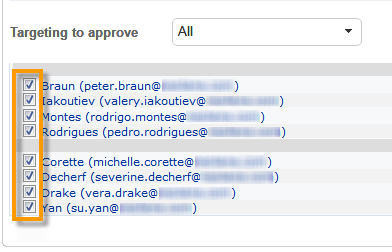

    * **[!UICONTROL Delivery label]**: lets you define an expression to display the delivery label in the return notification. The default expression provides information on the standard label of the delivery (compute string). You can modify this expression. 
    
      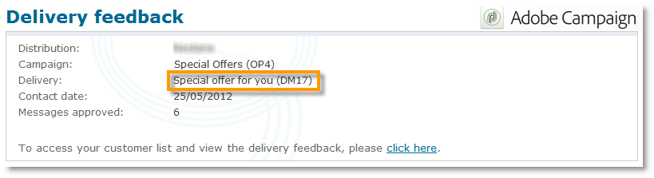

    * **[!UICONTROL Grouping field]**: this field lets you define the grouping used to display recipients in approval and return notifications.
    
      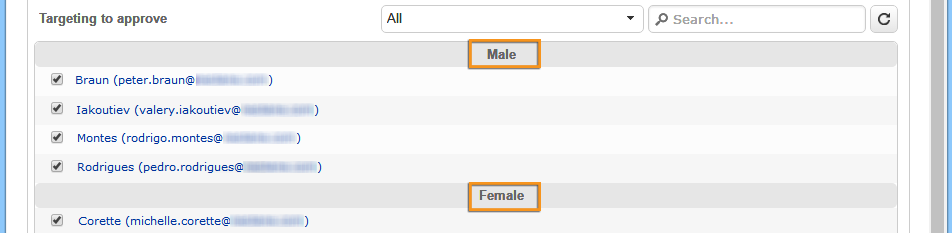

    * **[!UICONTROL Web Interface]**: lets you link a web application to the recipient list. In the approval and return notification, each recipient will be clickable and will link to the selected web application. The **[!UICONTROL Parameters]** field (for example **[!UICONTROL recipientId]**) lets you configure the additional parameter to be used in the URL and the web application.
    
      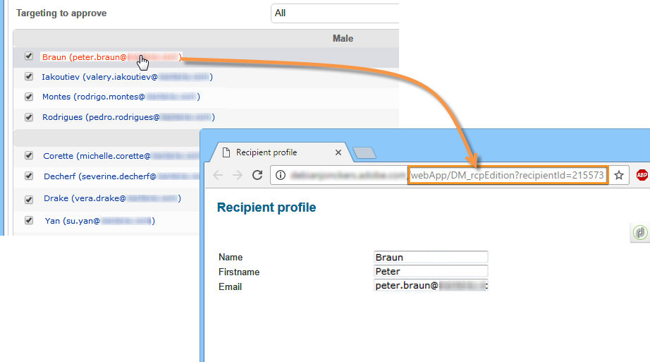

1. The **[!UICONTROL Breakdown]** tab lets you define the list of distribution values.

   

    * **[!UICONTROL Value]**: enter the distribution values. 
    * **[!UICONTROL Percentage / Set]**: enter the record limit (fixed or percentage) linked to each value.

      This column is defined by the **[!UICONTROL Distribution type]** field within the **[!UICONTROL General]** tab.
    
    * **[!UICONTROL Label]**: enter the label linked to each value.
    * **[!UICONTROL Group or operator]**: if you are using a **[!UICONTROL Local approval]** activity (refer to [Local approval](../../workflow/using/local-approval.md)), select the operator or group of operators assigned to each distribution value.

      In case of a simple limitation by data grouping without local approval, you do not need to enter the **[!UICONTROL Group or operator]** field.

      >[!IMPORTANT]
      >
      >Make sure the operators have been assigned the appropriate rights.

    * **[!UICONTROL Local entity]**: select the local entity assigned to each distribution value. Local entities are used in **Distributed Marketing**. For more information, refer to this [section](../../campaign/using/about-distributed-marketing.md).

## Filtering parameters {#filtering-parameters}

Click the **[!UICONTROL General]** tab to enter the activity label. Select the target and filter dimensions for this split. If necessary, you can change these dimensions for a given subset.

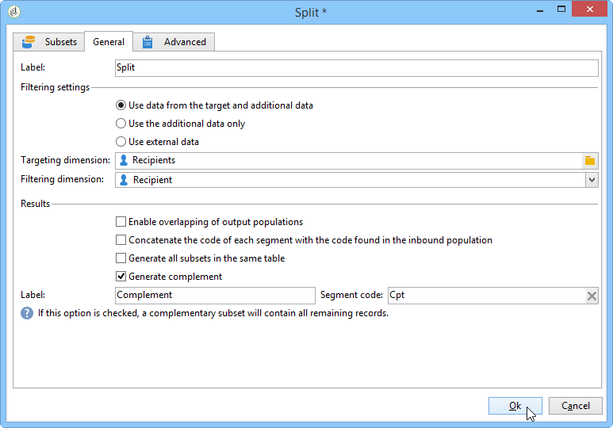

Check the **[!UICONTROL Generate complement]** option if you wish to exploit the remaining population. The complement is the inbound target minus the union of the subsets. An additional outbound transition will then be added to the activity, as follows:

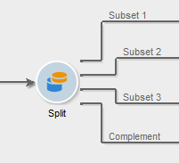

For this option to work correctly, the inbound data must have a primary key.

For example, if the data is read directly from an external database such as Netezza (which does not support the notion of an index) via a **[!UICONTROL Data loading (RDBMS)]** activity, the complement generated by the **[!UICONTROL Split]** activity will be incorrect.

To avoid this, you can drag and drop an **[!UICONTROL Enrichment]** activity just before the **[!UICONTROL Split]** activity. In the **[!UICONTROL Enrichment]** activity, check the **[!UICONTROL Keep all additional data from the main set]** and specify in the additional data the columns that you want to use for configuring the filters of the **[!UICONTROL Split]** activity. The data from the inbound transition of the **[!UICONTROL Split]** activity are then stored locally in a temporary table on the Adobe Campaign server and the complement can be generated correctly.

The **[!UICONTROL Enable overlapping of output populations]** option lets you manage populations belonging to several subsets:

* When the box isn't checked, the split activity makes sure a recipient cannot be present in several output transitions, even if it meets the criteria of several subsets. They will be in the target of the first tab with matching criteria. 
* When the box is checked, the recipients can be found in several subsets if they meet their filter criteria. Adobe Campaign recommends using exclusive criteria.

## Input parameters {#input-parameters}

* tableName
* schema

Each inbound event must specify a target defined by these parameters.

## Output parameters {#output-parameters}

* tableName
* schema
* recCount

This set of three values identifies the target resulting from the exclusion. **[!UICONTROL tableName]** is the name of the table that records the target identifiers, **[!UICONTROL schema]** is the schema of the population (usually nms:recipient) and **[!UICONTROL recCount]** is the number of elements in the table.

The transition associated with the complement has the same parameters.
