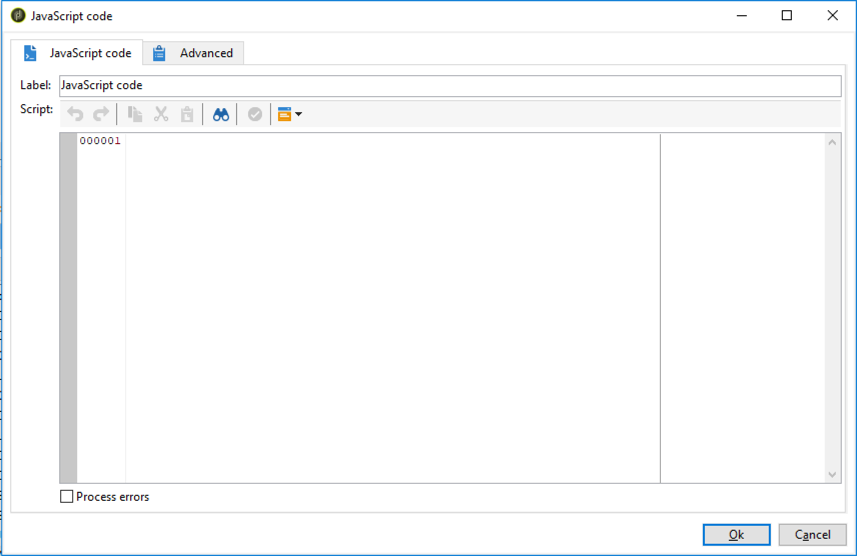
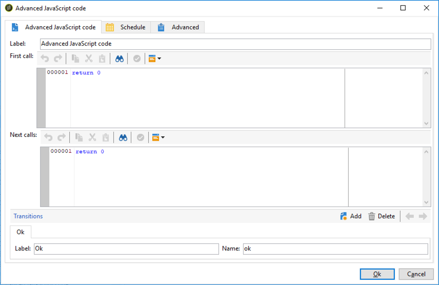

# SQL code and JavaScript code{#sql-code-and-javascript-code}


## SQL code {#sql-code}

The **[!UICONTROL SQL code]** activity executes an SQL script.

1. Specify the activity **[!UICONTROL Label]**.

1. If you want to load an existing SQL code, select the **[!UICONTROL The SQL script is contained in an entity stored in the database]** option. 

    SQL scripts must be created and stored in the **[!UICONTROL Administration]** / **[!UICONTROL Configuration]** / **[!UICONTROL SQL scripts]** menu.

1. Choose on which database the SQL script will run:

    * **[!UICONTROL Default data source]**: The SQL script will be executed on the default PostgreSQL database.
    * **[!UICONTROL Active FDA external account]**: The SQL script will be executed on the Cloud database of the selected FDA external account.

    

1. Type or copy-paste your SQL script in the dedicated area.
   Otherwise, 

   >[!CAUTION]
   >
   >It is the SQL script writer's responsibility to make sure that the SQL script is functional, and that its references (fields names, etc.) are in accordance with the Outbound schema.

1. Check the **[!UICONTROL Processing errors]** option to display a specific transition which will be enabled if an error is generated.
  
    Refer to [Processing errors](../../workflow/using/monitoring-workflow-execution.md#processing-errors).

## JavaScript code and Advanced JavaScript code {#javascript-code}

**[!UICONTROL JavaScript code]** and **[!UICONTROL Advanced JavaScript code]** activities execute a JavaScript script in the context of a workflow. For more on scripting, refer to the [JavaScript scripts and templates](javascript-scripts-and-templates.md) section.

### Execution delay {#exec-delay}

Starting 20.2 release, an execution delay has been added to the **[!UICONTROL JavaScript code]** and **[!UICONTROL Advanced JavaScript code]** activities. By default, the execution phase cannot exceed 1 hour. After this delay, the process will be aborted with an error message and the activity execution will fail.

You can change this delay in the **[!UICONTROL Stop execution after]** field available in these activities.

To ignore this limit, you need to set the value to **0**.

### JavaScript code {#js-code-desc}



* **[!UICONTROL Script]**: The central area of the editor contains the script to be executed.

* **[!UICONTROL Process errors]**: Refer to [Processing errors](monitoring-workflow-execution.md#processing-errors).

### Advanced JavaScript code {#adv-js-code-desc}



* **[!UICONTROL First call]**: The first zone of the editor contains the script to execute during the first call.
* **[!UICONTROL Next calls]**: The second zone of the editor contains the script to execute during the next calls.
* **[!UICONTROL Transitions]**: You can define several activity output transitions.
* **[!UICONTROL Schedule]**: The **[!UICONTROL Schedule]** tab lets you schedule when to trigger the activity.

Advanced JavaScript is a persistent task and is periodically recalled if it has not been marked as completed. To terminate the task and prevent future recalls, you must use the **task.setCompleted()** method in the **[!UICONTROL Next calls]** section:

```
task.postEvent(task.transitionByName("ok")); // to transition to Ok branch
task.setCompleted();

return 0;
```
